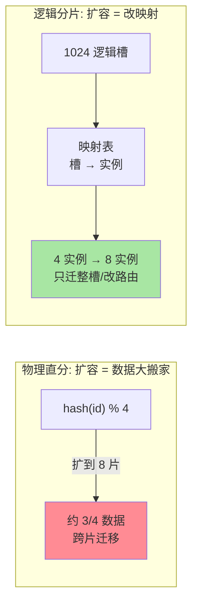
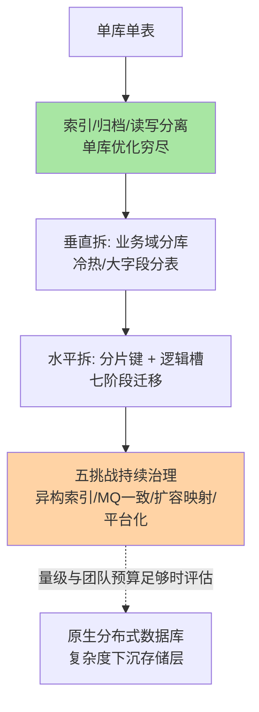

# 分库分表架构全景：拆完之后的五个核心挑战

> 本目录前三篇解决了「要不要拆、键怎么选、数据怎么搬」。本篇是架构级收束：**拆完之后的生活**——跨片查询、分布式事务、扩容再平衡、运维平台化，五个挑战各有架构级答案；最后把四篇收成一张决策总图。与前三篇零重复，篇 1 的拆分时机与事故剧本不再复述。

## 一句话摘要

分库分表的难度不在「拆」而在「拆完之后」：**跨片查询**靠「强制带键 + 异构兜底」、**分布式事务**靠「能避开就避开，避不开按一致性等级选型」、**扩容**靠「逻辑分片 + 映射表」把搬数据降级为改映射、**运维复杂度**靠平台化对冲——四个挑战的答案共同指向一个原则：**分片引入的每一份复杂度，都要有显式的架构组件承接，没有组件承接的复杂度会变成事故**。

## 🎯 本文核心

**核心一句话：分库分表不是「到亿级的动作」而是一种「持续付费的架构形态」——五挑战（跨片查询/分布式事务/扩容/键与索引/运维）就是它的年费账单；每项挑战的架构答案是固定的，选型只是决定「谁来承接这个组件」。**

决策链：三问总览（何时拆/怎么拆/拆了怎么管——前两问链回篇 1/2）→ 三种架构形态（SDK/代理/托管）→ 五挑战逐一给架构答案 → 演进路线图。全文一句话可重构：「拆是手术，养是长跑——五挑战就是长跑的补给清单」。

## 前置阅读

- 本目录篇 1《拆分方案选型》：拆分时机与中间件双路线（本文不再重复其决策与事故）
- 本目录篇 2《分片键设计》：三问定键与异构索引（本文只引用其结论）
- 本目录篇 3《分布式 ID 衔接与平滑迁移》：七阶段迁移（本文只讲拆完后的扩容增量）

## 一、三种架构形态：复杂度由谁承接

| 形态 | 路由位置 | 复杂度承接方 | 适用 |
|---|---|---|---|
| 客户端 SDK | 应用进程内 | 应用团队（心智 + 升级随发版） | 技术栈统一、延迟敏感 |
| 代理层 | 独立代理进程 | 中间件团队（部署/扩容/监控代理集群） | 异构技术栈、重管控 |
| 云托管/原生分布式 | 平台存储层 | 云厂商（SLA 定价换运维） | 新建系统优先评估 |

三形态跑的是同一套分片语义，差异只在「五挑战里的运维部分由谁扛」——选型前先回答「团队有谁」，再回答「技术要什么」（篇 1 的结论，此处收束为一句话）。

## 二、挑战一：跨片查询——能避免就避免，避不开就分层

分片后查询分三档处理：

```text
第一档：带分片键 → 单片命中，最优路径（应用层设计保证）
第二档：跨片但可聚合 → 并行查各片 + 归并（LIMIT/ORDER BY 全局归并，COUNT 求和）
        代价：深分页全局归并要取「前 N 页偏移量」的行数，成本随偏移暴涨
第三档：跨片且复杂（多维筛选/全文/报表）→ 不在分片集群做
        → 异构到 ES / ClickHouse / 数仓（篇 2 的异构索引结论，这里是其架构落位）
```

**架构纪律**：第二档查询必须白名单登记并限流——归并查询的成本 = 片数 × 单片成本，是「片数越多越贵」的放大器；第三档是异构链路的职责边界，混进分片集群做就是事故入口。

## 三、挑战二：分布式事务——先问「能不能不分布式」

分库后本地事务失效，但**第一反应不是选分布式事务方案，而是重新审视业务边界能否让事务单片化**（分片键把同一业务的强关联数据放同片——篇 2 分片键的架构意义）。避不开时的选型：

| 方案 | 一致性 | 性能 | 复杂度 | 适用 |
|---|---|---|---|---|
| XA / 2PC | 强一致 | 差（同步阻塞） | 中 | 金融强一致（业内实际少用） |
| TCC | 最终一致（业务补偿） | 好 | 高（三接口开发） | 资金类核心链路 |
| SAGA | 最终一致（状态机补偿） | 好 | 中 | 长流程事务 |
| MQ + 本地消息表 | 最终一致 | 好 | 中 | 异步解耦场景 |

**业内默认**：互联网业务默认 MQ 最终一致 + 对账兜底；强一致需求优先靠「业务设计单片化」消化，其次才是 TCC。一致性等级是**按资金风险定价的决策**，不是技术偏好。

## 四、挑战三：扩容再平衡——用逻辑层把搬家变改表



物理直分的扩容成本（再平衡期间的双写、校验、路由切换）随片数平方级上涨；逻辑分片把「扩容」拆成「整槽搬迁」（可分批低峰）+「映射切换」（秒级）。**这个设计必须在第一次拆分时就定**（篇 1 事故的核心教训），事后补逻辑层等于二次拆分。

## 五、挑战四：键与索引的分片语义（链回收束）

三个已在篇 2/3 定型、这里收束成纪律的结论：①分片键三问定键、终身不变；②全局唯一性交给分布式 ID（趋势递增护聚簇），分片键退为普通索引列，两者职责正交；③每个分片内的二级索引只保证「片内有序」——跨片排序/唯一约束一律靠业务层或异构组件，**别指望数据库在片间维护任何全局有序性**。

## 六、挑战五：运维复杂度——平台化是唯一的对冲

分片把运维动作乘以片数：备份（各片独立 + 全局一致性快照点）、DDL（N 片顺序变更 + 版本一致校验）、监控（单片水位 + 全局聚合双层）、故障切换（单分片主备切换 + 集群视角影响面）。

**平台化四件套**：变更编排（DDL 按「从库先行 → 逐片低峰 → 校验」自动推进）、监控聚合（片级报表 + 跨片全局视图）、容量再平衡自动化（逻辑槽迁移任务化）、元数据中心（路由映射 + 分片拓扑单源）。没有平台承接的分片集群，运维成本会在第三次扩容前后压垮团队——这是业内自建分片体系最普遍的死因。

## 七、演进路线图：把四篇收成一张图



演进的关键纪律：**每一级只解决上一级解决不了的瓶颈**——跳级（单库直接水平拆）与恋级（量级到顶还靠加索引）都是架构失衡。

> 💡 **实战提示**
> - 什么时候给归并查询设白名单：片数超过 4 就该建「跨片查询登记表」——频率、耗时、业务方三要素登记，无登记的归并查询发现即治理
> - MQ 最终一致的对账频率按「资金敏感度」定价：核心资金链路小时级对账 + 差错账工单闭环，普通业务天级兜底
> - DDL 平台化的最小可用版：分片顺序脚本 + 每片校验 + 中断续跑——三个能力齐了，N 片 DDL 才从「高危操作」降级为「常规操作」
> - 扩容演练纳入年度例行：用影子槽位预演整槽搬迁与映射切换，真实扩容时才不是第一次跑这套流程

## 八、你们可能会问

**Q1：五挑战里哪个最先杀死团队？**
经验答案是运维复杂度——它不爆雷但持续消耗人力，等团队意识到时通常已积累两三个「没人敢动的分片」。运维平台化的投入要在第一次水平拆时同步启动，不是「稳定后再补」。

**Q2：分布式事务为什么业内不推荐 XA？**
同步阻塞 + 协调器单点 + 运维黑盒，性能与可用性代价在互联网并发下不可接受；TCC/Saga 把一致性的复杂度显式化到业务代码里——「复杂度从基础设施搬到业务层」是行业用血泪投票出的取舍。

**Q3：什么信号说明该评估原生分布式数据库了？**
五挑战的治理成本超过迁移成本时：异构链路维护团队超过 X 人、扩容频率高于年一次、跨片事务需求持续增长——此时「复杂度下沉到存储层」的订阅费开始低于自建复杂度。是经济学决策，不是技术潮流决策。

## 九、常见误区

- **「分库分表是常态」**：它是量级逼出来的最后手段——多数系统的正确答案是归档 + 索引 + 读写分离
- **「片数越多越分散越安全」**：五挑战的成本全部随片数增长，片数按「当前量级 × 增长」算，不为想象扩容
- **「分片后索引不重要了」**：片内查询仍靠索引，且分片键本身要建索引——分片解决「数据放哪」，不解决「怎么找」
- **「MQ 最终一致 = 不需要对账」**：最终一致的对账是正确性组件不是可选件——补偿与对账跑不起来的一致性方案等于没有一致性

## 十、开放问题

- 原生分布式数据库把五挑战逐个下沉为内核能力（全局索引、分布式事务、在线扩容），自建分片体系的工程价值边界随产品成熟度持续收缩
- Serverless 化存储让「片数」变成平台内部概念，容量规划从架构题退化为配置题——这门手艺的半衰期值得从业者清醒评估

## 🎯 核心带走

- **核心一句话**：拆完之后才是长跑——五挑战（跨片查询/分布式事务/扩容/键索引语义/运维）每项都要有显式组件承接，运维平台化是最先要启动的那件
- **决策链**：三形态定承接方 → 五挑战架构答案 → 演进路线图（逐级解决瓶颈，不跳级不恋级）
- **哪里会坏**：归并查询无白名单、XA 撑并发、物理直分扩容、平台化欠账
- **边界**：本篇是分库分表四篇的收束；拆分时机在篇 1、键在篇 2、迁移在篇 3——四篇合起来是一套完整可评审的方案

## 📌 数据与事实声明

- 写于 2026-09-09（2026-09-10 按边界原则重构为五挑战收束，删除与篇 1 重复的拆分时机与事故内容），机制以 MySQL 8.0 生态为基准
- 工具口径以 ShardingSphere 5.x、Vitess 与主流云分布式数据库公开文档为准；一致性方案适用性为业内经验归纳
- 免责：产品能力以各官方文档为准

## 📚 参考资料

| 类型 | 标题 | 来源 |
|---|---|---|
| 开源项目 | Apache ShardingSphere（JDBC/Proxy/弹性伸缩） | shardingsphere.apache.org |
| 开源项目 | Vitess（CNCF，分片中间件） | vitess.io |
| 实战书 | 《高性能 MySQL（第 4 版）》规模化章 | 公开出版 |
| 社区沉淀 | 各大厂公开的分库分表演进与对账实践 | 技术社区公开文章 |
| 系列导航 | MySQL 系列目录 | `docs/data/mysql/index.md` |
