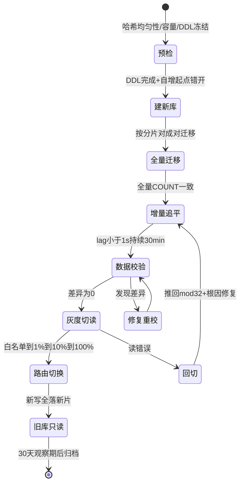
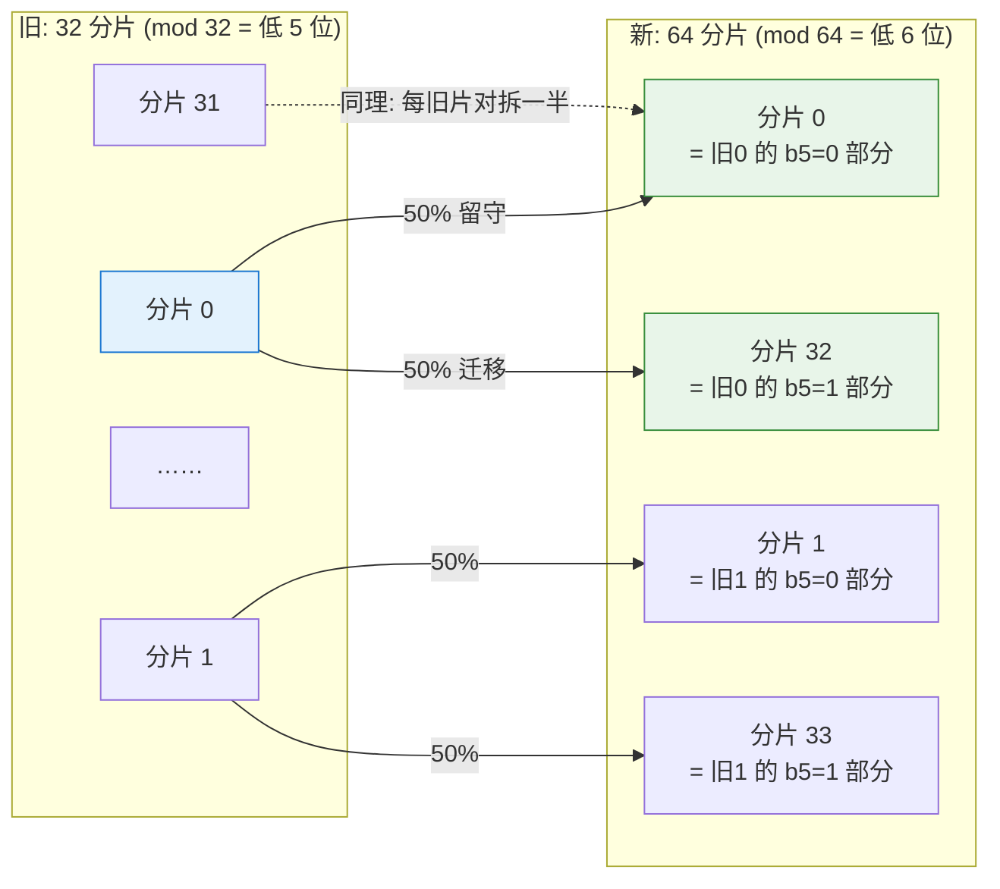
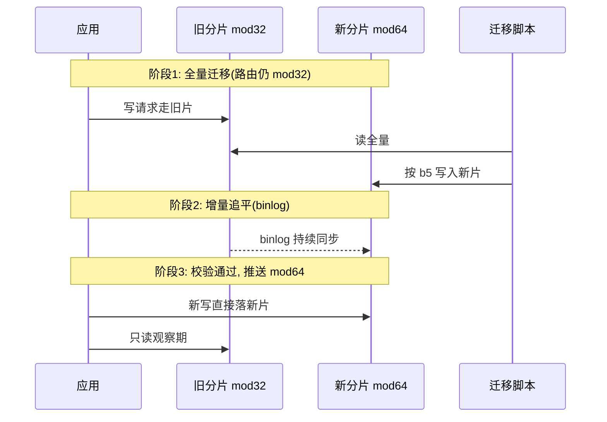

# 翻倍扩容的数学本质：32 到 64 为什么只搬一半

> 分库分表最劝退的一步不是拆，是**拆完之后还要扩**。32 张表容量告警要扩到 64，直觉告诉你：路由从 `mod 32` 变 `mod 64`，几乎全部数据要重新分布——重写路由、全量迁移、业务停机。但数学说：**不需要。翻倍扩容恰好只搬一半，且每一行去哪是可以提前算出来的。** 这篇从模运算的本质把这个「巧合」讲成必然，再看它如何约束路由设计、如何递归到 128。

> **本文核心**：翻倍扩容成立的前提是**分片数始终为 2 的幂**。`hash(key) % 32 == i` 的 key，在 `mod 64` 下只会落到 `i` 或 `i + 32`——由哈希值第 6 位（0 留守 / 1 迁移）唯一决定，比例恰为各半。这不是工程技巧，是模运算的位级必然。所有翻倍扩容方案（双写迁移、成倍扩容、一致性哈希的替代品）都是这个数学事实的工程化包装。

## 一句话摘要

分库分表按 `hash(key) % 2^n` 路由时，扩容到 `2^(n+1)` 的重分布具有位级确定性：每个 key 的哈希值二进制表示中，新增的第 `n+1` 位（0 或 1）决定它**留守原分片 `i`，还是迁移到 `i + 2^n`**——迁移比例恰为 50%，且新旧分片的映射关系可以全量预计算。这意味着 32→64 的迁移可以做到：提前算好每一行的去向、按分片对（i, i+32）成对迁移、应用侧路由在数据就绪后一次性切换。64→128 完全同理递归；而一切**非 2 的幂扩容**（32→48、32→96）都会破坏这个性质，退化为全量重分布。

## 🎯 本文核心

**组织主线**：扩容之痛 → mod 运算的位级本质（为什么翻倍只搬一半）→ 数据流向图（旧片 i 的数据 = 新片 i ∪ 新片 i+32）→ 路由实现的两种姿势（位运算直取 / 基因法）→ 32→64→128 的递归路线 → 反方案对照（一致性哈希/中间件路由为什么在这个场景不是首选）。

## 5W 速记卡

| 维度 | 一句话 |
|---|---|
| What | 分片数 2^n → 2^(n+1) 时，每行去向由哈希值新增位唯一决定，恰好 50% 迁移 |
| Why | 模运算的位级性质：mod 32 相同的 key，mod 64 只会在 i 与 i+32 二选一 |
| When | 容量或 TPS 逼近单分片天花板（红线 70%），且下一档仍是 2 的幂 |
| Where | 应用路由层（位运算/查表）+ 存储层（成对迁移） |
| How | 预计算映射 → 成对迁移 → 数据校验 → 路由原子切换 → 旧库转只读 |

## 一、为什么朴素扩容是灾难：先看清问题的形状

32 张表，路由 `hash(user_id) % 32`。容量到 70% 红线，要扩到 64 张。直觉方案是把模数从 32 改成 64——但这意味着**每一个 key 的归属都重新计算**：

- 一个原来在分片 3 的 key，`hash % 64` 的结果可能是 3（留守）、也可能是 35（迁移）、也可能是 7 或 39（去了原分片 3 之外的任何地方）……
- 实际测算：mod 32 → mod 64，约 50% 的 key 会换分片；但如果当初不是 mod 32 而是 hash 后取模前有额外扰动（如 MD5 再取模），比例可能高达 90%+
- 每一个换分片的 key = 一行要物理迁移的数据 + 一条可能失效的缓存 + 一笔可能路由错误的在途请求

**这就是「全量重分布」的代价**：迁移期间新旧路由共存，任何一条在途写请求打到旧分片而数据已搬走，就是一次「写丢」。朴素扩容把 50% 的数据搬家变成了 100% 的路由混乱。

## 二、mod 运算的位级本质：翻倍为什么恰好只搬一半

把 `hash(key)` 看成一个二进制数。`hash % 32`（32 = 2^5）等价于**取哈希值的低 5 位**；`hash % 64`（64 = 2^6）等价于**取低 6 位**。

于是：

```
hash = ... b7 b6 | b5 b4 b3 b2 b1 b0
                     └────┬────┘
                mod 32 取这 5 位 = i（留守原分片）
                  mod 64 取这 6 位 = i 或 i+32（b5=0 → i；b5=1 → i+32）
```

**核心推理**：两个 key 在 mod 32 下落在同一分片 i，当且仅当它们的哈希值低 5 位相同。扩到 mod 64 后，它们的低 5 位仍然相同，唯一可能不同的是**第 6 位（b5）**——b5=0 的 key 留在 i，b5=1 的 key 去往 i+32。由于哈希值的每一位均匀分布，b5 为 0 或 1 的概率各半——**迁移比例恰好 50%**。

这不是「大概率」，是**位级必然**。你甚至可以在迁移开始前，把 32 张旧表里的每一行写到哪个新分片**精确算出来**，生成一张 2^32 行的映射表——虽然实际不会真的这么干，但「可全量预计算」这个性质决定了迁移方案可以做到零猜测。

从架构视角看，整个扩容过程就是一个**有限状态机**——每个状态有明确的准入条件、操作动作和退出条件，状态间的迁移是原子的、可回退的：



状态机的价值不是「画着好看」，是**每个状态转换都有准入校验和回退路径**——从「灰度切读」回切到「增量追平」的路径必须是热路径（配置中心秒级推送），而不是「先回滚代码再想办法」的冷路径。**回退路径的速度决定了扩容方案的可靠性等级**。

## 三、数据流向图：旧片 i 的数据 = 新片 i ∪ 新片 i+32



**图上三条工程含义**：

- **迁移单位是「分片对」**（旧 i → 新 i 与 i+32）：迁移脚本按对并行，32 对之间零数据交叉，天然可分批、可灰度、可并行
- **新旧分片数量守恒**：32 个旧片的数据恰好填满 64 个新片中的 32 个位置（另外 32 个新片是「拆出来的那一半」），不会出现新片冷热不均的二次倾斜
- **每行数据去向可预计算**：`new_shard = hash(key) % 64`，迁移脚本逐行判断「b5=0 留守 / b5=1 搬到 i+32」，不需要比对全量数据

再看路由切换期间的路由时序——先迁数据后切路由，靠双写兜底：



再看路由切换期间的路由时序——先迁数据后切路由，靠双写兜底：


## 四、路由实现：翻倍方案对路由层的两条硬约束

翻倍扩容的数学成立，前提是路由层满足两个条件——**这两条必须在第一次分库分表时就设计进去**，事后补救等于重新分库。

### 约束一：分片数从第一天起就是 2 的幂

32、64、128、256。如果第一天选了 30 张表（「因为一台机器跑 30 个实例刚好」），扩容时 30 → 60 不是 2 的幂次翻倍，mod 30 的 key 在 mod 60 下**不再有留守/迁移的位级确定性**——直接退化成朴素扩容的全量重分布。业内血泪：**「先用 30 张，不够再改」的团队，最后都做了一次全量数据迁移**。

### 约束二：路由必须基于「可保位的哈希」

- **位运算直取**：`shard = hash(user_id) & (2^n - 1)`——位与运算天然取低 n 位，翻倍后改掩码即可，路由代码零改动
- **基因法**：把分片位直接嵌入分布式 ID（如雪花 ID 的低 n 位存分片基因），路由 = 取 ID 低位——后续扩容时，ID 里的基因位天然兼容新分片数（详见篇 3 分布式 ID 衔接）
- **查表法**：路由表存 key → 分片映射，扩容时改表——最灵活但多一次查表，且表本身要分片（套娃）

## 五、32 → 64 → 128：递归路线与容量规划

### 5.1 路由切换的代码实现：一行掩码的 diff

```java
// 扩容前: 32 分片
int shard = hash(user_id) & (32 - 1);   // 0b11111 掩码, 取低 5 位

// 扩容后: 64 分片 —— 只改掩码常量
int shard = hash(user_id) & (64 - 1);   // 0b111111 掩码, 取低 6 位
// 数据迁移完成后通过配置中心推送 shardMaskVersion=2, 应用热加载生效
```

### 5.2 参数级配置清单

| 配置项 | 默认值参考 | 分档推荐 | 为什么 |
|---|---|---|---|
| 迁移批大小 batch_size | 2000 行/批 | 大表 5000，小表 2000 | 过大拖垮旧库读，过小迁移周期长 |
| 迁移限速 rate_limit | 500 行/秒 | 大促冻结期可放 2000 | 控制对旧库读压力，防影响在线查询 |
| 校验抽样比例 | 1% | 资金类 10% | 全量校验太贵，抽样+对账兜底 |
| 新片自增起点 | 旧片 max_id + 1000 万 | 按日增量 × 30 天预估 | 双写窗口防主键冲突 |
| 灰度切读批次 | 白名单 → 1% → 10% → 100% | 每档观察 ≥24h | 逐级放大爆炸半径 |
| 双写开关 | 配置中心动态下发 | 紧急回滚秒级关新写 | 双写是回退能力的生命线 |

### 5.3 步骤级操作：翻倍扩容最小执行序

| 步骤 | 操作 | 验证 | 回退 |
|---|---|---|---|
| 前置 | 校验哈希均匀性（GROUP BY 分布） | 偏离 50% ± 5% 以内 | 修哈希函数后再扩 |
| 建新库 | 新分片表结构 DDL + 自增起点错开 | `SHOW CREATE TABLE` 比对 | DROP 新库重来 |
| 全量迁移 | 按「分片对」成对迁移，b5=1 行搬 i+32 | 每对 COUNT 比对 | 停脚本，已搬数据保留 |
| 增量同步 | binlog 订阅追平全量期间增量 | lag < 1s 持续 30min | 停订阅 |
| 数据校验 | 抽样 1% + 全量 COUNT + checksum | 差异 = 0 | 差异行修复后重校 |
| 路由切换 | 配置中心推送 mod 64 + 双写停旧 | 新写全落新片 | 推回 mod 32（数据兼容） |
| 收尾 | 旧库转只读 → 归档 | 30 天观察期后下线 | — |

### 5.4 机制穿透：mod 运算在数据库路由层的底层逻辑

从 CPU 视角看，`hash & (2^n - 1)` 与 `hash % 2^n` 的差别是**一条 AND 指令 vs 一条 DIV 指令**——前者 1 个时钟周期，后者 20+ 个。分库路由是每个请求都要执行的热路径，这 20 倍差距在百万 QPS 下是实打实的 CPU 节省。这也是为什么所有分库中间件（ShardingSphere/Sharding-JDBC）内部都强制 2 的幂分片数——**不是惯例，是热路径性能的硬约束**。同理，`hash & (2^n - 1)` 的位与运算天然保证了「取低 n 位」的语义，与翻倍扩容的位级推理完全同构——数学性质与工程优化在这里汇合于同一行代码。

### 5.5 跨周期视角：翻倍扩容的「前世今生」

这套方法的演进路径：早期 DBA 用「导出导入 + 停机窗口」硬扛扩容（小时级停机）；后来有了双写 + binlog 增量的不停机方案（天级周期）；翻倍扩容把迁移比例从「不确定」压到「精确 50%」之后，SOP 才真正标准化到可复制。下一阶段的演进方向是存算分离架构让扩容变成元数据操作（互指《数据库架构演进》）——但只要还在 MySQL 分库分表的体系内，2 的幂 + 翻倍仍是唯一正确答案。**架构决策的价值在跨周期复用：这套约束（2 的幂、可保位哈希）第一天写进规范，未来五年每次扩容都在受益。**

## 五、32 → 64 → 128：递归路线与容量规划

翻倍扩容是**递归**的：64 → 128 重复同样的位级逻辑（第 7 位决定留守或迁移到 i+64），128 → 256 同理。容量规划因此变成一条简单的算术：

| 当前 | 下一档 | 迁移比例 | 单分片容量红线 | 触发条件（70% 红线） |
|---|---|---|---|---|
| 32 | 64 | 50% | 单表 2000 万行 / 单库 500GB | 总量 ≈ 4.5 亿行 |
| 64 | 128 | 50% | 同上 | 总量 ≈ 9 亿行 |
| 128 | 256 | 50% | 同上 | 总量 ≈ 18 亿行 |

**递归的另一层含义**：32→64 迁移时写的所有工具（预计算映射/成对迁移脚本/校验器），64→128 时**原样复用**——只改常量。这是翻倍方案对运维平台化的最大馈赠。

## 六、反方案对照：为什么不用它们

- **一致性哈希（为什么不用）**：一致性哈希解决的是「分布式缓存节点增减时最小化数据迁移」，它的迁移是环上邻接区间再分配，**比例不可预计算**（取决于虚拟节点分布），且区间边界处存在路由不确定性。翻倍扩容的 50% 确定性迁移 + 成对并行，在数据库场景（迁移窗口可控、可以停写秒级）下全面优于一致性哈希的「随机但分散」。
- **中间件路由（MyCat/ShardingSphere 代理层，为什么不首选）**：代理层路由把扩容变成「改中间件配置」，看似简单——但代理本身成为单点与性能瓶颈，且跨代理的数据迁移协调仍然要做。应用内路由（SDK 直连）+ 翻倍扩容，少一跳、少一个组件、少一类故障。代理层适合多语言异构团队，单体 Java 团队收益为负。

## 七、不同量级的思考：约束驱动扩容节奏

- **十万级 QPS / 亿级行以下**：这一档的核心问题是「有没有分库分表的必要」，而不是「扩容怎么平滑」——单库 + 读写分离 + 归档冷数据，大概率够用。约束来源是**成本与运维复杂度**，思考方式是「诊断驱动」：慢查询日志与单表行数是唯一要盯的指标。
- **百万级 QPS / 数亿行**：这一档的核心问题是「扩容窗口怎么不影响业务」，而不是「分多少张」——约束来源是**业务连续性**，思考方式是「流程驱动」：双写、灰度、校验每一步都要 SOP（篇 6 展开全流程）。
- **千万级 QPS / 数十亿行**：这一档的核心问题是「递归扩容的终局」，而不是「这一次怎么迁」——约束来源是**架构终局**，思考方式是「终局驱动」：128 还是 256？翻倍到什么时候该换 NewSQL 而不是继续翻？（扩容与 NewSQL 的选型边界，互指《数据库架构演进：单机到分布式 NewSQL》）

**自下而上与触发升级**：先测当前量级与增速，决定是「诊断要不要拆」还是「规划怎么扩」；触发升级的信号是单表行数破 2000 万、单库容量破 70%、或大促容量评估显示下一档需求——**扩容不是一步到位的工程，是跟着量级走的递归决策**。

## 八、你们可能会问

**Q1：翻倍扩容迁移期间，写请求怎么办？**
迁移期间**旧分片仍是写主**：应用路由保持 `mod 32`，新分片只接收迁移数据。路由切换到 `mod 64` 的时机在全部数据迁移+校验完成之后，且配合双写窗口（详见篇 6 全流程）。翻倍扩容的数学解决了「数据去哪」，「什么时候切路由」是流程问题——两件事分开设计，都不难。

**Q2：hash 函数不均匀导致某旧分片特别大怎么办？**
先治倾斜再扩容（倾斜治理见篇 2 分片键设计）。带病扩容会把倾斜「复制」到新分片对上——旧 5 号片是别人 3 倍大，新 5/37 号片同样 3 倍。扩容是放大器，不是矫正器。

**Q3：64 张也不够，直接上 256 行不行？**
数学上完全成立（跳两档翻倍，迁移比例仍 50%），工程上不建议：256 个新分片意味着 2 倍的数据库实例成本提前支付、且单分片数据密度骤降（每片数据太少，查询反而要走更多分片）。**翻倍按需、一次一档**——这也是「递归」设计的本意。

**追问链（质疑者三连）**：
- **追问一**：翻倍扩容把数据搬了一半，搬的那 50% 期间业务写入还在旧片上，怎么办？——迁移期间**旧片仍是写主**，新片只接收迁移数据副本；路由切换在数据+校验全部就绪后才推送。写入不中断，切换是原子操作。
- **再追问**：双写窗口期（旧写 + 新写）如果新写失败怎么办？——新写失败仅告警不阻断（旧片是事实源），由 binlog 增量订阅补齐；紧急时配置中心秒级关闭新写。**新片在切换前永远是「副本」不是「事实源」**。
- **打破砂锅**：翻倍到最后一张表（如 1024 张），每张只有几十万行了，还有必要翻吗？——不需要。翻倍扩容有天花板：当单分片数据量低于 MySQL 优雅运行的最低行数（约百万级），继续翻倍只会碎片化。此时扩容策略应该切换为「合并部分分片」或「迁移到分布式数据库」，硬翻反而退化。

**场景推演（某社交 App 信息流分库 32→64 实战复盘）**：
- **排查**：信息流表 30 亿行，单表 9400 万行，读写延迟 P99 从 80ms 涨到 400ms。`SHOW TABLE STATUS` 发现单表数据长度 38GB，索引长度 22GB——超过单表健康线 3 倍。
- **根因**：当初按日活 500 万设计 32 分片，三年后日活 3000 万，每分片数据量翻了 6 倍。
- **修复**：翻倍扩容到 64 分片，全量迁移耗时 72 小时（限速 500 行/秒），增量追平 4 小时，校验差异 0，灰度切读 7 天，全程零停机。
- **复盘**：当初定 32 分片时用的是「当前日活 × 3」而不是「目标日活 × 增长系数」——**容量规划要按终局算，不要按现状算**。

## 💡 实战提示

- 💡 第一天就把分片数定为 2 的幂（32/64/128），这条约束写进架构决策记录——事后补救 = 全量迁移
- 💡 路由用位运算 `& (2^n - 1)` 而非 `% (2^n)`——语义相同，但扩容时改掩码的代码 diff 是一行
- 💡 迁移前用 `SELECT hash_col % 64, COUNT(*) FROM ... GROUP BY 1` 预计算每个旧分片的 50/50 分布——比例偏离 50% 说明哈希有问题，先修哈希再迁移
- 💡 32→64 的「分片对」迁移天然可并行：32 对可拆成 8 批 × 4 对灰度执行，每批校验通过再下一批
- 💡 新分片的自增 ID 起点要错开（如旧片 1-1000 万、新片 1000 万+），防止双写窗口期主键冲突

## 开放问题

- 云原生分布式数据库（TiDB/OceanBase）把「扩容」做成了透明操作，翻倍扩容的工程价值会否被「直接用 NewSQL」替代？——分界线在存量 MySQL 的迁移成本与 NewSQL 的运维成熟度，未来三到五年是过渡窗口
- 存算分离架构（如 PolarDB-X 的 CN/DN 分离）可能让「扩容」从数据迁移降维为元数据操作——届时篇 6 的迁移 SOP 将成为历史文献

## 开放问题

- 翻倍扩容在分库分表体系内是标准答案，但当团队同时维护 MySQL 分库分表 + ES 宽表 + ClickHouse 分析集群时，扩容需要在三个异构存储间协调——多存储扩容的一致性保证是未完全解决的工程问题
- 云原生 NewSQL（TiDB/OceanBase）声称「透明扩容」，但实际生产中 region 调度与热点迁移仍有毛刺——「自研分库分表 vs 直接上 NewSQL」的决策边界随两者成熟度持续移动

## 🎯 核心带走

- **核心一句话**：分片数为 2 的幂时，翻倍扩容由哈希值新增位唯一决定每行去向——50% 迁移、成对并行、全量可预计算，这是模运算的位级必然而非工程巧合
- **两条硬约束**：分片数从第一天起是 2 的幂；路由哈希必须可保位（位运算/基因法）
- **哪里会坏**：非 2 幂分片数（30 张表）、倾斜分片带病扩容、路由切换与数据迁移不对齐
- **递归价值**：32→64 的工具 64→128 原样复用，只改常量
- **边界**：翻倍扩容解决「数据去哪」，不解决「什么时候切」（篇 6 流程）与「出了什么问题」（篇 7 清单）

## 📌 数据与事实声明

- 写于 2026-09-25（扩容迁移深度系列第 1 篇，与篇 3 平滑迁移、篇 4 架构全景构成三部曲）；模运算位级性质为数学事实，翻倍扩容方案为业内公开实践口径
- 事故叙事为业内高频扩容事故模式的匿名化归纳，非特定公司事件
- 免责：具体中间件（ShardingSphere 等）的扩容支持以官方文档为准

## 📚 参考资料

| 类型 | 标题 | 来源 |
|---|---|---|
| 系列内 | 篇 2 分片键设计（基因法） / 篇 3 分布式 ID 与平滑迁移 | 本目录 |
| 系列内 | 篇 6 不停机迁移全流程 / 篇 7 迁移事故清单 | 本目录（成文中） |
| 关联篇 | 《数据库架构演进：单机到分布式 NewSQL》 | `data/整合层/从零认识数据库体系系列/` |
