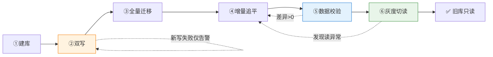
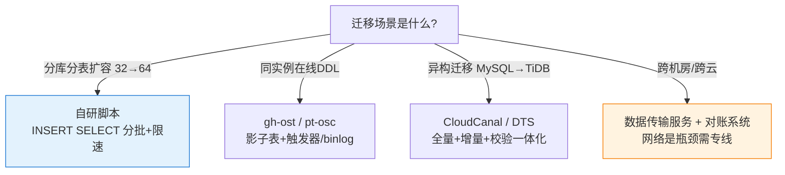
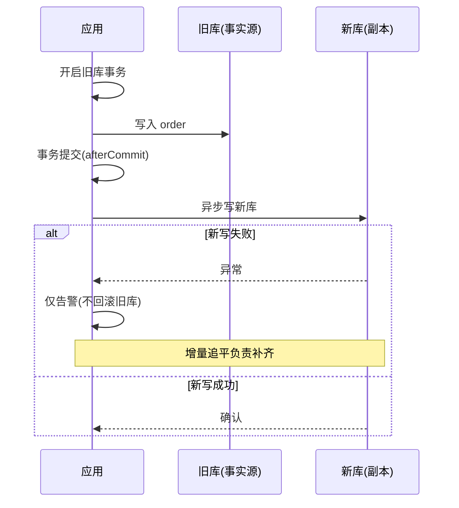
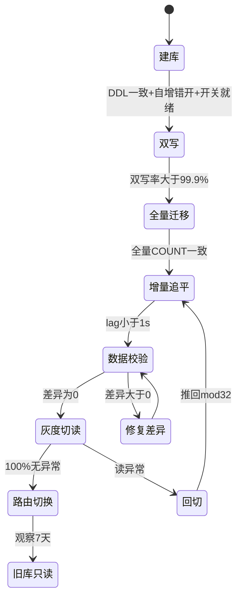

# 不停机迁移全流程：六阶段 SOP 与回退路径

> 篇 5 讲了翻倍扩容「数据去哪」的数学——本篇讲「怎么安全地把数据搬过去，同时业务不停」。不停机迁移不是一套工具，是一条**六阶段状态机**：每个阶段有准入条件、操作动作、验证标准和回退路径，跳步或省略校验 = 事故种子。

> **本文核心**：不停机迁移的本质是**新旧库共存窗口的管理**——窗口越短风险越低，但每一步的准入条件越严格。六阶段（建库 → 双写 → 全量 → 增量追平 → 校验 → 灰度切读）是一条**不可逆序的单向通道**：跳过校验直接切读、双写期不监控差异、回退走冷路径，每一个省略都是生产事故的种子。

## 一句话摘要

分库分表不停机迁移分六阶段执行：①建库（DDL + 自增错开）②双写（旧为主新为辅，新写失败仅告警）③全量迁移（存量拷贝限速）④增量追平（binlog 订阅，lag < 1s）⑤数据校验（全量 COUNT + 抽样 checksum）⑥灰度切读（白名单 → 1% → 10% → 100%）→ 旧库只读。每个阶段有明确的准入/退出/回退路径，整个流程靠**写前技能清单 + 状态机管控**保证可复制。

## 🎯 本文核心

**组织主线**：旧库还在服务 → 新库开始并行 → 逐步把流量和数据搬到新库 → 旧库退役。整个过程的**生命周期**：



**核心洞察**：整个流程中，旧库始终是**事实源（Source of Truth）**，新库是「副本 + 新流量承载体」。只有旧库转为只读的那一刻，事实源才正式切换。这个定义决定了整个迁移架构的设计基线：迁移期间**任何新库数据问题都不需要紧急回滚**（旧库没断），但**任何旧库数据丢失都是 P0 事故**（不可再生）。

## 5W 速记卡

| 维度 | 一句话 |
|---|---|
| What | 六阶段不停机迁移：建库→双写→全量→追平→校验→灰度切读 |
| Why | 停机迁移在大规模场景不可接受，不停机是唯一选项但需严格 SOP |
| When | 分片扩容（32→64）、存储引擎更换、机房迁移、云上迁移 |
| Where | 应用双写开关、迁移工具、binlog 订阅、数据校验服务 |
| How | 每阶段四段表（前置/操作/验证/回退），状态机管控 |

## 一、源码/关键路径：双写的实现模式与坑

### 模式一：应用层双写（侵入式）

```java
// 旧库写完 → 同步写新库 → 新写失败仅告警不回滚旧写
@Transactional("oldDataSource")
public void createOrder(Order order) {
    oldRepo.insert(order);
    try {
        newRepo.insert(order);   // 新库写失败不阻断旧库事务
    } catch (Exception e) {
        alarmService.report("双写异常", order.getId(), e);
        // 不 throw——旧库是事实源，新库靠增量追平修复
    }
}
```

**坑**：旧库事务回滚时，新库已经写入了（写顺序不可控）——产生脏数据。**解法**：旧库事务提交后再异步写新库（Spring `TransactionSynchronization.afterCommit`），或者走 binlog 订阅替代应用层双写。

### 模式二：binlog 订阅（非侵入式）

```yaml
# Canal / Debezium 订阅旧库 binlog → 投递到新库
# 优点: 应用零改动、不侵入事务、延迟可控(毫秒级)
# 缺点: 无法捕获缓存更新等非 DB 操作、binlog 格式需 ROW 模式
canal:
  server: canal-server:11111
  destination: order_migration
  filter: "old_db\\.order$"
```

**选型口诀**：应用层双写适合**表少且写入路径可控**的场景；binlog 订阅适合**表多且写入路径分散**的场景——后者是大规模迁移的主流选择。

迁移工具选型的决策逻辑：



## 二、六阶段详解：每步的前置/操作/验证/回退

双写事务顺序的事故成因与修复：



六阶段全流程状态机（含回退路径）：



## 二、六阶段详解：每步的前置/操作/验证/回退

### 阶段① 建库

| 维度 | 内容 |
|---|---|
| 前置 | 容量评估（64 片 × 单片预估）· DDL 评审 · 新实例规格与旧库对齐 |
| 操作 | 新分片 DDL + **自增起点错开**（旧片 max_id + 1000 万）+ 索引与旧库一致 |
| 验证 | `SHOW CREATE TABLE` 新旧一致 · 自增起点 ≥ 旧片 max_id |
| 回退 | DROP 新库重来（此阶段无数据，回退零成本） |

**关键细节**：**自增起点必须错开**——双写期间新旧库各自自增，如果起点相同，同一笔订单可能在两库生成相同自增 ID（不同数据）。错开量按**日增量 × 30 天**预估。

### 阶段② 双写

| 维度 | 内容 |
|---|---|
| 前置 | 双写开关接入配置中心 · 新库告警接入值班群 · 双写异常告警阈值（>0.1% 即人工介入） |
| 操作 | 应用开启双写开关：旧库同步写（事务内），新库异步写（事务提交后） |
| 验证 | 双写成功率 > 99.9% · 新库写入延迟 P99 < 100ms · 双写异常计数趋势平稳 |
| 回退 | 关闭双写开关（秒级），新库回退为空库 |

**双写期间的核心纪律**：新库写失败**绝不阻断旧库事务**（旧库是事实源），只告警 + 依赖增量追平修复。这段窗口内**禁止目标表 DDL**——迁移与 DDL 并行 = 需要四维同步，复杂度指数级。

### 阶段③ 全量迁移

| 维度 | 内容 |
|---|---|
| 前置 | 双写稳定运行 ≥24h · 迁移工具压测通过 · 限速参数确认 |
| 操作 | 按「分片对」成对迁移，`WHERE id BETWEEN start AND end` 分批，限速执行 |
| 验证 | 每批完成后 COUNT 比对 · 全量完成后总 COUNT 比对 |
| 回退 | 停迁移脚本 → 清空新库重跑（全量迁移幂等） |

**工具选型**：小表（<1000 万行）直接 `INSERT INTO new SELECT * FROM old`；大表用 DataX/自研脚本分批拉取。关键参数：批大小 2000-5000 行/批、限速 500 行/秒、失败重试 3 次后跳过并记录（后续人工修复）。

### 阶段④ 增量追平

| 维度 | 内容 |
|---|---|
| 前置 | 全量迁移完成 · binlog 订阅位点正确（从全量迁移开始的时间戳起） |
| 操作 | binlog 持续订阅 → 变更写入新库（幂等写入：ON DUPLICATE KEY UPDATE） |
| 验证 | 订阅 lag < 1s 持续 30 分钟 → 可进入校验阶段 |
| 回退 | 停止订阅 → 重新从上次位点开始（位点持久化在迁移元数据库） |

### 阶段⑤ 数据校验

| 维度 | 内容 |
|---|---|
| 前置 | 增量追平 lag < 1s · 校验工具部署 · 抽样比例确认 |
| 操作 | 全量 COUNT 比对 + 抽样 checksum 比对（1% 或资金类 10%）|
| 验证 | 差异 = 0（抽样含热数据 + 冷数据 + 边界数据） |
| 回退 | 差异 > 0 → 逐条修复（以旧库为准重写新库）→ 修复后重校 |

**校验三层**：第一层全量 COUNT（秒级）；第二层分片 checksum（分钟级）；第三层逐行比对（小时级，仅资金类）。差异行逐条修复后必须重跑第二层确认修复无副作用。

### 阶段⑥ 灰度切读

| 维度 | 内容 |
|---|---|
| 前置 | 校验差异 = 0 · 灰度开关接入配置中心 · 回退开关测试通过（推回 mod 32 秒级生效） |
| 操作 | 白名单用户 → 1% → 10% → 50% → 100%，每档观察 ≥24h |
| 验证 | 每档：新库读延迟 P99 与旧库持平 · 无用户反馈异常 · 双写仍正常 |
| 回退 | 推回 mod 32（秒级）→ 回读旧库 → 根因修复后重走灰度 |

**切读的本质**：读路由从旧库切到新库，写路由从「旧库」变为「新库」，但**旧库仍有增量写入**（双写还在跑）——直到灰度 100% + 观察 7 天后才停旧库写入，旧库转只读。

## 三、事故叙事三则（业内高频迁移事故的匿名化归纳）

**叙事一：双写事务顺序导致数据不一致。**某支付平台迁移时应用层双写，旧库事务内写，新库事务外写。某日旧库事务回滚（余额不足），但新库写入已经执行——新库多了一条不存在的支付记录。发现：对账系统报告差异 1 条。修复：新库按旧库 binlog 重新覆盖。**沉淀**：双写必须在旧库事务提交后执行（`afterCommit`），或在事务内捕获回滚事件同步删新库。

**叙事二：灰度切读 10% 时发现读到的数据缺字段。**某平台切读 10% 后，客服收到用户反馈「订单详情页少了优惠券信息」。排查发现新库表结构少了 `coupon_id` 列——DDL 评审时遗漏，但双写期间 MySQL 宽松模式允许写入（该列有默认值 NULL），切读后前端解析报错。修复：新库补列 + 重新全量校验该表。**沉淀**：切读前必须做**新旧库 schema 全列比对**，不能只查 COUNT。

**叙事三：校验抽样漏了热点数据。**某系统校验抽样 1% 随机采样，但秒杀活动的热点商品（占写入量 40%）恰好不在抽样范围内——校验通过后切读，热点商品的库存数据全部异常。修复：资金类数据改为**定向抽样（热点 key 100% + 冷数据 1%）**。**沉淀**：抽样策略必须覆盖写入分布的长尾与头部，不能只按行数比例。

## 四、追问链（质疑者三连）

- **追问一**：双写期间新旧库事务如何保证？——不保证。**旧库事务是唯一事务边界**，新库写入在事务外（afterCommit 异步），失败靠增量追平修复。追求双写事务 = 分布式事务 = 复杂度指数级。
- **再追问**：增量追平 lag 居高不下怎么办？——分三步：①检查 binlog 订阅消费者并发度（Canal 单线程是瓶颈，改多线程按表哈希）②检查新库写入批次大小（INSERT ... ON DUPLICATE 逐条改批量）③如果旧库写入 TPS 真的大于新库消费能力，必须降低旧库写入限流——**让迁移逼你发现系统真实的写入上限，也是一次容量体检**。
- **打破砂锅**：为什么不干脆停机迁移？——停机 1 小时的业务损失远超不停机迁移多花 3 天的人力成本；且停机迁移没有回退路径（数据已在旧库改了，回不去）。**停机不是简单，是把风险集中到一个时间点的赌博。**

## 五、反方案分析

- **为什么不用 MySQL 原生主从复制做迁移**：主从复制要求主从表结构完全一致，但分库分表迁移往往伴随 DDL 变更（新增分片键列/改自增/改索引）；且主从复制的从库天然只读，无法满足「双写新库」的需求。binlog 订阅（Canal/Debezium）是更灵活的替代。
- **为什么不直接用云厂商 DTS**：DTS 确实是「全自动迁移」，但两个问题——①跨云迁移（如自建到 RDS）DTS 有限制；②DTS 的校验粒度是表级 COUNT，无法做到行级 checksum，资金类数据不敢只信 DTS。**云工具适合标准迁移，自研适合深度定制**——按团队对迁移可控性的要求选。

## 六、设计思想：为什么是状态机而不是 checklist

迁移流程不是「做完 A 做 B 做 C」的线性清单——因为**任何一步都可能失败，失败后需要精确回退到某个之前的状态**。状态机的价值在于：每个状态有明确的准入/退出条件，状态间的转换是原子的，回退路径是预定义的（不是临场发挥）。这也是为什么所有严肃的迁移工具（gh-ost/Liquibase/Flyway）都内置了状态管理——**迁移的可靠性不取决于工具功能多强，取决于状态转换是否可管控——这套思想从 MySQL binlog 复制到 gh-ost 在线 DDL 再到分库分表迁移平台，底层架构逻辑一脉相承**。

## 七、你们可能会问

**Q1：双写期间新库出问题，关掉新写后数据不一致窗口有多大？**
从关新写到重新开启，窗口内的旧库变更靠增量追平补齐——窗口大小 = 追平时间 ≈ 故障持续时间。因此**关新写的决策必须配套「增量追平健康检查」**，确保重开后 lag 能快速归零。

**Q2：能不能把双写和全量迁移并行？**
不能。全量迁移期间双写会导致迁移工具读到「迁移开始后变更过的数据」，产生覆盖冲突。正确顺序：先开双写（新库只收增量）→ 再跑全量（存量）→ 全量完成后增量追平。**双写是全量迁移的前置条件**，不是并行步骤。

**Q3：切读到 100% 后，双写开关什么时候关？**
观察期 ≥7 天后（确认新库无隐藏问题），配置中心关双写 → 旧库写入归零 → 旧库转只读 → 30 天归档后下线。**双写开关是最后关的，不是最先关的**——它是你最后的安全网。

## 八、什么时候用 / 不用

- ✅ 用：分片扩容（32→64/128）、存储引擎更换、机房迁移、云上迁移
- ✅ 用：数据量太大无法停机（>1 亿行/停机代价 > 人力成本）
- ❌ 不用：数据量小可以接受 30 分钟停机窗口——停机 30 分钟比不停机 3 天的人力便宜
- ❌ 不用：没有对账/校验基础设施的团队——先建校验，再做迁移

### 不同量级的思考：迁移 SOP 的档位差异

- **十万级（单表 <500 万行 / 迁移 <1h）**：这一档的核心问题是「数据一致性」，而不是「迁移效率」——量小到全量校验秒级完成，不需要抽样策略，COUNT 即可。约束来源是数据量小、工具简单（INSERT SELECT 就够），思考方式是「人工驱动」——DBA 手动执行 + 肉眼验证
- **百万级（单表 500 万-5000 万 / 迁移 1-12h）**：这一档的核心问题是「增量追平的 lag 控制」——写入量大时增量订阅消费不完，lag 持续增长。约束来源是消费吞吐瓶颈，思考方式是「脚本驱动」：限速、分批、断点续传，每个参数都要精确调优
- **千万级（单表 >5000 万 / 迁移 >12h）**：这一档的核心问题是「迁移期间的一致性保证」——迁移窗口跨天，双写差异可能积累到不可修复。约束来源是一致性验证成本，思考方式是「平台驱动」：需要独立的校验服务、自动修复流水线、差异告警体系——人工逐条修复已不可行
- **亿级（跨库/跨机房）**：这一档的核心问题是「多库迁移的协调」——不再是一个表的迁移，是几十个表的 DAG 依赖调度 + 跨网络传输优化。约束来源是网络与协调成本，思考方式是「平台化 + DAG 编排」——这就是为什么大厂都自研了迁移平台而不是用脚本

**自下而上与触发升级**：先测量数据量与写入 TPS，选择对应档位；触发升级的信号是——量小方案跑不动（脚本超时/校验超时），说明需要升档；跨档位的标志是「人工变成了脚本，脚本变成了平台」。

### 跨周期视角：迁移方案的演进路径

不停机迁移的方案演进与数据库架构本身共生：早期 DBA 用「主从切换」实现伪迁移（停写→切主→旧主变新库），后来有了 binlog 订阅 + 异步双写（不停机但需应用配合），现在有了 CloudCanal/gh-ost/pt-osc 等自动化工具（低侵入+自动回退）。未来的方向是「声明式迁移」——用户声明「我要从 32 分片到 64」，平台自动编排整个状态机——但这要求底层基础设施（存算分离/元数据服务）先成熟。**方案的复杂度总是与基础设施的成熟度成反比**——基础设施越成熟，迁移 SOP 越短，但理解 SOP 背后原理的能力不能退化，因为出问题时你还是要知道状态机里哪个环节卡了。

## Trade-off## Trade-off

不停机迁移的核心取舍是**复杂度换连续性**：双写、增量、校验、灰度每一步都增加工程复杂度，换来的是业务零感知。**复杂度的下限是「至少有一层校验 + 一条回退路径」**——没有校验的迁移等于盲飞，没有回退的迁移等于赌博。

## 迁移期间的团队分工与值班机制

大规模迁移不是 DBA 一人的事——需要应用开发、DBA、运维、QA 四方协同。分工原则：**应用开发负责双写代码与灰度开关逻辑，DBA 负责迁移脚本执行与数据库层面监控，运维负责基础设施资源保障与告警接入，QA 负责数据校验脚本的编写与全量比对执行**。值班机制上，迁移窗口（全量迁移 + 增量追平 + 灰度切读的关键 72 小时）必须 7×24 小时有人值守，交接班时对接：双写异常计数、增量 lag 趋势、校验差异计数、灰度切读比例、告警事件清单——五项指标口口相传，不能只看飞书群消息。**迁移期值班不是形式，是六阶段状态机的人力保障层——状态机再完善，没人在状态异常时按下回退按钮也是空谈。**

## 开放问题## 开放问题

- 存算分离架构下「扩容 = 元数据操作」，迁移 SOP 的「双写/全量/增量」三步可能大幅简化——关注 TiDB/OceanBase 的在线扩容实践
- AI 辅助数据校验（异常模式识别替代规则校验）在头部厂商开始出现，可能提升校验覆盖率

## 开放问题（补充）

- 如果迁移同时涉及异构数据库（MySQL → TiDB），schema 差异（自增 vs 自动分配/事务隔离级别差异）在双写期如何对齐——异构迁移的 schema 映射是独立专题
- 跨机房迁移（异地多活建设）的网络延迟对增量追平 lag 的影响——同机房 lag < 1s 可达，跨机房可能 > 5s，需要调整追平的验收标准

## 💡 实战提示

- 💡 双写开关放配置中心，紧急回滚秒级生效——代码里硬编码开关 = 回退靠发版
- 💡 新库自增起点 = 旧库 max_id + 日增量 × 30——错开量太小双写冲突，太大浪费 ID 空间
- 💡 迁移工具的限速参数跑前必须压测——不限速的全量迁移对旧库的读压力等于一次全表扫描风暴
- 💡 校验差异行「以旧库为准修复新库」——不要「两边各改一半」，那会产生第三种不一致
- 💡 灰度切读的每一档都观察 24 小时——连续三档无异常才加速到下一档

## 自测三问

1. 六阶段中哪一阶段是不可跳过的底线？跳过的后果是什么？
2. 双写的两种实现模式各有什么坑？选型口诀是什么？
3. 「回退路径的速度决定了可靠性等级」怎么理解？举一个热回退的例子。

## 🎯 核心带走

- **核心一句话**：不停机迁移 = 新旧库共存窗口的管理——六阶段状态机 + 每步四段表 + 校验三层 + 灰度逐级放大，跳过校验直接切读 = 事故种子
- **核心纪律**：旧库始终是事实源 · 新写失败仅告警 · 双写开关是最后关的 · 校验差异以旧库为准
- **哪里会坏**：双写事务顺序、schema 列遗漏、抽样漏热点、DDL 与迁移并行
- **回退体系**：每阶段有预定义回退路径，切读的回退是热路径（秒级推送）
- **边界**：数据量小可停机就不停机；没有校验设施的团队先建校验再做迁移

## 📌 数据与事实声明

- 写于 2026-09-25（扩容迁移深度系列第 2 篇）；双写/binlog 订阅/灰度切读为业内公开实践口径
- 事故叙事为业内高频迁移事故的匿名化归纳，非特定公司事件
- 免责：具体工具（Canal/DataX/gh-ost）以官方文档为准

## 📚 参考资料

| 类型 | 标题 | 来源 |
|---|---|---|
| 开源工具 | Canal（binlog 订阅） | github.com/alibaba/canal |
| 开源工具 | gh-ost（在线 DDL） | github.com/github/gh-ost |
| 系列内 | 篇 5 翻倍扩容数学本质 / 篇 3 分布式 ID 与平滑迁移 | 本目录 |
| 关联篇 | 《亿级容量实战选型决策》《全链路压测的生产安全》 | engineering/专题层 |
