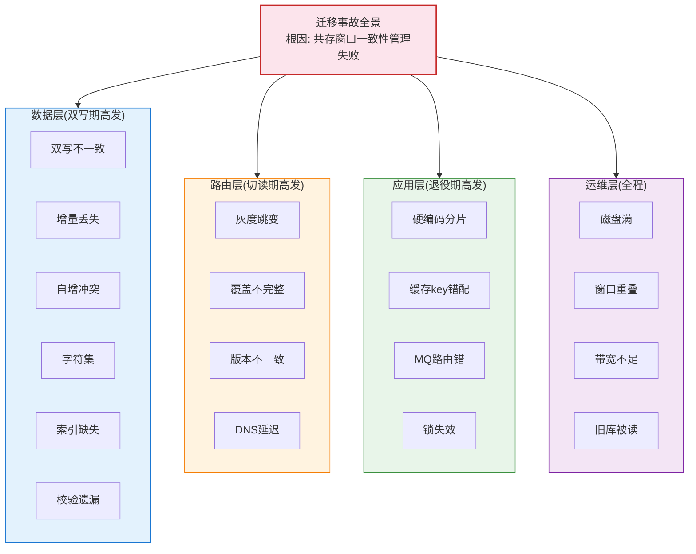
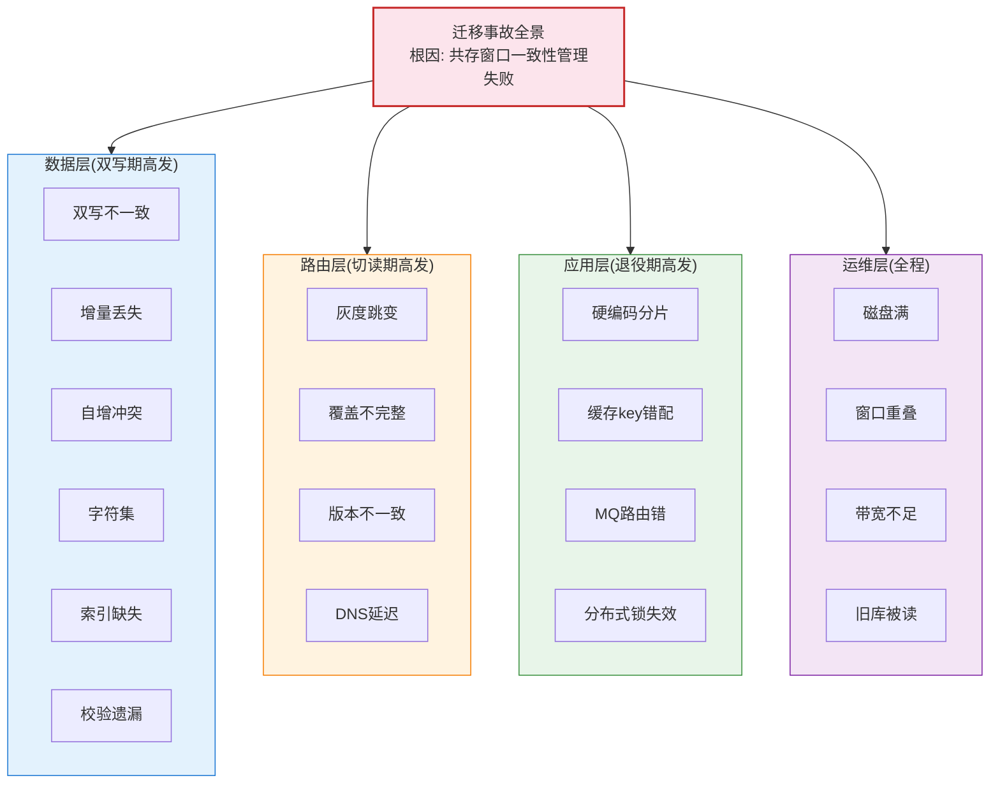
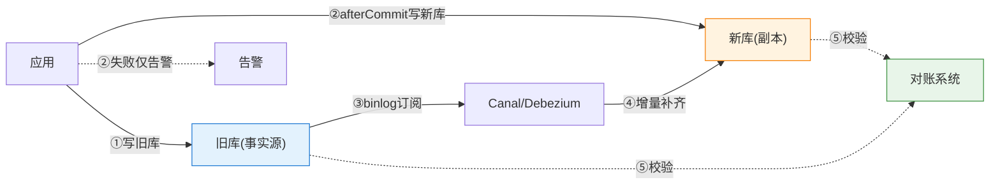
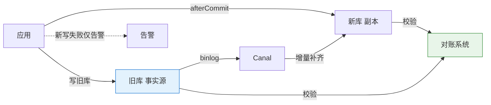

# 迁移事故清单：十八种翻车姿势与全面治理

> 篇 5 讲了翻倍扩容的数学，篇 6 讲了六阶段 SOP——但 SOP 是「不出事的理想路径」。这篇是**事故路径的全景清单**：十八种翻车姿势，按「数据层 / 路由层 / 应用层 / 运维层」四层分类，每种给出症状、根因、预防与治理。**读完这篇，你的迁移预案从「我相信不会出事」升级为「每种事我都知道怎么发现和修复」。**

> **本文核心**：从底层原理看，迁移事故的本质是**新旧系统共存窗口内的一致性管理失败**——数据层管「数据对不对」，路由层管「请求去哪」，应用层管「代码兼不兼容」，运维层管「资源够不够」。四层各自的典型事故模式不同，但**根因高度收敛于三个**：①新旧库状态不一致 ②路由切换不原子 ③资源预估不足。治理思路因此收敛为一句话：**每一层都预埋「发现不一致的手段 + 回退到旧状态的路径」**。

## 一句话摘要

分库分表迁移的事故清单覆盖四层十八种翻车姿势。数据层六种：双写不一致 / 增量丢失 / 校验遗漏 / 自增冲突 / 字符集不匹配 / 索引缺失导致回源慢。路由层四种：灰度比例跳变 / 路由规则覆盖不完整 / 多应用实例路由版本不一致 / DNS 缓存导致路由延迟。应用层四种：代码兼容性（老代码依赖旧分片逻辑）/ 缓存 key 分片后缀不匹配 / 消息队列分片路由错误 / 分布式锁跨库失效。运维层四种：迁移期间磁盘打满 / 迁移窗口与大促重叠 / 网络带宽不足导致增量 lag / 旧库归档后意外被读。每种事故都有对应的发现手段与修复路径。

## 四层事故全景图

## 🎯 本文核心

**组织主线**：四层十八种事故不是随机分布的——它们沿「新旧共存窗口」的时间线分布：双写期（数据层高发）→ 切读期（路由层高发）→ 旧库退役期（应用层 + 运维层高发）。**时间线即风险图**：知道当前处于哪个阶段，就知道该盯哪几类事故。

## 5W 速记卡

| 维度 | 一句话 |
|---|---|
| What | 分库分表迁移的 18 种事故模式，按四层分类 |

## 四层事故全景图

双写期间的数据流与事故注入点：

## 双写数据流与事故注入点

## 一、数据层六种事故（双写期高发）

### 1. 双写不一致

- **症状**：新旧库同一行数据不同（新库少了字段 / 状态不同）
- **根因**：双写代码在事务外写新库，旧库回滚后新库未同步回滚
- **预防**：双写放在旧库事务 `afterCommit` 回调，不在事务内
- **发现**：增量校验（逐行比对）或对账系统定时比对
- **治理**：以旧库为准重写新库该行；如果量大走「重放 binlog」批量修复

### 2. 增量丢失

- **症状**：新库 COUNT < 旧库 COUNT，差值持续增长
- **根因**：binlog 订阅断线重连后位点跳过 / Canal 宕机期间 binlog 被清理
- **预防**：位点持久化到元数据库 · binlog 保留期 ≥ 7 天 · Canal 高可用
- **发现**：增量 lag 告警（lag > 5s 持续 5 分钟）
- **治理**：重设位点回放缺失区间 → 校验差异 → 逐条修复

### 3. 校验遗漏

- **症状**：校验通过但切读后业务发现数据异常
- **根因**：校验 SQL 只覆盖部分列（遗漏了新增列 / 大文本列未比对）
- **预防**：校验 SQL 由 schema 自动生成（覆盖全列），而非手写
- **发现**：全量 checksum（而非仅 COUNT）
- **治理**：补全校验 SQL → 重新校验 → 差异行修复

### 4. 自增冲突

- **症状**：INSERT 报 Duplicate entry
- **根因**：新旧库自增起点未错开 / 双写期间新库 ID 追上旧库
- **预防**：新库自增起点 = 旧库 max_id + 日增量 × 30；或新库用分布式 ID
- **发现**：双写期间的 INSERT 异常日志
- **治理**：新库该行改用分布式 ID 重新 INSERT，删冲突行

### 5. 字符集不匹配

- **症状**：新库中文数据乱码 / emoji 丢失
- **根因**：旧库 utf8（3字节，非真 UTF-8）vs 新库 utf8mb4（4字节），反向迁移时 emoji 被截断
- **预防**：新旧库统一 utf8mb4
- **发现**：新库查询对比旧库同名数据，抽样包含 emoji 的行
- **治理**：受影响行从旧库重新拉取

### 6. 索引缺失导致回源慢

- **症状**：切读后新库查询 P99 远高于旧库
- **根因**：新库建表遗漏了部分索引（DDL 脚本不完整）
- **预防**：DDL 脚本由工具从旧库 schema 自动生成 + 人工比对
- **发现**：切读后 P99 对比 / `SHOW INDEX` 比对
- **治理**：新库补建缺失索引（在线 DDL，ALGORITHM=INPLACE）

## 二、路由层四种事故（切读期高发）

### 7. 灰度比例跳变

- **症状**：灰度比例从 10% 直接跳到 100%（配置中心推送异常）
- **根因**：配置格式错误 / 推送接口 bug
- **预防**：灰度比例变更需走审批流（禁止直接改配置中心）
- **发现**：灰度监控大盘比例突变告警
- **治理**：立即推回上一比例，排查推送链路

### 8. 路由规则覆盖不完整

- **症状**：部分请求仍走旧库（应走新库）
- **根因**：路由规则只覆盖了主要接口，遗漏了定时任务 / MQ 消费者 / 后台管理的路由
- **预防**：路由规则变更覆盖**所有数据入口**（入口清单在写前技能清单中确认）
- **发现**：旧库的写入量不为零（双写关闭后仍持续有写入）
- **治理**：排查旧库写入来源（`SHOW PROCESSLIST` / binlog 分析），补齐路由规则

### 9. 多应用实例路由版本不一致

- **症状**：部分用户读到新数据，部分读到旧数据
- **根因**：应用滚动发布期间，新旧实例路由版本不同（旧实例仍用 mod 32）
- **预防**：路由版本通过配置中心统一下发（不依赖代码发版）
- **发现**：新旧实例的日志中出现不同分片路由
- **治理**：加速滚动发布 / 临时回退到统一版本

### 10. DNS / 客户端缓存延迟

- **症状**：路由切换后部分请求仍打旧库连接
- **根因**：数据库连接池中的旧连接未断开，DNS 缓存 TTL 未过期
- **预防**：路由切换后主动断开旧连接池 / 连接池 TTL < DNS TTL
- **发现**：旧库的活跃连接数不为零
- **治理**：重启应用实例（极端情况）/ 连接池主动刷新

## 三、应用层四种事故

### 11. 代码兼容性——老代码依赖旧分片逻辑

- **症状**：切读后部分业务逻辑异常（硬编码了 mod 32 的地方计算出错）
- **根因**：代码中散落着硬编码分片数（`% 32`）而非统一走路由层
- **预防**：路由收敛到统一路由层（篇 2 分片键设计的纪律），禁止散落硬编码
- **发现**：代码扫描 `grep -rn "% 32\|% 64" src/`，对比路由层版本
- **治理**：硬编码处改为路由层调用；紧急时按 mod 32 兼容开关临时回退

### 12. 缓存 key 分片后缀不匹配

- **症状**：切读后缓存命中率骤降
- **根因**：缓存 key 包含分片号后缀（如 `order:{shard}:123`），切读后 shard 号变了但缓存 key 的旧后缀还在——新旧 key 不一致导致缓存 miss
- **预防**：缓存 key 与分片路由解耦（用业务 ID 而非分片号做 key）
- **发现**：命中率监控突降告警
- **治理**：缓存 key 重构（去分片后缀）或预热新 key 格式

### 13. 消息队列分片路由错误

- **症状**：MQ 消费者写入新库时路由到错误的分片
- **根因**：消息体携带了旧分片号，消费者按旧分片号路由
- **预防**：消息体只传业务 ID，分片路由由消费端重新计算
- **发现**：消费端写入的分片与预期不一致
- **治理**：消息消费端改为重新计算路由（废弃消息体中的旧分片号）

### 14. 分布式锁跨库失效

- **症状**：迁移期间分布式锁不生效，出现并发重复操作
- **根因**：分布式锁的 Redis key 包含分片号（如 `lock:order:{shard}:123`），分片号变了锁 key 也变了
- **预防**：锁 key 用业务 ID（不分片号）
- **发现**：并发重复操作的告警 / 数据异常
- **治理**：改锁 key 为业务 ID 维度

## 四、运维层四种事故

### 15. 迁移期间磁盘打满

- **症状**：新库实例磁盘 100%，写入阻塞
- **根因**：容量评估遗漏了索引空间（索引可能是数据的 1.5-2 倍）
- **预防**：容量评估 = 数据大小 × (1 + 索引系数 1.5) × 副本数
- **发现**：磁盘使用率 > 85% 告警
- **治理**：紧急扩容磁盘 / 优化大索引 / 清理无用来索引

### 16. 迁移窗口与大促重叠

- **症状**：迁移增量同步与大促写入互相争抢资源
- **根因**：迁移排期未与大促日历对齐
- **预防**：迁移排期必须在**大促日历上避开高峰前后 2 周**
- **发现**：增量 lag 在大促期间持续 > 5s
- **治理**：暂停迁移增量 → 大促结束后从断点继续

### 17. 网络带宽不足导致增量 lag

- **症状**：跨机房迁移时增量 lag 始终 > 5s 且不可收敛
- **根因**：跨机房专线带宽不足以承载 binlog 传输速率
- **预防**：迁移前测试跨机房 binlog 传输速率 ≥ 峰值写入速率 × 1.5
- **发现**：网络带宽监控 / 增量 lag 与写入速率正相关
- **治理**：压缩 binlog 传输 / 升级专线带宽 / 改为本地迁移 + 整体搬迁

### 18. 旧库归档后意外被读

- **症状**：旧库归档下线后，某些边缘功能报「表不存在」
- **根因**：归档前路由扫描遗漏了某个低频功能的入口（如内部报表/定时任务）
- **预防**：旧库下线前 30 天设置「访问监控」——记录所有连接来源，未覆盖的来源逐一排查
- **发现**：旧库下线后的「表不存在」异常
- **治理**：紧急恢复旧库只读 → 排查遗漏入口 → 补齐路由后重新下线

## 事故时间线

```mermaid
gantt
    title 事故高发窗口
    dateFormat X
    axisFormat %s
    section 数据层
    双写不一致: 0, 3
    增量丢失: 1, 4
    section 路由层
    灰度跳变: 5, 8
    section 应用层
    缓存key错配: 8, 12
    section 运维层
    磁盘打满: 0, 15
```

## 五、追问链（质疑者三连）

- **追问一**：十八种事故不可能都预防吧？——不是让你全防，是让你**知道每种事故的「发现手段」**。预防可以做不完，但发现手段必须全覆盖（告警 + 校验 + 人工巡检），因为**发现速度决定了修复难度**：双写不一致当场发现是改一行代码，三天后发现是重跑全量迁移。
- **再追问**：这十八种是不是只适用于 MySQL？——数据层六种是 MySQL 特有的（自增/字符集/索引），但路由层/应用层/运维层的十二种是**分库分表通用的**，MongoDB/ClickHouse 的分片迁移同样适用——只是工具名换了。
- **打破砂锅**：为什么事故清单要在迁移之前写而不是出事之后补？——**事故清单是「发现手段」的设计输入**：你需要部署什么告警、写什么校验 SQL、准备什么回退工具，都取决于你知道要防什么。事后补 = 每种事故都要用生产数据当教材。

## 六、不同量级的思考

- **十万级（单表 <500 万行 / 迁移 <1h）**：这一档的核心问题是「数据一致性」——量小到全量校验秒级完成，十八种事故中只需防数据层的前三种（双写不一致/增量丢失/自增冲突）。约束来源是数据量小工具简单，思考方式是「人工驱动」
- **百万级（单表 500 万-5000 万 / 迁移数小时）**：这一档的核心问题是「路由与缓存的一致性」——切读期间路由版本不一致和缓存 miss 是高频事故。约束来源是切读窗口的流量比例控制，思考方式是「灰度驱动」
- **千万级（单表 >5000 万 / 迁移跨天）**：这一档的核心问题是「增量追平的长期稳定性」——迁移窗口跨天意味着增量订阅要跑 24 小时以上，任何抖动都可能造成增量丢失。约束来源是长周期稳定性，思考方式是「平台驱动」
- **亿级（跨机房/多库协同）**：这一档的核心问题是「多目标的一致性协调」——不再是 32→64 的单链路迁移，是几十个表的 DAG 依赖调度。约束来源是协调成本，思考方式是「编排驱动」

**自下而上与触发升级**：先测数据量与迁移时长预估，选择对应档位；触发升级的信号是——当前档位的 SOP 出现无法在预定义回退路径内修复的事故，说明需要升级到下一档的思考方式与工具链。

```mermaid
gantt
    title 迁移事故高发窗口
    dateFormat X
    axisFormat %s
    section 数据层
    双写不一致: 0, 3
    增量丢失: 1, 4
    section 路由层
    灰度跳变: 5, 8
    版本不一致: 7, 10
    section 应用层
    缓存key错配: 8, 12
    section 运维层
    磁盘打满: 0, 15
    窗口重叠: 10, 18
```

时间线揭示的规律：**数据层事故集中在双写期（前段），路由层事故集中在切读期（中段），应用层与运维层事故集中在退役期（后段）**——知道「什么时候会出什么事」，值班就不再靠猜。

## 七、你们可能会问

**Q1：十八种事故是不是吓唬人？真出了这么多事说明方案有问题。**
不是吓唬人，也不是方案问题——十八种事故是**行业十年迁移实践的归纳**，每一种都有公开的生产案例。方案好的团队遇到的事故少，不是因为事故不存在，是因为发现手段完备（告警 + 校验 + 巡检）让事故在萌芽期就被处理了。

**Q2：这篇清单会不会导致「不敢做迁移」？**
恰恰相反——**知道要防什么，才敢做**。不知道的才可怕。清单的价值是把「迁移的不确定性」转化为「已知的工程挑战」，每一条都有对应的发现手段和修复路径。

**Q3：有没有更简单的方式？比如直接用云厂商的一键迁移？**
云工具能自动化「标准部分」（全量/增量/校验），但十八种事故中的路由层和应用层事故（9-14）是**工具管不到的**——它们存在于你的业务代码中。所以云工具是效率工具，不是安全替代品。

## 八、什么时候用 / 不用

- ✅ 必须用：任何生产环境的分库分表迁移
- ✅ 选择性用：测试环境的迁移演练（用简化版清单验证 SOP）
- ❌ 不用：本地开发环境（有 git reset 就够了）
- ❌ 不用：数据量极小的项目（停机重跑比十八种预防便宜）

## Trade-off

事故清单的完备性与团队的心理负担成正比——清单太长，团队会「选择性忽略」；清单太短，团队会「过度自信」。平衡点在于**按当前迁移阶段裁剪清单**：双写期重点盯数据层前三种，切读期重点盯路由层四种，运维层清单在方案评审时过一遍即可。**清单是活的文档，不是一次性宣讲的教材。**

## 步骤级操作：事故响应 SOP

| 步骤 | 前置条件 | 操作命令 | 验证 | 回退 |
|---|---|---|---|---|
| 发现 | 告警触发/巡检发现 | 查看告警详情与影响范围 | 确认影响面 | 无需回退 |
| 定位 | 影响范围确认 | 分析 binlog/慢日志/应用日志 | 确定根因属于哪一层 | 无需回退 |
| 止血 | 根因确认 | 关闭新写/切回旧库/限流 | 告警消失 | 无需回退 |
| 修复 | 止血完成 | 修复代码/数据/配置 | 修复验证通过 | 可回退修复 |
| 复盘 | 业务恢复 | 全链路回顾+清单更新 | 改进项落库 | 不可回退 |

## 开放问题

- 迁移事故的自动化发现（异常检测模型替代规则告警）在头部厂商开始出现，但「误报率 vs 发现率」的平衡仍是开放问题
- 多云迁移（跨云厂商分库分表）的事故模式与单云不同——跨云网络、权限模型、监控体系的差异引入了新的事故形态，清单需要跨云版

## 治理闭环

## 🎯 核心带走

- **核心一句话**：十八种事故沿共存窗口时间线分布——双写期盯数据层、切读期盯路由层、退役期盯应用层与运维层；发现速度决定修复难度
- **三个根因**：新旧库状态不一致 / 路由切换不原子 / 资源预估不足——所有事故都是这三个根因的具体表现
- **治理思路**：每层预埋发现手段（告警 + 校验 + 巡检）+ 预写修复路径（回退 SOP）——发现比预防更实际
- **清单是活的**：按迁移阶段裁剪重点，不是一次性全上——但发现手段的全覆盖不可裁剪
- **边界**：清单管「已知事故模式」，未知事故靠「对账系统兜底」——**对账是最后一道防线，永远不可省略**

## 💡 实战提示

- 💡 事故清单在迁移方案评审时**逐条过**：每条标注「本场景是否适用 + 发现手段 + 修复责任人」
- 💡 旧库下线前 30 天开访问监控——所有连接来源都记录，一个都不能少
- 💡 灰度切读的每一档保留 24h——不是怕数据不一致，是给「路由版本不一致」这类延迟暴露的事故留观察窗口
- 💡 分布式锁 key / 缓存 key / 消息路由全部用业务 ID，**永不分片号**——一条纪律消灭三种事故（12/13/14）
- 💡 大促日历贴在迁移排期旁边——迁移排期必须避开大促前后各 2 周

## 自测三问

1. 十八种事故沿「新旧共存窗口」的时间线怎么分布？哪个阶段高发哪类？
2. 「发现速度决定修复难度」怎么理解？举例说明发现晚了的代价。
3. 「对账是最后一道防线」——对账系统的覆盖范围和运行频率怎么设计？

## 📌 数据与事实声明

- 写于 2026-09-25（扩容迁移深度系列第 3 篇·收官篇）；十八种事故模式为业内十年分库分表迁移实践的公开经验归纳
- 事故叙事为业内高频迁移事故的匿名化归纳，非特定公司事件
- 免责：具体工具与默认值随版本演进，以官方文档为准

## 📚 参考资料

| 类型 | 标题 | 来源 |
|---|---|---|
| 系列内 | 篇 5 翻倍扩容数学本质 / 篇 6 不停机迁移全流程 | 本目录 |
| 系列内 | 篇 1 拆分方案选型 / 篇 2 分片键设计 / 篇 3 分布式 ID | 本目录 |
| 系列内 | 篇 4 分库分表架构全景与选型决策 | 本目录 |
| 关联篇 | 《亿级容量实战选型决策》《全链路压测的生产安全》 | engineering/专题层 |
