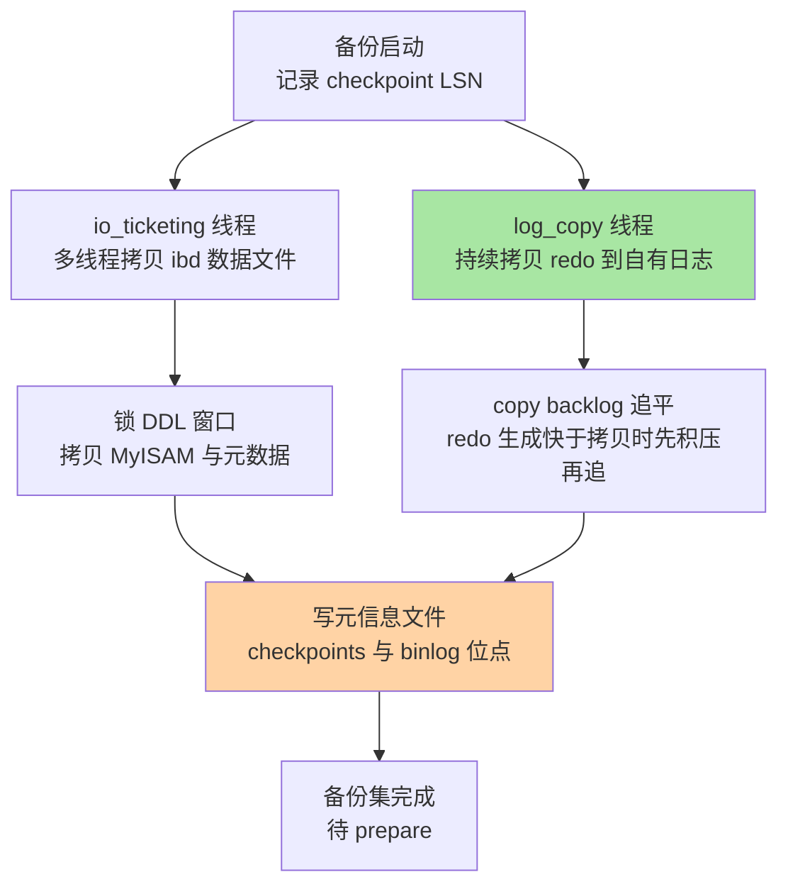
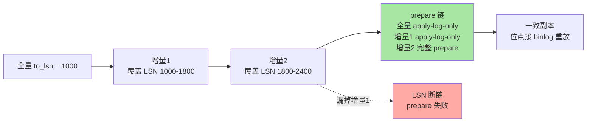
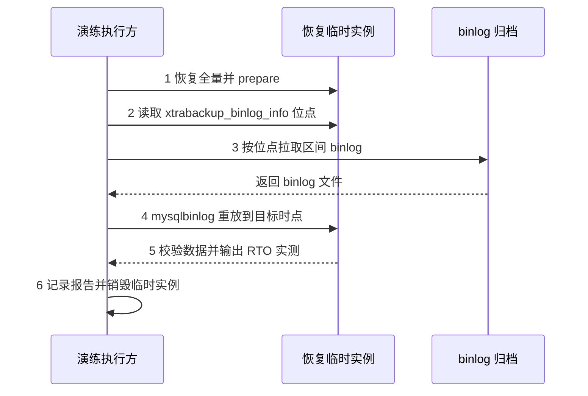
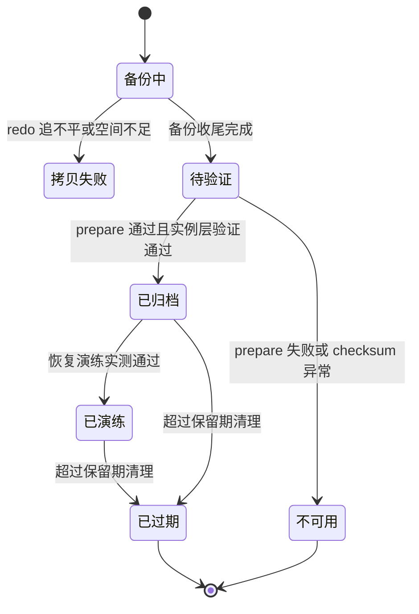

# XtraBackup 物理备份与 PITR：从拷贝原理到任意时点恢复

> 入门层《备份恢复与排错》讲了「全量 + binlog = PITR」的底座概念。本系列专题层第一篇往下钻一层：xtrabackup 为什么能拷出一个「不一致却可恢复」的物理副本、binlog 位点如何成为 PITR 的锚点、恢复演练怎么做才敢在生产执行，以及「没验证过 = 没备份」这条纪律的工程化落地。

## 一句话摘要

物理备份的本质是**人为制造一次受控宕机，再用崩溃恢复把它救回来**——xtrabackup 边拷贝物理文件、边追平 redo（copy 线程防止日志复用覆盖未拷贝内容），结束时把当时的 binlog 位点写进 `xtrabackup_binlog_info`；恢复 = prepare（对副本做一次 instance recovery）+ copy-back + 从记录的 binlog 位点起重放到目标时点（PITR）。备份文件本身不算能力，**能按 SLA 恢复出来的备份才算能力**，所以验证演练是这套体系的最后一环，也是最常被砍掉的一环。

## 🎯 本文核心

**核心一句话：物理备份的可靠性 = 一致性锚点（redo 追平）× 恢复锚点（binlog 位点）× 验证纪律（演练实测 RTO/RPO）——三者是乘法关系，任何一项为零，整个体系为零。**

机制链：物理/逻辑取舍 → copy 线程与 redo 追平（一致性从哪来）→ LSN 位点链与增量备份（备份怎么变快）→ prepare 崩溃恢复（一致性怎么兑现）→ 恢复演练全步骤（锚点怎么用）→ 验证纪律（能力怎么证明）→ 量级视角（架构怎么随规模升级）。

## 前置阅读

- 入门层《从零开始认识 MySQL 系列》篇 15：备份恢复与排错的底座概念
- 特性层《深入理解日志系列》篇 1/2：redo 刷盘与 crash-safe（prepare 阶段的原理基础）
- 特性层《深入理解主从复制系列》篇 1：binlog 三线程协议（位点与 GTID 的来源）

## 一、物理备份 vs 逻辑备份：取舍的本质

| 维度 | 物理备份 XtraBackup | 逻辑备份 mysqldump |
|---|---|---|
| 原理 | 拷贝数据页文件 + redo 追平 | 导出 SQL 语句、导入时重放 |
| 一致性来源 | prepare 阶段崩溃恢复 | 单事务导出的一致性快照 |
| 速度 | GB/s 级顺序 IO（业内认知：TB 级小时完成） | 逐行解释执行，大库动辄天级 |
| 恢复粒度 | 整实例/整表空间 | 库/表/行级灵活 |
| 跨版本 | 弱（同大版本或升级路径内） | 强（SQL 是逻辑格式） |
| 增量能力 | 原生支持（LSN 差量） | 无（靠 binlog 另拼） |

**追问一：mysqldump 是官方自带、输出可读，为什么生产大库不用它？**
反直觉的真相是：逻辑备份把「存储负担」变成了「计算负担」——导出要全表扫描并逐行格式化，导入要重新解析、构建索引，且 BLOB 大字段逐行搬运极慢。备份窗口的本质是**对生产的干扰时长**，恢复时长（RTO）的本质是**业务停机容忍度**；物理备份把两者都压缩为顺序 IO 问题。这就是为什么选型第一问不是「哪个工具功能多」，而是「RTO 预算是多少」——本质是拿恢复时长反推备份方式。

**追问二：为什么不用文件系统快照（LVM/存储层快照）？**
替代方案确实存在：快照秒级冻结、恢复即回滚。但它设计上的代价有三个——一是冻结瞬间的脏页全在快照里，恢复后要靠 redo 前滚，长短取决于 checkpoint 年龄；二是恢复粒度是整个卷，无法只救一张表；三是快照通常与数据同存储域，存储阵列级故障一起没。所以业内惯例是快照做「高频短保留」的快速回退点，xtrabackup + binlog 归档做「跨介质、可 PITR」的正源，两者是叠加关系而非互斥。

**追问三：为什么不直接用从库当备份？**
前面系列反复说过：复制防机器故障，不防数据级错误——误删的 DELETE 会同步到每一个从库。从库的价值是给「物理备份任务」降载（备份从从库跑，隔离生产压力），但备份本体必须独立于复制拓扑存在。

## 二、XtraBackup 原理：边拷贝、边追 redo



### 2.1 不一致副本为什么是安全的

拷贝持续几十分钟到几小时，期间数据页一直在被改——拷出来的文件集**必然不一致**。xtrabackup 的设计思想（设计哲学）是不发明第二套一致性协议，而是**复用 InnoDB 自己的崩溃恢复路径**：备份 = 人为制造一次「存储级宕机」，prepare = 对它做一次 instance recovery。InnoDB 本来就保证「宕机后用 redo 前滚 + undo 回滚到一致点」，所以只要备份集带上完整区间的 redo，不一致就只是一次「还没恢复的宕机」。

**追问：为什么需要 log_copy 线程一直追？**
redo 日志空间是复用的（环形写），如果不持续拷贝，运行中的实例可能把还没拷走的 redo 覆盖掉，备份直接失败。log_copy 线程从备份起点的 LSN 开始持续把 redo 抄进自有文件；当 redo 生成速度超过拷贝速度时产生积压（copy backlog），拷贝线程必须在收尾前追平积压——追不平备份失败退出。这也是「备份期间要监控 redo 生成速率」的原因：高频提交的大事务负载可能让物理备份天然追不上。

### 2.2 两份元信息：一致性与 PITR 的锚点

备份收尾时写两份关键文件：

- `xtrabackup_checkpoints`：`from_lsn`（起点）、`to_lsn`（数据文件一致性目标 LSN）、`last_lsn`（redo 拷贝终点）——增量备份与 prepare 的依据。
- `xtrabackup_binlog_info`：备份完成时刻实例正在写的 binlog 文件名、位点与 GTID 集合——**PITR 重放的起点锚点**。没有它，你就不知道「全量恢复出来的是哪个时刻」，后面的 binlog 也就不知道从哪里放。

常见误解是「binlog 位点从备份开始时刻算」——恰恰相反，锚点是**备份结束时刻**：全量包含的是起点到收尾之间所有已落盘变更，位点之后的变更才需要 binlog 补。

### 2.3 prepare：把「宕机」救回来

```bash
# prepare 阶段：对副本做崩溃恢复（前滚 + 回滚），之后副本才是一致的
xtrabackup --prepare --target-dir=/data/backup/full
# 恢复到本机数据目录（要求目录为空且实例已停止）
xtrabackup --copy-back --target-dir=/data/backup/full
chown -R mysql:mysql /data/mysql/data
```

prepare 做两件事：用拷贝的 redo 前滚到 `to_lsn`，再回滚未提交事务。`--use-memory` 控制 prepare 用的 buffer pool 大小，默认 128M（官方文档口径），大库恢复时建议给到 4-8 GB 缩短 prepare 时长——prepare 是 CPU + 内存敏感型操作，这是「恢复慢」最常见的非 IO 因素。

## 三、增量备份：LSN 链与 apply-log-only

增量备份只拷贝「页内 LSN 大于上次备份 `to_lsn`」的数据页变化，因此速度与变更量成正比而与库大小无关——这是物理备份独有的能力，逻辑备份没有对应物。

**追问：为什么 prepare 增量链要加 `--apply-log-only`，且最后一个增量才能省略？**
这是增量恢复最容易踩坑的一点。完整 prepare 的末段会把未提交事务**回滚**；一旦中间环节做了回滚，后续增量的页改动就「接不上」已回滚的页，LSN 链断裂。所以除最后一个增量外，每个中间 prepare 都必须 `--apply-log-only`（只前滚不回滚），把回滚动作留给整条链的终点。

```bash
# 增量链 prepare 顺序：全量只前滚 -> 逐个增量只前滚 -> 最后一个完整 prepare
xtrabackup --prepare --apply-log-only --target-dir=/data/backup/full
xtrabackup --prepare --apply-log-only --target-dir=/data/backup/full \
  --incremental-dir=/data/backup/inc1
xtrabackup --prepare --target-dir=/data/backup/full \
  --incremental-dir=/data/backup/inc2
```



线上排查过一类典型故障：恢复时跳过某个中间增量，prepare 报 LSN 不连续——根因是备份归档目录按时间命名、人工挑选时漏了一个「看起来不重要」的小增量。复盘结论：**增量链必须作为不可拆分的整体归档与校验**，恢复脚本按 checkpoints 文件自动拼链，不给人挑的机会。

## 四、PITR 恢复演练全步骤

### 4.1 前置条件

| 检查项 | 要求 |
|---|---|
| 恢复机版本 | 与生产同大版本，`innodb_page_size`、undo 表空间数量对齐 |
| 备份集完整 | 全量 + 全部增量 + `xtrabackup_checkpoints` + `xtrabackup_binlog_info` |
| binlog 连续 | 备份位点之后到目标时点的 binlog 已归档齐备（含目标时点所在文件的完整副本） |
| 资源 | 磁盘空间不低于生产数据 1.2 倍；prepare 内存按第六节参数清单预置 |
| 隔离 | 恢复实例监听独立端口、关闭对外服务注册，避免「演练实例」接业务流量 |

### 4.2 演练步骤



```bash
# 第 1 步：恢复全量（prepare + copy-back，见 2.3）
# 第 2 步：读取重放起点
cat /data/backup/full/xtrabackup_binlog_info
# 输出形如：binlog.000123  4521981  3e11fa47-71ba-...:1-82031

# 第 3-4 步：从位点重放 binlog 到目标时点（误操作发生前一刻）
mysqlbinlog --start-position=4521981 \
  --stop-datetime='2026-09-18 03:41:59' \
  /data/archive/binlog.000123 /data/archive/binlog.000124 | mysql -u root -p
```

### 4.3 验证（恢复完成的判定标准）

```sql
-- 验证三件：数据在、数据对、时间对
-- 1) 关键表行数与业务方核对
SELECT COUNT(*) FROM orders WHERE created_at >= '2026-09-17 00:00:00';
-- 2) 最大时间戳应停在目标时点附近，不得晚于误操作时刻
SELECT MAX(created_at) FROM orders;
-- 3) 抽样比对误删表的恢复内容
SELECT COUNT(*) FROM dropped_table_backup;
```

验证通过的标准不是「实例能启动」，而是**业务方签字的关键校验项全绿 + RTO 实测值落在 SLA 内**。

### 4.4 回退

- 演练环境：回退即销毁临时实例，不存在残留——这是「演练必须在隔离环境做」的原因之一。
- 生产切流：恢复期间原受损实例保持原样不覆盖，切流后如发现恢复数据异常，回退动作是「切回原实例 + 反向补录缺口」，而不是在恢复实例上继续修——所以切流前必须保留原实例的最后一刻 binlog。

## 五、备份验证纪律：没验证过 = 没备份

这句话的工程含义是：**备份的有效性是一个只能靠执行恢复来证明的命题**。备份任务成功只证明「拷出来了」，不证明「能恢复」。备份集的生命周期状态机里，「已生成」与「可恢复」是两个被验证隔开的状态——验证纪律就是连接它们的唯一边：



只有走过「已演练」状态的备份集，才有资格作为事故恢复的正源。三层验证把命题拆成可自动化的检查：

| 层次 | 验证内容 | 频率 |
|---|---|---|
| 文件层 | 备份集 checksum、大小环比、增量链 LSN 连续性 | 每次备份后 |
| 实例层 | prepare 成功 + 临时实例可启动 + 关键库存在 | 每次备份后（可抽样） |
| 业务层 | 关键表行数/校验值比对 + RTO/RPO 实测计时 | 月度演练起步，核心库季度全量演练 |

**事故推演 A（公开技术社区高频案例模式的匿名化推演）**：某系统备份任务连续半年「成功」，事故后需要 PITR 时发现全量之后的 binlog 已被过期清理，只能恢复到上一个全量点，丢了一整天的数据。排查发现清理策略只看文件年龄、不看「是否已归档且已有后续全量」。复盘 Action：binlog 清理条件改为「已归档 + 已存在晚于该文件的至少一个可用全量」双条件，并在演练中显式验证 binlog 链。

**事故推演 B**：备份文件在对象存储里躺了一个月，第一次真演练时 prepare 失败——备份当时磁盘满，拷贝只完成了一部分，而监控只盯「任务退出码」。复盘 Action：备份后必须立刻跑 prepare（实例层验证），备份大小环比突变（如骤降 30%）作为独立告警项。

**踩坑模式总结**：静默失败是备份体系的头号敌人。备份任务出错的常见形态不是报错，而是「退出码 0 但内容不对」——所以验证必须独立于备份任务本身存在。

## 六、参数级配置清单

| 配置项 | 默认值 | 分档推荐 | 为什么 |
|---|---|---|---|
| xtrabackup `--parallel` | 1 | 十万级 2-4 / 百万级 4-8 / 亿级 8-16 | 拷贝是顺序 IO 密集，并行度对齐磁盘吞吐（云盘看 IOPS 上限） |
| xtrabackup `--use-memory` | 128M（官方文档口径） | prepare 时 4-8 GB | prepare 的前滚靠内存 buffer，太小则反复刷临时文件 |
| xtrabackup `--lock-ddl` | ON（8.0 默认） | 保持默认 | 备份期间阻塞 DDL 保证元数据一致，替代旧版全局 FTWRL |
| `log_bin` | ON（8.0 默认） | 必须 ON | PITR 与复制的正源；备份体系隐含依赖 |
| `binlog_expire_logs_seconds` | 2592000（30 天） | 保留 ≥ 两个全量周期 | 清理过早 = PITR 断档（事故推演 A 的根因） |
| `gtid_mode` | OFF | 新环境 ON | 位点表达从「文件+偏移」升级为事务集，恢复与切流脚本都简化 |
| `sync_binlog` / `innodb_flush_log_at_trx_commit` | 1 / 1（双 1） | 保持双 1 | 备份救得了误操作，救不了「binlog 没落盘的已提交事务」 |
| `innodb_file_per_table` | ON | 保持默认 | 单表空间可传输，单表级恢复的前提 |
| 备份保留策略 | 无默认 | 全量 7-30 天 + 月度归档 | 保留期下限 = 误操作最长发现时长，不是成本预算 |

> 💡 **实战提示**
> - 备份账号最小权限：8.0 给 `BACKUP_ADMIN + PROCESS + RELOAD + LOCK TABLES + REPLICATION CLIENT` 即可完成备份，不要用 root 跑备份任务——最小权限同样适用于运维通道
> - `--lock-ddl` 期间 DDL 会被阻塞：把备份窗口与变更窗口错开，否则两边互相卡死
> - binlog 归档与数据文件异介质异地域存放：同机备份防不了磁盘阵亡与勒索加密，这是备份的「最后一代防线」原则
> - prepare 后立刻记录恢复实测耗时：RTO 不是架构文档里的承诺数字，是每次演练的实测曲线

## 七、不同量级的思考：约束驱动解法

- **十万级（单库 100 GB 以内、日增十万行上下）** —— 约束来源：单机磁盘吞吐与夜间窗口时长。这一档的核心问题是「备份任务别打扰白天业务」，而不是「恢复架构要多先进」。思考方式：窗口成本驱动——定时 xtrabackup 全量 + 本机 binlog 归档就够，mysqldump 甚至也在可选范围，不需要增量链，演练一季度一次即可守住底线。
- **百万级（数百 GB 到 1 TB）** —— 约束来源：全量窗口开始吃掉整个夜间低峰，恢复时长逼近业务容忍上限。这一档的核心问题是「恢复时长的可预测性」，而不是「把备份窗口再压短一点」。思考方式：RTO 预算驱动——引入周全量 + 日增量，把 RTO 从「一次全量恢复」变短；并行度对齐存储吞吐；演练频率升到月度。
- **千万级（1-5 TB）** —— 约束来源：单实例全量既慢且脆，恢复期间 buffer 预热又拖慢可用时间。这一档的核心问题是「把恢复拆成可并行的独立单元」，而不是「继续堆单实例硬件」。思考方式：分治驱动——按库/业务域拆分备份单元各自成链，恢复编排并行化；从库分担备份负载；对象存储侧校验与归档生命周期管理成为独立工程。
- **亿级（5 TB 以上/分库分表集群）** —— 约束来源：任何单点全量在时间上不可行，故障域从「一个库」变成「一个分片集合」。这一档的核心问题是「恢复编排与全局一致性快照」，而不是「某个分片备份多快」。思考方式：故障域驱动——分片各自备份 + 全局位点对齐（同一逻辑时刻的 GTID 快照点）、恢复演练按分片集演练、跨区异构副本（从库 + 对象存储双通道）成为标配。

**自下而上与触发升级**：备份体系的演进路径是逐档叠加约束——每一档的解法都不是推翻上一档，而是在其上叠约束——十万级的「定时全量」在百万级升级为「全量+增量链」，在千万级演进为「分治备份单元」，在亿级演进为「编排+全局位点」；下层能力（物理备份、binlog 归档、验证纪律）在所有档位不变。触发升级的信号有三个：全量窗口侵入业务高峰、演练实测 RTO 超 SLA、binlog 归档滞后于写入速率。看到信号先升级架构，不要先考虑换工具——量级决定架构，工具只是架构的载体。

## 八、你们可能会问

**Q1：备份期间锁表吗？业务会有感知吗？**
8.0 下 InnoDB 数据文件拷贝全程不加全局锁，只在收尾拷贝 MyISAM 与元数据时短暂持有备份锁（`--lock-ddl` 阻塞的是 DDL 不是 DML）。追问一：那 DDL 为什么必须阻塞？——拷贝中途改表结构会让「文件集 + redo」无法用崩溃恢复收敛到一致点，这是设计取舍：一致性锚点优先于变更自由度。追问二：怎么避免互相卡？——变更窗口与备份窗口错开，DDL 平台化审批里把备份时刻表作为输入。

**Q2：增量备份间隔怎么定？越密越好吗？**
间隔下限由「可接受的 PITR 重放时长」决定：增量越密，单次恢复要 apply 的增量越多但每个越小，重放 binlog 的区间越短。行业认知是小时级增量 + 日全量覆盖大多数场景；更密的意义只在「缩短全量丢失窗口」，而 binlog 实时归档已经把这个窗口压到秒级——所以增量频率的真实收益是「缩短恢复链长度」，不是「减少数据丢失」，这两个概念常被误解为同一件事。

**Q3：为什么 prepare 必须在演练期暴露，不能等事故时再说？**
prepare 是全流程里最吃内存、最容易因备份集残缺而失败的环节，且失败模式（LSN 断裂、页损坏）需要人参与判断。事故现场没有留给你调试 prepare 的时间——RTO 的每一分钟都在计费。这就是「没验证过 = 没备份」的具体形状：没 prepare 过的备份集，只能算一堆未必能用的文件。

## 九、什么时候用/不用与 Trade-off

| 场景 | 推荐方案 | 不推荐 |
|---|---|---|
| 生产例行全量（TB 级内） | xtrabackup 物理备份 | mysqldump（窗口不可接受） |
| 单表误删精确回救 | PITR（全量+binlog 到误操作前） | 整实例回滚（误伤面过大） |
| 跨大版本迁移/云间搬库 | 逻辑备份（mysqlpump/自研导出） | 物理备份（版本壁垒） |
| 高频短保留快速回退 | 存储快照 | 全量备份（频率撑不起） |
| 新建从库/快速克隆 | clone 插件或 xtrabackup 克隆 | 逻辑导入（天级 vs 小时级） |

Trade-off 三条主线：**物理换速度、丢灵活性**——恢复粒度粗、跨版本弱；**增量换窗口、付链复杂度**——增量链断裂风险与 prepare 顺序纪律；**归档换 PITR、付存储成本**——binlog 归档保留期与对象存储费用的线性关系。没有全赢的方案，只有与 RPO/RTO 预算对齐的方案。

## 十、开放问题

- 云托管的「即时恢复」（存储层快照挂载）把 RTO 压到分钟级，但 PITR 能力边界（能否恢复到任意 binlog 位点）与自建的差异需要逐家核对口径
- 备份加密（静态加密）与恢复演练的结合：密钥管理与备份集生命周期绑定后，「演练环境能否拿到密钥」成为新的前置条件
- 大规模分库下的「全局一致恢复点」定义：按 GTID 集合对齐各分片，工程上还没有标准化工具，多数团队靠自研编排

## 🎯 核心带走

- **核心一句话**：物理备份 = 受控宕机 + 崩溃恢复的复用；可靠性 = redo 一致性锚点 × binlog 位点锚点 × 验证纪律，乘法关系缺一为零
- **机制链**：copy 线程追 redo → checkpoints/binlog_info 双元信息 → prepare 前滚回滚（增量链 `--apply-log-only`）→ copy-back → 位点起重放 binlog → 业务级验证
- **哪里会坏**：binlog 先于备份被清理（PITR 断档）、增量链漏环（LSN 断裂）、只看任务退出码不验证内容（静默失败）
- **纪律**：没验证过 = 没备份——文件层/实例层/业务层三层验证，RTO 只认演练实测值
- **演进视角**：量级阶梯从「定时全量」演进到「分治+编排」，下层能力不变，升级信号是窗口/RTO/归档滞后三条

## 📌 数据与事实声明

- 写于 2026-09-18，机制以 MySQL 8.0 + Percona XtraBackup 8.0 为基准
- 参数默认值以 dev.mysql.com 与 docs.percona.com 官方文档为准
- 事故推演为公开技术社区高频案例模式的匿名化推演，非任何真实公司事件
- 涉及性能与时长的量级描述均为业内认知，非精确基准测试

## 📚 参考资料

| 类型 | 标题 | 来源 |
|---|---|---|
| 官方文档 | MySQL 8.0 Reference Manual: Backup and Recovery / binlog | dev.mysql.com/doc/refman/8.0/en/ |
| 官方文档 | Percona XtraBackup 8.0 Docs（backup/prepare/incremental） | docs.percona.com/percona-xtrabackup/8.0/ |
| 实战书 | 《高性能 MySQL（第 4 版）》备份与恢复章 | 公开出版 |
| 系列内链 | 本系列概念底座 | ../../入门层/从零开始认识MySQL系列/15_备份恢复与排错-入门.md |
| 系列内链 | crash-safe 与 redo 原理 | ../../特性层/深入理解日志系列/2_binlog与crash-safe-深度.md |
