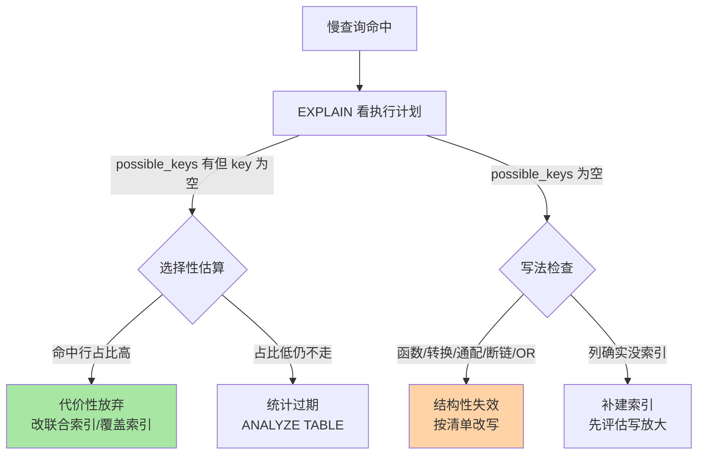
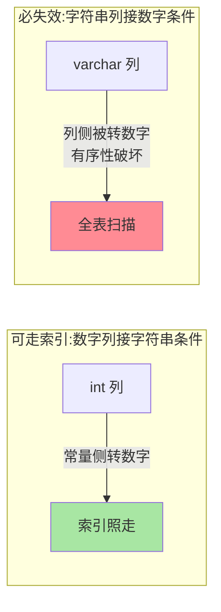

# 索引失效排查手册：失效不是玄学，是分类题

> 「明明建了索引为什么不走？」这句话背后是两类完全不同的病因：**结构性失效**（写法让索引用不上）和**代价性放弃**（优化器算完账决定不用）。混在一起猜，永远猜不完；分类排查，一抓一个准。

## 一句话摘要

索引失效分两类：**结构性失效**是 SQL 写法或类型不匹配让索引无法参与检索（函数包裹、隐式转换、前导通配、最左断链、OR 混连接），**代价性放弃**是索引可用但回表/扫描代价高于全表（低选择性、统计过期、回表放大）。排查 SOP：先 EXPLAIN 看意图，再分类归因，结构性改写法、代价性改索引或改统计——**九成线上案例落在这两类的固定子集里**。

## 🎯 本文核心

**核心一句话：失效 = 结构性（索引根本用不上）与代价性（用得上但划不来）两类——前者是写法破坏了「按列原值排序」的有序性，后者是优化器的经济决策；先分类再归因，改写方向自动清晰。**

排查决策链：EXPLAIN 看意图（possible_keys 空 = 结构性 / 有但 key 空 = 代价性）→ 结构性清单七场景 → 代价性三场景 → 隐式转换的方向性（唯一必记的「反直觉」点）→ 五步 SOP。全文一句话可重构：「索引按原值排序，变换即失效；可用但不划算，是优化器的账」。

## 前置阅读

- 特性层《深入理解索引系列》篇 2《聚簇索引与回表》：代价模型——「代价性放弃」的判断基础
- 入门层篇 11《性能优化入门》：慢查询定位入口

## 目标导向

本文是什么：索引失效的全分类排查手册。功能是什么：给慢查询一个「先分类、再归因、后改写」的固定打法。能得到什么：一张失效场景全清单、一套排查决策树、可复用的改写模板。为什么用：慢查询治理专项、新代码上线评审、老系统健康巡检，必看。

## 一、失效场景全清单（结构性）

| 场景 | 失效原因示例 | 改写方向 |
|---|---|---|
| 函数包裹索引列 | `WHERE DATE(create_time)='2026-09-01'` | 改范围：`create_time >= '2026-09-01' AND < '2026-09-02'` |
| 隐式类型转换 | varchar 列接数字条件 `WHERE sn_no=20260908001` | 条件传字符串，类型对齐 |
| 前导通配 | `WHERE name LIKE '%son'` | 业务改后缀匹配，或用倒排/搜索引擎方案 |
| 最左前缀断链 | 联合索引 (a,b,c)，条件只有 b、c | 补 a 条件或按查询重建索引 |
| OR 一侧无索引 | `WHERE a=1 OR other_col=2`（other 无索引） | 拆 UNION 两段各走各的索引 |
| 对索引列运算 | `WHERE id+1=100` | 改成 `WHERE id=99`，运算移出索引列 |
| 不等于与 NOT IN | `WHERE status != 'X'` | 大概率代价性放弃而非硬失效——见第二节 |

两类失效的本质区别：**结构性失效是「索引根本无法缩小范围」（函数把有序列变成了无序表达式）；代价性放弃是「能缩小但划不来」**。前者是写法错误必须改，后者是优化器在替你做经济决策——把这两类分开，一半的争论自动消失。

## 二、代价性放弃：优化器不是你的敌人

先补上机制底座：结构性失效的**原理**是索引按「列原值」排序的有序结构，任何让比较发生在变换后取值上的写法都破坏有序性；代价性放弃则是另一套机制——优化器按代价模型做经济决策，索引能缩小范围但「划不来」。三种高频「看起来失效」的代价场景：

1. **低选择性列**：`WHERE status = 1` 命中 40% 的行——走二级索引意味着海量回表（回表代价模型见前置篇），全表顺序扫反而便宜。此时应建**联合索引把选择性高的列并进来**，而不是抱怨优化器
2. **统计信息过期**：表刚灌完大批数据，优化器按旧统计判断错量级——`ANALYZE TABLE` 刷新即可「治好」大量假性失效
3. **小表全扫本来就快**：几百行的表全扫一遍内存就完，索引反而多一次树查找——**量级视角**：失效在小表上根本不是问题，治理优先级按表体量排



## 三、事故推演：隐式转换的一次线上故障

某中台系统晚高峰突现数据库 CPU 打满，慢查询全指向一条日常流量最大的查询：`WHERE order_no = 20260908123456`。`order_no` 列是 varchar，历史代码都传字符串；当天一次重构把参数改成了 Long 直传——**MySQL 对 varchar 列与数字比较，会把列侧转成数字再比，索引列被函数包裹，全表扫描**。

故障的三个教训值得沉淀：

1. **隐式转换是「单向的」**：数字列与字符串比较可以走索引（字符串在常量侧转成数字），**字符串列与数字比较必然失效**（列侧被转换，有序性破坏）——方向别记反，一图分清：



2. **发布关联归因**：故障时间点与重构上线重合，把变更上下游（代码重构 → 数据库执行计划）关联起来定位，回滚参数类型后 CPU 五分钟内恢复——变更关联是排障第一直觉
3. **治理靠规范加工具**：代码规约「查询参数类型与列类型严格一致」+ 上线前慢查询 diff（对比新旧执行计划），同类事故不再依赖人来记

**Trade-off 视角**：给 order_no 这类「业务主键」建索引时，varchar 数字串的隐式转换风险与字符串比较的排序语义要一起评估——业内常见做法是列与参数统一用字符串，或干脆数字化为 BIGINT，二选一，别骑墙。

## 四、排查 SOP：五步固定动作

```text
① EXPLAIN（或 EXPLAIN ANALYZE）拿到执行计划与真实耗时
② 看 key 列：没走索引 → 进③；走了但慢 → 看 rows 估算与真实行数差
③ 套结构性清单：函数？隐式转换？前导通配？最左断链？OR？
④ 套代价性清单：选择性？统计过期？回表放大？（结合数据量级）
⑤ 改写或改索引，前后 EXPLAIN 对比留档——没有对比就没有修复证据
```

**量级演进视角**：同一写法在十万行表上全扫 50ms 无人在意，在五千万行表上是 5 秒的事故——失效治理的优先级永远跟着量级走，巡检报表按表大小倒排；治理手段也按量级架构分工：小表靠算力硬扛、大表靠索引、超大规模靠分库分表（互指本目录「分库分表深度」）。

## 业内惯例

> 💡 **实战提示**
> - 何时怀疑隐式转换：SQL 参数与列类型「看起来一样」却全表扫——用 `SHOW CREATE TABLE` 对列类型 + 抓应用实际发送的参数类型（ORM 可能偷偷转）
> - 大表加索引走 online DDL（`ALGORITHM=INPLACE, LOCK=NONE`），并在低峰执行——失效治理的「补索引」动作本身别变成新事故
> - 每次治理留「前后 EXPLAIN + 耗时」对比存档：没有证据的修复无法沉淀为团队案例库
> - 联合索引「断链」的快速自查：把查询条件列与索引列逐位对齐，第一个断点之后的列全部无效——口算即可完成

- **上线前执行计划 diff**：发布平台对比新旧 SQL 的 EXPLAIN，type 与 rows 骤变即拦截——把失效挡在生产之前，成本远低于事后救火
- **慢查询模板化归因**：慢日志按 fingerprint 聚合，同类失效只修一次模板而不是逐条追——治理效率的分水岭
- **`force index` 是逃生舱不是常态**：统计失真时临时指定索引止血，随后修统计或改写法——长期 force index 说明归因没做完
- **字符集统一是隐式转换的根源治理**：表间关联列字符集/排序规则不一致同样引发转换失效——新表规范统一 utf8mb4，存量盘点对齐

## 你们可能会问

**Q1：为什么函数包裹必然失效，不能函数作用于常量侧吗？**
常量侧函数（`WHERE create_time > DATE_SUB(NOW(), INTERVAL 1 DAY)`）可以先算完再比较，索引照走；**列侧函数**（`DATE(create_time)`）要求对每行求值后再比——有序结构对「先变换再比较」无能为力。改写口诀：**函数可以包常量，永远别包列**。

**Q2：`IN` 大列表会失效吗？**
IN 是多次等值匹配，本身走索引；列表大到数万个元素时解析与优化成本上升，且优化器可能因范围过宽改判——大列表改临时表 JOIN 是业内成熟做法。

**Q3：怎么区分「没走索引」和「走了但慢」？**
EXPLAIN 的 key 列 + EXPLAIN ANALYZE 的真实耗时。前者是检索路径问题（本文清单），后者常是回表/排序/锁等待——归因错了，改写方向全错。

## 五、自测三问

1. 结构性失效与代价性放弃的本质区别是什么？各自的修复方向？
2. 隐式转换为什么「字符串列 + 数字条件」必失效、反方向却能走索引？
3. 复述五步排查 SOP，第三步和第四步为什么必须分开？

## 开放问题

- 优化器的代价模型随版本持续演进（直方图统计、机器学习辅助估计），「今天失效的写法」未来可能被智能修正——写法规范与优化器能力的边界值得持续重估。
- HTAP 与向量化引擎下「索引失效」的代价结构完全不同（列存扫描成本模型不同），OLTP 经验向分析库平移需重新校准。

## 🎯 核心带走

- **核心一句话**：失效分两类——结构性（写法破坏有序性，必须改写）与代价性（优化器算账放弃，改索引或统计）；隐式转换记一条「字符串列接数字必失效」
- **排查链**：EXPLAIN 意图 → 结构性七场景 → 代价性三场景 → 五步 SOP → 前后对比留档
- **哪里会坏**：函数包列、varchar 接数字、最左断链、统计过期假性失效
- **边界**：本篇是排查手册；代价模型的机制推导在特性层索引系列篇 2/3，EXPLAIN 全字段解读在本目录篇 2

## 📌 数据与事实声明

- 写于 2026-09-08，行为以 MySQL 8.0 为基准；隐式转换规则、EXPLAIN 行为以官方文档为准
- 故事案例为公开技术社区高频事故模式的匿名化复述，非特定公司事件
- 免责：具体行为以 dev.mysql.com 官方文档为准

## 📚 参考资料

| 类型 | 标题 | 来源 |
|---|---|---|
| 官方文档 | Optimizer / EXPLAIN / Type Conversion | dev.mysql.com/doc/refman/8.0/en/ |
| 实战书 | 《高性能 MySQL（第 4 版）》查询优化章 | 公开出版 |
| 社区沉淀 | 公开技术社区索引失效案例合集（多方博客） | 各技术社区公开文章 |
