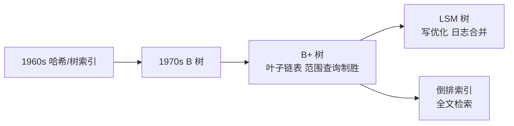
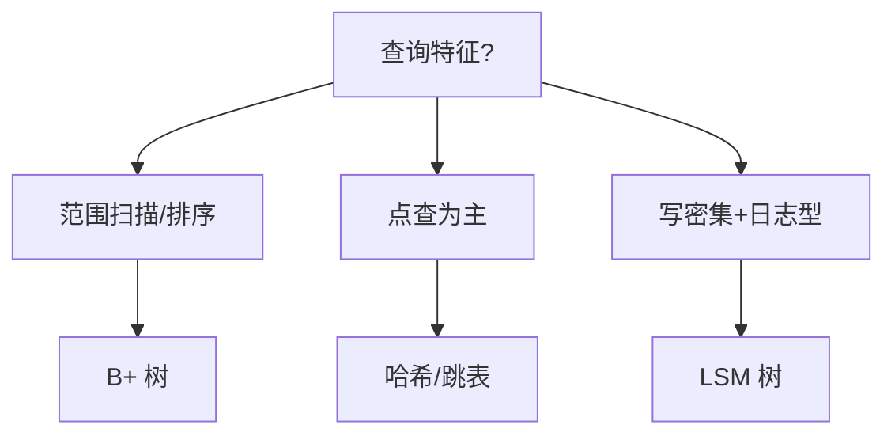

# 索引演进史与选型决策树：从 B+ 树到 LSM 的全面对比

> 特性层讲了 B+ 树的机制，本篇把视角拉到**演进史 + 选型决策**——为什么 MySQL 选了 B+ 树、Redis 用了跳表、ES 用了倒排索引、LSM 树在写密集场景的崛起。读完能对任何存储场景做出有依据的索引选型判断。

## 一句话摘要

索引选型不是「哪个更好」——是**介质 + 场景 + 取舍**的三元决策。B+ 树为磁盘顺序 I/O 优化，跳表为内存并发优化，倒排索引为全文检索优化，LSM 树为写放大优化。本文把四类索引的演进逻辑、机制差异、适用场景一次讲透，给出可复用的选型决策树。

## 🎯 本文核心

**核心一句话：索引结构由介质与访问模式决定——内存选跳表、磁盘点查范围选 B+ 树、全文检索选倒排、写密集选 LSM；「没有万能索引，只有场景匹配」是这条演进史的唯一定理。**

演进链：介质约束（磁盘随机 IO 贵）→ B+ 树的制胜改良（扇出 + 叶子链表）→ 内存路线（跳表的并发友好）→ 检索路线（倒排的词项入口）→ 写优化路线（LSM 的追加 + 合并）→ 三轴决策（介质 × 访问模式 × 场景）。全文一句话可重构：「结构跟着介质走，选型跟着场景走」。

## 前置阅读

- 特性层《深入理解索引系列》篇 1《B+ 树与页存储》：B+ 树机制底座
- 特性层《深入理解索引系列》篇 2《聚簇索引与回表》：回表代价模型
- 入门层篇 5《索引基础》：索引类型与基本判断

## 一、为什么索引选型是三元决策

```
介质（磁盘 vs 内存） → 访问模式（随机 vs 顺序） → 场景（点查 vs 范围 vs 全文）
```

**三类决策轴**：

| 轴 | 关键问题 | 影响 |
|---|---|---|
| 介质 | 数据在内存还是磁盘？ | 内存结构可以容忍随机访问；磁盘结构必须优化顺序 I/O |
| 访问模式 | 点查为主还是范围为主？ | 点查适合哈希/跳表；范围适合 B+ 树 |
| 场景 | 需要全文检索吗？需要去重吗？ | 全文检索需要倒排索引；去重需要 Bitmap |

**一句话**：没有万能索引，只有场景匹配。



## 二、四类索引的演进逻辑

### 2.1 B+ 树：磁盘时代的最优解

B+ 树是 InnoDB 的默认索引结构，本质是**为磁盘按页 I/O 优化的多叉搜索树**。

**演进脉络**：二叉搜索树 → AVL/红黑树 → B 树 → B+ 树

- 二叉树：内存优化，磁盘 I/O 次数太多
- B 树：多叉降低树高，但节点内键+数据混存，扇出不够大
- B+ 树：非叶子节点只存键（扇出最大化），叶子成环链（范围扫描无需回父节点）

**为什么 InnoDB 选 B+ 树**：
1. 磁盘按页读写（16KB），B+ 树节点 = 一页，一次 I/O 加载一个节点
2. 范围查询是数据库高频操作，叶子链表是天然支持
3. 自增主键追加写几乎不触发分裂，写入性能稳定

**代价**：
- 随机写（UUID 主键）→ 频繁分裂 → 写放大
- 大字段索引 → 叶子页变宽 → 扇出下降 → 树高上升

### 2.2 跳表：内存中的有序结构

Redis ZSet 用跳表，不是偶然。

**跳表 vs B+ 树**：

| 维度 | 跳表 | B+ 树 |
|---|---|---|
| 实现复杂度 | 简单（随机层数 + 指针） | 复杂（分裂/合并/页管理） |
| 并发更新 | 无锁 CAS 友好 | 需要锁/乐观插入 |
| 范围查询 | O(log N + M) | O(log N + M)，O(1) 跳下一叶子 |
| 磁盘友好 | 否（指针随机分布） | 是（节点 = 页，顺序 I/O） |

**结论**：内存用跳表，磁盘用 B+ 树——介质决定结构。

### 2.3 倒排索引：全文检索的基石

Elasticsearch 的核心结构，MySQL 全文索引也是倒排索引的简化版。

**正向索引 vs 倒排索引**：

- 正向索引：文档 → 词列表（查"包含这个词的文档"需要扫描全部文档）
- 倒排索引：词 → 文档列表（查"包含这个词的文档"直接查词项）

```
正向索引：
  doc1 → [MySQL, 索引, B+树]
  doc2 → [Redis, 跳表, 内存]

倒排索引：
  MySQL → [doc1]
  索引   → [doc1]
  B+树   → [doc1]
  Redis  → [doc2]
  跳表   → [doc2]
  内存   → [doc2]
```

**为什么倒排索引适合全文检索**：
1. 词项是检索入口，直接命中
2. 支持布尔运算（AND/OR/NOT）
3. 支持 TF-IDF/BM25 相关度打分

**代价**：
- 写入时需维护倒排表（写放大）
- 需要定期合并段（segment merge）
- 不适合等值/范围查询（没有顺序性）

### 2.4 LSM 树：写优化的终极形态

LevelDB/RocksDB 的核心结构，HBase/Cassandra 也用它。

**核心思想**：写操作只追加（memtable → SSTable），读操作合并多层视图。

```
写入：memtable（内存）→ flush → L0（SSTable）→ compact → L1/L2/...
读取：memtable → L0 → L1 → ... → 逐层查找，合并去重
```

**LSM vs B+ 树**：

| 维度 | LSM 树 | B+ 树 |
|---|---|---|
| 写入 | 追加（顺序写），极快 | 随机写，需维护 B+ 树 |
| 读取 | 需查多层，稍慢 | 树高 3-4 层，快 |
| 空间放大 | 有（compact 冗余） | 无（原地更新+撤销日志） |
| 适用 | 写密集（日志/时序） | 读密集（OLTP） |

**为什么 LSM 树写快**：顺序写磁盘的吞吐量是随机写的 100-1000 倍。LSM 把随机写变成顺序写，代价是读取需要查多层 + compact 占用后台 IO。



## 三、选型决策树

```
场景是什么？
├─ 点查为主 + 事务需要 → B+ 树（MySQL InnoDB）
├─ 范围查询为主 + 磁盘存储 → B+ 树（范围扫描是 B+ 树杀手锏）
├─ 全文检索 → 倒排索引（ES / MySQL 全文索引）
├─ 写密集 + 不需要事务 → LSM 树（RocksDB / LevelDB）
├─ 内存 + 并发更新 → 跳表（Redis ZSet）
└─ 等值查询为主 + 不需要顺序 → 哈希表（Memcached）
```

**更细粒度的决策**：

| 场景 | 推荐索引 | 理由 |
|---|---|---|
| 金融交易 | B+ 树 + 覆盖索引 | 事务 + 范围查询 + 精确 |
| 消息日志 | LSM 树 | 写入密集 + 不需要事务 |
| 商品搜索 | 倒排索引（ES） | 全文检索 + 相关度排序 |
| 实时计数器 | 跳表 | 内存 + 并发更新 |
| 会话缓存 | 哈希表 | 点查 O(1) |

## 四、跨数据库索引对比

| 数据库 | 默认索引 | 特殊索引 | 选型理由 |
|---|---|---|---|
| MySQL InnoDB | B+ 树（聚簇） | 全文索引（倒排） | 事务 + 范围查询 |
| PostgreSQL | B+ 树 | GIN/GiST（倒排/空间） | 扩展性强 |
| Redis | 跳表（ZSet） | 哈希/列表/集合 | 内存 + 并发 |
| Elasticsearch | 倒排索引 | Doc Values（列存） | 全文检索 |
| RocksDB | LSM 树 | Bloom Filter | 写密集 |

**结论**：没有跨场景的最优索引，只有场景匹配。

## 五、业内惯例

> 💡 **实战提示**
> - 什么时候该想起 LSM：单表写入持续高位、读侧优化已到头、业务能容忍最终一致读——三条件齐了再评估 RocksDB 系/时序库，别为「可能的高写入」提前换
> - 三件套组合的边界判据：MySQL 管事务与关系查询、Redis 管热数据与计数、ES 管检索与聚合——「谁的地盘谁承担」，跨地盘用数据同步衔接
> - 全文检索选内置还是 ES：数据量小（百万内）+ 词法简单用 MySQL FULLTEXT 免运维；分词/相关度/聚合要求高直接 ES
> - 向量检索需求按「专用引擎优先」处理，别指望 B+ 树/倒排硬扛——结构不匹配硬用就是篇七事故剧本

- **互联网默认组合**：MySQL（B+ 树）+ Redis（跳表/哈希）+ ES（倒排）—— 三件套覆盖 90% 场景
- **不迷信单一数据库**：关系型不做全文，搜索引擎不做事务——各司其职
- **索引选型是架构级决策**：不是"加个索引"的事，需要考虑写入模式、查询模式、量级、一致性
- **量级演进视角**：小数据量 B+ 树够用；大数据量写密集考虑 LSM；海量全文考虑 ES

## 六、常见误区

- **「B+ 树万能」**：写密集场景 B+ 树写放大严重，LSM 树是更好的选择
- **「倒排索引可以替代表格」**：倒排索引没有事务、不支持更新，不适合 OLTP
- **「跳表比 B+ 树快」**：内存场景跳表有优势，磁盘场景 B+ 树是专门为 I/O 优化的
- **「加了索引一定快」**：索引选型错场景 = 慢的更快（如全文索引用在点查场景）

## 七、生产事故推演：索引用错场景

**场景**：某日志系统用 MySQL InnoDB 存日志，按时间范围查询。数据量到千万级后写入性能急剧下降。

**根因**：
1. 主键为无序业务键（类 UUID 形态）→ 随机写页分裂（B+ 树写放大的经典触发，特性层篇 1）
2. 追加写场景 → 本该用 LSM 树
3. MySQL B+ 树为读优化，纯写密集场景是结构性短板

**修复**：
1. 短期：改自增主键 + 时间索引（减少分裂）
2. 长期：日志落 LSM 树（RocksDB）或消息队列（Kafka）

**Trade-off**：LSM 树写快但读慢（需查多层），日志场景通常是"写完很少读"——写优化是对的。

## 你们可能会问

**Q1：MySQL 为什么不做 LSM 内核？**
OLTP 主负载是「读写混合 + 事务语义」：B+ 树的读延迟稳定与原地更新语义更契合；LSM 的合并风暴与多层数据对事务隔离的实现是额外复杂度。写极重的细分场景社区用 RocksDB 引擎（MyRocks）补位，而不是改 InnoDB。

**Q2：跳表在磁盘上真的不行吗？**
跳表节点指针随机分布，磁盘上每次跳转都是一次随机 IO——它「简单 + 并发友好」的优势在内存成立，放到磁盘等于把最大成本（随机读）放大。结构与介质匹配，这是全文反复出现的定理。

**Q3：哈希索引 MySQL 支持吗，为什么不用它做主索引？**
InnoDB 有自适应哈希索引（热点页自动建），但哈希不支持范围与排序——主索引必须服务最广的查询形态（范围/排序/前缀），B+ 树因此不可替代；哈希只做「热点的热点」的加速旁路。

## 🎯 核心带走

- **核心一句话**：索引选型 = 介质 × 访问模式 × 场景——磁盘混合负载 B+ 树、内存有序跳表、全文倒排、写密集 LSM；结构跟着介质走，选型跟着场景走
- **演进链**：介质约束 → B+ 树改良 → 跳表/倒排/LSM 各踞一域 → 三轴决策
- **哪里会坏**：写密集硬上 B+ 树（分裂风暴）、全文需求硬上 LIKE、向量需求硬上关系型
- **边界**：本篇是「跨结构选型」；B+ 树内部机制在特性层索引系列，MySQL 内的索引设计在本目录篇 3

## 开放问题

- LSM 树与 B+ 树的融合结构（业界多项学术与工程探索）能否在通用 OLTP 落地？
- 向量索引（近似最近邻）在 AI 场景崛起，传统 B+ 树/倒排索引如何与向量索引共存？
- 云原生数据库（如 TiDB/Aurora）的存储层抽象让索引选型对用户透明，但代价是什么？

## 📌 数据与事实声明

- 写于 2026-09-09，机制以 MySQL 8.0 InnoDB 为基准
- 跳表为 Redis ZSet 实现（公开资料）；LSM 树为 RocksDB/LevelDB 实现
- 选型对比为业内经验归纳，非官方推荐

## 📚 参考资料

| 类型 | 标题 | 来源 |
|---|---|---|
| 官方文档 | InnoDB Index Structure | dev.mysql.com/doc/refman/8.0/en/ |
| 原理书 | 《MySQL 技术内幕：InnoDB 存储引擎》 | 公开出版 |
| 实战书 | 《高性能 MySQL（第 4 版）》索引章 | 公开出版 |
| 论文 | The Log-Structured Merge-Tree (LSM) | OSDI 2004 |
| 开源项目 | RocksDB / LevelDB | github.com/facebook/rocksdb |