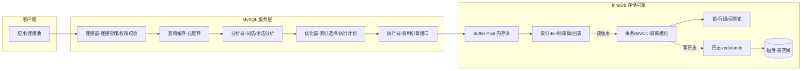
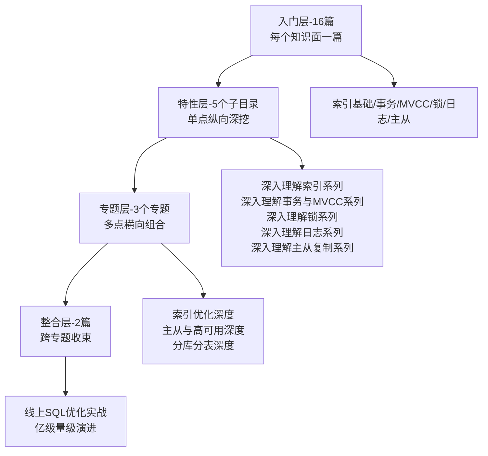

# MySQL 系列导读 · 从一条 SQL 的一生认识 MySQL

> 📖 本系列共 16 篇（0_导读 + 1-15 正文），覆盖 MySQL 整个知识面：架构、存储引擎、字符集、schema 设计、索引、事务、MVCC、锁、日志、查询执行、性能优化、主从复制、高可用、分库分表、备份排错。
> 本篇是第 0 篇导读：先建立全局心智模型，再决定读哪条路。

## 一、为什么需要这套系列

MySQL 是后端开发绕不开的存储底座：业务数据落它、订单状态查它、报表统计靠它。但 MySQL 的知识散落在博客、书、专栏里，常见两种极端：

- **碎片化学习**：今天看索引原理，明天看 MVCC，各知识点之间没有连线，看一篇懂一篇，合起来还是不会排查问题
- **一上来就啃原理**：直接读 InnoDB 源码分析，没建立整体框架，读两章就放弃

这套系列的设计思路：**先主线后支线**。主线是「一条 SQL 的一生」——从客户端发起到磁盘落盘，把 MySQL 架构串起来；支线是挂在这条主线上面的六大核心机制：索引、事务、MVCC、锁、日志、主从复制。主线通了，支线各自深挖时都知道「它在整条链路里处于什么位置」。

## 二、全局心智模型：一条 SQL 的一生

一条 SQL 的一生：

1. **连接器**：校验账号权限，建立连接（客户端到服务层的第一道门）
2. **分析器**：词法分析（识别关键字）→ 语法分析（检查语法），生成语法树
3. **优化器**：决定用哪个索引、按什么顺序 join，生成执行计划——**优化器不是万能，选错索引是慢 SQL 一大来源**
4. **执行器**：按执行计划调用存储引擎接口，逐行判断返回
5. **存储引擎**（InnoDB）：先在 Buffer Pool 内存页里找，找不到再从磁盘加载；索引（B+ 树）决定怎么找；事务/MVCC 决定看到哪个版本；锁决定并发怎么排队；redo/undo 日志决定崩溃后怎么恢复

> tips：(知识地图) 这条主线是整套 MySQL 知识的主干：索引/事务/MVCC/锁/日志/主从全部是挂在「一条 SQL 的一生」上的支线——先主线后支线。

## 三、系列导航表（16 篇）

| 序号 | 篇目 | 深度 | 一句话定位 | 对标书目 |
|---|---|---|---|---|
| 0 | 系列导读 | 全景 | 全局心智模型 + 阅读路径 | - |
| 1 | MySQL 架构与一条 SQL 的一生 | 入门 | 架构分层 + SQL 执行链路 | MySQL 45 讲 / 高性能 MySQL |
| 2 | 存储引擎与落盘细节 | 入门 | InnoDB vs MyISAM、页/行格式、Buffer Pool | MySQL 是怎样运行的 |
| 3 | 字符集与排序规则 | 入门 | utf8mb4、比较规则、乱码根因 | MySQL 是怎样运行的 |
| 4 | schema 设计与数据类型 | 入门 | 字段类型选择、范式与反范式 | 高性能 MySQL |
| 5 | 索引基础 | 入门 | B+ 树、聚簇/二级索引、回表、索引失效 | 高性能 MySQL / 是怎样运行的 |
| 6 | 事务与隔离级别 | 入门 | ACID、四种隔离级别、脏读/幻读 | MySQL 45 讲 / 是怎样运行的 |
| 7 | MVCC 机制 | 入门 | 版本链、ReadView、快照读/当前读 | MySQL 是怎样运行的 |
| 8 | 锁机制 | 入门 | 全局锁/表锁/行锁、间隙锁、死锁 | MySQL 45 讲 / 是怎样运行的 |
| 9 | 日志三件套 | 入门 | redo/undo/binlog 分工与协作 | MySQL 45 讲 |
| 10 | 查询执行原理 | 入门 | join 算法、排序、临时表 | 高性能 MySQL |
| 11 | 性能优化入门 | 入门 | 慢 SQL 定位、索引优化、参数调优 | 高性能 MySQL |
| 12 | 主从复制 | 入门 | binlog 复制、延迟、数据一致性 | 深入理解 MySQL 主从原理 |
| 13 | 高可用方案 | 入门 | 主从切换、半同步、MHA/组复制 | 高性能 MySQL |
| 14 | 分库分表与扩展 | 入门 | 垂直/水平拆分、分片键、读写分离 | 高性能 MySQL |
| 15 | 备份恢复与排错 | 入门 | 备份策略、恢复演练、常见故障排查 | MySQL 排错指南 |

## 四、从点到面：四层进阶路径

入门层 16 篇把知识面铺全之后，真正的深度在后面三层——这也是本系列「从点到面」的设计：

| 层级 | 定位 | 规模 | 适合 |
|---|---|---|---|
| 入门层 | 点：每个知识面一篇，建立完整认知 | 16 篇 | 所有读者必读 |
| 特性层 | 点 × 深：一个点拆开挖透 | 5 个子目录 × 2-3 篇 | 按兴趣挑重点 |
| 专题层 | 面：多个点组合成主题 | 3 个专题 × 3 篇 | 解决实际问题 |
| 整合层 | 体系：整个知识体系收束 | 2 篇 | 面试/实战前收束 |

## 五、入门读者最容易踩的 3 个认知误区

### 误区 1：以为 MySQL 只有 InnoDB

很多入门文章只讲 InnoDB，容易让人以为 MySQL = InnoDB。实际上 MySQL 是**可插拔存储引擎架构**：MyISAM（老默认，无事务）、Memory（临时表）、Archive（归档）等并存，`SHOW ENGINES` 可见全貌。InnoDB 之所以是默认，是因为它支持事务、行锁、崩溃恢复——但**知道其他引擎的存在和适用场景**，才能理解「为什么默认是 InnoDB」这个设计决策。

### 误区 2：索引越多越好

新手常见操作：查询慢 → 给所有 where/order by 字段建索引。但索引有代价：**写入要维护 B+ 树（插入/更新/删除都变慢）、存储要占额外空间、优化器选择变复杂**。索引是空间换时间的典型 trade-off——正文里会详细讲「怎么判断一个索引该不该建」。

### 误区 3：日志只知道 binlog

「MySQL 日志 = binlog」是常见误解。MySQL 的日志是**三件套分工协作**：

- **redo log**：InnoDB 的物理日志，崩溃恢复用（保证不丢已提交事务）
- **undo log**：InnoDB 的逻辑日志，事务回滚 + MVCC 版本链用
- **binlog**：MySQL 服务层的归档日志，主从复制 + 数据恢复用

三者的写入时机、作用范围完全不同——正文 9_日志三件套会拆开讲透。

> tips：(日志分工) redo 管「崩溃后不丢」（物理重做）、undo 管「回滚和 MVCC」（逻辑回滚）、binlog 管「主从和归档」（逻辑复制）——redo 保不丢、undo 保回滚、binlog 保同步。

## 六、怎么读这套系列

- **零基础/刚入行**：从 0 按顺序读到 15，每天 1 篇，两周建立完整知识面
- **有 1-3 年经验**：快速扫入门层（每篇 10-15 分钟），重点读 5 索引、7 MVCC、8 锁、9 日志，然后进特性层挑感兴趣的子目录深挖
- **准备面试/实战**：读完入门层后直接进专题层（索引优化/主从高可用/分库分表）+ 整合层（线上 SQL 优化/亿级演进），用实战场景把知识串起来

---

**下一篇预告：[1_MySQL架构与一条SQL的一生-入门](./1_MySQL架构与一条SQL的一生-入门.md)** —— 从连接器到存储引擎，完整走一遍一条 SQL 的一生。
