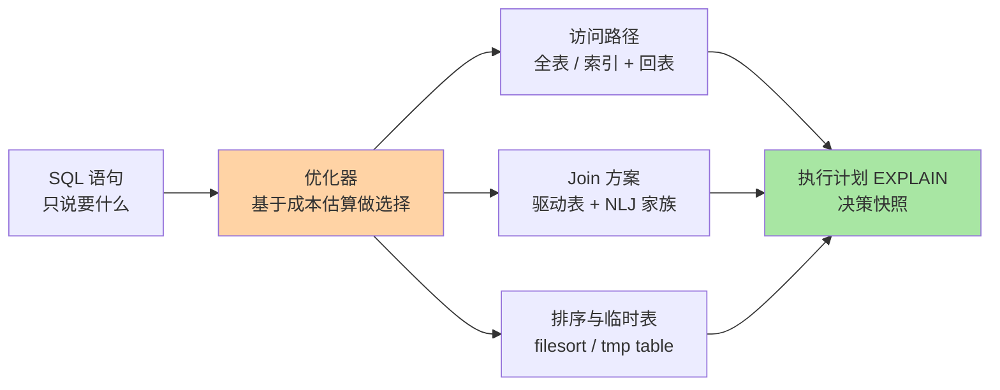
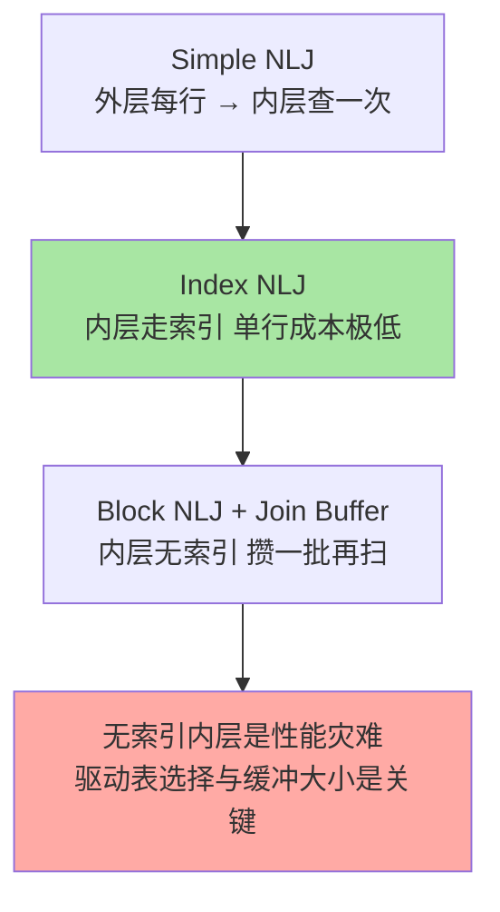

# 查询执行原理：优化器与 Join 的内部旅程

> 一句话：SQL 是声明式的「要什么」，优化器决定「怎么拿」——选访问路径、选 Join 顺序、决定排序与临时表，看懂它的选择逻辑，慢查询才能治本。

## 🎯 本文核心

**核心一句话：一条查询进来后由优化器做三组决策——访问路径（全表/索引/回表）、Join 顺序与算法（嵌套循环家族 + Join Buffer）、排序与临时表方案（filesort/内存或磁盘临时表），执行计划就是这些决策的快照。**

组织主线：

EXPLAIN 的每一列都对应链上的一次决策——读懂决策逻辑，EXPLAIN 就不是天书而是「优化器的思路直播」。

## 一句话摘要

MySQL 服务层的优化器负责把声明式 SQL 翻译成可执行的访问方案：估算各候选路径的成本（扫多少页、回多少表、排多少序），选它认为最便宜的一条。Join 用嵌套循环家族实现：外层表（驱动表）每取一行，到内层表（被驱动表）查一次——内层有没有索引、Join Buffer 能不能装下中间结果，决定性能量级；大结果集排序放不下排序缓冲就落磁盘临时表。理解「优化器在权衡什么」，是所有 SQL 优化的底层视角：你不改它的算法，只能改变它的成本估算输入（索引、数据量、统计信息）。

## 一、为什么需要优化器：SQL 与执行的鸿沟

`SELECT * FROM o JOIN u ON o.uid=u.id WHERE u.city='sz'`——这句 SQL 没有说「先查哪张表、用不用索引」。同一条语句至少有几种走法：先扫 o 再逐行到 u 找（u 的 id 是主键，快）；先按 city 找 u 再到 o 查（city 有索引才成立）；或者干脆全扫。不同走法在数据量变化后性能差几个量级，人类手写执行方案不现实——把「怎么执行」交给优化器，是关系数据库相比早期网状数据库最大的架构演进。

## 5W 速记卡

| 维度 | 一句话 |
|---|---|
| What | 优化器做成本决策（路径/Join/排序），执行器照方案跑 |
| Why | SQL 是声明式的，执行方案需要按数据量动态选优 |
| When | 每条查询都发生；慢查询分析就是复盘它的选择 |
| Where | 服务层：优化器 + 执行器，通过引擎接口读写 |
| How | EXPLAIN 查看决策；改索引/改写法/更新统计信息来影响它 |

## 二、核心机制：三组决策

### 2.1 访问路径与 Join 算法

访问路径三选一：全表扫描（数据小或无索引时反而最便宜）、索引范围/等值 + 可能的回表（索引基础篇讲过第二跳）、覆盖索引（免回表）。Join 的本质是嵌套循环：

**驱动表选择的直觉：小表驱动大表**——外层行数少，内层查询次数就少；内层必须吃索引（Index NLJ），吃不到就退化成「每批都全扫内层」。8.0 还引入了哈希 Join 处理无索引等值 Join，作为嵌套循环的补充。

### 2.2 排序与临时表

`ORDER BY` 吃不到索引的有序性时走 filesort：结果集小在排序缓冲（内存）里排，放不下就分块排序落磁盘再归并；`GROUP BY`/`DISTINCT`/UNION 处理不了时建临时表，内存临时表超限转磁盘临时表——大分页、大分组的慢，多数慢在这两个「内存放不下」上。

> 💡 **实战提示**
> - EXPLAIN 先看 `type`（访问路径）再看 `rows`（估算扫描量）、`Extra`（Using filesort / Using temporary / Using index 都是决策结果的直接展示）
> - 统计信息会过期：`ANALYZE TABLE` 刷新后优化器选择突变，「昨天还快今天慢」的常见根因之一
> - 深分页 `LIMIT 1000000,20` 慢在「取一百万行丢弃」——改成游标式（`WHERE id > 上页末尾 LIMIT 20`）或延迟关联，专题层索引优化深度有完整手册
> - 大事务/大查询挤占排序缓冲与临时表是相互踩踏的——先治大查询，再谈并发

## 三、与「应用层组装」的区别

复杂 Join 拆到应用层查多次再内存拼装（部分互联网大厂的实践），本质是把「优化器的 Join 决策」换成「应用层可控的多次单表查询」：代价是多次往返 + 应用复杂度，收益是单表 SQL 简单可缓存、便于分库分表。这是「让数据库做 Join」与「应用做 Join」的架构取舍，没有绝对对错，分界在数据量与团队约定。

## 四、典型使用场景

- **慢查询复盘**：EXPLAIN 逐列对照本篇三组决策，定位优化器选了哪条路
- **报表大查询治理**：GROUP BY 落磁盘临时表的，先缩结果集再聚合
- **Join 变慢排查**：看被驱动表走没走索引（`type` 为 ALL 即灾难）、驱动表是否选小
- **升版本后计划突变**：优化器演进（如 8.0 哈希 Join、直方图统计）会让老 SQL 换执行计划，升级回归要覆盖核心查询

## 五、误区与代价

- ❌ **「JOIN 一定比循环单查慢」或反之**：走 Index NLJ 的 Join 比应用循环查快得多；无索引 Join 则是灾难——结论取决于执行计划，不取决于句式
- ❌ **「FORCE INDEX 一加了之」**：强制索引掩盖统计信息问题，数据分布变化后反而锁死错误选择——先修统计与索引，hint 只做急救
- ❌ **「rows 估算就是真实行数」**：它是统计信息的估算，偏差大时优化器整个决策跑偏——EXPLAIN ANALYZE（8.0+）看真实执行
- ❌ **「内存临时表都会转磁盘」**：只有超限才转；`tmp_table_size` 调大有上限与全局内存代价，治标先治「结果集为什么这么大」

## 六、你们可能会问

**Q1：优化器怎么估算成本？**
基于统计信息（索引基数、数据页数、直方图）估算每个候选方案的 I/O 与 CPU 成本，选最低的。估算错 → 选错 → 慢查询，所以「统计信息质量」是优化器可靠性的地基。

**Q2：为什么小表驱动大表，反过来不行吗？**
反过来意味着内层（大表）被查的次数 = 外层行数，每次都要定位；驱动方向换一下，查询次数差几个数量级。有索引时两者都能跑，无索引时差距是灾难性的。

**Q3：EXPLAIN 里 type 的好坏顺序怎么记？**
从差到好：ALL（全扫）→ index（扫整棵索引）→ range（范围）→ ref（非唯一等值）→ eq_ref（唯一等值，Join 最理想）→ const（主键单行）。目标是把 ALL 治成 range 以上。

## 七、什么时候用 / 不用

- ✅ 上线前跑 EXPLAIN：新 SQL 看一眼计划是最低成本的预防
- ✅ 优化从「改写 SQL 与索引」入手，参数（缓冲大小）最后动
- ❌ 不要对着执行计划盲调参数：先问「结果集能不能变小」「索引能不能覆盖」
- ❌ 不要在 OLTP 里写万行级 Join 结果集：那是数仓/离线的活，层次错位

## 八、开放问题

- 优化器的未来是「更多自适应」：自适应哈希索引、执行中重优化（8.0 的 histogram、HyPer 风格的 adaptive execution 在各产品陆续落地）——「一次编译多次执行」的经典模型在向「边执行边学习」演进
- AI 辅助优化器（学习型成本模型）研究多年，工程落地的可信度门槛仍是「可解释、可回退」，值得持续跟踪

## 九、自测三问

1. 优化器的三组决策分别是什么？EXPLAIN 哪些列对应它们？
2. 嵌套循环 Join 家族的性能分界在哪里？驱动表怎么选？
3. filesort 与磁盘临时表什么时候出现？怎么从源头避免？

下一篇讲「性能优化入门」：把本篇的原理视角落成「定位 → 分析 → 优化 → 验证」的可执行 SOP。

## 🎯 核心带走

- **核心一句话**：优化器做三组成本决策（路径/Join/排序临时表），EXPLAIN 是决策快照；优化 = 改善它的决策输入
- **主线**：声明式 SQL → 成本估算 → 访问路径 / NLJ 家族 / filesort 临时表 → 执行计划
- **哪里会坏**：内层 Join 无索引、统计过期计划突变、深分页与大分组落磁盘
- **边界**：本篇管「单机怎么执行」；EXPLAIN 深度解读在专题层篇 2，分库分表后的执行变化在分库分表深度展开

## 📌 数据与事实声明

- 写于 2026-09-10；NLJ 家族、Join Buffer、filesort、临时表机制、8.0 哈希 Join 与直方图为官方文档口径
- 「type 列好坏顺序」为社区通用解读（业内认知）
- 免责：优化器行为随版本演进变化明显，以对应版本的官方文档与实测为准

## 📚 参考资料

| 类型 | 标题 | 来源 |
|---|---|---|
| 官方文档 | Optimizer / JOIN Optimization / EXPLAIN | dev.mysql.com/doc |
| 官方文档 | Block Nested-Loop and Hash Joins (8.0) | dev.mysql.com/doc |
| 系列导航 | MySQL 系列目录 | `docs/data/mysql/index.md` |
