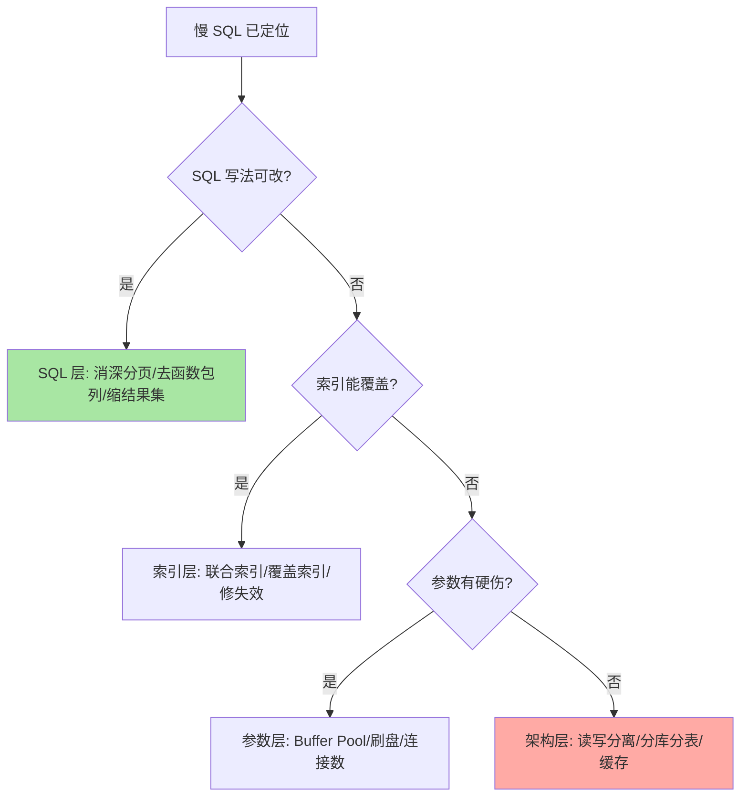

# 性能优化入门：定位先于优化的四层地图

> 一句话：性能问题分四层——SQL 写法、索引、参数配置、架构，从上往下代价递增；先用慢日志定位、再用 EXPLAIN 归因，不拍脑袋。

## 🎯 本文核心

**核心一句话：优化 = 定位（慢日志找语句）→ 归因（EXPLAIN 看执行决策）→ 动手（按四层地图从低成本层开始改）→ 验证（数字说话），顺序错了就是白费力气。**

组织主线：

本篇所有手段都挂在这条流水线上：每一节回答流水线上的一道工序。

## 一句话摘要

MySQL 性能优化最常见的失败不是「不会优化」，而是「没定位就动手」：上来加缓存、调参数、拆库，结果慢的根源是一条没走索引的 SQL。正确姿势是四层地图：**SQL 层**（写法问题：SELECT *、深分页、函数包列）成本最低；**索引层**（该建没建、建了没用、失效三兄弟）；**参数层**（Buffer Pool、日志刷盘、连接数——数据分布不变时才考虑）；**架构层**（读写分离、分库分表、缓存——前三层治不了再上，代价与复杂度最高）。工具链是慢查询日志（找语句）+ EXPLAIN（看决策）+ 监控指标（验证收益），构成从发现到验证的完整闭环。

## 一、为什么需要流程：一次「越优化越慢」的教训

典型场景：接口慢了，团队第一反应加 Redis 缓存——缓存加完接口还是慢，因为慢的那条 SQL 是后台统计任务里的全表扫描，跟接口无关；缓存只挡了读，没挡「本来就不该这么写的查询」。根因是跳过了定位。**优化是医疗行为：先诊断（哪条语句、哪个环节、什么量级），再开方（四层地图选层），最后复查（对比前后指标）**——流程本身就是防「用力方向错了」的机制。

## 5W 速记卡

| 维度 | 一句话 |
|---|---|
| What | 四层问题地图 + 定位/归因/动手/验证的优化闭环 |
| Why | 不定位的优化方向错误率高，架构层改动不可逆代价大 |
| When | 慢告警、大促前压测、上线回归时 |
| Where | 慢查询日志、EXPLAIN、性能监控体系 |
| How | SQL → 索引 → 参数 → 架构，从低成本层开始动 |

## 二、核心机制：定位与归因

### 2.1 慢查询日志：把慢语句捞出来

`slow_query_log=ON` + `long_query_time` 阈值（毫秒级业务建议 0.1-1 秒起步观察），所有超过阈值的语句连同扫描行数、锁时间落盘；配合 `pt-query-digest` 类工具按「总耗时 × 频次」聚合排序——**单条慢不算慢，高频慢才是真凶**，聚合视图直接给出「治谁收益最大」。

### 2.2 EXPLAIN 归因与四层地图

拿到语句后 EXPLAIN 看三样：`type`（访问路径是不是 ALL）、`rows`（扫描量与结果集比例）、`Extra`（filesort/临时表/覆盖）。归因后按四层地图选改动层：

> 💡 **实战提示**
> - 深分页三选一：游标式翻页（记住上页末尾 id）、延迟关联（子查询只取 id 再回表）、业务上限保护——`LIMIT 100万,20` 必须消灭
> - 大事务拆小批：批量更新按 id 分段提交，减少锁持有时长与 undo 压力（长事务代价见 MVCC 篇）
> - 参数层收益先看 Buffer Pool 命中率与刷脏曲线，别从「小参数」开始微调——低效且掩盖真问题
> - 每次优化记录前后数字（P99、QPS、扫描行数）：没有基线的优化无法验收，也无法沉淀为团队经验

## 三、与「加缓存」的区别

缓存是架构层的手段，治「读重复出现」的问题；SQL/索引层治「单次访问本身低效」的问题。慢的第一反应加缓存，等于把「一次查询 3 秒」原样搬进 Redis 变成「第一次 3 秒之后 3 毫秒」——首次与回源仍慢，且引入一致性新问题。顺序：先把单次访问治到健康，再考虑用缓存挡重复流量。

## 四、典型使用场景

- **日常巡检**：慢日志周报聚合，高频慢语句按收益排序治理
- **大促备战**：压测暴露的慢 SQL 按本篇流程批量过一遍
- **新上线接口回归**：EXPLAIN 过一遍核心 SQL，防患未然
- **故障复盘**：把「慢导致雪崩」的事故沉淀成慢 SQL 治理清单

## 五、误区与代价

- ❌ **「上来就拆库分表」**：架构层是最后手段，90% 的慢 SQL 死在 SQL/索引层——先用便宜的手段把便宜的问题治完
- ❌ **「只看平均耗时」**：平均值掩盖长尾，P99/P999 才是用户体感与雪崩源头
- ❌ **「EXPLAIN rows 小就没事」**：估算可能失真，关键语句用 EXPLAIN ANALYZE 看真实执行（8.0+）
- ❌ **「优化是一次性运动」**：数据量增长会让昨天的最优变成今天的瓶颈，慢日志巡检必须常态化

## 六、你们可能会问

**Q1：慢查询日志开了影响性能吗？**
阈值合理时开销可忽略（只记超阈值语句）；全量日志（general log）才是性能杀手，只做临时排查用。

**Q2：索引也建了 SQL 也改了还是慢，下一步？**
进参数层前先看资源层：CPU/IO/网络是否打满、Buffer Pool 命中率、锁等待——「数据库之外的原因」（连接池配置、应用 GC、网络）常被漏掉，定位要覆盖全链路而不只是库内。

**Q3：什么时候才真的需要分库分表？**
判断锚点：单表数据量与增长趋势 + 索引与 SQL 已无优化空间 + 单机资源天花板可见。粗略行业经验是单表千万级起步评估（业内认知，非硬标准），但顺序必须是「SQL/索引治完再评估」。

## 七、什么时候用 / 不用

- ✅ 每个慢告警走完整闭环：定位 → 归因 → 分层动手 → 数字验证
- ✅ 大促/版本升级前后对比基线，防计划突变（查询执行原理篇讲过优化器演进的影响）
- ❌ 不跳过定位直接上架构层方案：代价最大且不可逆
- ❌ 不做没有基线记录的「感觉变快了」

## 八、开放问题

- 自治数据库（自动索引推荐、自动参数调优）在云厂商产品里逐步可用，人工四层地图会被工具接管多少？定位与归因的「诊断直觉」仍是工程师的核心价值
- HTAP 与云原生存储让「读写分离」的经典形态在变化：分析流量走列存副本后，架构层的优化选项在增多，决策依据值得持续更新

## 九、自测三问

1. 四层优化地图从低到高怎么排？为什么按这个顺序动？
2. 慢查询日志与 EXPLAIN 分别在闭环里承担哪道工序？
3. 深分页为什么慢？三种替代方案各自的适用条件？

下一篇讲「主从复制」：读写分离是四层地图架构层的第一站，先看清它的原理与延迟代价。

## 🎯 核心带走

- **核心一句话**：优化 = 定位（慢日志）→ 归因（EXPLAIN）→ 按四层地图从低到高动手 → 数字验证
- **主线**：发现 → 定位语句 → 归因决策 → SQL/索引/参数/架构择层 → 验证闭环
- **哪里会坏**：跳过定位方向跑偏、只看均值漏长尾、缓存掩盖单次低效
- **边界**：本篇是流程总览；EXPLAIN 深度解读与失效排查在专题层「索引优化深度」，架构层细节在主从与分库分表各篇

## 📌 数据与事实声明

- 写于 2026-09-10；慢查询日志、EXPLAIN、`pt-query-digest`、EXPLAIN ANALYZE（8.0+）为官方文档与官方工具口径
- 「单表千万级评估分表」为业内经验认知，非官方标准
- 免责：参数名与行为随版本演进可能调整，以官方文档为准

## 📚 参考资料

| 类型 | 标题 | 来源 |
|---|---|---|
| 官方文档 | The Slow Query Log / EXPLAIN ANALYZE | dev.mysql.com/doc |
| 官方工具 | pt-query-digest (Percona Toolkit) | docs.percona.com |
| 系列导航 | MySQL 系列目录 | `docs/data/mysql/index.md` |
