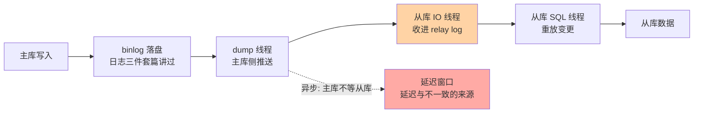
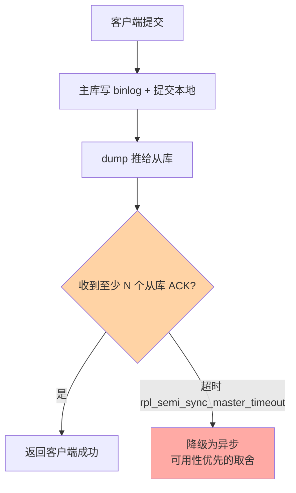

# 主从复制：binlog 驱动的三线程旅程

> 一句话：主库写 binlog、从库拉取重放——复制靠三个线程接力完成，默认异步意味着「主库提交成功 ≠ 从库已同步」，延迟与不一致都要在这条链上治理。

## 🎯 本文核心

**核心一句话：主从复制 = 主库 dump 线程推 binlog + 从库 IO 线程收进 relay log + SQL 线程重放——数据单向流动、默认异步，所有延迟与一致性问题都源于「重放追不上写入」这一基本事实。**

组织主线：

从「为什么需要」到「延迟怎么治」，全部挂在这条三线程接力链上。

## 一句话摘要

主从复制把主库的变更持续同步到一个或多个从库，支撑三件事：**读写分离**（读流量分摊到从库）、**高可用**（主库故障时提升从库）、**灾备**（异地副本）。机制上是三线程接力：主库 dump 线程把 binlog 推给从库；从库 IO 线程接收并写入本地中转日志（relay log）；SQL 线程重放 relay log 里的变更。默认是**异步复制**：主库提交不等从库确认，主库宕机瞬间可能有事务还没传到从库——强一致需求演进出了半同步复制（至少一个从库确认才返回），延迟治理（并行重放、监控、补偿读）是架构层的第一课。

## 一、为什么需要主从：单机的三重天花板

单实例撑不住三件事：**读吞吐**（读多写少是多数业务形态，单机 CPU/IO 有上限）、**可用性**（实例挂了业务全停）、**数据安全**（单点磁盘损坏 = 数据全无）。主从架构用一个「binlog 单向流」同时缓解三件事——这是 MySQL 高可用体系的地基，也是性能优化四层地图里「架构层」的第一站（上一篇刚铺垫过）。

## 5W 速记卡

| 维度 | 一句话 |
|---|---|
| What | binlog 驱动的主从数据同步，三线程接力 + relay log 中转 |
| Why | 读扩展、高可用、灾备都依赖从库副本 |
| When | 一切生产环境的标准部署形态（一主多从起步） |
| Where | 主库 dump 线程 + 从库 IO/SQL 线程 + relay log |
| How | 默认异步；半同步保不丢；延迟靠并行重放与补偿读治理 |

## 二、核心机制：三线程与两种模式

### 2.1 异步复制：默认模式的边界

异步复制下，主库事务提交即返回客户端，dump 线程「尽力」往外推。代价：主库宕机的瞬间，最后一批 binlog 可能还没送达——**提升从库后，刚提交的订单「消失」**。这是异步复制的固有窗口，不是 bug；是否可接受由业务定（资金业务不可接受，于是有半同步）。

### 2.2 半同步复制：至少一人确认

半同步用「提交延迟换不丢」：至少一个从库收到 binlog 才算提交成功；从库全挂或超时则降级回异步（可用性取舍）。注意半同步只保证「从库收到了」，不保证「从库已重放」——读到最新数据还需要延迟治理配合。

### 2.3 延迟从哪来、怎么治

重放是单线程排队追写入的并发（历史实现），追不上就积压：大事务（一条 binlog 重放很久）、从库单核瓶颈、从库还在服务读流量。治法方向：**并行复制**（8.0 基于 write-set 的并行重放，按事务冲突关系并发）、**大事务拆小**（源头治理）、**监控到位**（`SHOW SLAVE STATUS` 的 Seconds_Behind_Master + 外部探测）、**业务补偿**（写后立刻读走主库，即「读己之写」路由）。

> 💡 **实战提示**
> - 读写分离路由要区分业务：用户改完自己的资料立刻回显——走主库；列表/报表读从库，容忍秒级延迟
> - 延迟监控不能只信 `Seconds_Behind_Master`（估算口径有盲区），配套心跳表法：主库定时写心跳，从库读心跳算真实延迟
> - 从库机器规格别比主库差太多：「从库可以凑合」是延迟常年的隐性根源
> - 半同步 + `rpl_semi_sync_master_wait_for_slave_count` 按「能容忍丢几笔」定 N，资金链路 N=1 起步

## 三、与「Redis 主从复制」的区别

同为复制，机制形态差异大：MySQL 复制的是**逻辑/物理变更日志**（binlog 重放），天然有延迟窗口与格式演进；Redis 复制是**全量 RDB + 增量命令流**，速度极快但断线重连有全量重传代价。共同哲学（日志驱动、异步为主、按需加同步语义）一致，差异源于数据体量与一致性要求不同——数据库副本重放追平经常以秒计，Redis 通常毫秒级。

## 四、典型使用场景

- **读写分离**：一主多从 + 中间件路由（ProxySQL/ShardingSphere），读扩展的标准解
- **高可用切换**：MHA/Orchestrator 类工具基于复制拓扑做故障提升（高可用方案篇展开）
- **异地灾备**：级联复制把数据传到远端机房，接受更大延迟换距离安全
- **数据分发**：从库专门服务 ETL/数仓抽取，隔离分析负载对主库的冲击

## 五、误区与代价

- ❌ **「主从架构 = 高可用」**：复制只提供副本，故障检测与自动切换是另一层体系（工具 + 演练）；以为建了从库就高可用，故障时才发现没人做主
- ❌ **「延迟只是小问题」**：写后读从库读到旧值 = 「我刚改的怎么没了」，用户直接可感；资金场景读旧余额是资损事故
- ❌ **「半同步 = 零丢失」**：从库收到 ≠ 落盘重放；对丢失零容忍要配合 GTM/GTID 校验与切换演练，半同步只是缩小窗口
- ❌ **「从库随便加」**：每个从库都是主库 dump 的一份推送负担，且从库自身也要容量规划——副本数是成本与读扩展的权衡

## 六、你们可能会问

**Q1：为什么从库要用 relay log 中转，不直接重放？**
IO 线程收日志要「快」（网络敏感），SQL 线程重放要「稳」（执行敏感），relay log 解耦两者：网络抖动时先把日志囤下来，重放按自己节奏追——两级流水线的经典解耦。

**Q2：GTID 是什么，解决了什么？**
全局事务标识（每个事务全局唯一）。没有它时，从库换主要按「文件名 + 偏移量」人工对位，切主极易错位；GTID 让从库按「事务号」自动对齐缺失部分——切换与搭建从库从手工活变成半自动，是复制体系的关键演进。

**Q3：并行复制为什么以前做不到？**
重放要保序：同一行的事务乱序会改变结果。8.0 的 write-set 方案让数据库自动判断「哪些事务没碰同一行」从而安全并发——并行度受冲突率约束，冲突高的库并行收益有限。

## 七、什么时候用 / 不用

- ✅ 生产环境标配一主一从起步：哪怕当前读量小，灾备价值也值得
- ✅ 读已扩展时配套「读己之写」路由规则与延迟监控
- ❌ 不要把从库当备份唯一手段：误删主库的数据照样同步到从库——备份与复制是两道独立防线
- ❌ 不用跨城同步当实时读源：物理距离决定的网络延迟不可优化，跨城只做灾备

## 八、开放问题

- 分组复制（MGR/组复制）把「异步复制 + 外部切换工具」演进为「多副本共识协议」内置化——MySQL 生态从异步语义向 Paxos 语义靠拢的程度，是高可用架构演进的主线之一
- 云托管数据库把复制下沉到存储层（计算/存储分离），主从概念正在被「共享存储 + 多计算节点」部分替代——传统三线程模型的生命周期值得跟踪

## 九、自测三问

1. 三线程各自做什么？relay log 解耦了什么？
2. 异步与半同步的边界在哪？半同步保证什么、不保证什么？
3. 复制延迟的三个来源与对应治法是什么？

下一篇讲「高可用方案」：有了副本，怎么在故障时自动、正确地完成切换。

## 🎯 核心带走

- **核心一句话**：主从复制 = binlog 经 dump → IO → SQL 三线程接力重放；默认异步有丢失窗口，半同步收窄、延迟靠并行与补偿治理
- **主线**：单机天花板 → 三线程链路 → 异步/半同步 → 延迟来源与治理 → GTID 演进
- **哪里会坏**：主从延迟引发写后读旧值、大事务拖垮重放、误把复制当备份
- **边界**：本篇是复制骨架；延迟治理与切换演练在专题层「主从与高可用深度」，复制协议细节在特性层「主从复制系列」

## 📌 数据与事实声明

- 写于 2026-09-10；三线程模型、relay log、半同步、GTID、8.0 write-set 并行复制为官方文档口径
- 从库规格、心跳监控等为业内运维惯例（业内认知）
- 免责：参数名与默认值随版本演进可能调整，以官方文档为准

## 📚 参考资料

| 类型 | 标题 | 来源 |
|---|---|---|
| 官方文档 | Replication Implementation (Threads / Relay Log) | dev.mysql.com/doc |
| 官方文档 | Semisynchronous Replication / GTID | dev.mysql.com/doc |
| 系列导航 | MySQL 系列目录 | `docs/data/mysql/index.md` |
