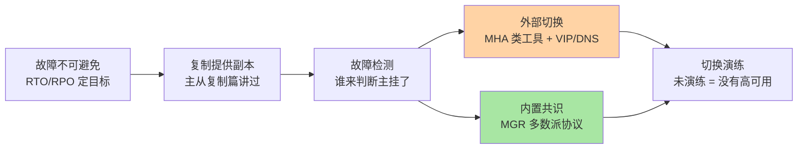
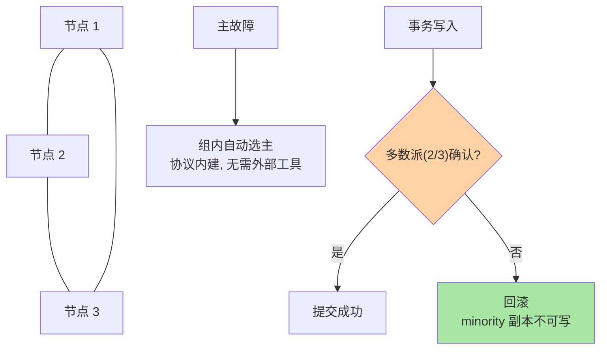

# 高可用方案：从主从切换到组复制

> 一句话：复制给了你副本，高可用要解决「故障时怎么自动、正确地换主」——从外部工具切换（MHA）到内置共识（MGR），演进主线是把「切换正确性」从人工经验变成协议保证。

## 🎯 本文核心

**核心一句话：MySQL 高可用 = 副本（复制）+ 故障检测 + 主从切换三件事的组合；方案演进的分水岭在于「脑裂与丢数据的防护」是靠外部工具弥补，还是靠共识协议内建（组复制 MGR）。**

组织主线：

任何方案都能挂到这条链上定位：它检测怎么做、切换谁来做、脑裂怎么防、演练怎么过。

## 一句话摘要

高可用回答「数据库挂了多久恢复、丢多少数据」——两个指标 RTO（恢复时长）与 RPO（数据丢失量）定目标。基础是主从复制（副本来源），但复制本身不会换主：主库宕机后需要**故障检测**（判断主真的挂了而非网络抖动）和**主从切换**（从库提升为主、其他节点改指新主）。传统路线用外部工具（MHA 为代表）驱动切换，配合半同步降低 RPO；演进路线是组复制（MGR）：多副本基于 Paxos 变体达成多数派共识，写入需要多数派确认，切换由协议内建自动完成——用写入延迟换自动化与一致性。无论哪种方案，**没有演练过的高可用等于没有高可用**。

## 一、为什么需要专门的高可用层：切换不是复制自带的

主从复制篇的遗留问题：从库在哪、谁是新主、客户端改连谁、旧主复活了怎么办——复制一条都不回答。真实故障切换里最危险的从来不是「把从库提升」，而是**分裂瞬间**：网络分区时旧主还活着还在接写入，新主也开写了，数据劈成两叉（脑裂）。高可用方案的全部工程含量，集中在「怎么确认旧主真死」「怎么保证只有一个主」这两问上。

## 5W 速记卡

| 维度 | 一句话 |
|---|---|
| What | 故障检测 + 自动切换 + 防脑裂的完整体系 |
| Why | 复制只给副本，不给「换主」的正确性 |
| When | 主库故障、机房级演练、大促前预案检查 |
| Where | 外部工具层（MHA/Orchestrator）或数据库内核（MGR） |
| How | 按可用性预算与一致性要求选方案，定期演练验证 |

## 二、核心机制：两条路线的取舍

### 2.1 外部工具切换：MHA 路线

管理节点持续探测主库，确认故障后：从从库里挑数据最新的提升为新主、差额 binlog 补齐其他从库、VIP 或中间件把流量切过去。配合半同步复制能把 RPO 压到接近零（从库已收到的日志不丢）。边界：检测与切换是外部组件，自身可靠性、网络分区下的判断正确性都要靠部署设计与演练来保证——**工具是外挂的大脑，大脑出错系统就出错**。

### 2.2 内置共识：组复制（MGR）

MGR 把复制升级为共识协议：写事务需要多数派节点确认，分区时少数派自动不可写——**脑裂在协议层面被排除**，主故障组内自动选主。代价是每次写入多一轮组内确认（延迟上升）与运维复杂度。8.0 时代还有 InnoDB Cluster（MGR + Router 的打包形态），把选主、路由、管理面做成开箱方案——高可用从「攒工具」演进为「买方案」是明显的方向变化。

> 💡 **实战提示**
> - 先定指标再选方案：RPO=0（资金）→ 半同步起步考虑 MGR；RPO 秒级可忍（内容类）→ 异步 + MHA 足够，别为用不上的一致性付写入延迟
> - 切换演练季度化：拔主库、网络分区、从库延迟中切换——每个剧本都要真跑，预案文档不等于能力
> - 旧主复活必须先隔离（fencing）：接回集群前确认它没有残留写入，否则脑裂事故就是从「旧主悄悄回来了」开始的
> - VIP/代理/DNS 三种流量切换方式各有生效速度与客户端感知差异，演练时按真实链路验证

## 三、与「Redis 哨兵」的区别

同为「副本 + 自动切换」体系：Redis 哨兵是独立进程集群投票判定主挂了、选 leader 执行切换；MGR 把这套机制做进数据库内核用共识协议保证。分水岭是数据语义：Redis 多数命令可容忍秒级旧数据、RPO 宽松；MySQL 资金语义对「哪个主是合法主」要求协议级保证——一致性要求越高，越倾向共识协议内建。

## 四、典型使用场景

- **交易/资金库**：MGR 或半同步 + MHA，RPO 优先，演练频率最高
- **内容/社区库**：异步复制 + Orchestrator 自动切换，RTO 优先
- **多活/异地**：单元化 + 双向复制或基于 MGR 的多主形态，代价与复杂度显著上升，先问业务真需要多活吗
- **云托管 RDS**：复制与切换由云平台托管，用户负责的只剩「读懂它的 SLA 与切换语义」

## 五、误区与代价

- ❌ **「上了 MGR 就不用演练」**：协议保证的是共识正确性，网线拔错、磁盘坏、参数错这些事故剧本仍要靠演练暴露
- ❌ **「半同步 = 万无一失」**：超时降级回异步的窗口、从库 ACK 后自身故障等边界都在；半同步是降低 RPO，不是消灭它
- ❌ **「高可用 = 不停机」**：方案目标是不灾难性丢失 + 分钟级恢复；计划内变更（升级/DDL）另有滚动方案，别混为一谈
- ❌ **「多主随便写」**：多主模式冲突检测与业务侧幂等要求高，默认选单主模式，多主是特定场景的取舍

## 六、你们可能会问

**Q1：脑裂到底怎么发生？网络分区时为什么不能两边都写？**
分区时 A 区看到主活着继续写，B 区判定主死提了新主也写——两边都在收写入就是分裂。共识协议用「少数派不可写」排除它：没有多数派就拒绝服务；外部工具路线靠 fencing（隔离旧主、写屏障）人工工程化同样的语义。

**Q2：MGR 写入延迟高多少，能接受吗？**
多一轮组内网络往返，同机房通常毫秒级增量；跨机房部署时网络 RTT 直接叠加进每次提交。值不值看业务对 RPO 的定价——这是典型的延迟换正确性取舍。

**Q3：云 RDS 的高可用和自建有什么本质区别？**
形态从「主从 + 工具」变成平台托管（常见为半同步类 + 存储层冗余），用户失去的是底层控制力，换来的是 SLA 承诺与免运维。选自建还是托管，是控制力与运维成本的架构权衡。

## 七、什么时候用 / 不用

- ✅ 一切生产库都要有答案：哪怕答案是「异步 + 手动预案」，也要白纸黑字 + 演练过
- ✅ 方案选择从 RTO/RPO 预算倒推，不从技术偏好出发
- ❌ 不追新：MGR 没运维经验就全量切核心库，先在边缘业务跑半年
- ❌ 不忽略客户端：切换方案再好，连接池不配合（重连、故障转移超时）照样停服

## 八、开放问题

- 存算分离的云原生架构把「高可用」部分转移到存储层（三副本存储 + 弹性计算节点），数据库内核的高可用组件权重在下降——「高可用是数据库的事还是平台的事」这条边界仍在移动
- 多写多活（跨地域）与共识协议的物理冲突（光速限制 RTT）决定了真多活只能按单元化分治——全局强一致与地域自治的取舍是长期架构命题

## 九、自测三问

1. RTO 与 RPO 分别衡量什么？你的业务该定多少？
2. 脑裂是怎么发生的？MGR 用什么机制排除它？
3. 为什么说「没演练过的高可用等于没有高可用」？

下一篇讲「分库分表与扩展」：高可用解决「挂了怎么办」，分库分表解决「单机撑不住怎么办」。

## 🎯 核心带走

- **核心一句话**：高可用 = 副本 + 检测 + 切换 + 防脑裂；外部工具路线灵活、共识协议（MGR）路线把正确性内建
- **主线**：RTO/RPO 目标 → 复制副本 → 两条切换路线 → 演练闭环
- **哪里会坏**：网络分区脑裂、旧主复活残留写入、演练缺失导致切换预案纸面化
- **边界**：本篇是方案地图；延迟治理与切换实操在专题层「主从与高可用深度」逐一展开

## 📌 数据与事实声明

- 写于 2026-09-10；MHA/Orchestrator 为开源工具公开口径；组复制（MGR）/InnoDB Cluster 为官方文档口径
- 「同机房 MGR 毫秒级增量延迟」为业内实测共识（业内认知），具体数字以压测为准
- 免责：各方案能力边界随版本演进变化，以官方文档为准

## 📚 参考资料

| 类型 | 标题 | 来源 |
|---|---|---|
| 官方文档 | MySQL InnoDB Cluster / Group Replication | dev.mysql.com/doc |
| 开源工具 | MHA / Orchestrator | github.com（公开项目） |
| 系列导航 | MySQL 系列目录 | `docs/data/mysql/index.md` |
