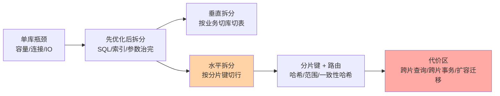
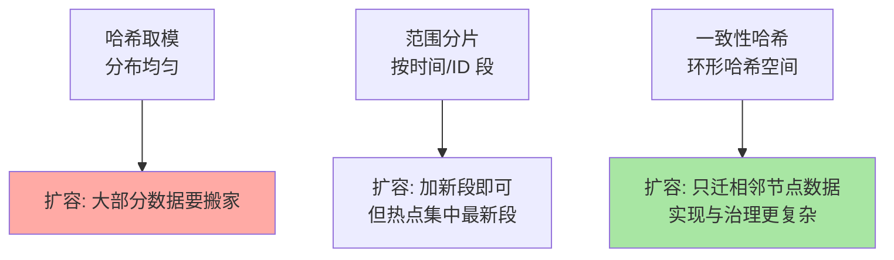

# 分库分表与扩展：拆分前后的代价地图

> 一句话：分库分表是「用架构复杂度换单机容量」的最后手段——拆之前先治 SQL 与索引，拆之后最难的不是切数据，是跨分片查询与事务。

## 🎯 本文核心

**核心一句话：分库分表的一切难点都源于一个动作——把「一台数据库里天然完整的查询与事务」按分片键切开：键选对则绝大多数查询单分片命中，键选错则跨片扫描、跨片事务遍地开花。**

组织主线：

本篇每个概念都挂这条链：先证明「必须拆」，再选「怎么拆」，最后看清「拆完多出来哪些新问题」。

## 一句话摘要

单库的三重天花板：容量（磁盘撑不住数据量）、连接（应用连接数打满）、IO（读写吞吐到顶）。拆分前必须先走完 SQL/索引/参数三层优化（性能优化入门篇的四层地图）——大量「以为要分表」的案例治完索引就好了。真到拆的量级，先**垂直拆**（按业务域切库：订单库/用户库；按访问模式切表：大字段分离），后**水平拆**（同一张表按分片键把行散到多个库）。水平拆的核心资产是**分片键**：绝大多数查询必须带分片键路由到单分片，路由算法在哈希（均匀但扩容迁移大）、范围（好扩但热点）之间权衡。拆完的代价要认：跨分片查询要聚合、跨分片事务要改最终一致、扩容要在线迁移——这些不是工程细节，是架构级的新约束。

## 一、为什么需要拆分：量级的三个信号

判断要不要拆，看三个信号而非拍脑袋：**容量信号**（单表行数与增长曲线逼近运维边界，业内经验认知千万级起步评估）、**吞吐信号**（写入 QPS 单机 IO/CPU 持续高位，读写分离后读已分流但写仍顶不住）、**局部性信号**（数据有天然的业务边界可切，如按租户/按地域）。三个信号齐了再动——**拆分是不可逆级架构决策**：一旦拆开，跨片 join、分布式事务、全局唯一 ID 这些复杂度永久上车。

## 5W 速记卡

| 维度 | 一句话 |
|---|---|
| What | 垂直（按业务）与水平（按行）拆分数据库与表 |
| Why | 单机容量/连接/IO 天花板，前三层优化治不动时 |
| When | 大表大流量场景；先优化后拆分是铁序 |
| Where | 应用与数据库之间的路由层（中间件或 SDK） |
| How | 选分片键 → 选路由算法 → 迁移 → 治理跨片问题 |

## 二、核心机制：分片键与路由

### 2.1 分片键：唯一的架构资产

分片键决定每行数据落在哪个分片，也决定「哪些查询能单分片命中」。选择原则按优先级：**高频查询必须带它**（订单表用 user_id 还是 order_id，看多数查询从哪个维度进）、**数据分布要匀**（避免某片占八成容量的数据倾斜）、**业务局部性要强**（同一用户的数据尽量同片，事务与查询都不跨片）。分片键选错的代价是长期的：改分片键 = 重新迁移，比第一次拆还痛。

### 2.2 路由算法的权衡

三种算法是「均匀性、扩容成本、实现复杂度」三角的取舍：时间范围分片天然适配日志/订单类（冷热分层顺路解决），用户维度哈希适配社交/交易，一致性哈希在动态扩缩容场景胜出。

> 💡 **实战提示**
> - 分片键之外的查询用「异构索引」兜底：把数据按另一个维度再存一份（如订单按买家分片，卖家查询走 binlog 异构出的卖家库）——这是分库分表体系的标配架构件
> - 全局唯一 ID 提前规划：自增主键跨片会冲突，用号段/雪花类趋势递增方案（分布式 ID 专题与索引篇的随机主键问题在此交汇）
> - 跨片分页/聚合能推就推：中间件聚合（内存压力在路由层）与业务改造（两段查询）按数据量选
> - 在线迁移用双写 + 灰度切读：旧库双写 → 全量校验 → 灰度切读 → 下线旧写，每步可回滚（专题层篇 3 有完整迁移手册）

## 三、与「读写分离」的区别

同属架构层扩展，方向不同：读写分离**复制数据**换读吞吐，不解决容量与写瓶颈；分库分表**切开数据**换容量与写吞吐，复制解决不了的才轮到它。实践中先后有序：读写分离是标配先行，分库分表是量级逼出来的第二步——跳过第一步直接分表，是把便宜方案的问题用昂贵方案解决。

## 四、典型使用场景

- **电商订单**：按 user_id 哈希分片，买家维度查询单片命中，卖家维度走异构
- **账单/日志类**：按时间范围分片，冷数据归档顺路解决
- **多租户 SaaS**：大租户独立库、小租户共享库的混合分片
- **消息/流水表**：只写不改的时间序列，范围分片 + 定期归档

## 五、误区与代价

- ❌ **「分表是性能优化的终点站」**：它是架构层最后手段；跳过 SQL/索引优化直接分表 = 把可治的问题复杂化
- ❌ **「分片键随便选一个就行」**：选错键的代价按「每次跨片查询」计息，改键等于二次迁移
- ❌ **「拆完就一劳永逸」**：跨片事务改成最终一致后，业务语义（对账、补偿）要跟着改——工程阵痛在拆完才开始
- ❌ **「中间件能解决一切」**：路由层只解决「去哪找」，跨片 join、分布式 ID、扩容迁移仍是自己的活

## 六、你们可能会问

**Q1：单表多少行该分表？**
没有普适数字。参考锚点：B+ 树 3-4 层内、备份与 DDL 时长可接受、缓冲池能容纳热点——「千万级」是经验粗值（业内认知），真实判据是「前面三层优化已无空间 + 容量/吞吐曲线持续上行」。

**Q2：为什么不直接用 TiDB 这类分布式数据库？**
NewSQL 把分片透明化，代价是运维体系、生态成熟度与资源成本的更换。改造存量 MySQL 体系与换数据库是两条路线，决策依据是团队运维能力与业务增长确定性，不是技术新潮度。

**Q3：拆分后跨分片事务怎么办？**
能避开就避开：分片键设计保证单笔业务事务落在单片（同一用户的数据同片）。避不开时引入分布式事务体系：强一致用 XA（性能差）或 NewSQL，多数互联网场景用消息最终一致 + 对账补偿——正确性从「数据库保证」迁移到「业务流程保证」。

## 七、什么时候用 / 不用

- ✅ 拆分前的检查单：SQL 治理完、索引治到头、参数到位、读写分离已上——四项全过仍顶不住才评估拆分
- ✅ 拆分设计先写「代价清单」：跨片查询清单、事务改造清单、迁移方案——拆不拆，看清单能不能接受
- ❌ 不为「未来可能的大」提前拆：提前拆 = 白付多年的复杂度税，量级逼到眼前再动
- ❌ 不用分表解决慢查询：慢查询归 SQL/索引层管，分表治的是容量与写吞吐

## 八、开放问题

- 分布式数据库（TiDB/OceanBase 类）正在把「分库分表 + 中间件」的存量方案产品化——「应用层分片」这套手艺的长期价值在收缩还是长期与 NewSQL 并存，取决于云托管数据库的演进速度
- Serverless 化数据库宣称「容量自动伸缩」，若成熟将直接取消「评估拆分时机」这道题——方向值得跟踪，当下生产决策仍按存量体系判断

## 九、自测三问

1. 拆分前的四步检查是什么？为什么顺序不能反？
2. 分片键选择的三条原则是什么？选错的真实代价有哪些？
3. 哈希、范围、一致性哈希各自在什么维度占优？

下一篇讲「备份恢复与排错」：扩展体系再复杂，数据安全的底线仍是备份与恢复演练。

## 🎯 核心带走

- **核心一句话**：分库分表 = 用架构复杂度换容量与写吞吐；分片键是唯一核心资产，跨片查询/事务/迁移是拆后三大代价
- **主线**：单机三瓶颈 → 先优化后拆分 → 垂直/水平 → 分片键与路由 → 代价治理
- **哪里会坏**：分片键选错（跨片遍地）、扩容迁移无演练（双写不一致）、跳过优化直接拆
- **边界**：本篇是入门地图；拆分选型、分片键设计、迁移实操在专题层「分库分表深度」四篇展开

## 📌 数据与事实声明

- 写于 2026-09-10；垂直/水平拆分、哈希/范围/一致性哈希、双写迁移为架构领域公开共识口径
- 「千万级评估分表」为业内经验认知，非官方标准
- 免责：具体中间件能力差异较大，以所选产品文档为准

## 📚 参考资料

| 类型 | 标题 | 来源 |
|---|---|---|
| 官方文档 | MySQL Partitioning（单机分区，与分表的概念边界） | dev.mysql.com/doc |
| 开源组件 | ShardingSphere / MyCat | github.com/apache/shardingsphere |
| 系列导航 | MySQL 系列目录 | `docs/data/mysql/index.md` |
