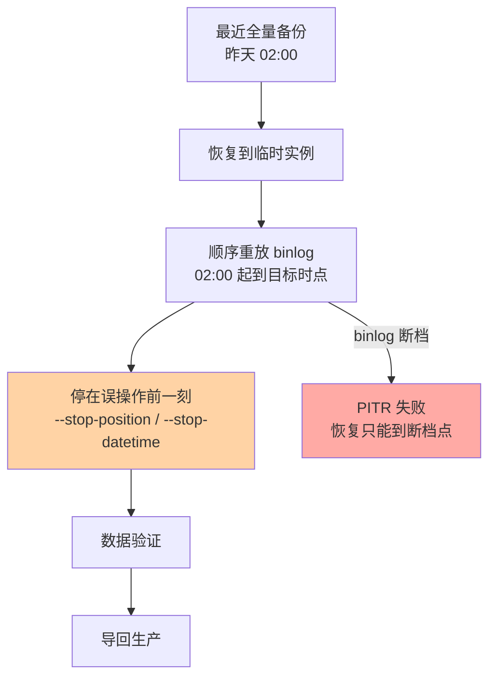

# 备份恢复与排错：数据安全的最后防线

> 一句话：备份的意义在恢复而不在备份——「全量 + binlog 增量」构成可恢复到任意时刻的底座，没演练过的备份等于没备份。

## 🎯 本文核心

**核心一句话：数据安全底座 = 物理全量备份（xtrabackup）+ binlog 增量（日志三件套篇的 binlog），二者组合实现时间点恢复（PITR）；备份体系的验收标准不是「备份任务成功」，是「演练恢复成功 + 恢复时长可接受」。**

组织主线：

本篇四段全挂这条链：丢数据的可能从哪来、底座怎么搭、怎么恢复到任意时刻、怎么保证「真出事时能跑通」。

## 一句话摘要

复制（主从篇）解决「机器坏了还有副本」，但**误删数据、误更新、逻辑损坏会同步到所有副本**——备份是独立于复制的最后防线。备份分两类：**物理备份**（xtrabackup 直接拷贝数据文件，大库快，是生产主力）与**逻辑备份**（mysqldump 导出 SQL，小库灵活，跨版本迁移友好）。光有全量不够：全量之间发生的变更靠 binlog 补齐，全量 + 连续 binlog 重放即可**恢复到任意时刻**（PITR，时间点恢复）——比如回退到误删表执行前的一秒。整个体系的命门在演练：备份文件损坏、binlog 断档、恢复环境缺失，这些问题只有真跑一次恢复才暴露。

## 一、为什么需要备份：复制救不了的场景

主从架构下的经典误判：「我有从库，数据丢不了。」真实事故剧本：开发在主库执行了没带 WHERE 的 UPDATE——这个变更被 binlog 忠实地**同步到每一个从库**，全链路数据一起坏。复制保护的是「机器级故障」，对「数据级错误」无能为力（错误数据是合法数据）。独立的、可以回溯到历史时点的备份，才是这类事故的解毒剂。这就是「备份与复制是两道独立防线」的原理：它们防的风险类别不同。

## 5W 速记卡

| 维度 | 一句话 |
|---|---|
| What | 全量备份 + binlog 增量构成可 PITR 的数据安全底座 |
| Why | 复制不防逻辑错误；误删/误改是最高频的数据灾难 |
| When | 定时全量 + binlog 实时归档；演练按季度起步 |
| Where | 物理备份（xtrabackup）为主力，逻辑备份（mysqldump）补充 |
| How | 全量 → 顺序重放 binlog 到目标时点 → 验证数据 |

## 二、核心机制：PITR 的拼装过程

### 2.1 两类备份的取舍

| 维度 | 物理备份 xtrabackup | 逻辑备份 mysqldump |
|---|---|---|
| 原理 | 拷贝数据物理文件（配合 redo 保持一致性） | 导出 SQL 语句重放 |
| 速度 | 快（TB 级可用） | 慢（逐行导出导入） |
| 灵活性 | 整库/整表级 | 可按库/表/行精细导 |
| 适用 | 生产例行全量 | 小库、单表抽样、跨版本迁移 |

### 2.2 PITR：全量 + 增量拼装

PITR 成立的前提是 **binlog 链完整**：全量备份点之后的 binlog 一段都不能缺（归档到对象存储、与数据文件分地存放）。这也是日志三件套篇说「binlog 是运维最后一道防线」的完整含义。

> 💡 **实战提示**
> - RPO 定备份频率：每天一全量 + binlog 实时归档 = 数据最多丢「误操作前无备份窗口」——binlog 连续时 PITR 可到秒级
> - 备份保留策略兼顾「误操作发现时长」：发现晚了想回退的时点备份已被清理，是最冤的二次事故
> - 备份必须异地/异介质存放：同机备份防不了磁盘阵亡与勒索加密
> - 演练计时 + 计步骤：恢复脚本化，季度真跑，记录实际 RTO——台账上的恢复时长才是真 RTO

## 三、与「主从延迟切换」的区别

都在「回到正确数据」，机制不同：主从切换解决「主库物理故障」——从库有完整数据，提升即可；备份恢复解决「数据本身被写坏」——从库也是坏的，必须回退时间线。判断用哪个方案的第一问：**「所有副本是不是都坏了？」**是 → PITR；否 → 切换。两套预案都要有，事故现场靠这一问分流。

## 四、典型使用场景

- **误删表/误更新**：PITR 回退到误操作前一刻，找回数据
- **例行保障**：每日全量 + binlog 实时归档 + 季度恢复演练
- **跨环境搭建**：逻辑备份导出脱敏数据到测试环境
- **迁移升级**：大版本升级前物理备份兜底，失败可整库回退

## 五、误区与代价

- ❌ **「备份任务跑成功 = 能恢复」**：备份文件损坏、缺参数（如没开 binlog 就没法增量）只有恢复时才暴露——「能备份」与「能恢复」之间隔着一次真实演练
- ❌ **「备份放本机就安全」**：主机故障、加密勒索同归于尽；异地异介质是底线不是加分项
- ❌ **「从库停了备份就不用做」**：复制是可用性方案，备份是数据安全方案，前文已论证互不替代
- ❌ **「恢复慢点没关系」**：TB 级库恢复以小时计，业务停摆每分钟都在计价——RTO 不达标的备份体系要加量级（增量备份/快照）

## 六、你们可能会问

**Q1：为什么不用「主从延迟从库」代替备份？**
延迟从库（从库故意落后 N 小时）是常用补充手段：误删后到延迟从库把数据捞回来，比全量 PITR 快。但它本质是「时间机器副本」，窗口期有限、粒度是整实例——适合救急，不能替代完整备份体系。

**Q2：物理备份期间业务能写吗？**
能。xtrabackup 拷贝文件的同时记录增量 redo，结束阶段应用 redo 达到一致性点——这是「在线物理备份」的原理，也是它成为生产标配的原因（锁表备份的老方案已淘汰）。

**Q3：误操作发现晚了，binlog 已被清理怎么办？**
PITR 失效，只能从更早的备份 + 有限恢复。防法在保留策略：binlog 与备份的保留期 ≥ 「业务能发现数据错误的最长时延」——这是按业务特性定的参数，不是 DBA 拍的。

## 七、什么时候用 / 不用

- ✅ 一切有状态生产库：全量 + binlog 归档 + 异地存放 + 季度演练，四件套齐备
- ✅ 高危操作（批量 UPDATE/DDL）前手动全量备份一次，多一道即时快照
- ❌ 不用生产库当备份验证场：恢复演练在隔离环境跑
- ❌ 不迷信「云 RDS 自带备份」就不管了：读懂它的保留期、跨区能力、恢复 SLA，托管不等于免责

## 八、开放问题

- 快照类存储（存储层快照、COW 克隆）让「秒级全量」成为可能，传统 xtrabackup 全量 + binlog 的拼装形态在云原生体系里正被「高频快照 + WAL 归档」替代——备份体系的演进方向与日志即数据库（log-as-database）思潮合流
- 恢复演练的自动化（定期自动拉起恢复 + 数据校验 + 出报告）正在成为平台标配能力，人工演练会逐步退位为异常兜底

## 九、自测三问

1. 为什么说复制与备份是两道独立防线？各自的防线对象是什么？
2. PITR 的拼装流程是什么？成立的前提条件有哪些？
3. 物理备份与逻辑备份各适合什么场景？生产主力是哪个？

下一篇进特性层「深入理解索引系列」：入门层的骨架齐了，从 B+ 树与页存储开始逐个机制深挖。

## 🎯 核心带走

- **核心一句话**：备份体系 = 物理全量 + binlog 增量 → 可 PITR 到任意时刻；验收标准是演练恢复成功而非备份成功
- **主线**：数据丢失来源 → 两类备份取舍 → PITR 拼装 → 演练计时 → 排错体系
- **哪里会坏**：备份文件没验证、binlog 断档、备份同机存放、发现太晚备份已清
- **边界**：本篇是安全底线总览；日志机制细节回看日志三件套篇，主从与备份的分工配合在专题层高可用篇展开

## 📌 数据与事实声明

- 写于 2026-09-10；xtrabackup 在线物理备份原理、mysqldump、PITR（--stop-position）为官方与 Percona 文档口径
- 演练频率、保留期策略为业内运维惯例（业内认知），按业务合规要求定
- 免责：工具参数与行为随版本演进可能调整，以官方文档为准

## 📚 参考资料

| 类型 | 标题 | 来源 |
|---|---|---|
| 官方文档 | Backup and Recovery Types / Point-in-Time Recovery | dev.mysql.com/doc |
| 官方工具 | Percona XtraBackup | docs.percona.com/percona-xtrabackup |
| 系列导航 | MySQL 系列目录 | `docs/data/mysql/index.md` |
