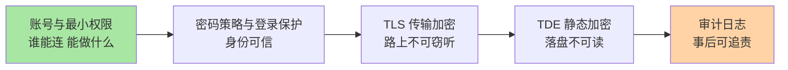
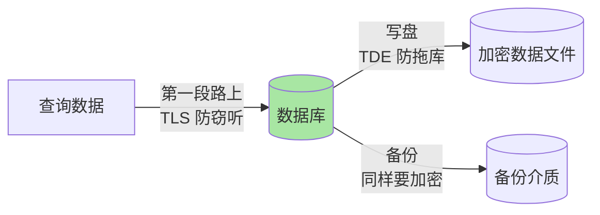

# MySQL 安全体系：账号、加密与审计的四道防线

> 系列前 15 篇讲的都是「让数据库跑得好」，本篇讲「让别人进不来、看得懂的人拿不走、出了事查得到」。安全体系由四道正交的防线组成：账号权限管「谁能连、能做什么」，密码策略管「连进来的身份可不可信」，加密管「路上和落盘的数据读不走」，审计管「事后能不能说清楚发生了什么」。

## 一句话摘要

MySQL 安全不是单点功能而是分层防线：**账号与最小权限**是第一性原理（应用绝不用 root、每个服务独立账号、只授必需权限）；**密码策略与登录保护**守住身份入口（复杂度校验组件 + 失败锁定）；**TLS 连接加密**保证数据在网络传输中不可窃听；**数据加密（TDE/表空间加密）**保证磁盘和备份文件被拖走后读不出明文；**审计日志**把「谁在什么时候执行了什么」记成可追责的证据链。四道防线各自独立成立、互不替代——最常见的破防，是以为其中一道能顶替其他三道。

## 🎯 本文核心

**核心一句话：安全的四道防线按「攻击者视角」排列——先挡人（账号+密码），再护路（TLS），再护库（TDE），最后留证据（审计）；每一道都在为上一道的失手兜底，缺任何一道都是单点。**

组织主线：



本篇按这条链展开四道防线的原理与配置，再用一个辨析节讲清传输加密与静态加密的区别，最后盘点高频误配置及其代价。

## 5W 速记卡

| 维度 | 一句话 |
|---|---|
| What | 账号权限 + 密码策略 + 传输/静态加密 + 审计的四层防线体系 |
| Why | 数据库暴露面 = 网络 + 账号 + 主机 + 备份，单点防护必被绕过 |
| When | 新环境初始化时一次配齐；每次扩容/加服务时复查 |
| Where | 服务端系统库（账号/密钥）+ 连接层（TLS）+ 存储层（表空间加密） |
| How | 最小权限授权 → 密码策略组件 → REQUIRE SSL → 表空间加密 → 审计插件 |

## 一、账号与最小权限：第一性原理

账号体系的设计思想只有一条：**权限是攻击者的行动半径**——一个账号能做什么，决定了它被攻陷后损失有多大。落地为三条纪律：

1. **应用不用 root**：root 只留给运维通道，且禁止远程登录（账号 host 收敛到本机或堡垒机网段）。
2. **一服务一账号**：每个应用服务独立账号，权限按服务实际访问的库表精确授予，不共享账号——共享账号让审计失去「定位到人/服务」的能力。
3. **只授必需动作**：只读服务不给写权限，报表账号不给 DDL。8.0 的角色（ROLE）机制可以把这套权限模板化。

```sql
-- 最小权限示例：报表服务只读账号（限内网网段）
CREATE USER 'report_svc'@'10.0.0.%' IDENTIFIED BY '随机强口令' REQUIRE SSL;
GRANT SELECT ON analytics.* TO 'report_svc'@'10.0.0.%';
-- 业务读写账号：不含 DROP/GRANT 等管理动作
GRANT SELECT, INSERT, UPDATE, DELETE ON app_db.* TO 'app_svc'@'10.0.0.%';
```

**追问：为什么「host 限制」和密码一样重要？**
账号三元组是「用户名 + 来源地址 + 凭证」。把 host 收敛到应用网段后，即使密码泄漏，攻击者也无法从任意地址连入——这是零成本的纵深防御。反常识的真相是：多数暴力破解并非绕过密码，而是撞上了 `root@%` 这种全网段开放的账号。

## 二、密码策略与登录保护

8.0 用组件（Component）体系提供密码能力：

```sql
-- 安装并启用密码强度校验组件
INSTALL COMPONENT 'file://component_validate_password';
SET GLOBAL validate_password.policy = STRONG;   -- 含特殊字符与字典检查
-- 账号级失败锁定：连续 5 次失败锁 1 天
CREATE USER 'app_svc'@'10.0.0.%'
  IDENTIFIED BY '随机强口令'
  FAILED_LOGIN_ATTEMPTS 5 PASSWORD_LOCK_TIME 1;
```

密码策略管「设出来的密码不弱」，失败锁定管「猜密码的速度被限死」——两者一起把暴力破解的成本抬到不可行。业内认知：密码泄漏与弱口令长期位于数据库入侵路径的前列，策略组件的配置成本远低于一次泄漏的处置成本。

## 三、TLS 连接加密：护住传输路径

数据库与应用通常分机部署，账号密码和查询结果明文跑在网络上是经典暴露面。MySQL 原生支持 TLS：服务端配置证书后，账号可用 `REQUIRE SSL`（或 `REQUIRE X509` 双向认证）强制加密连接。

**追问：内网流量也要加密吗？**
设计目标是「信任不依赖网络位置」——内网可被arp 欺骗、交换机镜像端口、同 VPC 其他租户监听（云上共享网络尤甚）。这个设计原则叫零信任：网络位置不构成豁免理由。加密的代价（单次握手与对称加密开销，业内认知在个位数百分比）远低于明文传输的风险敞口。这也是数据库安全体系这些年最大的架构演进：防护重心从「守住边界」转向「默认不可信」。

## 四、数据加密（TDE/表空间加密）：护住落盘数据

TDE（透明表空间加密）在 InnoDB 存储层对数据文件加解密：写入磁盘前加密、读入内存后解密，对应用完全透明——这套机制工作在页级别 IO 路径上，密钥由 keyring 组件（本地文件/密钥管理服务等多种后端）管理。

```sql
-- 开启 keyring 后，建表即加密；存量表可在线重构
CREATE TABLE secret_data (id INT PRIMARY KEY) ENCRYPTION = 'Y';
ALTER TABLE legacy_data ENCRYPTION = 'Y';
```

**边界要记清**：加密的是「落盘的表空间文件」；8.0 后续版本逐步覆盖了 redo/undo/binlog 的加密能力（以官方文档为准）。它不解决的是：有权连库的人依然能看到明文——所以 TDE 防的是「磁盘/备份失窃」这一类攻击，不替代权限防线。备份文件同样要纳入加密范围：一份未加密的备份 = 一块可以直接拖走的磁盘。

## 五、传输加密与静态加密的区别

这两道防线名字都叫「加密」，防护的攻击面完全不同，是安全体系里最常被混为一谈的一对概念——本质是两套独立的密钥体系与两类互不重叠的威胁模型：

| 维度 | TLS 传输加密 | TDE 静态加密 |
|---|---|---|
| 防护位置 | 数据在网络链路中 | 数据在磁盘/备份文件里 |
| 防的攻击 | 窃听、中间人 | 磁盘失窃、备份泄漏、旧盘回收 |
| 密钥归属 | TLS 证书（会话级） | keyring 主密钥（持久级） |
| 不防什么 | 数据落盘后被直接读取 | 有权连库的人查到明文 |



记住一句话：**TLS 护「路」，TDE 护「库」**——丢了任何一边，另一边的数据都会以另一种方式泄漏。

## 六、审计日志：留证据链

binlog 记录的是「数据怎么变的」，审计日志记录的是「谁在什么时候从哪台机器连进来、执行了什么、有没有成功」——含失败尝试。审计能力的演进方向是平台化：社区版可用方案是 Percona Server 的审计插件（公开口径）或云厂商内置审计，企业版自带审计组件；最低成本的兜底是 `general_log`（但全量记录性能代价大，业内认知不建议长期开启，适合临时取证）。审计的价值在事后：没有它，安全事件只能回答「数据变了」，回答不了「是谁干的、还干了什么」。

## 七、典型使用场景

- **新环境初始化**：装机清单里固定四件事——删匿名账号、收敛 root host、按服务建最小权限账号、启用密码策略组件；TLS 证书随环境一起发放。
- **等保与行业合规**：监管对访问控制、传输加密、审计留存普遍有硬性要求（具体条款以对应标准文本为准），本篇四道防线是合规检查的技术底座。
- **上云/跨机房迁移**：链路上下游拉长后传输加密与备份加密的优先级陡增——迁移评审里把「新链路是否全程 TLS、备份落在哪、密钥归谁管」列成检查项。
- **量级分界一句话**：十万级以内单库，账号权限 + 密码策略 + TLS 三件套就守得住底线；千万级、多服务共享实例时补上 TDE 与审计；亿级或强合规行业，密钥管理要独立体系化（专用密钥服务 + 轮换制度），不能把密钥和数据放同一台机器。

> 💡 **实战提示**
> - 💡 账号收敛做成模板：8.0 的 ROLE 把「一服务一账号 + 最小权限」沉淀成可复用角色，新服务接入即授角色，权限漂移在源头被锁住
> - 💡 把「备份加密」写进备份任务本身：备份脚本产出即加密，不靠人工事后补——凡是靠人记住的安全动作，最终都会被忘掉
> - 💡 密钥轮换先演练再执行：TDE 主密钥轮换支持在线操作，但「轮换失败怎么办」的回退路径要在测试环境先走一遍，安全变更同样需要回退方案

## 八、常见安全误配置与代价

- **`root@%` 全网开放 + 弱口令**：等于把管理入口挂到公网上，是暴力破解的第一目标。
- **共享账号**：一个账号多人多用，泄漏后无法定位泄漏源，审计记录也失去追责价值。
- **测试/演示残留**：`test` 库与匿名账号（老版本初始化默认存在）忘记清理，是最容易被忽略的免费入口。
- **备份明文落盘**：磁盘加密做得很全，备份却裸奔——攻击者拿走备份等于拿走整库。
- **密钥与数据同机**：keyring 文件和数据文件在同一块磁盘上，拖库时一起被拖走，TDE 形同虚设。
- **`skip-grant-tables` 忘关**：排查问题时临时跳过权限体系，恢复后忘记重启还原——线上排查过一起真实形态的安全事件：维修窗口的一时方便，让该实例在此后数小时处于无鉴权状态。复盘结论：跳过权限体系的操作必须双人复核 + 定时回收，这类「临时态」是安全事故的高发形态。

## 九、你们可能会问

**Q1：小团队没有专职安全，最低限度先做哪几件事？**
按「成本从低到高」做三件：账号收敛（root 禁远程 + 一服务一账号最小权限）、密码策略组件 + 失败锁定、强制 TLS。为什么不用一个共用账号省事？——因为共享账号毁掉的不只是安全，是审计定位能力。这三件都是配置级工作，半天内可完成；TDE 与审计在数据敏感度上升后再补——安全投入与数据敏感度对齐，不追一步到位。

**Q2：开了 TDE，性能影响怎么评估？**
加解密发生在页级别 IO 路径，业内认知的常态损耗在个位数百分比，页缓存命中的读几乎无感。真正的评估点在密钥服务：keyring 远程后端引入的密钥获取延迟与可用性要纳入容量与容灾设计。

**Q3：审计日志会不会把磁盘写爆？**
会，所以审计要有留存策略（写满轮转 + 归档到日志平台）。一般只审计 DDL 与高危 DML、或按账号采样，而不是全量记录——审计的工程问题从来不是「记不记」，是「记了之后谁看、怎么查」。

## 十、什么时候用/不用与 Trade-off

| 场景 | 推荐 | 不适用 |
|---|---|---|
| 内部业务库基线 | 账号收敛 + 密码策略 + TLS | 上来就堆昂贵密钥服务 |
| 敏感数据（用户隐私/资金） | 加 TDE + 备份加密 | 只加密不管密钥归属 |
| 强合规行业 | 全四道防线 + 审计留存 | 用 binlog 冒充审计 |
| 一次性分析环境 | 隔离网络 + 临时账号 | 长期共享 root |

Trade-off 在于：每道防线都有运行成本（TLS 握手开销、TDE 的 IO 路径、审计的存储与噪音），防线堆到超出数据敏感度就是纯负担；反过来，砍掉某一道省下的成本，会在出事时以「定位不到人、数据收不回」的形式加倍偿还。这层设计取舍的锚点是数据敏感度与合规要求，不是技术清单的完整性。

## 十一、开放问题

- 云托管数据库把 TLS/审计变成开关，但密钥的托管边界（平台管还是自管 BYOK）仍是数据主权讨论的焦点
- 零信任架构下「按服务身份认证」（证书即身份）能否替代长期密码，值得在内部环境先行试点——从密码到证书的身份体系演进，可能与当年从 IP 白名单到账号收敛的迁移一样漫长

## 🎯 核心带走

- **核心一句话**：安全 = 四道正交防线——账号权限挡人、密码策略保身份、TLS 护路、TDE 护库、审计留证据；互相兜底，不可互替
- **最小动作集**：root 禁远程、一服务一账号最小权限、密码策略组件、REQUIRE SSL——半天可完成的基线
- **哪里会破**：共享账号毁掉审计、备份明文抵消 TDE、密钥同机形同虚设、临时跳过权限忘记还原
- **取舍锚点**：防线强度对齐数据敏感度与合规要求，成本超配与欠配都是失衡

## 自测三问

1. 应用账号为什么必须拆分到「一服务一账号」而不是共用一个？——答出「审计定位 + 泄漏半径」两点算过。
2. TLS 和 TDE 各防哪种攻击？为什么开了 TDE 还要 TLS？——答出「护路 vs 护库」算过。
3. 开启 TDE 后，哪两个配套没做等于白做？——答出「备份加密 + 密钥分离存放」算过。

## 📌 数据与事实声明

- 写于 2026-09-18，机制以 MySQL 8.0 为基准（密码组件、失败锁定、表空间加密均为 8.0 体系能力）
- 参数与语法以 dev.mysql.com 官方文档为准；审计插件方案为公开口径
- 性能影响量级为业内认知，非精确基准测试
- 误配置案例为公开技术社区常见问题模式的匿名化复述

## 📚 参考资料

| 类型 | 标题 | 来源 |
|---|---|---|
| 官方文档 | MySQL 8.0 Reference Manual: Access Control and Account Management | dev.mysql.com/doc/refman/8.0/en/access-control.html |
| 官方文档 | The Password Validation Component / Failed-Login Tracking | dev.mysql.com/doc/refman/8.0/en/ |
| 官方文档 | InnoDB Data-at-Rest Encryption / keyring Components | dev.mysql.com/doc/refman/8.0/en/innodb-data-encryption.html |
| 系列内链 | 账号体系背后的日志与恢复 | 15_备份恢复与排错-入门.md |
| 系列内链 | 系列导读与全景 | 0_系列导读-全景.md |
