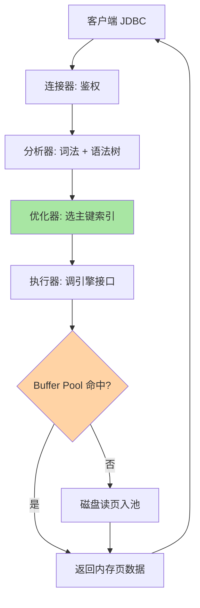

# MySQL 架构与一条 SQL 的一生

> 架构分层 + SQL 执行链路——先回答 MySQL 是什么、一条 SQL 进来后经历了什么。

## 🎯 本文核心

**核心一句话：MySQL 是「服务层 + 引擎层」的分层架构——一条 SQL 从客户端出发，服务层四组件接力（连接器 → 分析器 → 优化器 → 执行器），真正读写数据交给 InnoDB（Buffer Pool → 索引 → 磁盘）；后续所有机制篇都挂在这条链路的某个节点上。**

组织主线（全系列的锚点图）：

索引、事务、MVCC、锁、日志全是这条主干上的支线：主线通了，每一篇深挖时都知道「自己在链路里处于什么位置」——这就是本篇作为全系列第一篇的理由。

## 一句话摘要

MySQL 的知识可以挂在一条主线上——一条 SQL 从客户端发起到磁盘落盘，经历服务层四组件和 InnoDB 引擎层。服务层管 SQL 逻辑（鉴权、解析、优化、调度），引擎层管数据存取（缓存、索引、落盘），插件式架构让引擎可替换。理解这条链路是后续所有机制（索引/事务/MVCC/锁/日志）的锚点，也是慢 SQL 分层排查的地图。

## 1. 为什么先讲架构

MySQL 的资料很多，但有两个真实问题让初学者卡住：

- **「SQL 发出去后发生了什么」**——客户端点下回车，到数据库返回结果，中间经历了什么？
- **「慢 SQL 该去哪找」**——是网络问题？是 SQL 写得差？还是硬件撑不住？

两个问题的答案都藏在分层架构里。典型场景：线上慢 SQL 排查——先看执行计划（优化器层），再看 Buffer Pool 命中率（引擎层），最后看网络/磁盘（存储层），每一层负责一层的事。**分层架构的价值就是「出问题时能定位到层」**——这是架构设计的上下游分工逻辑，不是课本概念。

## 2. 三层架构全景

MySQL 的结构分三层：**客户端层**、**服务层（Server）**、**存储引擎层**。服务层是「大脑」（管 SQL 逻辑），存储引擎是「手脚」（管数据存取），客户端是「入口」。

### 2.1 连接器：连接管理 + 权限校验

客户端（mysql 命令行、JDBC 连接池）首先连的是**连接器**：建立 TCP 连接（默认 3306）→ 校验账号密码 → 加载权限。它不解析 SQL、不碰数据，只管「你是谁、有没有资格」。一个常见误解：连接内权限在建立时加载一次，**改权限要重连才生效**——排查「权限明明改了还报错」时先想到这条。

### 2.2 分析器：词法 → 语法 → 语法树

SQL 通过连接器后进入**分析器**：词法分析识别关键字/表名/列名，语法分析检查合法性（`SELECT * FORM t` 在这里报错），最后生成语法树交给下游。它只管「语法对不对」，不管「语义对不对」。

### 2.3 优化器：选索引 / 定 Join 顺序

**优化器**基于统计信息做成本决策：选哪个索引扫描行数最少、多表 Join 先查谁。输出是**执行计划**（EXPLAIN 可见）。选错索引是慢 SQL 第一大来源——这不是 Bug，是「基于估算的决策」在统计过期或数据倾斜时必然的误判率（查询执行原理篇展开决策细节）。

> 💡 **实战提示**
> - 分析器管「语法对不对」，优化器管「怎么查最快」——一个判合法性、一个判效率，排查报错与排查慢是两条路径
> - 慢 SQL 排查分层走：EXPLAIN（优化器决策）→ Buffer Pool 命中率（引擎层）→ 网络/磁盘（资源层），顺序别乱
> - 权限变更后让应用重置连接池，别等「改了不生效」的工单
> - `SHOW PROCESSLIST` 看连接堆积时，先区分「连接器层问题」（连接数打满）和「执行层问题」（查询挂住）

### 2.4 执行器与存储引擎

**执行器**按执行计划逐行调用引擎接口，关键指标 `rows_examined`（实际扫描行数）——扫 100 万行返回 1 行就是索引没走对。**存储引擎层**是插件式设计：服务层不变、换引擎换存储特性。

### 2.5 与 MyISAM 的区别

| 引擎 | 事务 | 行锁 | 崩溃恢复 | 场景 |
|---|---|---|---|---|
| InnoDB | ✅ | ✅ | ✅ | 默认，OLTP 业务表 |
| MyISAM | ❌ | ❌（表锁）| ❌ | 只读报表、日志归档 |
| Memory | ❌ | ❌ | ❌ | 临时数据 |

与 MyISAM 的区别集中在并发与安全两件事上：InnoDB 行锁让写并发成为可能、crash-safe 让宕机不丢数据——这两点是它成为 OLTP 默认的根本；MyISAM 只剩只读场景的记忆价值，Memory 引擎只服务纯内存临时数据。InnoDB 的胜出靠事务 + 行锁 + crash-safe 三大能力（存储引擎篇展开），后续所有机制（MVCC、锁、日志）都建在它之上。

## 3. 一条 SELECT 的一生

以 `SELECT * FROM t WHERE id = 1` 走查全链路：

六个停站：鉴权 → 解析成语法树 → 优化器决定走主键索引 → 执行器发起引擎调用 → Buffer Pool 命中或读盘 → 聚簇索引叶子直接是整行数据（索引基础篇的「索引即数据」）。**一张图记住：SQL 先进服务层（分析→优化→执行），再进引擎层（缓存→索引→磁盘）。**

## 4. 写链路对照：UPDATE 的读改写与日志先行

UPDATE 是「读-改-写」：先按索引定位行（读阶段），然后改内存页、标脏页——但落盘前先写日志：

**WAL（先写日志再改数据）**是 crash-safe 的核心：日志先行落盘，宕机后重放日志即可恢复——「先记流水再改账本，账本坏了靠流水重算」。redo（引擎层物理日志，管恢复）与 binlog（服务层逻辑日志，管复制归档）两阶段提交绑定一致性，细节在日志三件套篇展开。

## 5W 速记卡

| 维度 | 一句话 |
|---|---|
| What | 服务层（四组件）+ 引擎层（InnoDB）的分层架构与 SQL 全链路 |
| Why | 分层让 SQL 逻辑与数据存取解耦，问题能定位到层 |
| When | 学任何机制前先对位这条链；慢排查按层走 |
| Where | 服务层四组件在 Server 进程内，引擎层含内存与磁盘 |
| How | SELECT 沿链路读；UPDATE 读改写 + 日志先行 |

## 6. 你们可能会问

**Q1：查询缓存为什么被移除了？**
旧版缓存 SELECT 结果，但表任何一行变更就使相关缓存全部失效——写多读少的业务命中率极低还维护昂贵，8.0 直接移除。这本身就是「权衡失败就砍掉」的演进案例。

**Q2：为什么连接池要配「保活」？**
连接器建连有开销（TCP 三次握手 + 鉴权 + 权限加载），应用用连接池复用长连接；但 MySQL 默认 `wait_timeout` 会踢闲置连接，保活查询防「拿到的连接已是死连接」。

**Q3：服务层和引擎层的边界在事务上怎么体现？**
事务的 ACID 大头在引擎层（undo/redo/MVCC），但 binlog 在服务层——所以需要两阶段提交把两边日志绑成原子（日志三件套篇展开）。边界清晰也要协作机制，这是分层架构的常态。

## 7. 什么时候用 / 不用

- ✅ 把这条链路当「全系列地图」：后面每篇机制都先回来挂个位
- ✅ 慢排查按层走：先服务层决策（EXPLAIN）再引擎层（命中率）再资源层
- ❌ 不背组件清单当知识点：记不住是因为没用链路串起来
- ❌ 不在链路之外找「MySQL 的问题」：连接池配置、网络、应用代码都在链路上游，别全算数据库头上

## 8. 开放问题

- 计算存储分离的云数据库正在改写「服务层 + 本地引擎层」的经典分层：引擎下沉为共享存储服务后，本篇的链路图哪些节点会消失、哪些会上移，是架构演进值得持续观察的主线
- 服务层的模块边界（解析/优化/执行）在分布式 SQL 引擎里被重新切分（协调节点/数据节点），分层思想不变、层次重组

## 9. 自测三问

1. SQL 从客户端到返回结果，经过哪几层、哪些组件？按顺序说。
2. Buffer Pool 命中与未命中的性能差在哪？为什么写操作「不慢」？
3. redo log 与 binlog 的层级、内容、用途差别是什么？

**新手常见误区**：① mysql 客户端 ≠ MySQL 服务端，连的是网络端口不是本地文件；② 查询缓存 8.0 已移除，别再找它；③ 排序/分组（filesort/临时表）在服务层做，不在 InnoDB 里——每个误区的代价都是排查方向跑偏。

**下篇预告**：篇 2「存储引擎与落盘细节」——引擎层第一个深挖点：页、行格式与 Buffer Pool 的异步落盘。

## 🎯 核心带走

- **核心一句话**：服务层管逻辑（连接→解析→优化→执行），引擎层管存取（缓存→索引→磁盘），一条链路串起全系列
- **主线**：连接器 → 分析器 → 优化器 → 执行器 → Buffer Pool → B+ 树 → 磁盘
- **哪里会坏**：优化器选错索引（统计过期）、连接器权限不生效（需重连）、写链路误判（日志先行才是落盘保证）
- **边界**：本篇是链路骨架；每个节点的深挖对应后续各篇——引擎层篇 2、索引篇 5、日志篇 9

## 📌 数据与事实声明

- 写于 2026-09-10（升级重写）；三层架构、四组件走查、查询缓存 8.0 移除为 MySQL 8.0 官方文档口径
- 参考《高性能 MySQL》《MySQL 45 讲》公开内容，表述为本仓库原理化改写
- 免责：组件行为随版本演进可能调整，以官方文档为准

## 📚 参考资料

| 类型 | 标题 | 来源 |
|---|---|---|
| 官方文档 | MySQL Server Architecture / The Binary Log | dev.mysql.com/doc |
| 经典书 | 《高性能 MySQL》第 1 章 | O'Reilly（公开出版物） |
| 系列导航 | MySQL 系列目录 | `docs/data/mysql/index.md` |
