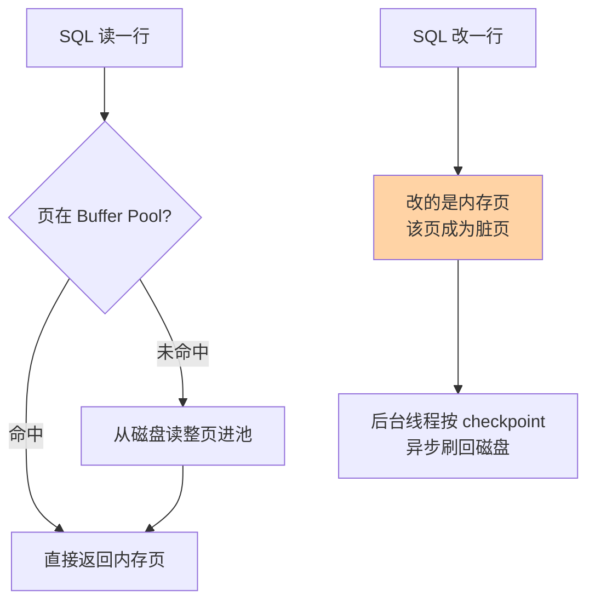

# 存储引擎与落盘细节：InnoDB 怎么把数据存到磁盘

> 一句话：Server 层管 SQL 逻辑，引擎层管数据怎么存——InnoDB 以 16KB 的页为唯一磁盘单位，读写都先走 Buffer Pool 内存缓存，脏页再异步刷盘。

## 🎯 本文核心

**核心一句话：MySQL 把「怎么存数据」整体下沉到可插拔的存储引擎层，形成 Server 层与引擎层的上下游分工：InnoDB 以「页」为唯一落盘单位，所有读写先经过 Buffer Pool 内存缓存，落盘是异步的。**

组织主线（本篇四段全挂这条线上）：

看懂「页 → 内存缓存 → 异步落盘」这条链，删数据不释放空间、内存命中率决定性能、宕机不丢已提交数据这几个现象就都有了同一处原理源头。

## 一句话摘要

存储引擎是 MySQL 架构里「负责数据真正存取」的组件：Server 层解析 SQL、做优化，到了真正读写数据时交给引擎。InnoDB 是默认引擎，它把磁盘抽象成一个个 16KB 的页，用 Buffer Pool 把热点页缓存在内存，写操作先改内存里的页（成为脏页），再由后台线程按 checkpoint 机制异步刷回磁盘——这就是「数据到底怎么落盘」的完整答案。

## 一、为什么默认是 InnoDB

MySQL 的引擎是可插拔的：同一套 SQL 接口，底下可以换不同的存储实现。历史上 MyISAM 曾是默认引擎（5.5 版本之前），**5.5 起（2010 年前后）默认引擎演进为 InnoDB**，原因集中在三件事上：

| 维度 | InnoDB | MyISAM |
|---|---|---|
| 事务 | 支持（ACID） | 不支持 |
| 锁粒度 | 行级锁 | 只有表锁 |
| 崩溃恢复 | crash-safe（redo log 保证） | 无，宕机可能坏表 |
| 索引组织 | 聚簇索引（数据即索引叶子） | 非聚簇（索引存数据地址） |

业务库的核心诉求是「并发读写 + 数据不丢」，这三件事 MyISAM 一件都接不住：表锁让写并发退化成串行，没有事务意味着出错没法回滚，没有崩溃恢复意味着断电后要人工修表。InnoDB 用 redo log 把「改内存页」和「落盘」解耦，换来了 crash-safe——这笔架构上的取舍是它成为默认的根本原因。

## 5W 速记卡

| 维度 | 一句话 |
|---|---|
| What | 可插拔的存储组件，InnoDB 以 16KB 页为单位管理数据落盘 |
| Why | Server 层专注 SQL 逻辑，存储细节下沉引擎层，各司其职 |
| When | InnoDB 用于一切 OLTP 业务表；MyISAM 仅剩只读报表类遗留场景 |
| Where | 引擎层：Buffer Pool（内存）+ 表空间文件（磁盘 .ibd） |
| How | 读写按页缓存 → 脏页异步刷盘 → checkpoint 推进边界 |

## 二、核心机制：页、行格式与 Buffer Pool

### 2.1 一切从页开始

InnoDB 磁盘管理的最小单位是**页（Page），默认 16KB**。表数据按主键顺序组织进 B+ 树，树的每个节点就是一个页：非叶子页放路由条目，叶子页放真实行数据。行数据按行格式（如 DYNAMIC）存储：变长字段只存实际长度，大字段溢出存到溢出页。

这个设计的底层原因：磁盘读写按块进行，16KB 的页让一次 I/O 摊薄多条数据的成本——「按页读写」是数据库与磁盘之间的基本契约。

### 2.2 Buffer Pool：内存与磁盘的缓冲带

读写不直接打磁盘，而是先经过 **Buffer Pool**（缓冲池）：

- **读**：页命中内存直接返回；未命中才触发一次磁盘 I/O，把整页读进池子
- **写**：先改内存页，该页变成「脏页」（内存与磁盘不一致的页），后台线程按 checkpoint 节奏批量刷盘
- 崩溃时不丢已提交数据的底气来自 redo log（日志三件套篇展开），不是靠「实时落盘」

### 2.3 checkpoint 直觉

checkpoint 就是「刷盘进度条」：记录脏页刷到了哪个位置。它把「攒一批脏页、顺序刷盘」变成可控的后台动作，避免随机小 I/O 打爆磁盘——这是写性能与恢复时间的权衡：刷得慢，写入顺滑但宕机恢复要重放的日志多；刷得快，反之。

> 💡 **实战提示**
> - `innodb_file_per_table=ON`（5.6 起默认）：每张表独立 .ibd 文件，删表可真正归还空间
> - 删数据不释放磁盘空间是因为页里留了「空洞」可复用，表空间文件不收缩——要回收需重建表（`OPTIMIZE TABLE` 或 online DDL 重建）
> - 关注 Buffer Pool 命中率（`SHOW ENGINE INNODB STATUS`）：命中率低于 99% 通常意味着内存不够、热点数据被挤出
> - Buffer Pool 大小用 `innodb_buffer_pool_size` 调，专用数据库服务器常给物理内存的一半以上（业内惯例，具体以官方建议为准）

## 三、与 MyISAM 的区别：数据组织方式是根

两者最深的差别在索引组织：InnoDB 是**聚簇索引**——叶子页就是数据本身，表即索引；MyISAM 是**非聚簇索引**——叶子存的是数据文件的地址指针，索引和数据分离。由此派生：InnoDB 主键查找一次 B+ 树可达，主键宜短（所有二级索引都存主键值）；MyISAM 无此约束但换不来事务与行锁。

## 四、典型使用场景

- **OLTP 业务表**：订单/账户/库存——并发读写 + 事务 + 行锁，InnoDB 全命中
- **只读归档查询**：历史报表类 MyISAM 老表，无并发写仍能跑，但新建表没有理由再选它
- **内存充裕的热点库**：调大 Buffer Pool 让「工作集」整体驻留内存，磁盘 I/O 趋近于零
- **大字段存储**：TEXT/BLOB 走溢出页，行内只留指针——行变小，一页装下更多行，缓存效率更高

## 五、误区与不适用

- ❌ **「写一条就立刻落一条盘」**：真实机制是改内存页 + 异步批量刷盘；误解它就会低估「断电为什么要靠 redo log 恢复」——每次提交都强制刷数据盘的代价是性能崩塌，InnoDB 用日志顺序写换数据页随机写，这是性能取舍的根
- ❌ **「删了数据磁盘就该变小」**：页内空洞只标记复用，文件不收缩；强行塞进共享表空间，删表都收不回空间
- ❌ **「Buffer Pool 越大越好，吃满内存」**：留给操作系统和其他进程的内存不足会引发 swap，反而拖垮延迟——这是典型的资源权衡
- ❌ **「引擎随便换」**：MyISAM 转 InnoDB 后 SQL 行为有差异（如无事务语义的变化），迁移前要过一遍依赖点

## 六、你们可能会问

**Q1：为什么页是 16KB，不是 4KB 或 64KB？**
页小 → 树高、随机 I/O 多、页头元数据占比大；页大 → 单次 I/O 大、缓存粒度粗、并发冲突面大。16KB 是 B+ 树扇出与 I/O 放大之间的折中值，且已被生态默认固化（压缩页等特性围绕它设计）。

**Q2：脏页没刷盘就断电，数据丢吗？**
已提交的事务不丢——提交时 redo log 已落盘（受 `innodb_flush_log_at_trx_commit` 控制），恢复时重放 redo 把改动补到数据页上；未提交的自然回滚。「先写日志再写数据页」就是 WAL 原理，日志篇展开。

**Q3：怎么知道一次查询有没有走磁盘？**
看 Buffer Pool 命中率与 `Innodb_buffer_pool_reads`（直接读磁盘次数）对比逻辑读次数；EXPLAIN 的 rows 只是估算，真正的物理 I/O 看这些状态变量。

## 七、什么时候用 / 不用

- ✅ 用 InnoDB：一切需要事务、并发写、崩溃安全的表——默认选择，不需要理由
- ✅ 调 Buffer Pool：内存充裕、热点数据明确的库，收益立竿见影
- ❌ 不用 MyISAM：新建业务表没有任何场景值得放弃事务与 crash-safe
- ❌ 不盲目调页大小 / 刷盘参数：默认值是大量生产实践折中的产物，改动前先有监控数据支撑

## 八、开放问题

- 列存与 HTAP 场景下，「行存页 + B+ 树」这套落盘契约还能撑多久？存储引擎这些年的演进方向是列式引擎分流分析负载，但 OLTP 主航道上行存页仍是主流答案，值得持续观察
- 持久内存类设备模糊了内存与磁盘边界后，「Buffer Pool 缓存 + 异步刷盘」这套机制是否会被重新设计？机制服务于「磁盘慢、易失」的假设，假设变了机制就可能变

## 九、自测三问

1. InnoDB 与 MyISAM 在数据组织方式上最深的差别是什么？
2. 脏页是什么？它靠什么机制保证断电后不丢已提交数据？
3. 删了大半数据，表空间文件为什么不缩小？怎么真正回收？

下一篇讲「字符集与排序规则」：数据落盘前的编码契约——utf8mb4 怎么选、乱码怎么根因排查。

## 🎯 核心带走

- **核心一句话**：引擎层负责存取，InnoDB 以 16KB 页为唯一磁盘单位，读写先走 Buffer Pool，脏页异步刷盘
- **主线**：Server 层（不管存储）→ 引擎层（可插拔）→ 页（磁盘单位）→ Buffer Pool（内存缓存）→ checkpoint（异步落盘）
- **哪里会坏**：Buffer Pool 太小（命中率掉、I/O 飙升）/ 共享表空间（删表收不回空间）/ 误以为实时落盘（低估 redo 的作用）
- **边界**：本篇是落盘的「物理视角」；索引怎么组织页、日志怎么保崩溃安全，分别在索引篇与日志篇展开

## 📌 数据与事实声明

- 写于 2026-09-10；InnoDB 自 MySQL 5.5 起为默认引擎、页默认 16KB、`innodb_file_per_table` 5.6 起默认开启——均为官方文档历史口径（公开资料）
- Buffer Pool 命中率 99% 经验值为业内惯例，非官方承诺
- 免责：具体参数名与默认值随版本演进可能调整，以官方文档为准

## 📚 参考资料

| 类型 | 标题 | 来源 |
|---|---|---|
| 官方文档 | InnoDB Architecture / Buffer Pool | dev.mysql.com/doc |
| 官方文档 | Alternative Storage Engines (MyISAM) | dev.mysql.com/doc |
| 系列导航 | MySQL 系列目录 | `docs/data/mysql/index.md` |
