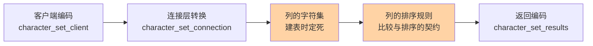
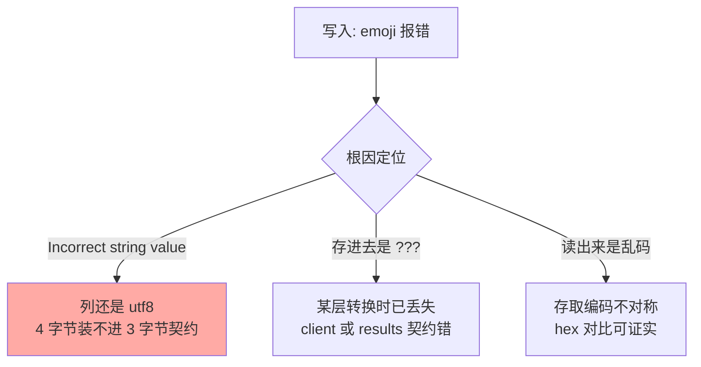

# 字符集与排序规则：utf8mb4 与比较契约

> 一句话：字符集规定「字节怎么变字符」，排序规则规定「字符怎么比大小」——两个契约藏在列元数据里，错了就是乱码与索引失效。

## 🎯 本文核心

**核心一句话：字符集与排序规则是写进列定义的两层编码契约——前者管存储编码，后者管比较与排序；任何一层在链路上不匹配，表现就是乱码或查询不走索引。**

组织主线（每个概念挂这条链的固定位置）：

乱码 = 链路上某两层对不上；「明明有索引却没用」= 比较两端的排序规则不一致。根因都收束到「契约」这一个概念上。

## 一句话摘要

MySQL 存字符串不是存「字符」而是存「编码后的字节」，编码方案由字符集决定；字符串之间怎么比较、怎么排序，由排序规则决定。MySQL 的 `utf8` 是历史遗留的残缺实现（最长 3 字节），真正的 UTF-8 是 `utf8mb4`（最长 4 字节）。理解「多层转换链 + 列级契约」这层原理，乱码排查和排序规则选型就都有了抓手。

## 一、为什么需要编码契约：一次经典乱码事故

典型场景：应用写入「👍」emoji，报错 `Incorrect string value`；或者数据页面上中文变成 `???` 与 `测试` 两类乱码。根因都不在「数据库坏了」，而在链路上某一层的编码契约与其他层不一致——同一个字节序列被按错误的字符集解读。

字符集问题的底层原因是一部演进史：MySQL 的 `utf8` 实现于早期版本，受当时实现限制每字符最多 3 字节；而标准 UTF-8 需要最多 4 字节（emoji、部分生僻汉字）。**2010 年前后社区已明确 `utf8` 是别名性质的残缺实现，`utf8mb4` 才是完整 UTF-8**——这是 MySQL 里最著名的「名字骗人」案例，也是新库一律 utf8mb4 这一工程约定的由来。

## 5W 速记卡

| 维度 | 一句话 |
|---|---|
| What | 字符集=字节与字符的映射；排序规则=字符间比较排序的规则 |
| Why | 存储需要确定编码，比较需要确定次序，两者都是列元数据 |
| When | 建库建表定契约；乱码/索引失效排查时对契约 |
| Where | 服务器默认值 → 库 → 表 → 列，逐层继承可覆盖 |
| How | 全链路统一 utf8mb4 + 匹配的排序规则，排查用 hex 逐层对 |

## 二、核心机制：转换链与排序规则

### 2.1 三层转换：乱码的物理现场

客户端到服务器之间有三个会话级参数：`character_set_client`（服务器如何解读你发来的字节）、`character_set_connection`（语句内部处理用）、`character_set_results`（返回给客户端的编码）。请求进来按 client 编码解码、转成 connection 编码处理、写入时再转成列的字符集存储——**每一次转换都是一次「按契约解码再按新契约编码」**，契约错一层，字节就永久变形。

### 2.2 排序规则：比较契约如何影响查询

排序规则（collation）决定两个字符「谁大谁小、相等怎么判」。命名读法：`utf8mb4_general_ci` = 字符集 + 算法 + `ci`（case insensitive，不区分大小写）。常用三款的取舍：

| 排序规则 | 口径 | 特点与代价 |
|---|---|---|
| `utf8mb4_general_ci` | 简化比较表 | 快，但部分字符排序不精确 |
| `utf8mb4_unicode_ci` | 基于 UCA 标准 | 更准确，稍慢 |
| `utf8mb4_0900_ai_ci` | Unicode 9.0（8.0 默认） | 更新更准，`ai` 连重音也不区分 |

关键机制：**比较必须两端契约一致**。WHERE 条件、JOIN 两列的排序规则不同时，MySQL 要先做转换再比较，列上的索引因此用不上——这是「排序规则影响索引可用性」的直接原理。同理 `ci` 类规则让 `WHERE name = 'Tom'` 命中 `tom`，业务上是不是想要的语义要自己定。

> 💡 **实战提示**
> - 新建库统一 `utf8mb4 + utf8mb4_0900_ai_ci`（8.0+）；5.7 生态用 `utf8mb4_general_ci`，升 8.0 前把排序规则演进纳入改造清单
> - 乱码排查三步：`SELECT HEX(col)` 看字节 → 逐层核对 `SHOW VARIABLES LIKE 'character%'` → `SHOW CREATE TABLE` 看列级契约
> - JDBC 连接串显式指定 `characterEncoding=utf8mb4`（或 utf8），不依赖服务器默认值
> - 迁移老库先扫 `information_schema.COLUMNS` 里非 utf8mb4 的列，emoji 类需求上线前是必查项

## 三、与「索引失效」常见原因的区别

字符集契约导致的失效是「**类型不匹配**」：比较两端编码契约不同，必须转换。它和另一类高频失效——对列做函数运算（`WHERE YEAR(dt)=2024`）——根因不同：后者是破坏了索引列的原始形态。共同点是都会让优化器放弃走索引，排查时先看 EXPLAIN 再回看列定义与条件写法。

## 四、典型使用场景

- **多语言/社交类业务**：昵称、评论含 emoji 与生僻字——utf8mb4 是硬要求
- **跨库数据同步**：上下游系统字符集不一致是乱码重灾区，先对齐契约再通数据
- **排序与分组语义敏感**：按名称排序/去重的场景，`ci` 与 `ai` 的选择直接改变结果集
- **老系统升级**：utf8 → utf8mb4 需要转换表字符集并重建索引，属结构变更而非参数修改

## 五、误区与代价

- ❌ **「utf8 就是 UTF-8」**：残缺实现，emoji 必炸；补救要改列定义 + 重建索引，表越大代价越大
- ❌ **「乱码修显示端就行」**：字节已经变形的脏数据修不回来，必须从契约层修复后重灌
- ❌ **「排序规则随手选」**：JOIN 两列规则不一致 = 隐式转换 = 大表全扫，这是线上慢查询的隐形大户
- ❌ **「只改表不改连接」**：会话参数仍按旧契约转换，改完照样乱——契约要全链路统一

## 六、你们可能会问

**Q1：`_ci` 不区分大小写，密码字段怎么办？**
密码不该明文存储，存的是哈希字节串——哈希列用 `utf8mb4_bin`（或直接 BINARY 类型），按字节精确比较，绕开大小写语义。

**Q2：utf8mb4 会让索引变大变慢吗？**
列的字节上限变长，索引条目上限随之变大；但实际存储按内容长度，普通中文场景增量有限。真正的代价出现在长字符串列上——控制索引前缀长度比纠结字符集更有收益。

**Q3：为什么 8.0 把默认排序规则换了？**
`0900` 系列基于更新的 Unicode 标准，排序正确性显著优于 general_ci；默认值改变换来的是「新库更正确 + 老库升级时契约差异需要显式处理」的权衡。

## 七、什么时候用 / 不用

- ✅ 一律 utf8mb4 + 8.0 用 `_0900_ai_ci`：正确性优先，生态已收敛到这个默认
- ✅ 精确比较列（哈希/令牌）用 `_bin` 系列排序规则
- ❌ 不为「省空间」继续用 utf8：省下的是小头，赔上的是 emoji 事故与二次迁移
- ❌ 不在 SQL 里依赖隐式转换跨契约比较：显式统一两端排序规则

## 八、开放问题

- 多语言排序（如拼音序、笔画序）本质是排序规则的可插拔演进，8.x 的 UCA 体系覆盖度还有多少缺口，值得跟踪后续版本的演进
- NewSQL 与分库分表体系下，跨节点查询的排序规则一致性如何治理——单机契约清楚了，分布式契约还没有统一答案

## 九、自测三问

1. MySQL 的 `utf8` 和标准 UTF-8 差在哪？由此产生过哪类线上事故？
2. 请求从客户端到落盘要经过几次编码转换？乱码出在哪个环节怎么定位？
3. JOIN 两列排序规则不一致为什么会让索引失效？

下一篇讲「Schema 设计与数据类型」：字符契约定了，字段类型怎么选才不给查询埋雷。

## 🎯 核心带走

- **核心一句话**：字符集管编码、排序规则管比较，都是列级契约——契约不一致 = 乱码或索引失效
- **主线**：客户端编码 → 连接转换 → 列字符集（utf8mb4）→ 列排序规则 → 返回编码
- **哪里会坏**：utf8 存 emoji 报错 / 多层转换不对称产生脏数据 / JOIN 契约不一致全表扫
- **边界**：本篇管「字符串怎么存与比」；数值/时间类型的选型逻辑在下一篇展开

## 📌 数据与事实声明

- 写于 2026-09-10；`utf8` 为 3 字节残缺实现、`utf8mb4` 为完整实现、8.0 默认排序规则 `utf8mb4_0900_ai_ci`——均为官方文档口径（公开资料）
- 排序规则性能差异为社区实测共识（业内认知），无官方基准承诺
- 免责：参数名与默认值随版本演进可能调整，以官方文档为准

## 📚 参考资料

| 类型 | 标题 | 来源 |
|---|---|---|
| 官方文档 | Character Sets, Collations, Unicode | dev.mysql.com/doc |
| 官方博客 | MySQL 8.0 Collations (Migrating from 5.7) | mysqlserverteam.com（历史存档） |
| 系列导航 | MySQL 系列目录 | `docs/data/mysql/index.md` |
