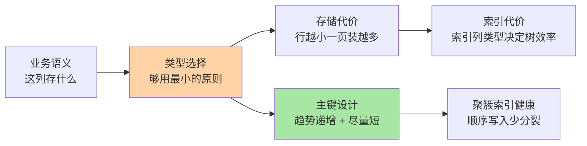
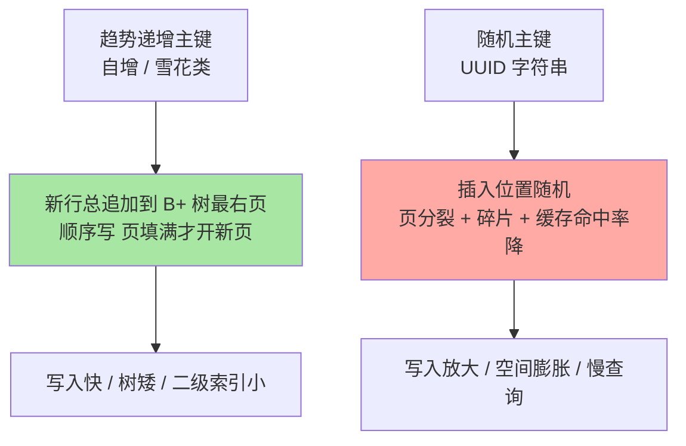

# Schema 设计与数据类型：表设计决定查询上限

> 一句话：字段类型与主键选择是写入时就定死的性能契约——类型选错多耗空间与转换，主键选错放大页分裂，后期的所有索引优化都在为设计买单。

## 🎯 本文核心

**核心一句话：Schema 设计的本质是「用最小的存储表达确定的数据语义」——数值选够用最小、时间选精度明确、字符串选变长限长、主键选趋势递增短键；设计期的每个决定都在为后期查询与索引定价。**

组织主线：

类型、主键、范式三个话题全挂这条链：都在回答「怎么让存储层花最小代价承载这些数据」。

## 一句话摘要

表结构是数据库设计的地基：**数值类型**按「取值范围 + 是否精确」选（金额用 DECIMAL 不用 FLOAT——浮点有精度误差；状态用 TINYINT 不用 INT）；**时间类型**按精度与时区需求选（DATETIME 无时区语义范围大，TIMESTAMP 带时区转换但受 2038 问题约束）；**字符串**按定变长选（VARCHAR 限长 + 拒绝滥用 TEXT）。**主键**在 InnoDB 聚簇索引体系下尤其关键：趋势递增保证顺序写入（避免页分裂）、键短让所有二级索引变小（索引基础篇讲过二级索引叶子存主键）。范式与反范式的权衡（规范化减少冗余 vs 反范式减少 join）属于设计自由度，按查询模式定。

## 一、为什么类型重要：一个字段的连锁反应

典型事故链：某表订单号用了 `VARCHAR(255)`（实际 19 位），后来要做覆盖索引——索引条目 255 字节上限让一页能放的路由锐减、树变高；同时每行定义 255 字符虽实际只存 19，但内存排序、临时表的缓冲估算全按上限放大。**类型是写入时的契约，查询期的所有组件（索引/排序缓冲/网络传输）都按这个契约定价**——改类型的代价（锁表或在线 DDL 的时长）随数据量线性上涨，设计期的一小时省掉后期的无数次优化。

## 5W 速记卡

| 维度 | 一句话 |
|---|---|
| What | 字段类型、主键、范式三件套的结构设计 |
| Why | 类型与主键在写入时定价了存储、索引与查询的全部成本 |
| When | 建表时；以及「慢查询怎么都治不好」时的回头检查 |
| Where | 聚簇索引行格式 + 各二级索引条目 |
| How | 够用最小 + 语义精确 + 主键趋势递增短键 |

## 二、核心机制：类型选择与主键设计

### 2.1 数值、时间、字符串的选择逻辑

| 数据 | 正确选择 | 为什么 / 反例代价 |
|---|---|---|
| 金额 | `DECIMAL(M,D)` | 精确十进制；FLOAT/DOUBLE 有二进制精度误差，资金对账必炸 |
| 状态/枚举 | `TINYINT UNSIGNED` | 1 字节；用 VARCHAR 存状态字符串浪费且难建高效索引 |
| 主键 ID | `BIGINT UNSIGNED` | INT 上限 21 亿，业务增长后改类型是灾难级 DDL |
| 时间 | `DATETIME`（默认） | 无时区转换、范围 9999 年；TIMESTAMP 受 2038 上限与隐式时区转换影响，多时区业务才需要它 |
| 短字符串 | `VARCHAR(N)` 限长 | 按实际内容存；`N` 是字符数按需给，顺手 TEXT 是索引与排序的坑 |
| 唯一业务键 | 独立列 + 唯一索引 | 别拿业务键当主键（长且可能变更），自增/雪花做主键 + 业务键唯一索引 |

### 2.2 主键：聚簇体系的健康根基

主键的两条铁律（索引基础篇讲过原理，这里落到设计动作）：**短**——每个二级索引都复制一份主键，主键长 = 所有索引跟着长；**趋势递增**——聚簇索引按主键组织，递增键让写入永远追加到尾部，随机键让每一次插入都可能撕开满页。UUID 做物理主键是 InnoDB 的经典反模式，需要全局唯一时用「雪花 ID 这类趋势递增方案 + 时间戳位」或 UUID 存二进制列做唯一索引。

> 💡 **实战提示**
> - 建表三查：查类型够不够用且没超配（INT 够就别 BIGINT）、查字符集与排序规则（字符集篇的 utf8mb4 契约）、查主键是否趋势递增
> - 拒绝「预留字段」与万能备注列：语义模糊的列最终都变成没人敢动的垃圾数据，要新字段走 online DDL
> - 反范式冗余要配维护机制：冗余「用户名快照」到订单表可以（历史语义），但必须写清「以哪边为准、何时同步」
> - 大字段（TEXT/BLOB）独立出扩展表：主表行变小，一页装更多行，缓冲池效率全线受益（存储引擎篇的溢出页机制）

## 三、与「分库分表」的区别

都是「为量级做准备」，时机与手段不同：Schema 设计是**单机内的最优**（类型紧凑、主键健康），分库分表是**单机外的扩展**（容量与写吞吐的架构解）。良好的 Schema 是分表的前置条件——分片键查询高效、主键全局唯一方案，都建立在类型与主键设计正确之上。顺序：先把单机设计做对，把单机性能用到头，再谈拆。

## 四、典型使用场景

- **资金表设计**：金额 DECIMAL + 状态 TINYINT + BIGINT 主键 + 时间 DATETIME(6)，审计字段齐备
- **高并发写入表**：自增或雪花主键保证顺序追加，行宽压缩让缓冲池容纳更多热点
- **列表查询优化**：反范式冗余高频展示字段（如昵称快照），覆盖列表页免 join
- **历史归档表**：同构表结构 + 时间范围分区/分表（分库分表篇的时间分片在此衔接）

## 五、误区与代价

- ❌ **「VARCHAR(255) 反正按实际存」**：存储确实按实际，但索引上限、内存排序估算、应用校验全按 255 放大——限长是给所有组件的信号
- ❌ **「UUID 好生成好同步」**：作为聚簇主键是页分裂机器；要全局唯一有趋势递增方案，UUID 只该做唯一索引列
- ❌ **「先 INT 后面再升 BIGINT」**：改列类型是大 DDL（锁表或长时在线变更），21 亿上限在增长型业务必然撞上——设计时就按终局选
- ❌ **「范式越高越专业」**：过度范式化让每个列表页五六个 join；按查询模式反范式 + 快照冗余是工程正解，教科书范式不是生产答案

## 六、你们可能会问

**Q1：为什么金额必须 DECIMAL，DOUBLE 差的那点精度真有事吗？**
二进制浮点表示不了精确十进制小数（0.1 就是存不准），单笔误差微小，聚合与对账的误差累积就是资损级——资金场景零容忍。INT 存「分」也是工程解，本质都是绕开浮点。

**Q2：DATETIME 和 TIMESTAMP 到底选哪个？**
默认 DATETIME：范围大、无隐式时区转换、行为可预期。TIMESTAMP 的价值在「存 UTC、按会话时区展示」——只有真多时区业务才需要；它的 2038 上限与隐式转换是长期负担。

**Q3：范式化到底还要不要学？**
要，但作为分析工具而非教条：先范式化理清实体与依赖，再按查询模式有依据地反范式——「知道自己在冗余什么、谁来维护冗余」的反范式才是设计，否则是埋雷。

## 七、什么时候用 / 不用

- ✅ 建表评审对照检查单：类型/主键/字符集/索引预估/增长预估五项
- ✅ 存量表「怎么优化都慢」时回头查设计：类型超配与随机主键是隐形根源
- ❌ 不在数据量大之后才改类型/主键：那是 DDL 灾难片，设计期五分钟的事
- ❌ 不用 JSON 列替代正经字段设计：灵活字段的代价是索引弱、校验缺失，仅在真 schemaless 场景用

## 八、开放问题

- HTAP 与湖仓体系下，「行存紧凑设计」的收益边界：分析型负载按列存重组织后，行宽设计只影响 TP 侧——同一份数据两种组织的同步机制（CDC）成了新的设计议题
- Serverless/多模数据库弱化类型系统（JSON 原生、动态列）的趋势，与「类型即契约」的传统设计哲学如何折中，值得观察

## 九、自测三问

1. 金额、状态、主键、时间四类字段的正确类型与理由？
2. 聚簇索引体系下主键的两条铁律是什么？违反的代价分别是什么？
3. 范式与反范式的决策依据是什么？反范式的冗余谁来维护？

下一篇讲「索引基础」：设计定了存储契约，索引决定查询能不能兑现这份契约。

## 🎯 核心带走

- **核心一句话**：Schema 设计 = 写入时给存储与查询定价——类型够用最小、语义精确、主键短且趋势递增
- **主线**：业务语义 → 类型选择 → 存储与索引代价 → 主键健康 → 范式权衡
- **哪里会坏**：类型超配（索引与缓冲放大）、随机主键（页分裂）、金额用浮点（资损级精度误差）
- **边界**：本篇管单机内的表设计；量级扩展在分库分表篇，索引结构在索引基础篇展开

## 📌 数据与事实声明

- 写于 2026-09-10；INT/BIGINT 上限、DATETIME/TIMESTAMP 范围、DECIMAL 语义为官方文档口径；TIMESTAMP 2038 问题为公开资料
- 「TEXT/大字段独立表」「拒绝预留字段」为业内设计惯例（业内认知）
- 免责：类型行为细节随版本演进可能调整，以官方文档为准

## 📚 参考资料

| 类型 | 标题 | 来源 |
|---|---|---|
| 官方文档 | Data Types / InnoDB Row Formats | dev.mysql.com/doc |
| 经典书 | 《高性能 MySQL》Schema 设计章 | O'Reilly（公开出版物） |
| 系列导航 | MySQL 系列目录 | `docs/data/mysql/index.md` |
