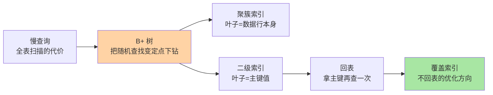
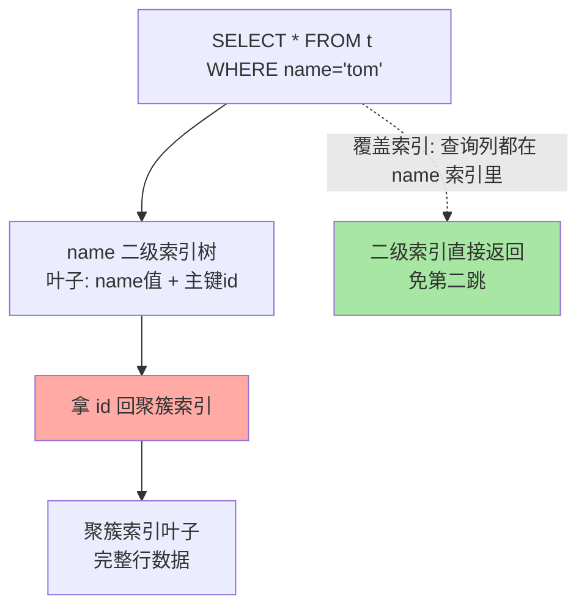

# 索引基础：为什么是 B+ 树与回表的代价

> 一句话：索引用「写入变慢 + 占空间」的代价，把查询从全表扫描换成 B+ 树定点查找——理解页、聚簇与回表，索引的一切现象都有了源头。

## 🎯 本文核心

**核心一句话：InnoDB 索引的本质是「B+ 树组织的数据页」——聚簇索引的叶子就是数据本身，二级索引的叶子存主键、查完还要回聚簇索引再查一次（回表），索引优化的核心就是消灭不必要的回表与扫描。**

组织主线：

本篇四个概念（选型 → 聚簇/二级 → 回表 → 失效场景）全部挂在这条「查找路径」上：路径越短，查询越快。

## 一句话摘要

没有索引时，查询只能全表扫描：把所有数据页读一遍逐行判断。索引是把指定列排序组织成 B+ 树的额外数据结构，用「写入维护索引 + 占用存储」的代价换「查找从 O(n) 降到树高次 I/O」。InnoDB 主键索引（聚簇索引）的叶子节点就是行数据本身；二级索引叶子存主键值，命中后需拿主键回聚簇索引再查完整行——这一步叫回表。理解这条查找路径，最左前缀、覆盖索引、索引失效等实践规则都能自己推导出来。

## 一、为什么需要索引：一次全表扫描的账

典型场景：500 万行的订单表，`WHERE user_id = 123` 无索引时要把全表数据页读一遍——按每页 16KB、内存未命中计，几十万次 I/O；有 user_id 索引时，B+ 树从根到叶 3-4 次页访问定位。差的是几个数量级，这就是索引存在的理由。

数据结构为什么收敛到 B+ 树，是排除法的结果（选型逻辑本身就是一次权衡推演）：

| 候选结构 | 为什么不行 / 行 |
|---|---|
| 哈希表 | 等值快，但**不支持范围查询与排序**——`WHERE age > 20` 无解 |
| 二叉/红黑树 | 树太高：千万数据 20+ 层 = 20+ 次磁盘 I/O |
| B 树 | 数据存所有节点，单节点容纳的路由条目少，扇出小树就高 |
| **B+ 树** | 数据只在叶子、内节点纯路由 → 扇出大、树矮（千万级 3-4 层）；叶子间链表 → 范围扫描顺链走 |

树矮的直接收益：每层一次页读取，树高就是 I/O 次数——「3-4 次定位千万数据」全部建立在「把树压扁」这个底层设计上。

## 5W 速记卡

| 维度 | 一句话 |
|---|---|
| What | 排序组织的额外结构（B+ 树），把扫描变定点查找 |
| Why | 全表扫描 I/O 代价不可接受；空间换时间的经典权衡 |
| When | WHERE/ORDER BY/JOIN 高频条件列建索引，低频小表不建 |
| Where | 聚簇索引=数据本身；二级索引与数据分开存 |
| How | 命中二级索引 → 拿主键 → 回聚簇索引取整行（或覆盖索引免回表） |

## 二、核心机制：聚簇、二级与回表

### 2.1 索引即数据

InnoDB 是聚簇索引组织表：主键 B+ 树的**叶子页就是行数据本身**（存储引擎篇讲过页结构，表即索引）。由此推论：主键要短（每个二级索引的叶子都要存一份主键值）、主键要有序（随机主键如 UUID 导致页分裂，写入性能恶化）。

### 2.2 回表：二级索引的第二跳

`SELECT *` 走二级索引必回表；若查询的列全部在索引里（如 `SELECT id, name`），索引自身已足够回答——**覆盖索引**，EXPLAIN 里表现为 `Using index`。索引优化的第一直觉就是「能不能让高频查询被覆盖」。

### 2.3 失效场景的统一解释

失效规则不用背，从树的组织方式推导：联合索引 (a, b, c) 先按 a 排、a 相同再按 b 排——**跳过 a 直接查 b，b 在整棵树里是乱序的，自然用不上**（最左前缀）。同理：对列做函数运算改变了参与排序的原始值；字符串列与数字比较发生隐式转换等价于套了函数——「树是按原值排序的，任何改值的操作都让有序性失效」。

> 💡 **实战提示**
> - 区分度优先：` gender ` 这类只有两三个值的列单独建索引收益极低，选择性 = 不同值数 / 总行数，越接近 1 越值得建
> - `EXPLAIN` 先看 `type`（ALL 全扫 / ref / range）与 `Extra`（Using index = 覆盖，Using filesort = 排序没吃到索引）——专题层篇 2 有完整解读手册
> - 联合索引把等值列放前、范围列放后：范围之后的列吃不到索引，这是最左前缀的直接推论
> - 单表索引不是越多：每个索引都是一棵要维护的 B+ 树，写入是 N 倍代价，冗余索引按期清理

## 三、与「缓存」的区别

索引和缓存都在加速读，但层次不同：索引改变**查找路径**（从扫全表到树下钻），缓存改变**数据位置**（磁盘到内存）。放在架构全景里看，索引是引擎内部的定位机制，缓存是内存与磁盘两层介质间的协同，上下游关系清晰：Buffer Pool 缓存的是页，索引加速的是页内定位——两者正交，叠加生效。慢查询先看 EXPLAIN（路径问题）再看命中率（位置问题），顺序别反。

## 四、典型使用场景

- **高频等值查找**：user_id、order_no 建索引，业务查询单据的标配
- **范围 + 排序**：`WHERE created_at > ? ORDER BY created_at`——叶子链表天然有序，EXPLAIN 无 filesort
- **联合索引覆盖列表页**：`idx(status, created_at)` 覆盖「按状态过滤按时间倒序」的列表查询
- **唯一业务键**：唯一索引兼任防重约束，`INSERT` 冲突即业务重复

## 五、误区与代价

- ❌ **「加了索引就一定快」**：区分度低/不满足最左前缀/统计信息过期，优化器可能直接放弃——「有索引」和「用上索引」是两回事
- ❌ **「主键用 UUID 方便」**：随机主键引发页分裂与缓存碎片，聚簇索引体系下写入代价被放大；分布式 ID 场景选趋势有序的方案（分库分表篇展开）
- ❌ **「每个 WHERE 列都建一个索引」**：N 个单列索引多数场景只用到一棵，不如一个覆盖高频查询的联合索引
- ❌ **「TEXT 也建个完整索引」**：超长列索引占空间且比较慢，用前缀索引或哈希列替代

## 六、你们可能会问

**Q1：为什么不用跳表？Redis 的 ZSet 就是跳表。**
跳表靠随机层高实现平衡，天然在内存里；数据库数据在磁盘，代价单位是「页 I/O」，需要的是「一层尽多的路由」——B+ 树扇出上百、树高 3-4 的形态正为页而生。内存数据库（如部分 NewSQL 的内存索引）确实用跳表，介质决定结构。

**Q2：删了大量数据后索引会变小吗？**
和表数据一样：页内空间标记复用，B+ 树不自动收缩，可能出现「稀疏索引树」——大量删除后重建索引是常规维护动作。

**Q3：`LIKE '%xx'` 一定全表扫描吗？**
前缀模糊（`LIKE 'xx%'`）可以走索引——本质是范围条件；后缀/中缀模糊破坏有序性，走不了。必须中缀检索时用全文索引或搜索引擎，不是硬灌 MySQL。

## 七、什么时候用 / 不用

- ✅ 高频查询条件、JOIN 关联列、排序列建索引——先看查询再建索引
- ✅ 用联合索引收敛多个单列索引，按「等值在前、范围在后」排列
- ❌ 小表（几百行）不建：全扫更快，还省写入维护
- ❌ 写多读少的表克制建索引：每个索引都是写入要维护的一棵树

## 八、开放问题

- 硬件演进（NVMe、持久内存）把随机 I/O 代价拉低后，「B+ 树页组织」的霸主地位在 OLTP 场景仍稳固，但 LSM-Tree 体系（写优化）在日志型负载的分流已持续多年——按负载选存储引擎形态是长期趋势
- 自适应索引（学习型索引）离生产还有多远：用模型替代树结构的研究很多，工程上「可解释、可预测延迟」仍是硬门槛

## 九、自测三问

1. B+ 树对比 B 树的核心改进是什么？分别换来什么收益？
2. 什么是回表？覆盖索引为什么能免掉它？
3. 最左前缀、函数运算、隐式转换三类失效，共同的根本原因是什么？

下一篇讲「事务与隔离级别」：索引解决「找得快」，事务解决「并发下不出错」。

## 🎯 核心带走

- **核心一句话**：索引 = B+ 树组织的页，把扫描变下钻；聚簇叶子是数据，二级叶子是主键，回表是第二跳
- **主线**：全表扫描代价 → B+ 树选型 → 聚簇/二级 → 回表 → 覆盖索引
- **哪里会坏**：失效三兄弟（最左前缀/函数/隐式转换）、随机主键页分裂、低区分度索引白建
- **边界**：本篇是入门骨架；失效排查手册、EXPLAIN 解读、优化器原理在专题层「索引优化深度」逐一展开

## 📌 数据与事实声明

- 写于 2026-09-10；B+ 树 3-4 层容纳千万级数据为按页扇出的推算（业内认知）；InnoDB 聚簇组织为官方文档口径
- 免责：参数与行为细节随版本演进可能调整，以官方文档为准

## 📚 参考资料

| 类型 | 标题 | 来源 |
|---|---|---|
| 官方文档 | InnoDB Index Architecture (Clustered / Secondary) | dev.mysql.com/doc |
| 经典书 | 《高性能 MySQL》索引章 | O'Reilly（公开出版物） |
| 系列导航 | MySQL 系列目录 | `docs/data/mysql/index.md` |
