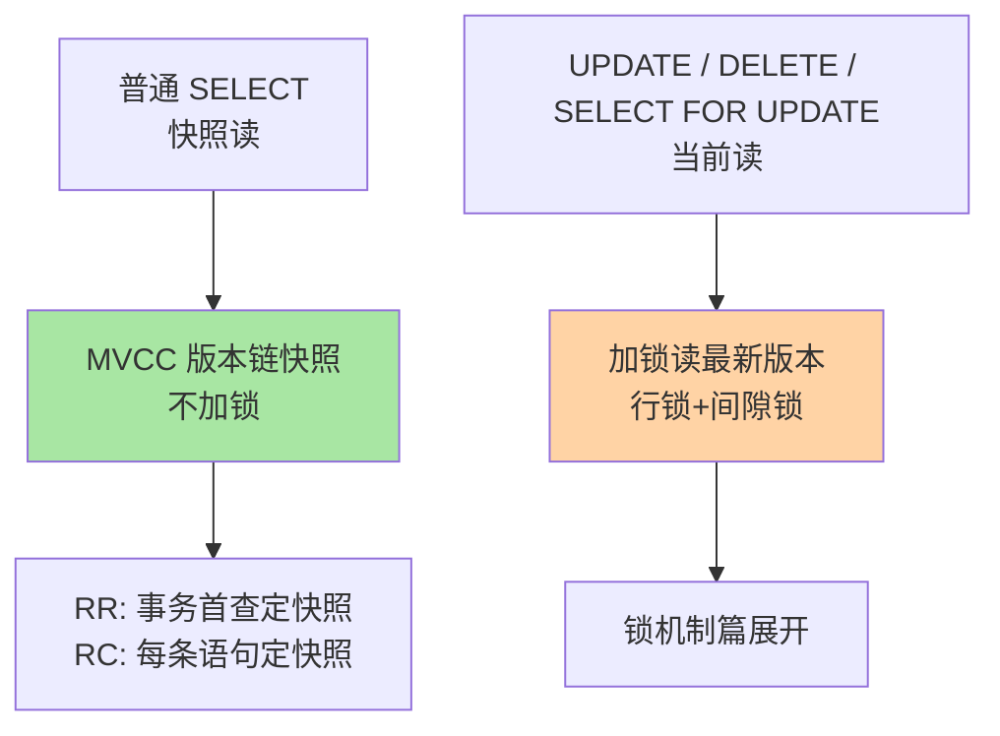

# 事务与隔离级别：并发正确性的第一课

> 一句话：事务把多条 SQL 打包成「要么全成要么全不算」的原子单元；隔离级别则是「并发正确性换性能」的连续光谱——InnoDB 默认停在可重复读档。

## 🎯 本文核心

**核心一句话：事务的 ACID 四性分别由不同机制兜底（原子性=undo、持久性=redo、隔离性=MVCC+锁），隔离级别是隔离性这台旋钮的四个刻度——每个刻度放行一类并发异常、省一类加锁开销。**

组织主线：

三个并发问题是什么、四档各挡住什么、InnoDB 靠什么挡——本篇所有内容都挂在这条「异常 → 刻度 → 实现」的因果链上。

## 一句话摘要

事务（Transaction）保证一组操作要么全部生效、要么全部不生效。ACID 四性不是抽象口号：**原子性**靠 undo log 回滚未完成的改动，**持久性**靠 redo log 保证提交不丢，**隔离性**靠 MVCC 快照与锁配合，**一致性**是前三者的业务结果。并发事务会产生三类读异常（脏读/不可重复读/幻读），SQL 标准用四个隔离级别划分「容忍哪些异常」：读未提交 → 读已提交 → 可重复读 → 串行化，越严越正确也越慢。InnoDB 默认可重复读（RR），靠 MVCC 让「快照读」不加锁就做到级别内的正确。

## 一、为什么需要事务：转账少一半的教训

典型场景：A 转 B 100 元，两条 SQL——先扣 A、再加 B。扣完 A 的瞬间连接断了：A 少 100，B 没收到，钱凭空消失。事务的意义就是让这两条 SQL 绑定命运：任一条失败，整体回滚，就像从没执行过。

更进一步是并发下的正确性：两个事务同时读写同一批行时，会看到「别的事务干到一半的结果」。三类经典异常：

| 异常 | 现象 | 出现场景 |
|---|---|---|
| 脏读 | 读到别人**未提交**的数据 | 对方回滚了，你基于假数据做了决策 |
| 不可重复读 | 同一事务内两次读同一行，值变了（别人 update 提交了） | 对账逻辑两次读结果不一致 |
| 幻读 | 同一事务内两次同条件查询，行数变了（别人 insert 提交了） | 统计与明细对不上 |

## 5W 速记卡

| 维度 | 一句话 |
|---|---|
| What | 一组绑定为原子的 SQL；隔离级别=并发异常的容忍刻度 |
| Why | 部分失败与并发交叉读都会造成业务性资损 |
| When | 涉及资金/库存/状态流转的写操作必须收进事务 |
| Where | InnoDB 引擎层：undo/redo/MVCC/锁协同实现 |
| How | `BEGIN ... COMMIT/ROLLBACK`；级别由 `transaction_isolation` 设定 |

## 二、核心机制：四档刻度与实现分工

### 2.1 四个隔离级别

| 级别 | 脏读 | 不可重复读 | 幻读 | 代价 |
|---|---|---|---|---|
| 读未提交 RU | 可能 | 可能 | 可能 | 最小 |
| 读已提交 RC | 阻止 | 可能 | 可能 | 每条语句生成快照 |
| 可重复读 RR（默认） | 阻止 | 阻止 | 基本阻止* | 事务首查生成快照 + 间隙锁 |
| 串行化 | 阻止 | 阻止 | 阻止 | 读也加锁，并发最差 |

\* InnoDB 在 RR 下通过 MVCC 挡住快照读的幻读、间隙锁挡住当前读的幻读，已比 SQL 标准的 RR 更强——但极端场景仍建议显式加锁，见 MVCC 篇。

**InnoDB 为什么默认 RR 而不是 RC**：历史演进原因——早期语句级复制（statement-based binlog）下 RC 会导致主从执行顺序不一致，RR 的加锁读语义与之配套；这套历史约束延续成默认值。今天已默认行级复制，很多互联网公司线上实际改用 RC（加锁范围更小、并发更好）——「默认值是历史产物，选型要回到业务」就是这个演进的注脚。

### 2.2 实现分工：快照读与当前读

同一个 RR 级别内，普通 SELECT 靠 MVCC「拍快照」，带锁语句读「最新版本」——两者看到的数据可能不同，这是理解 RR 下一切「灵异现象」的钥匙，MVCC 篇与锁篇分别展开。

> 💡 **实战提示**
> - 事务要短：长事务持锁时间长、undo 链拉长、历史版本无法清理（purge 滞后），是并发恶化的常见根源
> - `SET autocommit=0` 忘提交 = 无意长事务，监控 `information_schema.INNODB_TRX` 里运行时间最长的事务
> - RC 与 RR 的选择：多数互联网场景 RC 足够且并发更好；需要事务内多次读严格一致（对账/报表）用 RR
> - 避免「读-算-写」三段式依赖事务隔离兜底，改用原子更新（`SET x = x - 1`）或乐观锁版本号

## 三、与「分布式事务」的区别

本篇的隔离级别解决**单库内**并发正确性；跨库跨服务的操作原子性（下单扣库存跨两个库）是分布式事务问题——两阶段提交、TCC、消息最终一致，属于架构域另一个系列的机制。共同哲学一致：都是「正确性与性能的权衡」，但实现层次完全不同，别混为一谈。

## 四、典型使用场景

- **资金操作**：扣款/入账/清分——事务 + 高隔离是硬要求，宁可牺牲并发
- **库存扣减**：原子更新或 `SELECT FOR UPDATE`，防止超卖
- **批量导入**：大事务拆小批提交——单条提交太慢，一整个大事务 undo 膨胀
- **报表对账**：RR 下开事务拿一致快照，算到一半数据变了也不影响

## 五、误区与代价

- ❌ **「RR 能挡住一切幻读」**：快照读挡住了，当前读的极端交叉场景仍需显式锁——把「基本阻止」当「绝对阻止」是事故思维源头
- ❌ **「隔离级别越高越好」**：串行化让读也加锁，多数业务用不上；级别是取舍不是军备
- ❌ **「事务里可以慢慢算」**：事务内调外部接口（发短信/调支付）是长事务典型成因——外部调用移出事务，事务只包数据库操作
- ❌ **「autocommit=1 就没有事务」**：每条语句都是隐式小事务；多条语句的业务原子性必须显式 BEGIN/COMMIT

## 六、你们可能会问

**Q1：ACID 里一致性到底谁实现？**
A/I/D 是引擎提供的机制，C 是业务结果：约束（唯一键/外键/检查）+ 应用层逻辑在机制之上才达成一致。说「数据库保证一致性」时，指的是机制不破坏它，不是自动产出它。

**Q2：RC 和 RR 实现上差别就一个快照时机？**
快照生成时机是一个差别（语句级 vs 事务级）；另一大差别是当前读加锁范围——RC 多数场景没有间隙锁，锁冲突面小。这就是 RC 并发更好的底层原因。

**Q3：Spring 的 `@Transactional` 和数据库事务什么关系？**
注解是「批量打包」的编程封装：进入方法开事务、正常返回提交、异常按回滚策略回滚。底层仍是数据库事务；传播行为（REQUIRES_NEW 等）管理的是多个事务边界的嵌套规则。

## 七、什么时候用 / 不用

- ✅ 多条写语句有业务原子性依赖 → 显式事务，越短越好
- ✅ 互联网高并发读写 → 评估 RC；资金/对账类 → RR 起步
- ❌ 不要把外部调用包进事务：事务边界 = 数据库操作边界
- ❌ 不要用「先查后写」代替原子操作：隔离级别救不了应用层的竞态设计

## 八、开放问题

- 分布式数据库（NewSQL）里跨节点事务的隔离实现（Percolator 模型、混合逻辑时钟）与单机 MVCC 原理同源但复杂度陡增——「隔离级别」概念在分布式语境下如何演进，是长期值得跟踪的方向
- 应用侧「 Saga / 最终一致」在蚕食强隔离的使用面：业务能容忍短暂不一致时，用补偿换并发是越来越主流的取舍

## 九、自测三问

1. ACID 四性分别靠什么机制实现？
2. 三类并发异常的定义是什么？四档级别各挡住哪些？
3. 快照读与当前读的区别是什么？为什么 RR 下两者可能看到不同的数据？

下一篇讲「MVCC 机制」：把「快照」这两个字拆开——版本链与 ReadView 怎么配合出「不加锁的一致性读」。

## 🎯 核心带走

- **核心一句话**：ACID 靠 undo/redo/MVCC/锁分工实现；隔离级别是异常容忍刻度，InnoDB 默认 RR 靠 MVCC 不加锁保一致性读
- **主线**：并发异常 → 四档刻度 → 快照读（MVCC）/当前读（锁）→ 默认值的历史演变
- **哪里会坏**：长事务（undo 膨胀 + 锁滞留）、误信 RR 绝对防幻读、事务内调外部接口
- **边界**：本篇给「刻度与分工」的骨架；版本链/ReadView 细节在 MVCC 篇，加锁规则在锁系列展开

## 📌 数据与事实声明

- 写于 2026-09-10；InnoDB 默认隔离级别 RR、RC/RR 快照时机差异、statement 复制与 RR 的历史关联——均为官方文档与社区共识口径（公开资料）
- 「很多公司线上改用 RC」为业内认知（各厂技术分享），非统计结论
- 免责：参数名（如 `transaction_isolation`）随版本演进有更名调整，以官方文档为准

## 📚 参考资料

| 类型 | 标题 | 来源 |
|---|---|---|
| 官方文档 | InnoDB Transaction Model / Isolation Levels | dev.mysql.com/doc |
| 经典书 | 《高性能 MySQL》事务章 | O'Reilly（公开出版物） |
| 系列导航 | MySQL 系列目录 | `docs/data/mysql/index.md` |
