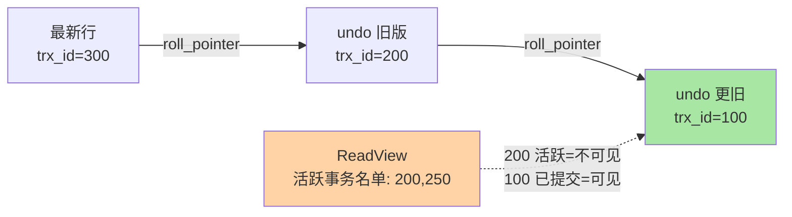

# MVCC 机制：不加锁的一致性读是怎么来的

> 一句话：每行数据带一条 undo 版本链，读事务凭 ReadView 快照沿链找「自己该看的版本」——读写互不阻塞的一致性，就是这么造出来的。

## 🎯 本文核心

**核心一句话：MVCC = 行级多版本（undo 版本链）+ 读视图（ReadView）可见性判断——写的人在改最新版，读的人沿链找自己快照该看的旧版，读写从此互不阻塞。**

组织主线：

从「行里藏了什么」到「哪个版本对我可见」，四个概念是一条装配线上的四道工序。

## 一句话摘要

MVCC（多版本并发控制）是 InnoDB 实现「一致性读」的底层机制：每行记录额外藏三个字段——最后修改它的事务 ID（trx_id）、指向上一个版本的回滚指针（roll_pointer），加一个行锁标记位；每次修改都把旧版本存进 undo log，版本之间用 roll_pointer 串成链。事务读数据时先生成一份 ReadView（当时活跃事务的名单），拿着名单沿版本链往回找「对我可见」的版本。普通 SELECT 走这套快照读不加任何锁；改数据的 UPDATE/DELETE 才是加锁的当前读——读写分离的并发能力由此而来。

## 一、为什么需要 MVCC：读写互不阻塞的诉求

没有多版本的数据库，读和写只能二选一：要么读加共享锁、写加排他锁（读阻塞写、写阻塞读，串行化味道），要么放弃一致性裸奔。真实业务两头都要：报表在慢慢算，订单在飞快写，谁也别等谁。

MVCC 的思路是把「同一时刻只有一个版本」的假设打破——**保留多个历史版本，让不同的事务各自看各自的时间断面**。这是「用空间（undo 存旧版本）换并发（读写不互斥）」的取舍，也是 InnoDB 读写比 MyISAM 高出一个量级的底层原因之一（存储引擎篇对比过两者）。

## 5W 速记卡

| 维度 | 一句话 |
|---|---|
| What | 行级多版本 + ReadView 可见性判断，实现不加锁的一致性读 |
| Why | 读写互阻塞撑不住并发；旧版本是免阻塞一致性的原料 |
| When | 一切普通 SELECT（快照读）都在用它，无感但无处不在 |
| Where | 行隐藏列 + undo log 版本链（引擎层） |
| How | 生成 ReadView → 沿链找第一个可见版本 → 返回 |

## 二、核心机制：版本链与 ReadView

### 2.1 版本链：行的时间机器

一行数据被改 N 次，就有 N 个历史版本躺在 undo log 里，最新版在聚簇索引行内。沿 roll_pointer 一路回溯，就是这行数据的「时间机器」：

### 2.2 ReadView：可见性裁判

ReadView 是「生成那一刻的事务全景」：已提交的最大事务 ID、生成时还活跃（未提交）的事务名单、下一个待分配 ID。判断某版本可见性的直觉规则：**改这版的事务在我拍快照前已提交 → 可见；还在跑或在我之后才开 → 不可见，沿链往前找**。RR 与 RC 的全部差别就一条：RR 在事务第一次查询时生成一次 ReadView 用到底；RC 每条语句都重新生成——所以 RC 能看到别人新提交的值（不可重复读），RR 看不到。

### 2.3 与锁的分工

事务与隔离级别篇给过分工图：普通 SELECT = 快照读（MVCC 管），UPDATE/DELETE/SELECT FOR UPDATE = 当前读（锁管，读最新版本并加锁）。MVCC 让「读读、读写」并发，锁兜底「写写」与当前读的冲突——两者是搭档不是替代，锁系列篇展开加锁规则。

> 💡 **实战提示**
> - 长事务是 MVCC 的大敌：它的 ReadView 一直存在，undo 旧版本全都不能清理（purge 滞后），undo 表空间膨胀、所有沿链回溯变慢
> - `SHOW ENGINE INNODB STATUS` 看 history list length：数值持续走高 = 有旧快照没放，先查长事务
> - 同一事务内既要快照读又要当前读时，两者结果可能不同——这不是 bug，是机制的边界，业务逻辑别混用两种读做一致性依赖
> - 大批量导出用「一致性快照」：`START TRANSACTION WITH CONSISTENT SNAPSHOT` 一次定版，读到的是同一时刻断面

## 三、与「Redis 持久化副本」的区别

都在讲「旧版本」，层次完全不同：MVCC 的版本链是**并发控制机制**，旧版本只为判断可见性、提交后由 purge 回收；Redis RDB/AOF 的副本是**持久化与恢复手段**。同名「多版本」，一个是内存里的事务语义，一个是磁盘上的数据安全，面试与架构讨论里别混。

## 四、典型使用场景

- **高并发读**：商品详情、行情查询——快照读不加锁，读再多也不挡写
- **备份与导出**：mysqldump 的 `--single-transaction` 就是利用 MVCC 拿一致性快照，不锁表导全库（InnoDB 专属福利）
- **长报表事务**：RR 下开事务慢慢算，底层新数据照常写，报表口径不漂移
- **乐观并发为主的应用**：写冲突少时，MVCC + 原子更新基本不碰显式锁

## 五、误区与代价

- ❌ **「MVCC 取代了锁」**：写写冲突、当前读全靠锁；以为没有锁就不用关心锁等待，遇事故会懵
- ❌ **「事务开久一点没关系」**：undo 膨胀 + purge 滞后 + 回溯变慢，代价在全局而不只是这个事务
- ❌ **「RC 一定更快」**：快照更频繁有成本，但锁范围小收益更大——多数场景成立，高冲突场景要实测
- ❌ **「看到旧数据是坏了」**：快照读按 ReadView 该旧就旧，先确认隔离级别再怀疑数据

## 六、你们可能会问

**Q1：undo log 既是回滚日志又是版本链，怎么兼顾两个职责？**
回滚是事务结束前的短期职责（活跃事务回滚沿链逆向改回）；版本链是并发读的长期职责（其他事务的 ReadView 还引用着旧版本）。purge 线程等「没有任何 ReadView 需要」才删旧版本——一个存储、两个消费者、生命周期不同。

**Q2：为什么 RR 只在第一次查询生成 ReadView？**
语义选择：RR 要的是「事务内重复读结果一致」，以首查为断面即可；若以 BEGIN 为断面，只读不查的长事务会白白延长快照持有时间。机制细节与代价的完整推导在特性层「事务与MVCC 系列」展开。

**Q3：快照读读到的「旧版本」存在哪，会不会丢？**
存在 undo 表空间（内存+磁盘）。已提交事务的旧版本在无人引用后由 purge 线程异步删除——除非有长事务拽着，否则不会堆积。

## 七、什么时候用 / 不用

- ✅ 默认信任它：普通查询无需任何配置，快照读自动生效
- ✅ 一致性导出/备份用它替代锁表方案
- ❌ 不用它做业务逻辑依据：「先快照读判断、再当前读更新」的两段判断会被并发打穿——用原子更新或显式锁
- ❌ 不纵容长事务：任何机制都救不了「快照不放」的资源代价

## 八、开放问题

- 分布式数据库的多版本管理（时间戳排序、混合逻辑时钟）与单机 undo 链原理同源，但跨节点可见性判定复杂得多——单机 MVCC 的直觉是理解 NewSQL 事务的入口，两边怎么统一还在演进
- 硬件越快，「多版本换并发」的空间代价是否仍值得？方向上并发收益始终在，形式可能在变

## 九、自测三问

1. 行隐藏三字段是什么？版本链怎么串起来？
2. ReadView 判断可见性的直觉规则是什么？RR 与 RC 差在哪个时机？
3. 为什么说长事务是 MVCC 的大敌？现象是什么？

下一篇讲「锁机制」：MVCC 管不完的写写冲突与当前读，交给锁体系兜底。

## 🎯 核心带走

- **核心一句话**：MVCC = undo 版本链 + ReadView 可见性判断，让快照读不加锁、读写不互阻塞
- **主线**：行隐藏字段 → 版本链 → ReadView → RC/RR 时机之差 → 与锁的分工
- **哪里会坏**：长事务（undo 膨胀）、快照读与当前读混用做判断、误把旧读当故障
- **边界**：本篇是原理直觉；ReadView 四字段算法与源码路径在特性层「事务与MVCC 系列」正式展开

## 📌 数据与事实声明

- 写于 2026-09-10；行隐藏列、undo 版本链、ReadView 机制为 InnoDB 官方文档与源码公开口径
- history list length 经验阈值为业内运维惯例（业内认知）
- 免责：实现细节随版本演进可能调整，以官方文档与源码为准

## 📚 参考资料

| 类型 | 标题 | 来源 |
|---|---|---|
| 官方文档 | InnoDB Multi-Versioning / undo Logs | dev.mysql.com/doc |
| 官方源码 | storage/innobase/read/ReadView | github.com/mysql/mysql-server |
| 系列导航 | MySQL 系列目录 | `docs/data/mysql/index.md` |
