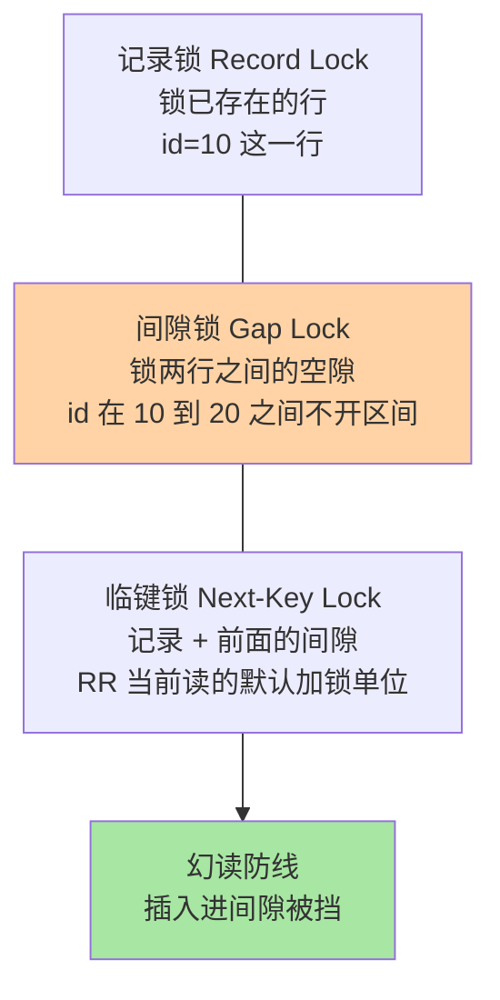

# 锁机制：从分类地图到死锁处理

> 一句话：锁是 MVCC 管不到的地方（写写冲突、当前读、结构变更）的并发兜底——按锁的对象分三层地图，行层再分三种粒度，死锁靠检测回滚兜最后一线。

## 🎯 本文核心

**核心一句话：MySQL 锁体系按「锁什么」分三层（全局/表级/行级），行级里再按「锁哪段」分三种（记录锁/间隙锁/临键锁）；死锁是加锁顺序冲突的必然产物，InnoDB 靠主动检测与回滚代价小的一方收场。**

组织主线：

每个锁名都能挂到这条链上：先知道「锁哪一层」，再知道「锁哪一段」，最后知道「锁打架了谁说了算」。

## 一句话摘要

MySQL 的锁按锁定对象从大到小分三层：**全局锁**（整库只读，用于逻辑备份的旧方案）、**表级锁**（表锁 + 元数据锁 MDL + 意向锁）、**行级锁**（InnoDB 专属，粒度最小并发最好）。行级锁不是只锁「一行」：记录锁锁已存在的行，间隙锁锁两行之间的「空隙」，两者的组合叫临键锁——RR 级别防幻读的当前读方案就靠它。两个事务以相反顺序加锁就会死锁，InnoDB 默认开启等待图检测，主动回滚代价小的事务打破僵局。理解「锁哪段」比背锁名重要——所有加锁规则的争议都在「段」上。

## 一、为什么需要锁：MVCC 的边界

MVCC 篇说过分工：快照读交给版本链，但**写写冲突和当前读必须互斥**——两个事务同时改同一行，数据库必须保证一个改完另一个才能改，否则数据损坏。锁就是保证这种互斥的底层原语：不兼容的锁不能同时持有，后来的事务等待。

锁粒度是并发的第一权衡：锁全库 → 并发为零；锁一行 → 并发最大但管理开销大（上千行的锁要维护上千份）。MySQL 三层地图正是这个权衡的落地——InnoDB 淘汰表锁走上行锁路线，是它赢得 OLTP 的关键演进之一。

## 5W 速记卡

| 维度 | 一句话 |
|---|---|
| What | 保证互斥访问的底层原语；三层对象 × 行级三段粒度 |
| Why | 写写冲突与当前读无法靠多版本解决 |
| When | UPDATE/DELETE、SELECT FOR UPDATE、DDL、备份时 |
| Where | Server 层管表级（MDL），InnoDB 管行级 |
| How | 加锁按索引定位；冲突则等待；成环则死锁检测打破 |

## 二、核心机制：三层地图与行级三段

### 2.1 全局锁与表级锁

- **全局锁**：`FLUSH TABLES WITH READ LOCK` 让整库只读——逻辑备份的旧方案，主库上执行业务全停；InnoDB 时代被 MVCC 一致性快照备份取代
- **MDL 元数据锁**：访问表自动加 MDL 读锁，改表结构加 MDL 写锁——慢查询拖着 MDL 读锁不放，DDL 拿不到写锁，后续所有查询排队，一锁锁全表，这是「一条慢 SQL 阻塞整张表」的常见事故链
- **意向锁**：事务给某行加行锁前，先给表挂「意向」标记，让表级操作（如 DDL）不用逐行检查就能快速判断有无行锁存在——纯粹为提升表/行冲突判断效率而生的辅助机制

### 2.2 行级三段：记录锁、间隙锁、临键锁

直觉：记录锁防「改同一行」，间隙锁防「往空隙里插新行」（幻读的来源是插入）。RC 级别基本不用间隙锁、只锁记录——这是 RC 并发更好的第二个原因（事务篇提过）；RR 当前读默认临键锁，锁得更多换来更强的一致性。

> 💡 **实战提示**
> - 行锁「锁在索引上」：UPDATE 不走索引时退化成扫全表逐行加锁，效果近似锁全表——线上锁风暴的第一嫌疑是「更新没走索引」
> - 死锁日志用 `SHOW ENGINE INNODB STATUS` 的 LATEST DETECTED DEADLOCK 看，两边各持有什么、在等什么一目了然
> - `innodb_lock_wait_timeout`（默认 50 秒）管锁等待放弃，死锁检测管成环秒断——两者是不同机制，超时长短按业务容忍度调
> - 减少死锁的编码习惯：多行更新按固定顺序（如按主键升序）、事务要短、大批量更新拆小批

## 三、与「乐观锁」的区别

数据库锁是**悲观**路线：先拿锁再操作，冲突由数据库串行化。乐观锁（版本号 `UPDATE ... SET v=v+1 WHERE v=旧v`）不加锁：更新时校验版本，冲突了应用层重试。读多写少用乐观锁省锁开销，写冲突高时重试风暴反而不如悲观锁——取舍分界在冲突率。应用层的乐观锁与数据库锁是互补关系，同一系统常混用。

## 四、典型使用场景

- **秒杀扣库存**：`UPDATE stock SET n=n-1 WHERE id=1 AND n>0` 单行记录锁，冲突激烈但行锁持有时间极短
- **防重复处理**：`SELECT ... FOR UPDATE` 锁定待处理行，多实例不重复消费
- **线上 DDL**：低峰期执行 + `ALTER` 走 online DDL，本质是绕开 MDL 长持锁风险
- **逻辑备份**：InnoDB 用 `--single-transaction` 快照，不再用全局锁

## 五、误区与代价

- ❌ **「行锁一定只锁一行」**：RR 当前读的临键锁连间隙一起锁，锁住的是「一段」；以为主键等值才安全、范围更新会扩大加锁面
- ❌ **「死锁是数据库故障」**：死锁是并发设计的一部分，检测回滚是正常机制；频繁死锁才说明加锁顺序设计有问题
- ❌ **「锁等待 50 秒能容忍」**：默认超时是兜底不是业务参数，高并发场景长等待会雪崩放大（连接堆积），要按 SLA 调小
- ❌ **「加索引就完了」**：锁依赖索引，索引设计错误（失效/区分度低）直接放大锁范围——索引篇与锁篇在事故层面是连通的

## 六、你们可能会问

**Q1：两个事务死锁了，为什么回滚「代价小」的而不是「后来的」？**
打破僵局的目标是损失最小化：InnoDB 选择 undo 量小（改动少）的事务回滚，另一个继续。语义上被回滚方收到死锁错误，应用按可重试处理即可。

**Q2：间隙锁在 RC 下真没有吗？**
基本没有——RC 当前读只加记录锁；唯一例外是外键与唯一键冲突检查等少数场景仍会用间隙类锁防插入。「RC 无间隙锁」是近似正确的工程记忆，精确规则在锁系列篇 1 展开加锁规则全景。

**Q3：应用报「Lock wait timeout」和「Deadlock」是一回事吗？**
不是。锁等待超时 = 我等一把锁太久主动放弃（没有环）；死锁 = 双方互相等待成环，被检测器强制打破。前者查慢 SQL 与锁持有者，后者改加锁顺序——排查路径完全不同。

## 七、什么时候用 / 不用

- ✅ 当前读、扣减类更新：信任行锁，保证事务短、走索引、顺序一致
- ✅ 死锁错误按「可重试」处理：捕获异常 → 等随机小间隔 → 重试
- ❌ 不用 `SELECT FOR UPDATE` 包长逻辑：锁内只做数据操作，外部调用移出
- ❌ 不在业务高峰跑 DDL：MDL 读写互斥的放大效应足以锁全表

## 八、开放问题

- 云原生分体式架构下（计算/存储分离），锁与 MVCC 的协调逐渐下沉到分布式事务层，单机锁语义如何映射到多副本一致性，各家实现仍在演进
- 无锁化数据结构在数据库内核的应用边界：冲突极低的场景用乐观并发（如部分 NewSQL 的写冲突重试）替代加锁，悲观/乐观的混合策略在持续演化

## 九、自测三问

1. MySQL 锁体系按对象分哪三层？各自典型用途是什么？
2. 记录锁、间隙锁、临键锁分别锁「哪一段」？RR 防幻读靠哪个？
3. 死锁检测与锁等待超时是同一机制吗？分别怎么处理？

下一篇讲「日志三件套」：redo/undo/binlog 怎么分工，把「崩溃恢复」和「主从复制」两件大事撑起来。

## 🎯 核心带走

- **核心一句话**：锁兜住 MVCC 管不到的互斥——三层对象（全局/表/行）× 行级三段（记录/间隙/临键），死锁靠检测回滚自动化解
- **主线**：写写冲突 → 三层地图 → 行级三段 → 加锁交叉 → 检测回滚
- **哪里会坏**：更新不走索引（锁范围爆炸）、MDL 长持锁（DDL 锁全表）、加锁顺序不一致（死锁频发）
- **边界**：本篇是分类地图；每类锁的加锁规则矩阵与源码路径在特性层「深入理解锁系列」正式展开

## 📌 数据与事实声明

- 写于 2026-09-10；全局/表/行三层锁、MDL、意向锁、临键锁、死锁检测机制为官方文档口径
- `innodb_lock_wait_timeout` 默认 50 秒为官方默认值（随版本演进以官方为准）
- 免责：加锁规则在不同隔离级别与场景下有精确差异，以官方文档与锁系列篇为准

## 📚 参考资料

| 类型 | 标题 | 来源 |
|---|---|---|
| 官方文档 | InnoDB Locking / Deadlock Detection | dev.mysql.com/doc |
| 官方文档 | Metadata Locking (MDL) | dev.mysql.com/doc |
| 系列导航 | MySQL 系列目录 | `docs/data/mysql/index.md` |
