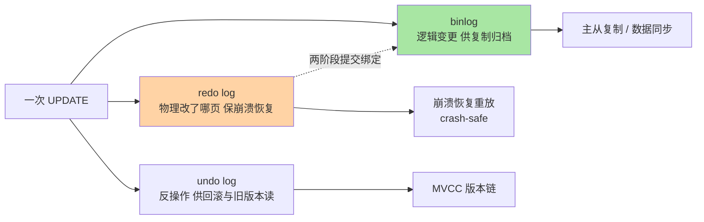
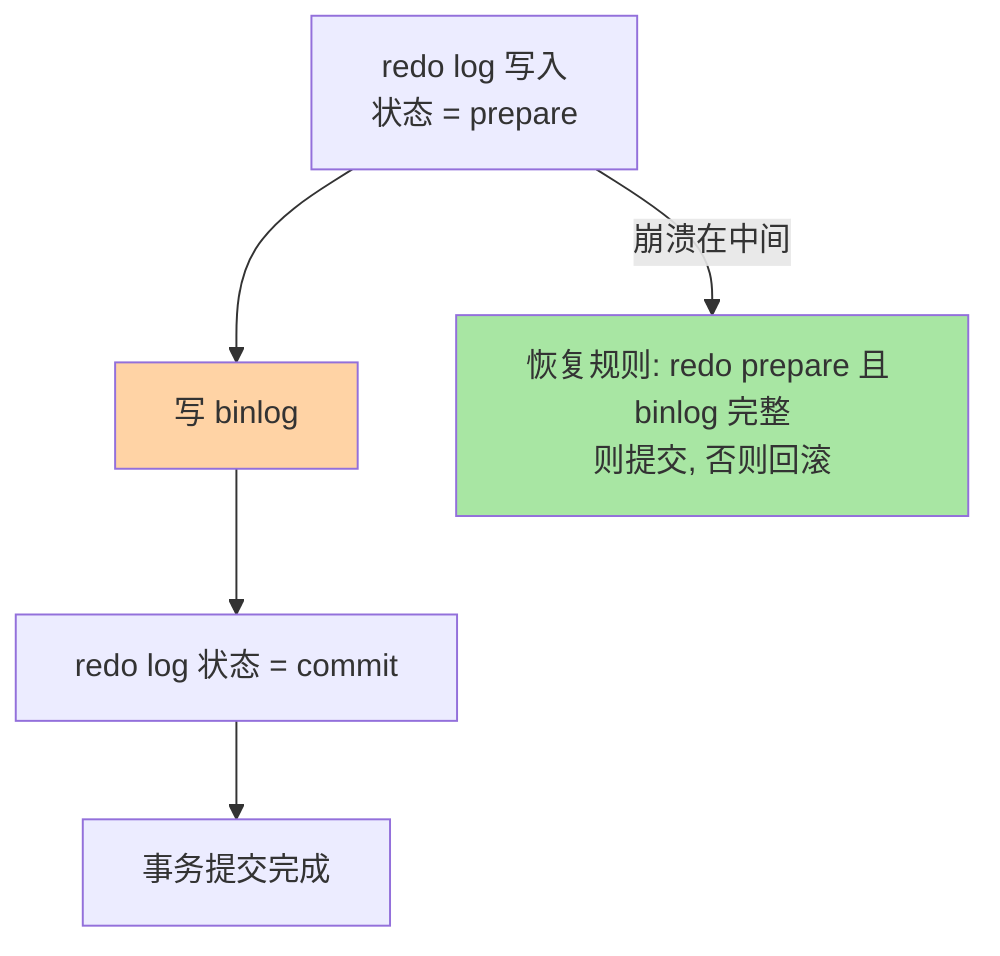

# 日志三件套：redo、undo、binlog 怎么分工

> 一句话：redo 管「崩了不丢」，undo 管「错了能退 + 旧版本可读」，binlog 管「同步给别人」——三份日志三种职责，撑起崩溃恢复与主从复制两大体系。

## 🎯 本文核心

**核心一句话：MySQL 用三份日志各管一段——redo log（InnoDB 层，物理日志，保持久性）、undo log（InnoDB 层，逻辑反操作，保原子性 + 喂 MVCC）、binlog（Server 层，逻辑日志，供复制与归档）；提交时刻的「两阶段提交」把 redo 与 binlog 绑成原子，防止主从不一致。**

组织主线：

三份日志挂一条链：改一行数据，三处各记一笔，各答一个问题——「怎么恢复」「怎么回滚」「怎么同步」。

## 一句话摘要

redo log 是 InnoDB 的物理日志：记录「某页某处改成了什么」，顺序写、体量小，把「随机写数据页」变成「顺序写日志」，是 WAL（先写日志后写数据页）原理的实现者，崩溃恢复时重放它补齐没来得及刷盘的改动。undo log 是逻辑反操作日志：改一行记一条反向操作，回滚时逆向执行，同时旧版本留在 undo 里喂 MVCC 版本链。binlog 是 Server 层的逻辑日志：记录表级变更事件，主要给从库复制和数据同步消费——它不属于某个引擎，所以 MyISAM 也有。提交时 redo 与 binlog 走两阶段提交（prepare → 写 binlog → commit），保证两者要么都有要么都没有，主从数据才不会劈叉。

## 一、为什么需要三份日志：WAL 与分工

如果每次提交都把数据页刷盘：随机 I/O、性能崩塌（存储引擎篇的 checkpoint 直觉提过这个权衡）。WAL（Write-Ahead Logging）的答案是：**提交时只保证日志落盘，数据页慢慢刷**——日志是顺序追加写，比随机页写快一个量级；崩溃后重放日志即可恢复。

为什么一份日志不够？因为三份日志回答三个不同的问题：恢复是引擎的事（redo）、回滚与旧版本是事务的事（undo）、复制是整个实例对外的能力（binlog）——归属不同（两份在 InnoDB、一份在 Server 层），格式不同（物理 vs 逻辑），消费者不同（恢复线程 / 事务与 MVCC / 从库与同步工具）。这是架构上的模块边界：引擎可插拔，但复制能力 Server 层统一提供。

## 5W 速记卡

| 维度 | 一句话 |
|---|---|
| What | redo（物理/恢复）+ undo（逻辑/回滚与多版本）+ binlog（逻辑/复制归档） |
| Why | WAL 用顺序写换随机写；三类职责归属三层，各有消费者 |
| When | 每次数据变更都产生；提交时 redo 与 binlog 两阶段绑定 |
| Where | redo/undo 在 InnoDB 表空间与 redo 文件；binlog 在 Server 层文件 |
| How | 提交 = redo prepare → 写 binlog → redo commit |

## 二、核心机制：两阶段提交与双 1 配置

### 2.1 两阶段提交：为什么必须有

没有它的事故现场：先写 redo 后写 binlog，中间崩溃——主库靠 redo 恢复了这条改动，binlog 却没有它，从库缺这一条，**主从不一致**。两阶段提交把「两个日志都写成」做成原子：

恢复规则一句话：**binlog 写成功的，redo 允许提交；binlog 没写上的，回滚**——以「对外发布的日志」为准绳，主从就劈不了叉。

### 2.2 双 1 配置：安全与性能的旋钮

`innodb_flush_log_at_trx_commit=1`（redo 每次提交刷盘）+ `sync_binlog=1`（binlog 每次提交刷盘）合称「双 1」，是资金类业务的标配。代价是每次提交两次刷盘——组提交（group commit）把并发事务的刷盘合并成一批，摊薄代价。调低两者可换性能但崩溃可能丢事务，这是数据安全与吞吐最经典的权衡之一。

> 💡 **实战提示**
> - binlog 三种格式演进：statement（记 SQL，体积小但不确定函数有坑）→ row（记行变更，体积大但确定）→ mixed（自动选）；如今 row 是事实默认，主从与同步工具都按 row 语义设计
> - redo 循环写、binlog 追加写：redo 写满会阻塞业务强制刷脏页（线上「刷脏抖动」的常见根因），binlog 写满则归档切换
> - 排查数据「什么时候被谁改的」：binlog 按时间倒查（row 格式能看到每一行的前后镜像），是数据恢复与审计的第一手材料
> - 误删数据恢复路径：全量备份 + 重放 binlog 到误操作前一刻（PITR），专题层备份恢复篇展开

## 三、与「Redis 的 AOF」的区别

都是「先写日志保安全」，设计取舍不同：AOF 记的是协议级写命令（逻辑），重放即恢复，语义类似 binlog 的角色；redo 记物理页改动，恢复快但绑定存储引擎。Redis 单机内存库没有「主从数据一致性协议绑定」的两阶段问题，MySQL 的 redo+binlog 双日志是「引擎可插拔 + 复制在 Server 层」这套架构催生的特殊产物——架构决定日志形态。

## 四、典型使用场景

- **资金库**：双 1 + 组提交，崩溃零丢失优先于极致吞吐
- **主从复制**：binlog 是从库拉取的数据源（复制协议与三线程在特性层展开）
- **数据同步/数仓接入**：Canal/Debezium 类工具解析 binlog 做变更捕获（CDC）
- **误操作恢复**：备份 + binlog 时间点恢复，运维最后一道防线

## 五、误区与代价

- ❌ **「日志越多越慢，能关就关」**：binlog 关掉 = 复制与 PITR 全废；redo 不是性能敌人，是「随机写换顺序写」的功臣
- ❌ **「双 1 可以随意调 0 换性能」**：非资金场景也要先算清楚「能丢多少秒数据」，这是业务决策不是 DBP 参数偏好
- ❌ **「崩溃恢复靠 binlog」**：单机恢复走 redo；binlog 是给从库和外部消费者的，职责别混
- ❌ **「undo 只用于回滚」**：它同时喂 MVCC 版本链，长事务的 undo 膨胀代价在 MVCC 篇已展开

## 六、你们可能会问

**Q1：为什么 redo 不直接做成「每个事务提交都刷数据页」？**
那就退回随机 I/O 地狱；顺序写 redo + 后台批量刷脏页，用日志的顺序性换数据页的随机性——性能上是一个数量级的差距，这是 WAL 成立的物理基础。

**Q2：statement 和 row 格式怎么选？**
历史演变方向已经给出答案：statement 体积小，但 `NOW()`/UUID 等不确定语义在主从各自执行会得到不同结果；row 记录行的实际变化，主从绝对一致，代价是日志量大。同步生态全按 row 设计，新系统没有理由不用 row。

**Q3：两阶段提交会不会影响提交速度？**
多一次日志写会拉长提交路径，组提交把高并发的多次刷盘合并成一次批刷——机制上有开销，工程上被摊薄。这是「正确性必须付出、代价可以被并发摊薄」的典型案例。

## 七、什么时候用 / 不用

- ✅ 任何持久化业务表：三份日志自动工作，重点是别关、别乱调刷盘参数
- ✅ 需要审计/恢复/同步：binlog row 格式 + 全量备份周期，构成数据安全基线
- ❌ 不为压测性能临时关 binlog 后忘开：线上事故常源于「测试优化带进生产」
- ❌ 不用 redo 的存在当「实时持久」的借口：它保证的是「崩溃后可恢复」，延迟与吞吐仍在

## 八、开放问题

- 云原生架构里日志与存储分离（日志即数据库，log-as-database 思路，如部分 NewSQL 把 redo 作为唯一真相源）：单机三日志的职责划分在云上怎么重组，是存储引擎演进的核心议题
- binlog 生态（CDC）越铺越广，「逻辑日志」正在从复制专用变成数据基础设施的标准接口——这一趋势反过来影响日志格式的设计取舍

## 九、自测三问

1. 三份日志各回答什么问题？分别归属哪一层？
2. 两阶段提交解决什么事故？恢复判断规则是什么？
3. 双 1 是什么？组提交为什么能摊薄它的代价？

下一篇讲「查询执行原理」：SQL 在服务层被怎么解析、优化、执行——一条查询的内部旅程。

## 🎯 核心带走

- **核心一句话**：redo 保恢复、undo 保回滚与多版本、binlog 保复制归档；两阶段提交把 redo 与 binlog 绑成原子
- **主线**：WAL 原理 → 三份日志分工 → prepare/commit 绑定 → 双 1 与组提交
- **哪里会坏**：redo 写满强制刷脏（抖动）、双 1 调低丢事务、binlog 格式选错主从不一致
- **边界**：本篇是分工地图；redo 刷盘与组提交细节在特性层「深入理解日志系列」逐一展开

## 📌 数据与事实声明

- 写于 2026-09-10；WAL、两阶段提交、双 1、组提交、binlog 三格式为官方文档口径
- 「row 是事实默认」为社区与主流发行版的现状共识（业内认知）
- 免责：参数默认值随版本演进可能调整，以官方文档为准

## 📚 参考资料

| 类型 | 标题 | 来源 |
|---|---|---|
| 官方文档 | InnoDB Redo Log / Undo Logs | dev.mysql.com/doc |
| 官方文档 | The Binary Log / Two-Phase Commit | dev.mysql.com/doc |
| 系列导航 | MySQL 系列目录 | `docs/data/mysql/index.md` |
