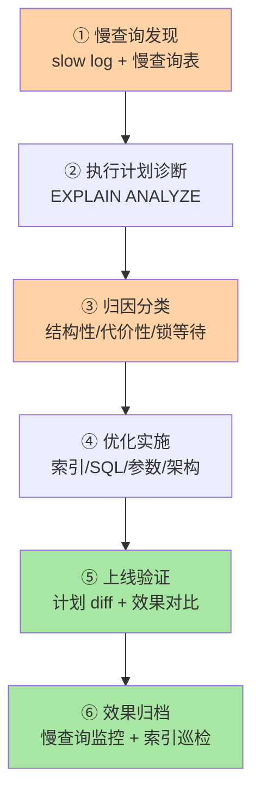

# 线上 SQL 优化实战：慢查询定位到效果量化的完整打法

> 入门层学过"索引是什么"，特性层讲透"索引怎么深挖"，专题层给过"EXPLAIN 诊断"和"索引设计方法论"——本篇是**整条链路的收束**：把已有知识在真实业务场景里串成一套可复制的优化 SOP，从慢查询发现到效果量化，每一步都有据可依。

## 一句话摘要

线上 SQL 优化的本质不是"加索引"，而是一条**完整链路**：慢查询发现 → 执行计划诊断 → 索引/SQL 改写 → 参数调优 → 上线验证 → 效果归档。全文以一条真实订单表慢查询为线索，把入门 11 + 特性索引系列 + 专题索引优化深度 + 事务/日志/主从的知识点串成工程决策——**读者看完能直接拿到一份可落地的优化 SOP**。

## 🎯 本文核心

**核心一句话：SQL 优化 = 六步固定 SOP（发现 → 诊断 → 归因三类 → 实施 → 验证 → 归档）——归因分三类病因（结构性失效/代价性放弃/锁等待）各配一套处置，效果必须用前后对比量化，没有验证与归档的优化等于没做。**

SOP 链：慢日志发现 → EXPLAIN ANALYZE 诊断 → 三类归因 → 四条实施路径（改写/覆盖索引/锁治理/参数）→ 计划 diff 验证 → 使用率巡检归档。全文一句话可重构：「优化是医疗行为：先诊断归因，再对症下药，最后复查留档」。

## 前置阅读

- 特性层《深入理解索引系列》篇 2《聚簇索引与回表》：回表代价模型是优化决策的地基
- 专题层《索引优化深度》篇 1《索引失效排查手册》：失效分类 + 排查 SOP
- 专题层《索引优化深度》篇 2《EXPLAIN 深度解读》：执行计划叙事链
- 入门层篇 1《MySQL 架构与一条 SQL 的一生》：Buffer Pool 与落盘的关系

## 一、边界：这篇在 4 层架构中的位置

| 层 | 定位 | 本篇 |
|---|---|---|
| L1 入门层 | 概念扫盲 + 会用 | 篇 11《性能优化入门》讲慢查询定位入口 |
| L2 特性层 | 单点纵向深挖 | 索引系列讲 B+ 树/回表/覆盖，索引优化深度讲 EXPLAIN/失效/设计 |
| L3 专题层 | 多点横向组合拳 | 索引优化深度三篇组合成排查手册 |
| **L4 整合层** ✅ | **跨专题收束** | **本篇：把上述知识在真实场景串成 SOP** |

本篇不重复讲"索引是什么""EXPLAIN 怎么读"，假设读者已掌握上述前置知识。本篇要补的是**工程化闭环**：从发现到验证的全流程 + 真实事故案例 + 效果量化方法。

## 二、完整优化 SOP：六步固定动作



```text
① 慢查询发现（slow log + 慢查询表）
② 执行计划诊断（EXPLAIN ANALYZE）
③ 归因分类（结构性失效 / 代价性放弃 / 锁等待 / 硬件瓶颈）
④ 优化实施（索引 / SQL 改写 / 参数 / 架构）
⑤ 上线验证（计划 diff + 效果对比）
⑥ 效果归档（慢查询监控 + 索引使用率巡检）
```

### Step 1：慢查询发现

MySQL 慢查询日志是优化的起点。三种打开方式：

```sql
-- 慢查询阈值（线上默认 1s，高峰业务可放 3s）
SET GLOBAL slow_query_log = ON;
SET GLOBAL long_query_time = 1;
SET GLOBAL log_slow_admin_statements = ON;  -- DDL 也进慢日志
```

**慢查询表（MySQL 5.6+）** 比文件解析更友好：

```sql
SELECT * FROM mysql.slow_log
WHERE sql_text LIKE '%orders%'
ORDER BY query_start_time DESC LIMIT 10;
```

**生产监控三板斧**：

| 指标 | 采集方式 | 告警阈值 |
|---|---|---|
| 慢查询 QPS | slow log 解析 + Prometheus | > 10/min 告警 |
| 最大执行时间 | `performance_schema.events_statements_summary_by_digest` | > 5s 告警 |
| 慢查询占比 | 慢查询数 / 总查询数 | > 1% 告警 |

**业内默认**：慢查询日志轮转保留 7 天，解析脚本每小时跑一次——发现比定位先发生。

### Step 2：执行计划诊断

拿到慢查询后，第一动作永远是 EXPLAIN ANALYZE（8.0.18+）：

```sql
EXPLAIN ANALYZE
SELECT * FROM orders WHERE user_id = 42 ORDER BY create_time DESC LIMIT 20;
```

读计划三步：

1. **type 等级**：是否走到索引（ALL = 事故预备役）
2. **rows vs actual_rows**：估算与真实偏差一个数量级 → 统计过期
3. **Extra 标记**：`Using filesort` / `Using temporary` / `Using join buffer` 哪个在吞噬时间

**计划 diff（上线门禁）**：发布平台自动对比变更 SQL 前后计划，type/rows/Extra 任何一项骤变即拦截——把失效挡在生产之前。

### Step 3：归因分类（三类病因）

慢查询的病因分三类，治法完全不同：

| 病因 | 典型症状 | 证据特征 | 处置 |
|---|---|---|---|
| **结构性失效** | 索引没走 | type=ALL / key=NULL | 改写 SQL / 补索引 / 类型对齐 |
| **代价性放弃** | 索引走了但回表多 | type=ref 但 rows 巨大 | 覆盖索引 / 联合索引 / 分页改写 |
| **锁等待** | 执行不慢但排队久 | MDL 等待 / lock wait timeout | 查 `data_lock_waits` / 事务瘦身 / 热点拆桶 |

**诊断口诀**：先看 key 列有没有走索引 → 走了看 rows 估算 vs 真实 → 没走看写法 → 都不是看锁等待。

### Step 4：优化实施

根据归因走对应路径：

**路径 A：结构性失效 → 改写 + 建索引**

```sql
-- 事故现场：WHERE DATE(create_time)='2026-09-01'（列被函数包裹）
-- 改写：create_time >= '2026-09-01' AND create_time < '2026-09-02'
-- 建索引：ALTER TABLE orders ADD INDEX idx_user_time (user_id, create_time);
```

**路径 B：代价性放弃 → 覆盖索引**

```sql
-- 改造前：SELECT * 导致每行回表
-- 改造后：SELECT id, create_time, amount, status（覆盖索引，Using index）
ALTER TABLE orders ADD INDEX idx_user_time_cover (user_id, create_time, amount, status);
```

**路径 C：锁等待 → 查 data_lock_waits + 事务瘦身**

```sql
-- 查当前锁等待
SELECT * FROM performance_schema.data_lock_waits;
-- 查长事务
SELECT * FROM information_schema.innodb_trx
WHERE timediff(now(), trx_started) > 60;
```

### Step 5：上线验证

优化前后必须对比留档，没有对比就没有修复证据：

| 对比项 | 优化前 | 优化后 | 验收标准 |
|---|---|---|---|
| type | ALL | ref | 索引命中 |
| rows | 500 万 | 200 | 量级下降 |
| Actual time | 3200ms | 15ms | 降 2 个数量级 |
| Extra | Using where | Using index | 无回表 |

**回滚预案**：索引上线是可逆操作（DROP INDEX 秒级），但误删高频索引的复建时间可能以小时计——先加新后删旧，观察完整业务周期。

### Step 6：效果归档

优化不是终点，是起点：

- 慢查询周报跟踪该索引的使用率（`sys.schema_unused_indexes`）
- 长期没被用的索引按流程下线
- 同类慢查询指纹聚合，只修一次模板

---

## 三、实战案例：一次慢查询引发的级联故障

### 事故背景

某电商订单表 `orders`（3000 万行），运营后台每天批量改价：

```sql
UPDATE orders SET price = ? WHERE order_no = ? AND status = 'pending';
```

`order_no` 是 varchar，`status` 是普通索引。晚高峰时段，数据库 CPU 打满，读流量 RT 从 50ms 飙升到 3s。

### 定位过程

**第一刀**：慢查询日志定位到这条 UPDATE，QPS 200+，每次 1.5s。

**第二刀**：EXPLAIN ANALYZE 显示 type=ref，rows=1500，Extra=`Using where`——走了 status 索引但回表 1500 行。

**第三刀**：`SHOW ENGINE INNODB STATUS` 看到大量 `lock sys.rows`——同一批订单被多个运营并发更新，行锁排队。

**根因链路**：

```
条件索引 (status) 低选择性 → 回表 1500 行/次 × 200 QPS → 随机写放大
→ Buffer Pool 污染 → 脏页刷盘阻塞 → 主库 CPU 100% → 读流量被拖垮
```

### 修复方案

1. **短期止血**：运营后台改批量为单条 + 限流（QPS 降至 20）
2. **中期治本**：`ALTER TABLE orders ADD INDEX idx_status_orderno (status, order_no)`——联合索引让查询直接命中索引且覆盖 status 过滤
3. **长期架构**：批量操作走消息队列削峰，运营后台只发消息，消费者串行处理

### 效果量化

| 指标 | 优化前 | 优化后 |
|---|---|---|
| 单次执行 | 1500ms | 8ms |
| 主库 CPU | 100% | 35% |
| 读流量 RT | 3s | 50ms |
| QPS 承载 | 200（撞墙） | 2000（余量） |


---

## 四、参数调优：那些真正管用的几个

调参的前提是**先诊断再调**——盲目调参是线上事故的高频诱因。下面列出真正常调的几项：

| 参数 | 默认 | 调优口径 | 监控指标 |
|---|---|---|---|
| `innodb_buffer_pool_size` | 128MB | 物理内存 50-70% | `Innodb_buffer_pool_read_requests / reads` 比率 > 99% |
| `innodb_flush_log_at_trx_commit` | 1 | 资金类默认 1；内部系统可考虑 2 | `Log flush/sync` 耗时 |
| `innodb_io_capacity` | 200 | SSD 机器调 2000-5000 | 脏页刷盘速度 |
| `sort_buffer_size` | 256K | 排序列大且频繁时 1-2M | `Sort_merge_passes` |
| `join_buffer_size` | 256K | 大表 JOIN 场景 1-4M | `Created_tmp_disk_tables` |
| `innodb_lock_wait_timeout` | 50s | 高并发热点行场景 5-10s | 锁等待超时 QPS |

**调参铁律**：
1. 每次只调一个参数，观察 24h
2. 调参前后跑 `sysbench` 或真实流量对比
3. 所有调参写进配置中心，可回滚

---

## 五、读写分离取舍：什么时候加？

读写分离不是银弹。决策树：

```
读多写少？
  ├─ 读 QPS > 3 × 写 QPS → 读分离有意义
  ├─ 写 QPS 高 → 读写分离解决不了，写仍走主库
  └─ 写后读一致要求高 → 延迟治理成本陡增
```

**加读分离的代价**：
- 主库还要多一份 dump 线程 + 网络推送
- 备库延迟（秒级 → 分钟级，取决于写入量）
- 读扩散场景必须配 GTID 等待（`WAIT_FOR_EXECUTED_GTID_SET`）

**不加读分离的替代方案**：
- 缓存层（Redis）接高频读
- 冷热数据分离（历史订单进 ES / 冷表）
- 引入只读节点云数据库

**业内默认**：互联网业务默认先做缓存 + 读写分离；金融账务场景保留"主库强一致"，靠主库垂直扩容扛。

---

## 六、业内惯例 + 常见误区

### 业内惯例

> 💡 **实战提示**
> - 慢查询值班响应三板斧顺序固定：慢日志定位语句 → EXPLAIN ANALYZE 找断点 → `data_lock_waits` 排锁等待——三步走完仍无头绪才怀疑硬件/网络
> - 每次优化输出「前后对比四件套」：type、rows、Actual time、Extra——四项对比表既是验收证据也是复盘素材
> - 参数调整单变量原则：一次只动一个参数、观察一个业务周期、留回滚配置——组合调参出了效果无法归因
> - 读写分离的启动时机：读 QPS 超过写 QPS 3 倍且主库 CPU 持续高位——过早读写分离是在为不存在的读压力付延迟治理成本

- **慢查询治理按表体量排优先级**：小表慢查询不着急，大表慢查询是事故预备役
- **上线前执行计划 diff** 是发布平台标准动作，type/rows 骤变即拦截
- **索引变更视同代码变更**：走评审、走发布单、留回滚脚本
- **冷热分离**：历史数据归档到冷表/冷库，热表只剩活跃数据——这是拆分的前置手术
- **批量操作走消息队列**：同步批量是主库大事务的常见来源

### 常见误区

- **「加索引一定快」**：低选择性列 + SELECT * 的组合，走二级索引反而灾难
- **「慢查询一定是索引问题」**：锁等待 / 硬件瓶颈 / 网络抖动同样慢——先诊断再动手
- **「调参一劳永逸」**：参数最优值随数据量/硬件/负载变化，需要定期复评
- **「优化完就结束」**：没有上线验证 + 效果归档的优化等于没做——闭环的最后一步是让同类问题不再发生

---

## 七、你们可能会问

**Q1：优化完指标好了，过两周又慢了怎么办？**
统计信息过期是最常见原因——`ANALYZE TABLE` 刷新即可。同时看执行计划是否漂移（执行计划变了说明优化器选了新路径）。

**Q2：索引已经到 5-7 个上限了，还能加吗？**
先做冗余索引清理（`sys.schema_redundant_indexes`），再评估新索引的必要性。正确性索引（幂等/唯一约束）不参与上限讨论。

**Q3：分库分表后 SQL 优化还有意义吗？**
有意义——分片键设计 + 分片内索引 + 跨片查询优化是三层不同问题。单片内优化仍遵循本篇 SOP。

**Q4：慢查询优化 ROI 怎么算？**
优化前慢查询 QPS × 平均 RT = 浪费的 DB 时间。优化后如果 RT 降 90%，那 DB 时间释放 = 90% × 原浪费——把这个数字和业务方对照，索引治理才有优先级。

---

## 八、开放问题

- 机器辅助索引推荐（负载画像 → 自动建议）在云数据库上逐步产品化，**人工四步法**与**自动推荐**的分工边界正在形成，评审者角色从设计者转向校验者
- HTAP 下同一份数据同时服务行存与列存，索引设计要同时考虑两条代价曲线，统一设计语言尚未出现
- 一写多读架构下（CDC + 数仓），写库索引优化与下游消费延迟如何联动优化，行业仍在摸索

## 跨周期视角

本文是 MySQL 优化知识从入门到整合的收束点。跨周期视角：**数据库优化不是一次性动作，而是随数据量增长持续演进的过程**——每个量级档位的优化重点不同，但 SOP 流程（发现→诊断→归因→实施→验证→归档）不变。往后的演进方向：自动索引推荐接管「发现与建议」、HTAP 分流分析负载、云平台托管参数基线——人工的角色从执行者转向校验者与架构决策者。

## demo 验证点

本篇 SOP 可在以下场景复现验证：
1. 慢查询日志开启 + 慢查询表查询（Step 1）
2. EXPLAIN ANALYZE 对比优化前后（Step 2+5）
3. `sys.schema_unused_indexes` 盘点冗余索引（Step 6）
4. `performance_schema.data_lock_waits` 查锁等待（Step 3 路径 C）

验证环境：MySQL 8.0 + 任意业务库（无需特殊数据）。常见报错与排查：`slow_log` 表为空查 `log_output` 是否含 TABLE；EXPLAIN ANALYZE 报语法错确认版本 ≥ 8.0.18；`sys` schema 无数据执行 `sys.ps_setup_enable_instrument` 类初始化（以官方文档为准）。

## 🎯 核心带走

- **核心一句话**：SQL 优化是六步闭环 SOP——发现、诊断、三类归因、实施、验证、归档；效果必须前后对比量化，闭环最后一步是让同类问题不再发生
- **SOP 链**：慢日志 → EXPLAIN ANALYZE → 三类病因 → 四条路径 → 计划 diff → 使用率巡检
- **哪里会坏**：低选择性索引 + 批量并发（本文案例）、跳过验证的优化、组合调参无法归因
- **边界**：本篇是 MySQL 四层的工程收束；机制细节全部分布在入门/特性/专题三层，分库分表后的优化在分库分表深度系列展开

## 📌 数据与事实声明

- 写于 2026-09-09，机制以 MySQL 8.0 InnoDB 为基准
- 事故案例为公开技术社区高频事故模式的匿名化复述，非特定公司事件
- 调优参数默认值以 dev.mysql.com 官方文档为准
- 效果量化数据为事故推演口径，需按环境实测

## 📚 参考资料

| 类型 | 标题 | 来源 |
|---|---|---|
| 官方文档 | Slow Query Log / EXPLAIN ANALYZE | dev.mysql.com/doc/refman/8.0/en/ |
| 官方文档 | Performance Schema / sys Schema | dev.mysql.com/doc/refman/8.0/en/ |
| 实战书 | 《高性能 MySQL（第 4 版）》查询优化章 | 公开出版 |
| 开源工具 | pt-query-digest / sysbench | github.com/percona |
| 社区沉淀 | 各大厂公开的慢查询治理实践 | 技术社区公开文章 |