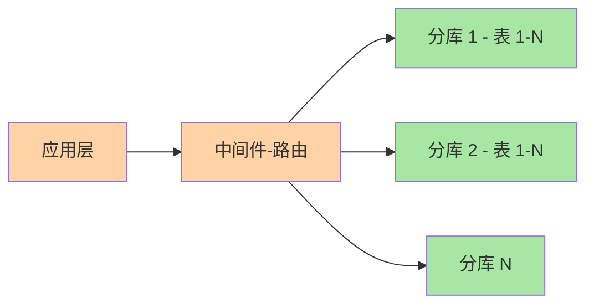

# 亿级量级演进：从单实例到分布式阵痛

> 入门层 14 讲过分库分表的概念，专题层 3 篇给过拆分方案/分片键/分布式 ID——本篇是**演化叙事**：从十万行到亿级数据，每一步踩什么坑、什么决策点、为什么这样走。全篇以"量级"为视角，读完能对任何量级的存储架构做出有依据的判断。

## 一句话摘要

MySQL 的量级演进不是"到了亿级才考虑拆分"——**每一档量级都有对应的架构形态和优化手段**。从单实例十万行到亿级，演进路径是：单库单表 → 索引治理 + 冷热分离 → 读写分离 → 分库分表 → 分布式架构。每一步的代价和收益完全不同，**跳级拆分是过度设计，拖延拆分是技术债**——本篇把这套决策链讲透。

## 🎯 本文核心

**核心一句话：量级演进是「逐档升级、每档只解决上一档解决不了的瓶颈」的过程——十万行靠索引、百万行靠冷热与读分离、千万行逼近单库临界、亿级才上分库分表；跳级是过度设计，拖延是技术债。**

决策链：四档量级全景 → 每档的打法与红线 → 三类演进事故（预支复杂度/键选错倾斜/跨片一致性）→ 拆分决策树 → 五组架构 Trade-off。全文一句话可重构：「量级定形态，红线定时机，决策树定路径」。

## 前置阅读

- 入门层篇 14《分库分表与扩展》
- 专题层《分库分表深度》3 篇（选型/分片键/分布式 ID）
- 专题层《主从与高可用深度》篇 1《延迟治理》
- 特性层《深入理解索引系列》篇 1《B+ 树与页存储》

## 一、边界：这篇在 4 层架构中的位置

| 层 | 定位 | 本篇 |
|---|---|---|
| L1 入门层 | 概念扫盲 | 篇 14 讲分库分表概念 |
| L2 特性层 | 单点深挖 | 主从复制/索引/事务各系列讲机制 |
| L3 专题层 | 多点组合 | 分库分表深度 3 篇给方案 |
| **L4 整合层** ✅ | **跨专题收束** | **本篇：量级演进叙事 + 决策链** |

## 二、量级演进全景：四档量级四种打法


```text
十万行 ──── 百万行 ──────── 千万行 ────────── 亿级
  │           │              │               │
  ▼           ▼              ▼               ▼
 索引治理    冷热分离+读分离   读写分离+分片   分库分表+分布式
```

### 第一档：十万行——索引治理够了

十万行是 MySQL 的舒适区。一张 10 万行的表，B+ 树高 2-3 层，全表扫描也不过几毫秒。这个量级的优化全是**索引层面的事**：

- 等值查询走唯一索引/普通索引
- 范围查询走联合索引（等值在前、范围在后）
- 覆盖索引消灭回表
- 冗余索引清理（`sys.schema_redundant_indexes`）

**这个量级不需要分库分表**——拆分的运维成本远高于收益。

### 第二档：百万行——冷热分离 + 读写分离

百万行时 B+ 树高 3-4 层，全表扫描开始变慢（100-500ms）。应对策略：

**冷热分离**：
- 热数据（近 3 个月）留主表，冷数据归档到历史表/冷库
- 冷热分离后热表行数回落到十万级，性能回到舒适区
- 归档策略：按时间分区，按月/季度切

**读写分离**：
- 主库写 + 从库读，读流量分流
- 延迟容忍：报表/分析类可容忍秒级延迟，交互类需要 GTID 等待
- 从库规格不低于主库（否则结构性追不平）

### 第三档：千万行——读写分离 + 分片

千万行是单库上限的临界点。B+ 树高 4 层成为常态，索引维护成本上涨（写放大）。

**这时候的决策链**：

1. 先做冷热分离（热数据千万级以下）
2. 读写分离扛读压力
3. 如果写入仍瓶颈，考虑分片（按用户 ID / 按时间）

**关键取舍**：分片是最后手段——它带来跨片查询、分布式事务、运维复杂度。**先做归档和索引优化，再做分片**。

### 第四档：亿级——分库分表 + 分布式架构

亿级数据单库已不可行，必须水平拆分：

- **分库**：按分片键把数据分散到 N 个实例
- **分表**：每库内再分 M 张表
- **中间件**：ShardingSphere / Vitess / 云原生分布式数据库
- **分布式 ID**：雪花 / 号段 / UUID（趋势递增优先）

**亿级典型架构**：



```text
应用层 → 中间件（路由）→ 分库 1（表 1-N）→ 分库 2（表 1-N）→ ...
                              跨片事务由 MQ + SAGA 类方案承接
```

**量级红线参考**（行业认知，按硬件实测）：
- 单表行数进入亿级、B+ 树高度 4 层成常态
- 单实例写入持续逼近硬件瓶颈
- 单库容量逼近备份/DDL/复制的时间窗口上限

---

## 三、演进中的典型事故

### 事故 1：为想象中的量级预支复杂度

某系统核心表 3000 万行，团队提前规划"亿级未来"，按用户 ID 拆了 64 片。一年后暴露的问题：

- 运营后台按时间维度拉报表，全片广播聚合
- 分布式 ID 接入改造
- 分片扩容（64→128）的再平衡方案论证了一个季度没落地
- 新同事理解数据分布的培训成本持续存在

而这张表在做好归档与索引后，真实活跃数据从未超过 4000 万行。

**三条沉淀**：
1. 拆分红利按"当前量级"兑现，拆分成本按"片数"计——为想象中的量级预支复杂度，是存储设计里最贵的乐观
2. 片数设计要留"逻辑层"：业界默认用"逻辑分片数大、物理映射可调"的设计（如 1024 逻辑槽映射到物理实例），把"扩容"变成"映射调整"
3. **拆分决策要写 ADR**：量级假设、片数理由、再平衡方案一并归档——一年后评估"拆错了没"才有依据

### 事故 2：分片键选错导致数据倾斜

某订单系统按 `status` 分片（0-待支付、1-已支付、2-已完成），结果 80% 数据集中在 status=1（已支付）。分片键选择失败导致：
- 某些分片数据量远超其他 → 热点实例
- 扩容时数据迁移量严重不均
- 查询跨分片成为常态

**教训**：分片键必须满足"数据均匀 + 查询对齐"两个条件。只满足一个的分片键不如不分。

### 事故 3：跨分片事务丢失一致性

分库后，原本单库事务变成跨分片事务。用 MQ + SAGA 替代本地事务：
- 本地事务 → 发消息 → 下一阶段
- 失败 → 补偿事务 → 逆向操作

**Trade-off**：SAGA 保证最终一致，不是强一致。金融账务场景需要额外对账+人工兜底。

---

## 四、决策树：什么时候拆？怎么拆？

```
单库优化清单做完？
├─ 没做完 → 继续索引治理 + 冷热分离 + 大字段外移
└─ 做完了 ↓
量级红线到了吗？
├─ 没到 → 继续观察，监控量级增长斜率
└─ 到了 ↓
分片键能选吗？
├─ 不能（查询形态不固定）→ 先加缓存/ES 兜底，继续观察
└─ 能 ↓
垂直拆还是水平拆？
├─ 业务耦合严重 → 先垂直拆（按业务边界切库）
└─ 数据量大 → 水平拆（按分片键分散行）
```

**先垂直解耦、后水平扩容**是业内演进的经典路径。

---

## 五、架构设计中的 Trade-off

| 决策 | 选 A | 选 B | Trade-off |
|---|---|---|---|
| 分片数 | 64 片 | 1024 逻辑槽 | 64 片简单直观但再平衡难；1024 逻辑槽灵活但路由复杂 |
| 中间件 | 客户端 SDK | 代理层 | SDK 延迟低但语言绑定；代理层语言无关但多一跳网络 |
| 一致性 | 强一致（同步复制） | 最终一致（异步+对账） | 强一致吞吐低；最终一致需要补偿+对账 |
| 分布式 ID | 雪花 | 号段 | 雪花全局唯一但依赖时钟；号段本地分配但需预分配 |
| 冷热分离 | 按时间分区 | 按业务标签 | 时间分区简单但热数据可能跨分区；业务标签精准但需业务配合 |

**核心取舍**：没有银弹，每一步都是代价换收益。**架构设计不是选最好的方案，是在约束条件下选最合适的**。

## 跨周期视角

本文是 MySQL 量级演进的收束点。跨周期视角：**数据库架构不是一次性设计，而是随数据量增长持续演进的过程**——每个量级档位的架构形态和优化手段不同，但决策链（诊断→定方向→选工具）不变。

## demo 验证点

本篇决策链可在以下场景复现验证：
1. 量级诊断：`information_schema.tables` 查表行数 + `SHOW TABLE STATUS` 看数据长度
2. 冷热分离：按时间分区 + `sys.schema_unused_indexes` 盘点
3. 读写分离：`SHOW REPLICA STATUS` 查延迟 + `sys.host_summary` 查读写比例
4. 分片键选型：数据均匀性验证（`SELECT COUNT(*), shard_key FROM table GROUP BY shard_key`）

验证环境：MySQL 8.0 + 任意业务库（无需特殊数据）。

## 六、业内惯例

> 💡 **实战提示**
> - 量级诊断两条 SQL 起手：`information_schema.tables` 看行数与数据长度、业务监控看读写比与增长斜率——先拿数字再开会，架构评审不讨论「感觉」
> - 每档升级前先跑「降级回退」推演：读分离回单库、分片回大表的可行性与代价——不可回退的决策要写 ADR 归档
> - 分片键均匀性提前验证：按候选键 `GROUP BY` 计数分布 + 抽样流量分布——数据与流量两个维度都均匀才合格
> - 亿级备份按「物理全量 + binlog 增量 + 恢复演练」三件套规划，全量窗口写进容量预算而不是事后补救

- **先归档再拆分**：多数"到量级"的表归档历史后回到舒适区——归档是拆分的前置手术
- **逻辑分片 + 映射表**：固定大逻辑片数（512/1024），映射到可变的物理实例——扩容只动映射不动数据分布规则
- **云上选型看托管分片能力**：云厂商的分布式数据库（PolarDB-X 类、Vitess 类托管）把分片路由、扩容再平衡产品化——新建系统优先评估托管能力
- **拆分与团队形态匹配**：客户端分片要求应用团队承接分片心智，代理分片要求中间件团队承接运维——按"谁有富余人力"定路线是务实的业内现实
- **所有表显式主键**：分片场景下主键是路由键，无主键表无法水平拆分——这是分片语境下主键的第三重理由（前面两重：聚簇索引组织 + 二级索引复制）

---

## 七、常见误区

- **「分库分表是常态」**：分库分表是最后手段，不是标配。大部分系统做到读写分离 + 缓存就够用了
- **「分片数越多越好」**：片数越多路由越复杂、跨片查询越多、再平衡越难。片数按量级估算，不是越大越好
- **「分库分表后就不用索引了」**：分片只解决"数据放哪"的问题，查询仍需索引。分片 + 索引是互补不是替代
- **「分布式事务解决了所有一致性问题」**：SAGA / TCC 是最终一致，不是强一致。金融场景仍需对账 + 人工兜底
- **「提前分片是远见」**：为想象中的量级预支复杂度，是存储设计里最贵的乐观

---

## 八、你们可能会问

**Q1：分库分表后分布式 ID 怎么选？**
雪花（全局唯一 + 趋势递增）vs 号段（本地分配 + 预分配）：雪花依赖时钟（回拨风险），号段需要预分配（浪费 ID 区间）。互联网默认雪花，金融默认号段。

**Q2：分片扩容怎么做？**
逻辑分片 + 映射表方案下，扩容只改映射、不动数据分布。物理分片方案下需要 rehash + 数据迁移，代价大——这就是为什么"逻辑分片 + 映射表"是业界推荐做法。

**Q3：什么时候该引入分布式数据库（如 PolarDB-X）而不是自建分片？**
新建系统 + 云原生环境优先评估托管分片；存量系统 + 团队有中间件经验可自建。自建分片的工程价值在于可控性，托管的价值在于运维省心。

**Q4：亿级数据备份怎么搞？**
全量备份 + binlog 增量恢复是基线。亿级数据全量备份窗口长，需配合物理备份（XtraBackup）+ 增量备份策略 + 定期恢复演练。

---

## 开放问题

- 分布式数据库（原生分片 + 分布式事务）与"MySQL + 分片中间件"两条路线的竞争持续——业务无感分片一旦成熟到价格可接受，自建分片的工程价值将系统性重估
- Serverless 形态的"按需自动分片"已有云厂商试点，容量规划这门手艺的半自动化程度在快速上升
- 冷热分离的自动化策略（AI 预测访问模式 + 自动归档）正在演进，传统 DBA 角色面临转变

## 🎯 核心带走

- **核心一句话**：量级演进四档各配打法——索引、冷热读分离、临界分片、分布式；量级定形态、红线定时机、决策树定路径，跳级与拖延都是失衡
- **决策链**：四档全景 → 红线校准 → 三类演进事故 → 拆分决策树 → Trade-off 对照
- **哪里会坏**：为想象量级预支 64 片、按低基数列分片（80/20 倾斜）、跨片事务无对账兜底
- **边界**：本篇是 MySQL 全系列的演化收束；拆分细节在专题层分库分表深度四篇，延迟与高可用在主从深度四篇——量级视角把它们串成一条演进线

## 📌 数据与事实声明

- 写于 2026-09-09，机制以 MySQL 8.0 为基准
- 量级红线（亿级/4 层树/千万舒适区）为行业认知口径，决策需按硬件与行宽实测校准
- 事故案例为公开技术社区高频案例模式的匿名化复述
- 工具口径以 ShardingSphere 5.x 与主流云分布式数据库公开文档为准

## 📚 参考资料

| 类型 | 标题 | 来源 |
|---|---|---|
| 开源项目 | Apache ShardingSphere | shardingsphere.apache.org |
| 开源项目 | Vitess（CNCF） | vitess.io |
| 实战书 | 《高性能 MySQL（第 4 版）》规模化章 | 公开出版 |
| 社区沉淀 | 各大厂公开的分库分表演进文章 | 技术社区公开文章 |
| 官方文档 | MySQL 分区 / 在线 DDL | dev.mysql.com/doc/refman/8.0/en/ |