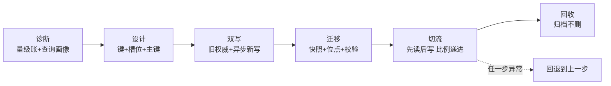
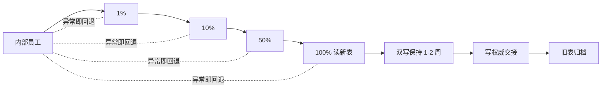

# 亿级订单分库分表实战：从容量规划到平滑迁移的全流程

> 订单表 12 亿行、每天新增 1500 万，查询越来越慢，老板要求「大促前必须拆完」。从哪一步动手？分片键怎么定？12 亿存量怎么搬、双写怎么保证不丢、切流怎么切得心里有底？这篇是分库分表的整合层实战——把前面所有机制篇收束成一条可执行的时间线。

## 一句话摘要

分库分表实战的全流程是六步闭环：**量级诊断 → 目标架构（分片键 + 槽位 + 主键） → 双写改造 → 存量迁移 → 校验切流 → 旧表回收**——每一步都有明确的完成标准与回退方案。本文以一个亿级订单库（日千万增量，行业认知量级的典型形态）为场景，把机制篇的结论（2^n 槽位、基因法主键、倾斜预案、游标分页）落到执行层：迁移的核心纪律是「**任何时刻有且只有一条权威写入路径，切换永远可回退**」。

## 前置阅读

- 特性层《深入理解分片机制系列》全 4 篇：路由/倾斜/跨片/分页的机制底座
- 专题层篇 3《分布式 ID 衔接与平滑迁移》：迁移的机制与原理视角——本篇是**实操视角**（时间线、checklist、踩坑），机制不重写

## 🎯 本文核心

**核心机制一句话**：分库分表迁移的工程本质是「在不停服的前提下，把权威数据源从旧表安全地切换到新表」——双写保证新表追上，校验保证可信，灰度保证可退。

**机制链（6 个节点，即全文六个阶段）**：诊断 → 设计 → 双写 → 迁移 → 切流 → 回收。

## 一、量级诊断：确认「真的要拆」与「拆到多大」

动手前把账算清（本篇场景数字均为行业认知量级的假设形态）：

- **存量**：订单表 12 亿行，表文件 + 索引约 800GB——单表远超 2000 万红线（篇 1 推导），任何索引变更 DDL 锁表风险不可接受；
- **增量**：日均 1500 万、大促峰值 5 倍——一年 +55 亿，按单表 1000 万水位，一年就需 5500 张表，终局按 5 年规划 **16384 槽位（16 库 × 1024 表）**，起手用 8 库 × 1024 表容量的一半物理实例；
- **查询画像**（决定分片键与异构策略）：买家查订单（80% 流量，强一致）、卖家查订单（15%，可容忍秒级延迟）、订单号直查（客服，5%）、运营多维检索（<1%，走数仓）——**画像决定架构，不反过来**。

💡 实战提示：诊断阶段产出物是三张表——量级账（存量/增量/峰值）、查询画像（维度×占比×一致性要求）、依赖清单（上下游谁在读这张表）。「先拆后想」的过度设计事故（专题层篇 1 有推演）全部始于跳过这张账。

## 二、目标架构：一次把终局设计对

**分片键与主键**：买家维度是绝对主流量 → 按 `buyer_id` hash 分片；订单主键用**基因法分布式 ID**（时间戳 + 序列 + buyer_id 低 16 位基因，篇 1 机制）——订单号直查自带路由凭据，卖家维度走 ES 异构（画像里可容忍延迟）。**为什么不用 seller_id 做键**——平台模式卖家分布幂律（篇 2），键分布被商业结构污染；买家维度天然分散，是「数据形态决定键选择」的教科书场景。

**槽位**：`槽位 = 基因 % 16384`（16 库 × 1024 表，2^n 纯位运算）；订单详情表与订单表**绑定表**同键同算法（跨片 join 本地化，篇 3）。**扩容路线**：表数一次到位 16384，物理实例从 8 库起步按库整体搬迁扩容——「逻辑槽位一次定死、物理实例渐进扩」是篇 1 容量纪律的落地。

**容量账**（决策留痕）：16384 表 × 单表终局 90 万行 ≈ 14.7 亿 × 5 年增长系数，单表水位健康；每库 1024 表摊到实例规格，连接数按跨片放大系数重算（篇 3 机制）。

## 三、双写改造：最危险的三周

双写是整个迁移的风险峰值——**写路径同时打到旧表与新表**。执行纪律：

1. **以旧表为权威**：双写期所有读走旧表，新表只收写不服务读——权威路径唯一，出问题新表可随时清掉重来；
2. **写顺序与失败策略**：同步写旧表（权威，失败则业务失败），**异步写新表**（失败进重试队列，不阻塞业务）——为什么不等强一致双写？双写事务 = 跨旧新两个数据源的分布式事务，为迁移引入分布式事务是把复杂度拉满的反模式；异步 + 对账补偿才是工程正解；
3. **双写开关**：配置中心下发的灰度开关（按流量比例开新写），随时可关——开关本身要演练过「秒级生效」（链回稳定性系列事前预案）。

**追问链**：异步双写会不会丢？——会（机器故障时队列丢失），所以双写期「丢」不致命的前提是**校验环节兜底**（第四步），双写的定位是「让新表追上」而不是「保证新表分毫不差」。→ 再追问：那分布式事务白学了？——不，迁移场景刻意选择「最终一致 + 对账」而不是强一致，是因为**旧表始终权威、任何不一致可修复**；真正需要强一致的业务双写（新旧同时对外服务）才是分布式事务的场景。机制选择跟着「权威在谁手里」走。

## 四、存量迁移与校验：对账对到敢切流

**全量迁移**：按槽位并行 dump（每槽位一批，限速避免打爆主库）→ 装载到新表；期间增量由双写持续追。**位点点位**：全量起点记录 binlog 位点，全量完成后用位点回放补齐窗口——机制与建从库同构（链回特性层主从复制系列，同一套「快照 + 位点」思想）。

**校验三层**（切流前的信心来源，校验不过切流免谈）：

| 层 | 手段 | 标准 |
|---|---|---|
| 行数对账 | 各槽位 `count(*)` 新旧对比 | 差异 = 0（双写重试队列清零后） |
| 内容抽样 | 按槽位随机抽样 1 万行全字段 checksum | 100% 一致 |
| 业务对账 | 关键状态字段（订单状态机）新旧全量比对脚本 | 差异清单逐条修复 |

💡 实战提示：校验脚本必须限速跑（大范围扫描会挤占业务 IO——Buffer Pool 抖动的老朋友，链回特性层内存体系系列），生产对账一律走从库或专门的校验实例。

## 五、灰度切流：读切写收，可退是底线

切流顺序必须是「**先读后写、比例递进、每步可回退**」：

1. **切读（按买家维度灰度）**：内部员工 → 1% 用户 → 10% → 50% → 100%，每档观察 24-48 小时（错误率/延迟/数据投诉）。**为什么先切读**——读错误可即时回退（切回旧表，损失为零），写错误涉及双数据源分叉，回退成本高一个数量级；

历史上每一次数据层切换事故，追根到底都是**演进过程中「不可回退点」埋得太早**——本方案在写权威交接前，旧表始终是完整可用的退路，这是把历史教训翻译成流程结构的安排。切读顺序的取舍逻辑也在此：读切流回退无损，所以全部验证压在读阶段完成；写切流不可逆性高，必须排在全部信心就绪之后。
2. **停双写延迟窗口**：读 100% 走新表后，保持双写一段时间（1-2 周）——**为什么不等停**：万一发现新表侧缺陷，旧表还有全量数据可兜底；
3. **切写（权威交接）**：把「旧表权威」翻转成「新表权威」，写主同步、旧表降级为异步冗余；观察一周无异常；
4. **回收旧表**：再观察一个账期（对账/客服工单归零），旧表转归档——**不要删，先归档**（行业惯例：迁移后的旧表至少保留一个完整账期，客服回溯是最后的安全网）。

整个时间线的机制纪律一句话：**每一步的回退方案在动手前写好并演练过——切流方案没有「回退预案」四个字就不许上线**（稳定性系列「事前预案」纪律在迁移场景的具象化）。

## 六、上线后的两场硬仗：倾斜与分页

拆完不是结束，机制篇的两个预案在真实流量下activation：

- **倾斜**：上线两个月后热键画像表（篇 2）发现头部商家写入占比爬升到 18%——启动评审，该商家订单走「独立成片」白名单（定向路由），长尾世界恢复均匀。**预案在案、按指标触发**，而不是等打挂再救。
- **分页**：买家订单列表全部游标化（`where id > last`，篇 4），运营后台 offset 上限 500 页，卖家多维列表走 ES——三条链路的规范在网关层 SQL 审核卡点，不靠自觉。

**复盘 Action（反哺机制）**：① 「迁移 checklist」沉淀为组织资产（双写开关演练/校验三层/切流灰度档位）；② 大表监控三件套（行数分布/写入热度/慢 SQL 分片聚合）进例行看板；③ 下一个待拆表直接复用本时间线——**迁移能力一旦闭环，就从一次性项目变成可复用的组织流程**。

## 你们可能会问

**Q1：能不能不停服迁移（锁写窗口一次性搬完）？**
小表可以（低峰停写 30 分钟），亿级不行——全量搬迁小时级起，停写窗口的业务损失不可接受。且停服迁移省下的双写复杂度，会在「迁移失败重来一次」时加倍还回去。**双写不是复杂度偏好，是亿级规模的唯一现实解**。

**Q2：双写期间新旧表的唯一键冲突怎么处理？**
主键由分布式 ID 生成器统一发放（不在 DB 层自增），新旧表同 ID——天然无冲突。这也是「主键方案必须先于迁移定案」的原因：迁移中途换主键方案 = 灾难。

**Q3：历史大表（已分库的）要再扩容怎么办？**
走同一套时间线，但「双写」变成「新旧槽位映射双写」（逻辑槽位不变、物理映射搬迁，篇 1 的二级映射方案）——扩容比首拆简单一个量级，这就是「逻辑槽位一次定死」红利的兑现时刻。

**Q4：迁移期间要不要同步做表结构重构？**
不要。一次迁移只做一件事——**拆分与重构并行 = 故障定位的噩梦**（出问题说不清是路由错还是新结构错）。重构排到迁移稳定后的独立窗口。

**Q5：怎么向业务方证明「可以切了」？**
用数据不用感觉：校验三层全绿截图 + 灰度档位的错误率对比曲线 + 回退演练记录。切流评审会上这三样东西是硬通货，缺一个就回炉。

**Q6：这套流程的历史由来？**
它是行业「停服迁移 → 停写迁移 → 双写迁移」演进史的当代形态——每一代方案都死于上一代的具体故障（停服损失业务、停写窗口超时、无校验切流出脏数据），本文时间线的每一步都是代价换来的纪律。
用数据不用感觉：校验三层全绿截图 + 灰度档位的错误率对比曲线 + 回退演练记录。切流评审会上这三样东西是硬通货，缺一个就回炉。

## 开放问题

- 云厂商分布式数据库（PolarDB-X/TiDB 类）提供「一键平滑迁移 + 自动分片」，自研分片 + ShardingSphere 的路线还有多少生存空间？控制力与成本的权衡随场景规模漂移，值得按业务体量每年重评。
- 存算分离 + 多租户物理隔离成熟后，「独立成片」是否会变成云原生形态的标准选项（租户级 QoS），从而改写倾斜治理的方案库？观察中。

## 🎯 核心带走

**30 秒复述**：亿级订单分库分表六步——诊断（量级账 + 查询画像）→ 设计（buyer_id 键 + 基因法主键 + 16384 槽位 + 绑定表）→ 双写（旧权威 + 异步新写 + 灰度开关）→ 迁移（快照 + 位点 + 三层校验）→ 切流（先读后写、比例递进、每步可退）→ 回收（归档不删）。**失效点**：跳过查询画像直接定键、双写搞成分布式事务、校验只对行数、切写没有回退演练、旧表手删。金句带走：

> **迁移的信心不是「应该没问题」，是三层校验全绿加一场演过真回退——切流方案里没有回退预案四个字，就不许上线。**

> **一次迁移只做一件事；权威路径任何时刻只有一条；旧表先归档再告别——三条纪律，条条都是事故换的。**

## 📌 数据与事实声明

- 场景数字（12 亿存量/日 1500 万/16384 槽位）为行业认知量级的假设形态，用于完整推演，非特定公司数据。
- 双写/校验/切流的机制描述为业界公开实践（ShardingSphere 数据迁移文档、行业公开技术分享）的模式归纳与综合；时间线档位（1-2 周/24-48 小时）为行业认知惯例。

## 📚 参考资料

- ShardingSphere 官方文档：数据迁移 / 拆分策略 / 绑定表
- 本仓库机制篇全套：《深入理解分片机制系列》×4 + 专题层《分库分表深度》×4 + 特性层《深入理解主从复制系列》（快照+位点同构）
- 关联：distributed-id 系列（主键正源）；稳定性系列（事前预案/事中止血/Action 反哺）；ES 系列（异构承接）
