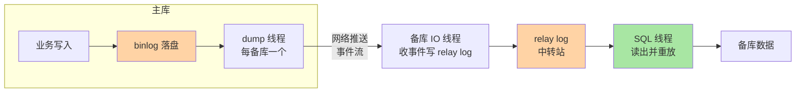
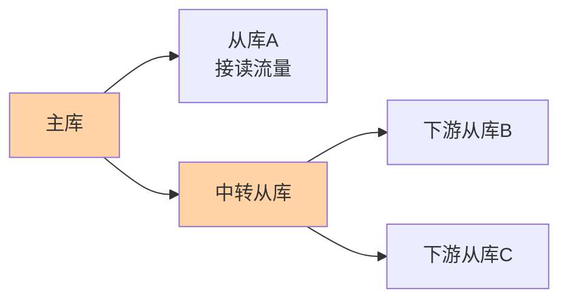

# 复制协议与三线程：主备之间的数据通道

> 主从复制常被当成「配一下就完事」的功能，但它是一条有三个角色、两种位点协议、明确语义边界的**数据通道**。这篇把三线程模型与位点协议讲透——后面半同步、并行复制、延迟治理全都挂在这条通道上。

## 一句话摘要

MySQL 复制链路是**三线程流水线**：主库 dump 线程把 binlog 推给备库，备库 IO 线程收下来写进 relay log，SQL 线程再从 relay log 重放。**异步复制下主库提交即返回，备库追多远都不阻塞主库**；定位「从哪开始重放」的位点协议从「文件名 + 偏移量」演进到 GTID（全局事务号），后者让故障切换从「人工找位置」变成「自动认进度」。

## 🎯 本文核心

**核心一句话：复制 = 三线程流水线（dump 推送 → IO 接收 → SQL 重放）+ 位点协议（进度表达）——relay log 解耦「收」与「放」，GTID 把进度凭据从「本地文件坐标」升级为「全局事务身份」；异步语义下丢失窗口由复制模式决定，一切延迟与一致性问题都在这条通道上定位环节。**

机制链：三线程各自职责 → relay log 的解耦价值 → 位点协议演进（文件位点 → GTID）→ 异步语义三条推论 → 级联拓扑的代价。全文一句话可重构：「一条流水线、两种进度凭据、一组明确的不等待语义」。

## 前置阅读

- 入门层篇 12《主从复制》：搭建与基本用途
- 本系列（日志）篇 2《binlog 与 crash-safe》：binlog 是复制的 payload

## 目标导向

本文是什么：复制链路的三线程模型与两种位点协议。功能是什么：把「主备之间到底发生了什么」拆到线程与协议层。能得到什么：读得懂复制状态输出、能选 GTID 拓扑、理解延迟问题的环节归属。为什么用：搭新集群、故障切换设计、复制断连排查，必看。

## 一、边界：入门层讲过什么，本文讲什么

| 内容 | 入门层 | 本文 |
|---|---|---|
| 主从复制能干什么、怎么搭 | ✅ 讲过 | 不重复 |
| 三线程各自职责与 relay log | 提了一句 | **本文核心一** |
| 位点协议 vs GTID | 未讲 | **本文核心二** |
| 半同步与并行重放 | 未讲 | 本系列篇 2 |

## 二、三线程流水线：数据怎么从主到备



三个角色各管一段，职责边界清晰：

- **dump 线程（主库）**：每个备库连接对应一个，从 binlog 文件按位点顺序读事件、走网络推出去。它只读不判断——「送报员」角色，语义纯度很高
- **IO 线程（备库）**：收事件写 relay log（中转日志）。落盘即回 ACK——把「网络接收」与「重放执行」解耦，网络抖动不影响已收内容的可靠性
- **SQL 线程（备库）**：从 relay log 读事件、在备库执行。**重放速度是延迟的大头**（单线程重放追不上多线程写入，解法在篇 2）

relay log 的存在价值值得单独说：没有它，IO 就得直接喂 SQL 执行——网络一抖，执行端跟着抖，断点也难找。中转站把「收」与「放」拆成模块边界分明的两段，各自独立推进、各自记录进度——这是流水线式架构的标准解法，断点续传天然成立。

## 三、位点协议：从「文件名 + 偏移」到 GTID

复制最核心的元数据问题是：**备库重放到哪了？**

**旧协议（文件 + 位点）**：`(binlog.000123, 4567)`。简单直接，但有两个痛点——主备各自维护一套名字，切换主库后文件名序列完全不同，人工对位极易出错；「这个事务执行过没有」没有全局答案。

**GTID（全局事务标识）**：每个事务在主库获得 `server_uuid:序号` 的全局唯一编号，备库只需回答「这个 GTID 执行过没有」。由此带来质变：

| 维度 | 文件+位点 | GTID |
|---|---|---|
| 切换主库 | 人工比对找新位置 | 自动跳过已执行事务 |
| 重复执行防护 | 无 | 天然幂等（执行过的拒绝） |
| 拓扑运维 | 逐对维护 | 全局进度一目了然 |

**演进的方向被 GTID 锁定**：新建集群默认开启 GTID 已是业内默认，存量迁移按官方 GTID 迁移流程走。它不改变传输协议，只改变「进度」的表达——上下游之间对齐进度的凭据从「本地文件坐标」变成「全局事务身份」，运维语义随之质变。

## 四、异步复制的语义边界

默认的异步复制有一条硬语义：**主库提交并返回客户端时，不等待任何备库**。推论三条：

1. 主库崩了，最近提交的若干事务可能还没到达备库——**丢失窗口由复制模式决定**（半同步如何收窄见篇 2）
2. 备库读到的数据永远「不新于」主库——读扩散方案必须容忍这个滞后（延迟治理见本系列专题层）
3. `SHOW REPLICA STATUS` 的 `Seconds_Behind_Master` 只是估算口径，读它要结合事件时间戳与系统时钟差（诊断细节在专题层）

## 五、源码关键路径

以 8.0 主线口径（sql/rpl_*）：

- 主库发送端：`Binlog_sender`（rpl_binlog_sender.cc）——dump 线程主体，从 binlog 读事件流并推送
- 备库接收端：`handle_slave_io`（rpl_replica.cc）——IO 线程收事件、写 relay log、周期 ACK
- 重放端：`handle_slave_sql` / Coordinator 逻辑——MTS 下的协调分发在篇 2 展开
- GTID 维护：`gtid_set` 与 `Gtid_table`（mysql.gtid_executed 表）——「执行过没有」的持久化答案

阅读建议：以「一个事务的跨机之旅」为主线——主库 commit 后进入 binlog，到备库 relay log 落地、SQL 线程执行完，每一跳对应一两个函数入口，走通一遍全链路就有了坐标系。

## 典型场景

- **读扩散**：一主多从把查询流量分流——配合 GTID 等待（`WAIT_FOR_EXECUTED_GTID_SET`）可实现「写后读自己」的一致性读
- **容灾从库**：跨机房异步复制 + 延迟复制（`REPLICATE_DELAY`）做「误删逃生舱」——延迟从库是业内常见的误操作保险
- **级联拓扑**：大扇出下用中转从库分发，减轻主库 dump 压力——层级化的复制架构如下：



代价是链路架构变长、中间节点的延迟逐级累加。

## 业内惯例

> 💡 **实战提示**
> - 新建集群三件套一次到位：GTID + ROW binlog + 双 1——分别解决进度表达、重放确定性、崩溃一致性，事后补课成本翻倍
> - 「写后读自己」用 GTID 等待实现：写入后 `WAIT_FOR_EXECUTED_GTID_SET` 确认备库已重放，再路由读请求——比「读主库」更省主库容量
> - 误删保险配延迟从库（`REPLICATE_DELAY`，常见 1 小时）：误操作发生时有完整「一小时前」副本可捞
> - 搭建完必做三查：`read_only` 与 `super_read_only` 双开、复制账号最小权限、跨机房 TLS

- **GTID + ROW binlog + 双 1 是新建集群的三件默认套**：三者分别解决进度表达、重放确定性、崩溃一致性——一次到位，避免后续补课
- **从库机器规格不低于主库**：重放端要追平写入端，硬件倒挂等于「结构性永久延迟」，是容量评审的常识红线
- **复制账号最小权限 + 加密链路**：`REPLICATION SLAVE` 精确授权，跨机房上 TLS——安全基线不因内网而放松
- **监控以「位点差 / GTID 差」为准而非秒数**：秒级估算会被时钟与空转干扰，事务数差距才是硬指标

## 六、常见误区

- **「主从延迟主要是网络慢」**：链路四段（binlog 落盘、dump 推送、relay 落盘、SQL 重放）中，网络通常最快，**单线程重放追不上批量写入才是大头**——归因错位会引出「换交换机」式无效治理
- **「复制就是备份」**：复制原样传播一切变更，主库 `DROP TABLE` 数秒内送达全库——备份是「时间点快照」，复制是「实时扩散」，语义完全不同（延迟从库是两者的折中补丁）
- **「备库只读就万事大吉」**：`read_only`/`super_read_only` 要一起开——普通只读挡不住高权限账号写入，脏写备库是常见事故
- **「GTID 只是换个写法」**：它改变了「进度」的归属——从「每对主备各自记账」变成「全局事务自证身份」，切换与重建从库的运维语义因此质变

## 七、与相邻机制的关系

- 本系列篇 2《半同步与并行复制》：收窄丢失窗口与提升重放并行度，是本篇流水线的两大提速/收紧改造
- 日志系列篇 2：binlog 的格式与两阶段提交决定 payload 的正确性，链路只负责搬运
- tips 互指：专题层「主从与高可用深度」把延迟治理、校验与切换演练组合成运维手册，本篇提供机制底座

## 你们可能会问

**Q1：为什么非要 relay log，直接重放不行吗？**
直接重放把网络波动与执行速度耦合在一起：网络抖一下、执行端就饿一顿。中转层让「收」与「放」解耦，断点、限速、并行分发都有了操作对象——这是流水线设计的标准答案。

**Q2：主库重启后复制会自动接上吗？**
会。位点/GTID 持久在备库，重连后按进度续传；主库切换后的「接上」才是难点——GTID 下新主库自动补差，文件位点下要人工对位，这正是 GTID 的价值所在。

**Q3：一个主库最多挂多少从库？**
dump 线程与 binlog 读取是主库开销，扇出过大挤占主库资源——业内经验是大扇出改级联或换读库集群，「数字上限」按主库余量实测，不背固定值。

复制架构的历史演进一句话：MySQL 5.1 前只有异步单线程 SQL 重放（延迟是常态），5.6 引入 GTID 与并行复制雏形，5.7 实现 logical clock 并行重放，8.0 引入 writeset 依赖追踪——**「从单线程重放到按组并行」的演进线贯穿了十五年**，这也是「文件位点与 GTID」一节那些运维痛点的历史来源。

## 八、自测三问

1. 三线程各自的输入输出是什么？relay log 解耦了哪两端？
2. 文件位点到 GTID 演进解决了哪两个运维痛点？
3. 异步复制下主库崩溃，丢失窗口由什么决定？

## 生产事故推演：主从延迟导致资损争议

**场景**：某支付系统主库写入后，读扩散到备库查到旧数据。用户余额已扣但客服系统显示未扣，资损争议。

**根因链路**：

1. 主库写入事务提交（异步复制，不等备库）
2. 备库 SQL 线程单线程重放，追不上主库写入节奏
3. 读请求路由到备库 → 读到事务提交前的旧数据
4. 用户端显示「扣款成功」但客服端查不到 → 争议

**排查 SOP**：

```sql
-- 查当前延迟
SHOW REPLICA STATUS\G
-- 关注 Seconds_Behind_Master 和 Retrieved_Gtid_Set vs Executed_Gtid_Set

-- 查事务差距（硬指标）
SELECT * FROM performance_schema.replication_applier_status_by_worker;
```

**止血三步**：
1. 紧急：关键业务读切回主库（写后读自己一致性）
2. 短期：开启 `replica_parallel_workers` + `replica_parallel_type=LOGICAL_CLOCK`
3. 长期：GTID 等待（`WAIT_FOR_EXECUTED_GTID_SET`）+ 延迟从库做误删逃生舱

**Trade-off**：半同步（AFTER_SYNC）收窄丢失窗口但增加 RTT 延迟——同机房微秒级、跨机房才需认真算账。

## 什么时候选什么拓扑：决策速查

- **读扩散为主**：一主多从 + GTID 等待做写后读一致——最简架构覆盖八成场景
- **大扇出（10+ 从库）**：什么时候上中转级联？主库 dump CPU 成为其瓶颈时——层级换主库余量，代价是延迟逐级累加
- **误删防护**：延迟从库是标配决策，与备份独立、互补
- **跨机房容灾**：异步 + 接受更大丢失窗口，或半同步 AFTER_SYNC 认真算 RTT 账——按 RPO 定价，不按习惯

## 开放问题

- MySQL 8.0.22 起的 ReplicaSet 与 InnoDB Cluster 把复制语义包进自动化故障切换，「原生三线程 + 外部编排」与「集群化」两条路线的边界仍在演变。
- 复制到异构系统（CDC 进数仓/缓存）让 binlog 承担更重的总线角色，位点语义向消费组语义的迁移尚无标准。

## 🎯 核心带走

- **核心一句话**：复制 = 三线程流水线 + 位点协议——relay log 解耦收放，GTID 让进度全局可认；异步语义下丢失窗口由复制模式定价
- **机制链**：三线程 → relay 解耦 → 位点演进 → 异步三推论 → 级联代价
- **哪里会坏**：单线程重放追不上（延迟大头）、复制当备份用（误删照样传播）、super_read_only 漏开（脏写备库）
- **边界**：本篇是通道底座；收窄丢失窗口与并行重放在篇 2，延迟治理与切换演练在专题层「主从与高可用深度」

## 📌 数据与事实声明

- 写于 2026-09-08，机制以 MySQL 8.0 为基准；`SHOW REPLICA STATUS` 为 8.0.22+ 新命名（旧版 SLAVE）
- GTID、延迟复制、级联均为官方文档能力；「从库规格不低于主库」为业内经验口径
- 免责：参数与行为以 dev.mysql.com 官方文档为准

## 📚 参考资料

| 类型 | 标题 | 来源 |
|---|---|---|
| 官方文档 | Replication / GTID Concepts | dev.mysql.com/doc/refman/8.0/en/replication.html |
| 官方源码 | mysql/mysql-server（sql/rpl_*） | github.com/mysql/mysql-server |
| 实战书 | 《高性能 MySQL（第 4 版）》复制章 | 公开出版 |
| 原理书 | 《MySQL 技术内幕：InnoDB 存储引擎》姜承尧 | 公开出版 |
