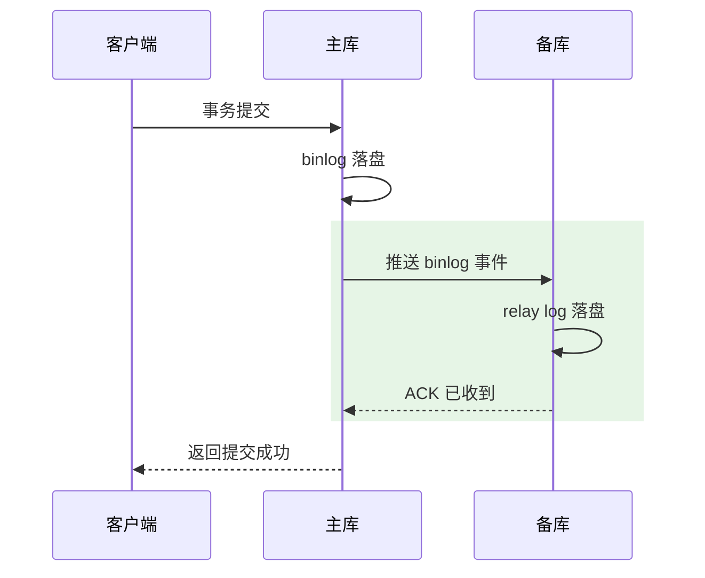

# 半同步与并行复制：收窄窗口与追平速度

> 异步复制的两大先天短板：主库崩溃可能丢「还没送达」的事务，备库单线程重放追不上多线程写入。半同步解决前者，并行复制（MTS）解决后者——这篇讲清两者的原理演进、参数口径与组合语义。

## 一句话摘要

**半同步**让主库在返回客户端前等待「至少 N 个备库已把 binlog 收进 relay log」，等待时机从 `AFTER_COMMIT`（5.5 初版）演进到 `AFTER_SYNC`（5.7 无损半同步），把外部可见才等的老问题修掉；**并行复制**让备库多线程重放，分发粒度从「按库」演进到「按组提交」再到「WRITESET 按行冲突」，把追平速度抬到接近主库写入并行度。**两者组合 = 「不丢 + 追得上」的复制基线**。

## 🎯 本文核心

**核心一句话：半同步与并行复制分别改造流水线的两端——半同步在提交路径插一步「等 ACK」（把送达变成提交的一部分），MTS 在重放端按依赖拆并行（把单线程排队变成按冲突集分佣）；前者管丢失窗口，后者管追平速度，组合才是完整复制基线。**

机制链：AFTER_COMMIT → AFTER_SYNC 的时序修正（为什么无损）→ 降级语义（尽力而为的强承诺）→ MTS 三代分发（库级 → 组提交 → 行冲突）→ preserve_commit_order 的显式取舍 → 参数基线的组合语义。全文一句话可重构：「一端等 ACK 收窗口，一端拆并行追速度」。从架构视角看，这两个改造分属主备链路的上下游两端：半同步动主库提交路径（Server 层与引擎层的衔接点），MTS 动备库重放端（协调器与 worker 的模块边界）——两端独立演进、组合生效。

## 前置阅读

- 本系列篇 1《复制协议与三线程》：三线程流水线与 GTID——本文在其上做两处改造
- 日志系列篇 2：binlog 组提交是 WRITESET 并行度的来源

## 目标导向

本文是什么：半同步的时序演进与 MTS 的分发演进。功能是什么：把「丢不丢」「追不追得上」两个复制核心命题变成参数与机制的可控项。能得到什么：容灾等级选型有据、备库延迟的结构性解法、参数组合的语义边界。为什么用：容灾方案评审、备库延迟治理、金融级主备设计，必看。

## 一、边界：入门层讲过什么，本文讲什么

| 内容 | 入门层 | 本文 |
|---|---|---|
| 半同步「听说过」、延迟「见过」 | ✅ 现象级 | 不重复 |
| AFTER_COMMIT vs AFTER_SYNC | 未讲 | **本文核心一** |
| MTS 三代分发机制 | 未讲 | **本文核心二** |
| 延迟的治理组合拳 | 未讲 | 专题层「主从与高可用深度」 |

## 二、半同步：把「送达」变成提交的一部分

异步复制下主库提交即返回，binlog 是否已到备库全凭运气。半同步在提交路径上插一步等待：



等待时机有两个版本，差异微妙但关键：

- **AFTER_COMMIT（初版半同步）**：先在引擎层 commit、再等备库 ACK。缺陷：等待期间**其他会话已经能看到这次提交**——若此刻主库崩溃且备库没收到，那些「看见了」的会话与备库世界分叉，产生幻读与数据丢失混合体
- **AFTER_SYNC（5.7+ 无损半同步）**：binlog 落盘后、引擎 commit 前 等 ACK。备库没确认，主库就不 commit——**任何外部可见的提交，binlog 必已抵达备库**，崩溃后切换零分叉，故名「无损」

配套语义：`rpl_semi_sync_master_wait_for_slave_count` 控制「等几个备库」（默认 1）；备库 ACK 超时（`rpl_semi_sync_master_timeout`，默认 10 秒）后**自动降级为异步**并在恢复后升级回来——半同步是「尽力而为的强承诺」，不是硬保证，监控降级事件是运维必修课。

## 三、并行复制：三代分发的演进

备库单线程重放是延迟的结构性来源：主库 32 线程并发写，备库 1 线程排队放，追平在数学上就不成立。MTS（多线程复制）三代演进：

| 代际 | 分发粒度 | 原理 | 局限 |
|---|---|---|---|
| 库级（5.6） | 按 schema | 不同库的事务并行 | 单库大表场景无效 |
| 组提交级 LOGICAL_CLOCK（5.7） | 按主库组提交 | **同组提交的事务无锁冲突，可并行重放** | 并行度 = 主库组提交并行度 |
| WRITESET（8.0） | 按行冲突集 | 基于行哈希判断事务是否碰同一行，不碰即并行 | 需要表有主键/唯一键 |

三代演进的主线是「**并行度判定从粗到细**」：库级看「在哪个库」，组提交看「谁和谁同时提交」，WRITESET 直接看「改的是不是同一行」。WRITESET 的妙处是打破「主库串行提交 → 备库也无法并行」的传导——即使主库组提交被拉平，按行判定仍能挖出并行空间。


保序开关 `replica_preserve_commit_order`：开启后 worker 各自执行、但**提交顺序与主库一致**——读扩散场景必备（否则备库上事务可见顺序乱掉），代价是并行度略降。这也是「并行」与「顺序可见」之间的显式取舍。

## 四、参数基线：一套可解释的组合

业内成熟的组合基线（8.0 口径）：

```text
# 半同步侧
rpl_semi_sync_master_enabled = ON
rpl_semi_sync_master_wait_point = AFTER_SYNC   # 无损
rpl_semi_sync_master_wait_for_slave_count = 1

# 并行重放侧
replica_parallel_type = LOGICAL_CLOCK          # 8.0.30+ 默认即此
replica_parallel_workers = 8~16                # 按核与负载压测定
replica_preserve_commit_order = ON             # 读扩散必备
binlog_transaction_dependency_tracking = WRITESET  # 可选加强
```

每个参数都能回答「为什么」：AFTER_SYNC 换无损、worker 数换追平速度、preserve_commit_order 换备库顺序可见——**组合语义 > 单参数值**，这正是本篇想建立的判断方式。

## 五、源码关键路径

以 8.0 主线口径：

- 半同步插件：`plugin/semisync/`——master 侧 `ReplSemiSyncMaster::commit_trx` 在 AFTER_SYNC/AFTER_COMMIT 两个挂钩点等待 ACK
- Coordinator/Worker：`sql/rpl_replica.cc` 的 Coordinator 把 relay log 事务按依赖分发给 worker 队列；LOGICAL_CLOCK 依赖信息直接读 binlog 事务的 `last_committed/sequence_number`
- WRITESET：`transaction_write_set_extract` 一族，行哈希集合随 binlog 传播，备库按集合交集判并行

阅读建议：抓「一张事务的两个号码」——`last_committed` 与 `sequence_number` 是 LOGICAL_CLOCK 并行的钥匙，备库分发逻辑完全围绕它们。

## 典型场景

- **金融主备**：无损半同步（AFTER_SYNC）+ 双 1 + `wait_for_slave_count=1`——「至少一备收到才对客承诺」，容灾等级讲得清
- **读扩散大集群**：WRITESET + preserve_commit_order——备库追得快且顺序可见，「写后读」一致性读才有底气
- **高峰延迟告警**：先看 worker 是否打满（重放瓶颈）、再看主库组提交是否被压平（并行度来源枯竭）——两条归因路径分别对应扩 worker 与治理主库提交节奏

## 业内惯例

> 💡 **实战提示**
> - 半同步降级告警是底线配置：`rpl_semi_sync_master_status` 掉 OFF 即告警——降级窗口里容灾等级在静默掉档
> - worker 数调优看利用率曲线：`replication_applier_status_by_worker` 各 worker 均匀打满才是真并行；个别 worker 独大说明冲突集中，调参数没用
> - WRITESET 上线前先扫无主键表：`information_schema.tables` 查无主键/唯一键的表清单——一张漏网表让整个库的并行判定退化
> - 半同步 + 半同步备库数按「能容忍丢几笔」定价：资金链路 count=1 起步且配两个半同步候选备库

- **AFTER_SYNC 是新建集群默认**：初版 AFTER_COMMIT 的可见性缺陷已被社区结论化，无理由新集群还选旧语义
- **worker 数压测定，不上限崇拜**：并行度超过冲突度后收益归零、调度开销上升——按 `replica_worker` 利用率调到「打不满但接近」
- **半同步降级必须告警**：降级窗口 = 静默回到异步语义，容灾等级悄悄掉档——`rpl_semi_sync_master_status` 纳入监控大盘是底线
- **WRITESET 要求主键纪律**：无主键表让 WRITESET 失效退化到组提交级——「所有表显式主键」因此又多一条理由

## 六、常见误区

- **「半同步 = 强一致」**：它只保证 binlog **送达** relay log，不保证**重放完成**——备库查询仍可能读到旧值。数据不丢与读新鲜是两件事
- **「开了半同步性能必然腰斩」**：AFTER_SYNC 的等待与网络 RTT 同量级，同机房微秒到毫秒级、跨机房才需要认真算账——把「半同步」与「跨机房半同步」分开讨论
- **「worker 越多重放越快」**：并行度受冲突集约束，worker 超过可并行事务数只是空转排队；先看 WRITESET/组提交能否提供并行空间，再谈 worker 数
- **「preserve_commit_order 关了能更快，读不到就算了」**：顺序乱掉的备库对「写后读」是正确性伤害，读扩散集群必须开——除非该从库只做备份不接流量

## 七、与相邻机制的关系

- 本系列篇 1：三线程流水线与 GTID 是本文的地基——半同步挂在 IO 线程 ACK 上，MTS 改造 SQL 线程
- 日志系列篇 2：组提交的三队列是 LOGICAL_CLOCK 并行度的源头，「主库提交节奏决定备库并行上限」的因果在那边
- tips 互指：延迟治理、校验与切换演练的组合拳在专题层「主从与高可用深度」，本文只讲机制

## 你们可能会问

**Q1：半同步超时降级了，数据会不会乱？**
不会乱，只会「退回异步语义」：主库继续提交，丢失窗口重新打开。降级期间要靠告警触发人工/自动决策（切半同步备库、限流主库），而不是依赖机制自愈。

**Q2：WRITESET 会不会把本该串行的事务并行错？**
不会。行哈希集合相交才串行，不相交即无锁冲突——判定比「同库」「同批次」都更接近冲突本质。前提是主键/唯一键完整，DDL 与无键表是已知边界。

**Q3：为什么我的半同步集群切主后还是有分叉？**
排查三件事：等待点是不是 AFTER_SYNC、ACK 的备库数、以及切换时旧主是否未完全退出（脑裂窗口）。半同步收窄窗口的前提是切换流程配合，机制与流程缺一不可。

## 八、自测三问

1. AFTER_COMMIT 与 AFTER_SYNC 的差异是什么？「无损」无损在哪？
2. MTS 三代分发各自按什么判并行？WRITESET 的前提是什么？
3. `replica_preserve_commit_order` 用什么换什么？哪些场景必须开？

## 开放问题

- 半同步的 ACK 粒度仍停留在「relay 落盘」，若演进到「重放完成才 ACK」则跨出半同步语义（更接近同步复制），等待成本与一致性的新平衡尚无定论。
- WRITESET 之后，基于更细粒度依赖（字段级/谓词级）的并行判定已有论文探索，通用化落地取决于冲突检测成本能否继续压低。

## 🎯 核心带走

- **核心一句话**：半同步收窄丢失窗口（AFTER_SYNC 无损语义），并行复制抬升追平速度（WRITESET 按行冲突判定）——组合成「不丢 + 追得上」基线
- **机制链**：两个等待点 → 降级语义 → 三代分发 → 保序取舍 → 参数组合语义
- **哪里会坏**：降级窗口静默回异步、无主键表让 WRITESET 失效、worker 空转（并行度超冲突度）
- **边界**：本篇管「两端改造」；流水线底座在篇 1，延迟的运维组合拳在专题层「主从与高可用深度」

## 📌 数据与事实声明

- 写于 2026-09-08，机制以 MySQL 8.0 为基准；AFTER_SYNC（无损半同步）自 5.7 引入、WRITESET 自 8.0 引入，为官方版本演进口径
- worker 数、同机房 RTT 影响为业内经验口径，需按环境实测
- 免责：参数名与默认值以 dev.mysql.com 官方文档为准（8.0.26+ 参数名 REPLICA 前缀化）

## 📚 参考资料

| 类型 | 标题 | 来源 |
|---|---|---|
| 官方文档 | Semisynchronous Replication / Replication Replica Options | dev.mysql.com/doc/refman/8.0/en/ |
| 官方源码 | mysql/mysql-server（sql/rpl_replica.cc、plugin/semisync/） | github.com/mysql/mysql-server |
| 实战书 | 《高性能 MySQL（第 4 版）》复制章 | 公开出版 |
| 官方博客 | MySQL 8.0 Replication 增强（WRITESET 相关） | mysqlserverteam.com（公开归档） |
