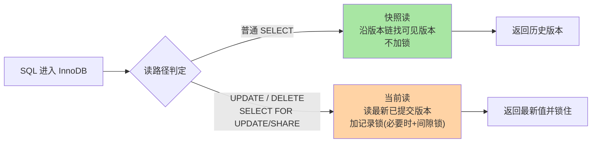
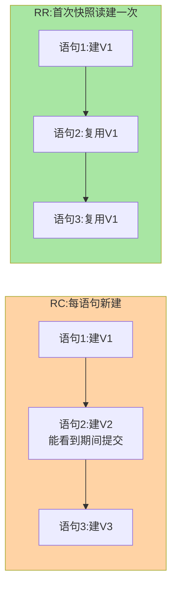

# 隔离级别的实现路径：MVCC 与锁的分工

> 入门层背过四个隔离级别能防什么。但「级别」只是对外语义——真正的问题是谁在实现它：哪些操作靠 MVCC 免锁读，哪些必须上锁，RC 和 RR 的实现差异到底有几处。本文把隔离级别还原成一张「机制分工图」，并补上跨库对比、生产事故、代价量化三个深度维度。

## 一句话摘要

InnoDB 用**两套机制拼出四个隔离级别**：普通 SELECT 走 MVCC 多版本快照读（不加锁），增删改和 `FOR UPDATE` 走当前读加锁。**RC 与 RR 的全部实现差异只有两处**——ReadView 的创建时机（每语句 vs 每事务一次）和是否启用间隙锁。理解了分工，隔离级别就从「背表格」变成了「推机制」。

跨库对照：PG 仅靠 MVCC 解决快照读，但写写冲突仍需锁；Oracle 类似 MVCC + 行锁；SQL Server 默认读已提交用锁 + 快照选项。MySQL 的特殊之处在于**把快照读完全从锁里剥离**——这是它并发能力高于多数关系型数据库的根源，也是面试高频「为什么 MySQL RC 下快照读不加锁」的答案。

## 🎯 本文核心

**核心一句话：隔离级别不是「读也一级级加锁」堆出来的，而是 MVCC 兜读侧 + 锁兜写侧的分工结果——RC 与 RR 的实现差异只有两处（ReadView 时机、间隙锁开关），其余全是这两处的推论。**

机制链：异常与实现者对照（谁防什么）→ 快照读/当前读的分叉点 → RC/RR 两处差异（时机 + 间隙锁）→ binlog 强绑定（RC 必须 ROW）→ 选型结论（互联网 RC、金融 RR 的结构性原因）→ 跨库对照 → 生产事故 → 代价量化。记住「两套机制、两处差异」，全篇可重构；ReadView 内部结构留篇 2，锁的细节留锁系列——本文只画分工图。

## 前置阅读

- 入门层篇 6《事务与隔离级别》：级别定义与并发异常现象
- 本系列篇 2《版本链与 ReadView》：MVCC 的数据结构层（本文的上层视角）
- 特性层《深入理解锁系列》：记录锁/间隙锁/临键锁的定义（本文的锁基础）

## 一、边界：入门层讲过什么，本文讲什么

| 内容 | 入门层 | 本文 |
|---|---|---|
| 四个级别的定义与并发异常 | ✅ 讲过 | 不重复 |
| 快照读与当前读的分工 | 未讲 | **本文核心一** |
| RC 与 RR 的实现差异点 | 未讲 | **本文核心二** |
| ReadView 内部结构 | 未讲 | 本系列篇 2 |
| 跨库对照 | 未讲 | **本文新增** |
| 生产事故与代价量化 | 未讲 | **本文新增** |

## 二、并发异常由谁防：一张分工表

把入门层的「级别—异常」表加一列「实现者」和「代价」，格局立刻清晰：

| 并发异常 | RU | RC | RR | 序列化 | 实现者 | 代价 |
|---|---|---|---|---|---|---|
| 脏读 | 有 | 无 | 无 | 无 | **MVCC**（只读已提交版本） | 无额外 IO |
| 不可重复读 | 有 | 有 | 无 | 无 | **MVCC**（快照固定） | 快照链回溯 IO |
| 幻读（快照读） | 有 | 有 | 无 | 无 | **MVCC**（快照不含新行） | undo 版本链增长 |
| 幻读（当前读） | 有 | 有 | 有* | 无 | **锁**（记录锁 + 间隙锁） | 插入阻塞/死锁上升 |
| 完全串行 | 有 | 有 | 有 | 无 | 锁（读也加锁） | 并发塌缩 |

*RR 下当前读的幻读由间隙锁基本消除，但极端交错场景仍有讨论空间——这也是「RR 下幻读到底消没消除」长期争论的根源：**快照读消除了，当前读靠锁基本消除**。

结论先行：**MySQL 的隔离级别不是靠「读也加锁」一级级顶上去的，而是 MVCC 兜住读侧、锁兜住写侧**。序列化是唯一「读也上锁」的级别，也是性能最差、生产几乎不用的一级。

## 三、快照读与当前读：两条不同的执行路径

同一条表数据，InnoDB 内部有两条读取路径，取决于 SQL 的类型：



三条必须咬清楚的规则：

1. **只有普通 SELECT 是快照读**。UPDATE 的 WHERE 子句虽然「看起来是读」，但它是当前读——必须看到最新值才能改，否则会覆盖别人的修改（丢失更新的直接来源）。
2. **显式加锁读也是当前读**。`FOR UPDATE` / `LOCK IN SHARE MODE`（8.0 写作 `FOR SHARE`）读最新版本并持锁到事务结束。
3. **快照读与当前读同事务混用会产生「看到的时间线不一致」**——先普通 SELECT 再 FOR UPDATE，前者可能读旧快照后者读最新值，这是「同事务两次查询结果不同」谜题的常见答案。

## 四、RC 与 RR：只有两处实现差异

**差异一：ReadView 创建时机**。ReadView 是快照读的「可见性裁决单」（结构见本系列篇 2）。RC 下**每条语句**都新建 ReadView——所以别的事务已提交的修改，下一条语句立刻可见（不可重复读因此放行）；RR 下整个事务只在**第一条快照读**时建一次，之后复用——时间线钉死在开头（可重复读因此成立）。



**差异二：间隙锁开关**。RR 为把当前读的幻读也堵住，引入间隙锁（锁住索引记录之间的区间，阻止插入）；RC 下间隙锁**整体不启用**，只有记录锁。代价随之而来：RC 下当前读挡不住别人插入新行，幻读放行——这正是它换来更高并发的结构性原因。

这两处差异还牵出一个 binlog 陷阱：RC 语义依赖「语句重放结果一致」，而 RC 下语句级回放可能乱序，因此 **RC 必须搭配 ROW 格式 binlog**——业内所有启用 RC 的团队都同时强制 ROW，这是一条强绑定约定而非可选项。

## 五、跨库对照：为什么 MySQL 的隔离实现是特殊的

| 数据库 | 快照读机制 | 写冲突机制 | 默认隔离级别 | 备注 |
|---|---|---|---|---|
| **MySQL InnoDB** | MVCC 多版本链 | next-key lock | RR（可改 RC） | 快照读完全免锁，写写才上锁 |
| **PostgreSQL** | MVCC（元组 xmin/xmax） | LWLock + tuple lock | READ COMMITTED | 每次语句新建快照，不可重复读是默认行为 |
| **Oracle** | MVCC（UNDO + SCN） | 行级排他锁 | READ COMMITTED | 快照读不阻塞写，写不阻塞快照读 |
| **SQL Server** | 可选快照隔离（RCSI） | 锁 + 键范围锁 | READ COMMITTED | 默认用锁，RCSI 是显式开启的选项 |
| **MariaDB Xpand** | MVCC（Paxos 复制） | 分布式锁 | READ COMMITTED | 分布式 MVCC，隔离语义在副本间对齐 |

**MySQL 特殊在哪**：多数数据库的快照读与当前读分界没那么「干净」——PG 的快照读在序列化级别也要上 SI 锁，Oracle 的快照读虽免锁但回滚段管理更重。MySQL 把「普通 SELECT 完全从锁里剥离」做到了极致，这是它高并发读场景的杀手锏，代价是当前读在 RR 下的间隙锁代价更显眼。

**PG 对比启示**：PG 默认 RC 下每条语句新建快照（与 MySQL RC 类似），但 PG 的「可重复读」通过 SI（Serializable Isolation）实现——用SSI（Serializable Snapshot Isolation）检测冲突而非锁，机制路径完全不同但结论相似：快照读不动锁，写写冲突才仲裁。

## 六、源码关键路径

以 8.0 主线口径（storage/innobase）：

- 读路径分叉点：`row_search_mvcc()`——先看隔离级别与锁模式，普通读进入快照逻辑（沿 roll_ptr 回溯版本链），加锁读进入 `lock_rec_lock` 路径
- ReadView 生命周期：RC 在每条语句入口 `trx_assign_read_view()` 重建；RR 复用事务首个视图（`ReadView::prepare/open`）
- 间隙锁判定：`lock_rec_insert_check_and_lock()` 里按隔离级别决定是否请求 gap lock——RC 直接跳过
- 跨库对照：PG 的快照创建在 `SnapshotNow`（语句级）vs `SnapshotAny`（事务级），InnoDB 对应 `trx->read_view` 的复用/重建逻辑

读源码建议抓「一个变量、一个函数」：`trx->isolation_level` 决定分支，`row_search_mvcc` 是两条路径的总闸，其余细节都挂在这条主线上。

## 七、生产事故推演：RC 配 STATEMENT binlog 主备分叉

**场景**：某互联网业务全局 RC + STATEMENT binlog，主库高并发下从库数据漂移。

**根因链路**：

1. RC 下事务 T1 执行 `UPDATE t SET cnt=cnt+1 WHERE id=1`（语句 A）
2. T1 又执行 `SELECT cnt FROM t WHERE id=1`（语句 B）——RC 每语句新 ReadView，看到 A 的结果
3. 但 binlog STATEMENT 格式按语句顺序回放，从库执行顺序不同 → 主备 cnt 不一致
4. 叠加并发写入，从库数据持续漂移——这是 RC + STATEMENT 的已知缺陷，不是偶发 bug

**排查 SOP**：

```sql
-- 查当前 binlog 格式
SHOW VARIABLES LIKE 'binlog_format';

-- 查隔离级别
SELECT @@transaction_isolation;

-- 查主从延迟（排查时必看）
SHOW SLAVE STATUS\G
```

**止血三步**：
1. 紧急：全局切 ROW binlog（`SET GLOBAL binlog_format=ROW`）
2. 短期：对所有 RC 会话校验 `binlog_format=ROW`（应用连接串或代理层强制）
3. 长期：把「RC + ROW」写入数据库规范，评审时作为必查项

**Trade-off**：ROW binlog 体积比 STATEMENT 大（尤其批量 UPDATE），但正确性优先。

## 八、典型场景

- **长报表查询**：多语句要看到完全一致的时间线——RR 的固定快照天然合适，且全程不加锁不阻塞业务写
- **高并发计数/状态更新**：互联网场景普遍对「不可重复读」无感——单条语句内一致即可，业内大量团队因此选 RC 换并发
- **资金核对**：跨多表的余额一致性——RR + 必要的 `FOR UPDATE` 当前读，锁与快照双保险
- **跨库对照场景**：从 PG 切 MySQL 时，RC 下的快照读行为相似但锁行为差异大——PG 默认 RC 下语句级快照但锁粒度更粗，MySQL RC 下间隙锁完全关闭，需重新评估幻读风险

## 九、业内惯例

> 💡 **实战提示**
> - 换隔离级别前先查长事务：`information_schema.innodb_trx` 里跑超过分钟级的事务清零，级别带来的问题一半会自己消失
> - RC 会话内验证法：切 RC 后用 `SHOW VARIABLES LIKE 'transaction_isolation'` 确认生效级别，再跑核心业务回归——别靠连接串猜
> - 同事务混用两类读时，把一致性要求的那次读显式写成 `FOR UPDATE`：语义自文档化，避掉双时间线谜题
> - 评审「要不要上 RR」先数当前读比例：当前读占比高的业务（扣减/抢占类）在 RR 下间隙锁冲突面大，RC 通常更顺
> - 互联网默认 RC + ROW binlog 是公开技术规范的常见建议（公开出版的 Java 开发手册即持此立场）：理由是 RR 的间隙锁在热点行场景放大锁冲突，RC 语义对多数在线业务够用
> - 金融账务场景保留 RR：跨语句一致性诉求强、并发量相对可控，「默认 RR + 显式锁」更稳
> - 级别在会话级可调：全局默认与关键任务会话允许不同级别，业内做法是「全局保守、局部放松」，改全局级别属于架构级决策
> - 监控长事务先于调级别：级别引发的多数问题（快照过旧、锁范围大）根源是事务太长——治理长事务的收益高于换级别

## 十、代价量化：RC vs RR 的真实性能差距

**量化口径**（行业经验，非官方数字）：

| 维度 | RC | RR | 差距来源 |
|---|---|---|---|
| 快照读并发 | 高 | 高 | 无差距 |
| 当前读冲突面 | 点 | 区间 | 间隙锁 |
| 插入阻塞概率 | 低 | 中~高 | 临键锁锁区间 |
| 死锁概率 | 低 | 中 | 区间交叉成环 |
| 写密集 P99 | 稳定 | 可能显著抬升 | 间隙锁放大 |
| 热点行更新吞吐 | 高 | 低~中 | 锁等待排队 |

**关键洞察**：RC vs RR 的差距不是「快多少倍」那种常数修正——而是冲突面从一个维度扩到两个维度（点 → 区间），代价随热点插入密度**非线性增长**。因此「RC 比 RR 快多少」没有通用答案，只有「当前读密集 + 热点插入」场景下 RR 的代价才会显性化为 P99 抬升。

**Benchmark 边界**：TPC-C 类标准测试通常用 RR（金融场景），互联网业务内部压测多用 RC——两套数据不可直接对比，测试环境必须用线上真实隔离级别。

## 十一、常见误区

- **「RR 就完全没有幻读」**：快照读没有，当前读靠间隙锁基本没有但不是公理级别的保证——混合使用两类读时，别把「不可能」挂在嘴边，用 `FOR UPDATE` 明确意图
- **「RC 不安全」**：RC 放弃的是「跨语句一致视图」，不是正确性——配合 ROW binlog 与乐观校验（更新带版本条件），RC 体系是经过海量生产验证的
- **「级别越高数据越安全，默认就该最高」**：每上一级都是并发能力付账，序列化在生产近乎禁用。取舍基准是「业务能容忍哪种异常」，不是「越高越好」
- **「UPDATE 的 WHERE 读的是快照」**：当前读读最新已提交版本。理解错这条，丢失更新类事故就无法归因
- **「RC 比 RR 快一倍」**：差距取决于当前读比例和热点密度，不是常数——压测用真实级别，不信通用数字
- **「其他库的 RC 语义和 MySQL 一样」**：PG 默认 RC 但快照读行为不同（语句级快照），Oracle RC 与 MySQL RC 在幻读防护上差距大——跨库迁移时隔离语义要重新评审

## 十二、与相邻机制的关系

- 本系列篇 2《版本链与 ReadView》：快照读「怎么找到该看的版本」，数据结构层在那篇展开
- 特性层《深入理解锁系列》：当前读的记录锁/间隙锁/死锁链路在那边深挖，本文只划定「什么时候需要锁」
- tips 互指：binlog 与 redo 的一致性（内部 XA）在日志系列展开

## 你们可能会问

**Q1：事务里先 SELECT 再 UPDATE，为什么两次看到的值不一样？**
大概率一次快照读一次当前读。RR 下快照读复用旧 ReadView，UPDATE 永远读最新——想让两者一致，显式 `FOR UPDATE` 把第一次读也变当前读。

**Q2：RC 下为什么 binlog 必须 ROW？**
STATEMENT 格式靠语句重放，RC 的语句级乱序会让主备数据分叉；ROW 记录行变更本身，与加锁顺序天然一致。混用 = 主备不一致的定时炸弹。

**Q3：能只把某个会话调成 RR 而全局 RC 吗？**
可以，隔离级别支持会话级设置。业内常见组合正是「全局 RC + 特殊任务会话 RR」，改全局反而是少见动作。

**Q4：PG 的 RC 和 MySQL 的 RC 行为一样吗？**
不完全一样。PG 默认 RC 下每条语句新建快照（类似 MySQL RC），但 PG 的快照读在序列化级别仍要上 SI 锁——机制路径不同，结论相似但不完全等价。从 PG 切 MySQL 必须重新评审幻读风险。

**Q5：Oracle 的隔离级别语义和 MySQL 差距在哪？**
Oracle 默认 READ COMMITTED（类似 MySQL RC），但 Oracle 的快照读由 UNDO + SCN 驱动，回滚段管理更重；Oracle 的 SERIALIZABLE 通过 SSI 实现而非锁，机制路径完全不同。

## 十三、自测三问

1. 哪些 SQL 走快照读、哪些走当前读？UPDATE 的 WHERE 呢？
2. RC 与 RR 的两处实现差异是什么？各换来什么收益与代价？
3. 脏读、不可重复读、幻读分别由哪套机制在哪个级别上消除？

## 开放问题

- 快照读与当前读的「双时间线」是 InnoDB 的实现选择而非 SQL 标准要求，其他数据库（如 PG 的 MVCC 只作用于读、写仍需处理）采用了不同折中，哪种更优仍在被业务形态检验
- 分布式数据库里「快照」要跨节点对齐时钟（TSO/HLC），单机隔离级别语义如何平移到分布式快照隔离，各家路线尚未收敛
- 随着硬件演进（NVMe 延迟下降、内存容量上升），RR 间隙锁的代价是否正在缩小——业内暂无定论

## 🎯 核心带走

- **核心一句话**：隔离级别 = MVCC（读侧快照）+ 锁（写侧互斥）的分工；RC/RR 只差 ReadView 时机与间隙锁开关
- **机制链**：异常-实现者对照 → 快照读/当前读分叉 → 两处差异 → RC+ROW 强绑定 → 分场景选型 → 跨库对照
- **哪里会坏**：混用两类读的双时间线、RC 配 STATEMENT binlog（主备分叉）、RR 热点行间隙锁冲突
- **边界**：本篇画「分工图」；ReadView 结构在篇 2，加锁规则与死锁在锁系列，级别语义入门在入门层篇 6

## 📌 数据与事实声明

- 写于 2026-09-10，机制以 MySQL 8.0 InnoDB 为基准；RC/RR 实现差异、间隙锁行为以官方文档为准
- 「业内常用 RC + ROW」为公开技术规范与社区通行口径，非官方推荐
- 「RC vs RR 性能差距」为行业经验口径（业内认知），具体幅度以实测为准
- 跨库对照基于公开资料（PG/Oracle/SQL Server 官方文档），细节以各版本官方为准
- 免责：默认级别与参数以 dev.mysql.com 官方文档为准

## 📚 参考资料

| 类型 | 标题 | 来源 |
|---|---|---|
| 官方文档 | Transaction Isolation Levels / InnoDB Locking | dev.mysql.com/doc/refman/8.0/en/ |
| 官方源码 | mysql/mysql-server（storage/innobase/row/row0sel.cc） | github.com/mysql/mysql-server |
| 原理书 | 《MySQL 技术内幕：InnoDB 存储引擎》姜承尧 | 公开出版 |
| 实战书 | 《高性能 MySQL（第 4 版）》事务章 | 公开出版 |
| 跨库参照 | PostgreSQL 9.6+ Serializable Snapshot Isolation | github.com/postgres/postgres |