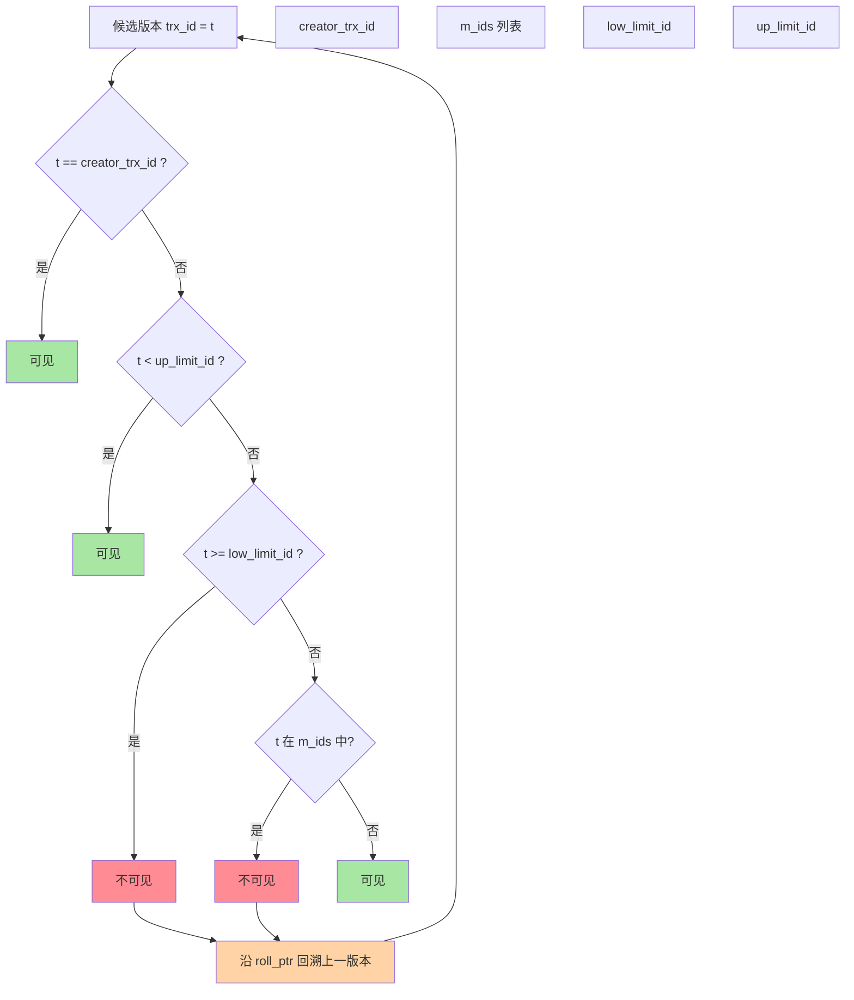
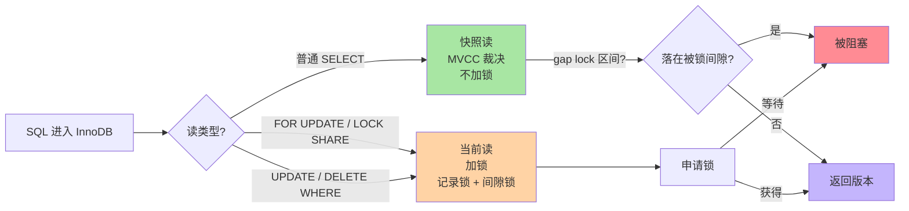
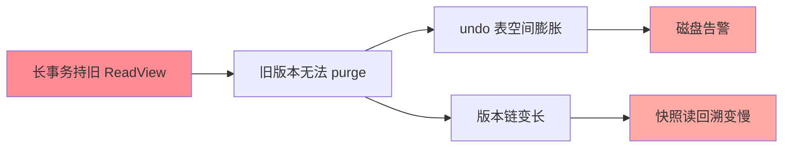
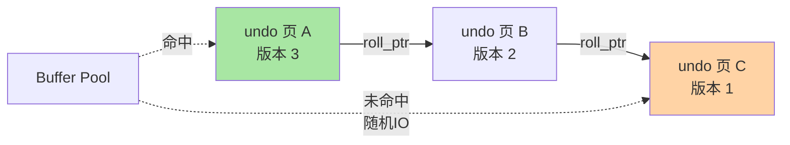

# 版本链与 ReadView：多版本可见性的裁决机制

> 快照读「不加锁还能看到一致的数据」，靠的是每行背后的一条版本链和一张叫 ReadView 的裁决单。这篇把两个结构拆开：版本怎么串成链、可见性怎么判定、长事务为什么能把整个 undo 空间拖爆。并补上跨库对照（PG/Oracle 的 MVCC 实现差异）和生产事故推演。

## 一句话摘要

InnoDB 每行数据带两个隐藏列：最后修改它的**事务 ID（trx_id）**和指向上一版本的**回滚指针（roll_ptr）**——更新产生的旧版本经 undo log 串成**版本链**。快照读时拿一张 **ReadView**（记录「生成时刻谁还活跃」），沿链回溯对每个版本的 trx_id 做可见性判定，找到第一个可见版本返回。**整个过程不加任何锁**，这就是 MVCC 的全部机密。

跨库对照：PG 用元组头 xmin/xmax + CLOG 可见性图，Oracle 用 UNDO + SCN 判可见，MySQL 用 roll_ptr 链 + ReadView 裁决——三者「存版本 / 判可见」的两步组合各不相同，但核心思想一致：读不加锁，靠历史版本。

## 🎯 本文核心

**核心一句话：MVCC = 版本链（数据从哪来）+ ReadView（谁可见）的裁决组合——更新是「压栈」旧版本而非覆盖，快照读拿活跃事务名单沿链找第一个可见版本；长事务拽住名单不放，purge 就回收不了，undo 膨胀与全库变慢是同一条因果链。**

机制链：隐藏列与压栈式更新 → 版本链结构 → ReadView 四字段 → 五步可见性算法 → RC/RR 时机之差在结构层的解释 → 快照读与锁的交互边界 → purge 代价链 → undo 物理布局的回溯成本 → 跨库对照 → 生产事故。全文一句话可重构：「链上找版本，名单判可见，名单不放，链就收不回」。

## 前置阅读

- 本系列篇 1《隔离级别的实现路径》：快照读/当前读的分工、ReadView 的创建时机
- 入门层篇 7《MVCC 机制》：可见性结论的用法层

## 一、边界：入门层讲过什么，本文讲什么

| 内容 | 入门层 | 本文 |
|---|---|---|
| MVCC = 多版本并发控制、读写不阻塞 | ✅ 讲过 | 不重复 |
| 隐藏列与版本链怎么串起来 | 未讲 | **本文核心一** |
| ReadView 结构与判定算法 | 口诀级 | **本文核心二** |
| purge 与长事务的代价链 | 未讲 | **本文核心三** |
| 跨库对照 | 未讲 | **本文新增** |
| undo 物理布局与回溯代价 | 未讲 | **本文新增** |

## 二、版本链：更新不是覆盖，是「压栈」

每行记录头部有三个本文关心的隐藏字段：

- `DB_TRX_ID`：最后修改（插入/更新/删除）该版本的事务 ID
- `DB_ROLL_PTR`：指向 undo log 里该行的**上一个版本**
- `DB_ROW_ID`：无主键时的隐藏聚簇键（与本篇关系不大）

一次 UPDATE 的实际动作：**把旧版本写入 undo log，再在原位置写新版本，roll_ptr 指向 undo 里的旧版**。连续更新三次，就形成一条从「当前最新」往回穿的链：


两个细节决定理解上限：

1. **删除也是一条「版本」**：DELETE 打删除标记（delete bit），行在链上仍是合法版本，只是可见性判定会把它当「不存在」处理。真正的空间回收是 purge 线程的活（见第五节）。
2. **undo log 身兼两职**：它既是 MVCC 的版本仓库，又是事务回滚的数据来源——同一份数据服务两个机制，这是 InnoDB 空间设计上的精明取舍，也是「undo 涨了影响的不只是回滚」的根源。

## 三、ReadView：一张「谁还活着」的名单

快照读开始时，事务向系统要一张 ReadView，核心字段四个：

| 字段 | 含义 |
|---|---|
| `m_ids` | 生成时刻**尚且活跃**（未提交）的事务 ID 列表 |
| `low_limit_id` | 生成时刻系统应分配的**下一个**事务 ID（水位上界） |
| `up_limit_id` | m_ids 中**最小**的活跃事务 ID（水位下界） |
| `creator_trx_id` | 自己的事务 ID |

**可见性判定算法（Mermaid 决策图）**：



四步判定逻辑：

1. `t == creator_trx_id` → 可见（自己写的永远可见）
2. `t < up_limit_id` → 可见（生成快照前已提交）
3. `t >= low_limit_id` → 不可见（快照后才开启的事务）
4. `up_limit_id <= t < low_limit_id`：
   - `t` 在 `m_ids` 里 → 不可见（当时活跃，还没提交）
   - `t` 不在 `m_ids` → 可见（当时已提交）
5. 不可见 → 沿 `roll_ptr` 回溯上一版本，回到步骤 1

把这个算法和本系列篇 1 的「RC 每语句建视图、RR 只建一次」拼起来，所有现象都对上了：RR 下别的事务后来提交了，但它仍在「我这张旧名单」的 `m_ids` 里（或落在低水位之上），沿链回溯继续往旧找——所以你看到的永远是事务开头那个世界。RC 每语句换新名单，新提交立刻落进「已提交」区——不可重复读放行。

## 四、跨库对照：MySQL vs PG vs Oracle 的 MVCC 实现差异

三者的「存版本 / 判可见」组合各不相同，但核心思想一致：

| 数据库 | 版本存储 | 可见性判定 | 关键差异 |
|---|---|---|---|
| **MySQL InnoDB** | undo log 链 + roll_ptr | ReadView 四字段 + 五步算法 | 回溯沿链，名单在事务层 |
| **PostgreSQL** | 元组头 xmin/xmax + CLOG | xmin 可见性图 | 每次语句新建快照，CLOG 是物理存储 |
| **Oracle** | UNDO 段 + SCN | SCN 比较（读时刻的快照 SCN） | UNDO 是独立表空间，回溯靠 SCN 排序 |

**MySQL 特殊在哪**：PG 的可见性判定是位图扫描（O(1)），Oracle 的判定是 SCN 比较（O(1)），MySQL 是沿链回溯（O(链长)）。链长受 undo 保留量约束——这是 MySQL MVCC 性能不确定性的根源，也是长事务拖垮全库的本源。

**PG 对比启示**：PG 默认 RC 下每条语句新建快照（类似 MySQL RC），但 PG 的「可重复读」通过 SI（Serializable Snapshot Isolation）实现——用 SSI 检测冲突而非锁。机制路径完全不同，但结论相似：快照读不动锁，写写冲突才仲裁。

## 五、创建时机的实现侧呼应

RR 的「只建一次」有个容易忽略的实现细节：ReadView 是在**第一条快照读**时创建，不是 `BEGIN` 时。也就是说 `BEGIN;` 之后先执行了一条当前读（UPDATE），再快照读，快照的时间线从当前读之后算起——「RR 的事务开始时刻」在实现层面是「第一个快照读时刻」。要在长事务里锚定明确时间线，业内惯例是事务开头先做一次基准读。

## 六、MVCC 与锁的交互：快照读 ≠ 不受阻塞

MVCC 的核心承诺是「读不加锁」，但这有个前提：**纯快照读**。一旦读操作混入当前读语义，MVCC 退场、锁上场。

**快照读何时被阻塞**：

- `SELECT ... LOCK IN SHARE MODE`（`FOR SHARE`）— 当前读，走锁路径
- `UPDATE ... WHERE ...` — 当前读，先锁再读
- `DELETE ... WHERE ...` — 当前读，先锁再删
- `INSERT ... ON DUPLICATE KEY UPDATE` — 唯一键冲突时走锁路径

**关键边界**：快照读不会被记录锁阻塞，但会被 **gap lock / next-key lock** 阻塞——因为 gap lock 锁的是「索引间隙」而非记录本身，快照读执行时若落在被锁的间隙上，会被阻塞等待锁释放。



这解释了面试高频题：**RR 下快照读为什么不会被幻读阻塞，但当前读会？**——快照读沿版本链回溯不看最新数据，不触发锁判定；当前读必须看到最新值，必须先确认没有冲突的锁。

## 七、purge 与长事务：一条代价链

版本链不会自己消失。没有人的 ReadView 还需要某个旧版本时，purge 线程才把它从 undo 里回收。于是形成一条著名的代价链：

**长事务不结束 → 它的 ReadView 持续有效 → 它可能需要的旧版本都不能回收 → undo 空间持续膨胀 → 版本链越拉越长 → 后来的快照读沿链回溯变慢 → 全库读写共同买单**。



这就是「长事务治理」排在多数团队数据库规范前列的底层原因——它伤害的不只是这个事务自己。

## 八、undo 版本链的物理布局：回溯的实际代价

上节说「沿 roll_ptr 回溯」，但回溯不是内存操作——每次回溯可能触发**页读**。undo 版本在 undo 表空间中的组织方式，决定了版本链回溯的真实成本。

**undo 页的组织**：

| 层级 | 结构 | 说明 |
|---|---|---|
| undo 表空间 | 段（segment） | 每个回滚段 128 个 undo 页 |
| undo 页 | 行堆 + 页目录 | 类似 B+ 树叶节点，按插入顺序堆组织 |
| 版本链 | 跨页链表 | roll_ptr 指向 undo 页内的具体行 |

**关键影响**：

1. **同一 undo 页内的版本**：顺序读，几乎零代价
2. **跨 undo 页的回溯**：每次回溯 = 一次随机 IO（undo 页可能不在 Buffer Pool）
3. **长事务的版本链跨越多页**：回溯成本线性增长——这就是「长事务把 undo 拖爆」不仅是空间问题，也是 IO 问题



**调优启示**：

- 增大 `innodb_buffer_pool_size` → undo 页更可能常驻 Buffer Pool → 回溯成本下降
- 短事务 + 分批提交 → 版本链短 → 回溯路径短
- 这与篇 3（undo 回滚段与 purge 治理）联动：purge 清理旧版本 = 缩短链长 = 降低回溯 IO

## 九、源码关键路径

以 8.0 主线口径（storage/innobase）：

- ReadView 构建：`MVCC::view_open() → ReadView::prepare()`——收集活跃事务数组、写上下水位
- 可见性判定：`ReadView::changes_visible()`——第三节算法的直接实现，判断失败即需要回溯
- 版本回溯：`row_search_mvcc()` 循环里 `trx_t::... → row_sel_build_prev_version_for_mysql()` 沿 roll_ptr 逐版本应用 undo（含 delete bit 处理）
- purge：`trx_purge()` 一族，按最老活跃 ReadView 计算可回收水位（`purge_sys->clone_oldest_view`）

阅读建议：先读 `ReadView::changes_visible()`（二十行以内，把第三节算法对上号），再逆着一条慢查询沿回溯路径走一遍，整条机制就闭环了。

## 十、生产事故推演：长事务把 undo 拖爆

**场景**：某报表系统一个事务跑 3 小时，undo 表空间告警，全库读写性能塌方。

**根因链路**：

1. 长事务开启 → ReadView 一直有效（RR 下第一个快照读建视图）
2. 期间其他事务不断更新数据 → undo 版本链持续增长
3. purge 无法回收被旧 ReadView 引用的版本 → undo 表空间膨胀
4. 版本链变长 → 后来所有快照读回溯变慢 → 全库读性能下降
5. undo 空间用满 → 写入阻塞 → 业务全面受影响

**排查 SOP**：

```sql
-- 查最老事务（往往就是持链人）
SELECT trx_id, trx_started, trx_state, trx_query
FROM information_schema.innodb_trx
ORDER BY trx_started ASC LIMIT 1;

-- 查 undo 占用
SELECT tablespace_name, SUM(actual_size) / 1024 / 1024 AS mb
FROM information_schema.undo_tablespaces
GROUP BY tablespace_name;
```

**止血三步**：
1. 紧急：kill 最老事务（undo 释放）
2. 短期：事务禁混入 RPC/人工等待（毫秒到秒级）
3. 长期：undo 独立表空间 + `innodb_undo_log_truncate = ON`

**Trade-off**：undo 自动 truncate 需要独立表空间 + 8.0 默认开启。旧版共享 undo 表空间需手动 shrink。

## 十一、典型场景

- **后台大批量更新**：一个事务刷千万行 = 超长版本链 + 阻塞 purge——业内默认拆批提交（每批数千到数万行），批次间留喘息让 purge 跟上
- **导出/报表长查询**：只读长事务同样持 ReadView，与写事务同罪——导出走备库或分页断点续读
- **undo 空间告警排查**：先查 `information_schema.innodb_trx` 最老事务，八成能直接找到持链人；独立 undo 表空间（8.0 默认）+ `innodb_undo_log_truncate` 才有自动收缩的余地
- **跨库对照场景**：从 Oracle 切 MySQL 时，UNDO 表空间的管理方式不同（Oracle UNDO 是独立表空间，MySQL 8.0 默认独立 undo tablespace），但长事务持 ReadView 的逻辑完全相同——迁移时治理经验可直接复用

## 十二、业内惯例

> 💡 **实战提示**
> - 排查 undo 告警第一命令永远是「找最老事务」：`innodb_trx ORDER BY trx_started ASC LIMIT 1`——八成直接抓到持链人
> - 批量更新分批大小按「批间 purge 能跟上」定，不是按「单批多大不超时」定：让 purge 喘口气比单批阈值更重要
> - RR 长事务开头先做一次基准 SELECT：把快照锚在业务明确的位置，避开「BEGIN 后先写后读」的时间线漂移
> - Buffer Pool 富余时优先喂给它：undo 页常驻内存，回溯从随机 IO 变内存读，长链代价减半
> - 事务内禁混入 RPC/人工等待：跨网络的活移出事务——几乎所有公开数据库规范的第一条
> - 监控最老事务时长：`innodb_trx.trx_started` 与当前时间的差值上告警（阈值业内常见分钟级），而不是等 undo 告警
> - RR 事务开头先基准读：把快照时间锚定在业务明确的位置，避免「BEGIN 后先写后读」造成的时间线漂移
> - undo 独立表空间 + 自动 truncate 保持开启：8.0 的默认演进方向，升级核对一遍配置属于例行项

## 十三、常见误区

- **「RR 快照 = 事务开始时把数据复制一份」**：物理上没有复制，只有一份当前数据 + undo 链 + 可见性判定。快照是**逻辑视图**，这是 MVCC 空间成本可控的原因
- **「undo 是备份，平时没用来」**：它每秒都在服务所有并发快照读。undo 出问题不是「回滚不了」这么简单，是全库读性能一起塌
- **「读旧版本需要加锁等写事务提交」**：沿版本链回溯即可，读写永远不互相阻塞——这正是 MVCC 相对「读写锁」方案的演进意义
- **「DELETE 了就释放空间」**：删除标记 + purge 延迟回收，长事务在场的删除一样回收不了
- **「undo 膨胀只能加大磁盘」**：核心手段是缩短链长（短事务+分批提交）而非加大空间——治标不如治本

## 十四、与相邻机制的关系

- 本系列篇 1《隔离级别的实现路径》：ReadView 的创建时机差异（RC/RR）在那篇，本文是它的数据结构底座
- 特性层《深入理解日志系列》：undo 与 redo 的分工、purge 的日志侧约束在那边展开
- tips 互指：入门层篇 8《锁机制》——当前读加锁与快照读免锁的分界在篇 1，锁本身的细节在锁系列

## 你们可能会问

**Q1：为什么 ReadView 要记「活跃事务列表」，只记水位不行吗？**
只看水位无法区分「快照后开启的」和「快照前开启但还没提交的」——后者虽在水位区间内，但它提交后的版本对快照不可见（生成时刻它还活跃）。m_ids 正是补这个判别的。

**Q2：RR 下对方都提交了，我为什么还读不到？**
你的 ReadView 生成在它提交之前，它的 trx_id 落在你名单的活跃区——沿链往回找旧版本是按算法办事。要看到新值：要么 RC、要么开新事务、要么当前读。

**Q3：purge 会阻塞业务吗？**
purge 有独立线程与节流参数（`innodb_purge_threads` / `innodb_max_purge_lag`），积压时会自我限速——但「堆积到自我限速」本身就是治理警报，别把限速当容量规划。

**Q4：Oracle 的 UNDO 和 MySQL 的 undo 表空间有什么不一样？**
Oracle UNDO 是独立表空间（默认 undo 表空间），支持自动扩展和手动 shrink；MySQL 8.0 默认独立 undo tablespace + `innodb_undo_log_truncate = ON` 自动 truncate。两者底层实现不同（Oracle UNDO 是回滚段循环写，MySQL undo 是段内页链表），但长事务持 ReadView 阻止 purge 的逻辑完全相同——迁移时治理经验可直接复用。

**Q5：PG 的可见性判定为什么是 O(1)？**
PG 用 CLOG（Commit Log）位图记录每个事务的提交状态，可见性判定只需查位图——不需要沿链回溯。这是 PG 快照读性能稳定的根源，但代价是 CLOG 随事务 ID 持续增长，需要 vacuum 清理。

## 十五、自测三问

1. 版本链靠哪两个隐藏字段串起来？更新一行的完整动作是什么？
2. 写出可见性判定的五步算法，并说明 m_ids 为什么必须存在。
3. 长事务拖垮全库的完整代价链是什么？治理的第一刀切在哪？

## 开放问题

- 版本链长度与回溯成本线性相关，超长事务场景下「读旧版本」的成本模型如何影响 HTAP 架构里 OLAP 查询的落点选择，业内仍在摸索
- 分布式数据库的可见性判定需全局事务序（TSO/HLC），单机 ReadView 语义向分布式快照的平移路径，各家实现尚无统一范式
- 随着硬件演进（NVMe 延迟下降、内存容量上升），undo 页常驻 Buffer Pool 的比例上升，回溯代价是否会显著下降——业内暂无定论

## 🎯 核心带走

- **核心一句话**：版本链存旧版本、ReadView 判可见性——更新是压栈不是覆盖；名单不放，链收不回，undo 膨胀与全库变慢同源
- **机制链**：隐藏列 → 压栈更新 → 版本链 → ReadView 四字段 → 五步算法 → 锁交互边界 → purge 代价链 → undo 页回溯成本 → 跨库对照
- **哪里会坏**：长事务持名单（purge 停摆）、跨页回溯随机 IO、误以为 RR 快照是「复制了一份」
- **边界**：本篇是结构层；创建时机差异在篇 1，purge 的日志侧联动在本系列日志篇与篇 3《undo 回滚段与 purge 治理》

## 📌 数据与事实声明

- 写于 2026-09-10，机制以 MySQL 8.0 InnoDB 为基准；隐藏列与 undo/purge 行为以官方文档为准
- 「分批大小数千至数万行」为业内经验口径，具体值需按行宽与负载实测
- 跨库对照基于公开资料（PG/Oracle 官方文档），细节以各版本官方为准
- 免责：参数默认值以 dev.mysql.com 官方文档为准

## 📚 参考资料

| 类型 | 标题 | 来源 |
|---|---|---|
| 官方文档 | InnoDB Multi-Versioning / Undo Logs | dev.mysql.com/doc/refman/8.0/en/innodb-multi-versioning.html |
| 官方源码 | mysql/mysql-server（storage/innobase/read/read0read.cc） | github.com/mysql/mysql-server |
| 原理书 | 《MySQL 技术内幕：InnoDB 存储引擎》姜承尧 | 公开出版 |
| 实战书 | 《高性能 MySQL（第 4 版）》事务章 | 公开出版 |
| 跨库参照 | PostgreSQL 9.6+ MVCC / Oracle UNDO 管理 | github.com/postgres/postgres / oracle.com |