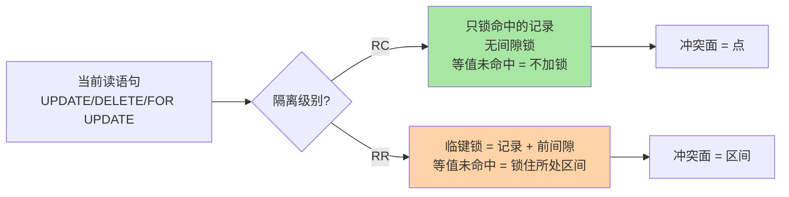
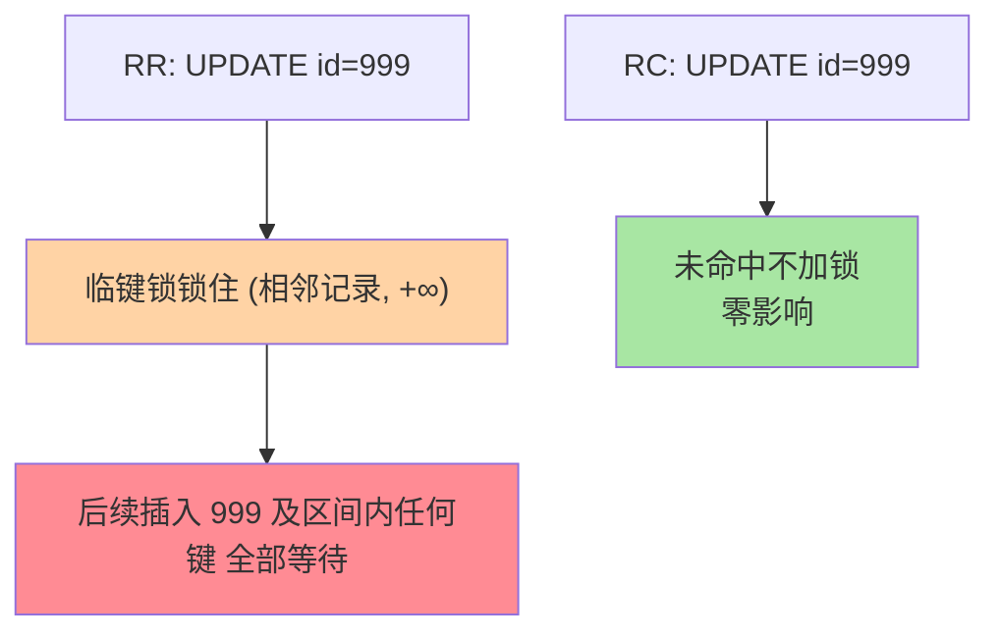

# 当前读与加锁读：加锁规则与冲突面量化

> 篇 1 划清了「快照读走 MVCC、当前读走锁」的分工，篇 2 拆了 ReadView。本篇只回答一个递进问题：**当前读到底锁多大**——RC 与 RR 的加锁行为差异如何把「点冲突」放大成「区间冲突」，这把锁的代价怎么量化。并补上生产事故、代价量化、跨库对照三个深度维度。

## 一句话摘要

当前读（UPDATE/DELETE/`FOR UPDATE`）按隔离级别走出两套加锁行为：**RC 只锁真正命中的记录**（无间隙锁，等值未命中不加锁）；**RR 默认临键锁**（记录 + 前间隙，等值未命中也会锁住所处区间）。冲突面的差别就是并发度的差别：写密集场景下 RR 的间隙锁把「点到点的竞争」放大成「区间段的竞争」，插入被成片阻塞、死锁概率上升——这就是「RR 更严格」背后的隐形成本账。

## 🎯 本文核心

**核心一句话：当前读的加锁面积 = 命中记录 + （RR 才有的）前置间隙——RR 的临键锁让「锁不存在的东西」成为常态（等值未命中也锁区间），RC 让「锁不存在的行 = 不加锁」；锁面积差一个维度，并发与死锁表现就差一个量级。**

机制链：加锁规则对照（RC/RR 四行对照）→ 等值未命中的两种命运 → 热点案例（UPDATE 不存在的 id）→ 代价量化（点冲突 vs 区间冲突）→ 源码分叉点 → 跨库对照 → 场景化选型 → 生产事故。全文围绕一个变量展开：**锁的面积**。从架构视角看，这也是 Server 层语义（隔离级别）与引擎层实现（加锁面积）的上下游传导——语义上一档之差，到引擎层就是锁模块边界内冲突面积的一个维度之差。

## 前置阅读

- 本系列篇 1《隔离级别的实现路径》：快照读/当前读分工、RC/RR 两处实现差异（本文的上层语义）
- 本系列篇 2《版本链与 ReadView》：可见性算法（快照读侧的机制）
- 特性层《深入理解锁系列》：记录锁/间隙锁/临键锁的定义与死锁检测（本文的锁基础）

## 一、边界：篇 1 讲过什么，本文讲什么

| 内容 | 篇 1 / 锁系列 | 本文 |
|---|---|---|
| 快照读 vs 当前读的分工 | ✅ 正式定义 | 不重复 |
| ReadView 时机（RC 每语句 / RR 每事务） | ✅ 正式定义 | 不重复 |
| 间隙锁「是什么」（锁索引区间防插入） | ✅ 锁系列 | 不重复 |
| **当前读在 RC/RR 下的加锁面积差异** | 提了一句 | **本文核心** |
| **等值未命中锁区间的热点案例与量化** | 未讲 | **本文核心** |
| 跨库对照 | 未讲 | **本文新增** |
| 生产事故 | 未讲 | **本文新增** |

## 二、当前读加锁规则对照



```text
RC 当前读：
  - 记录锁 ✓（仅锁真正命中的行）
  - 间隙锁 ✗（不锁间隙）
  - 等值未命中 → 不加锁

RR 当前读：
  - 记录锁 ✓
  - 间隙锁 ✓（默认临键锁 = 记录 + 前间隙）
  - 等值未命中 → 锁住所在区间的临键锁
```

## 三、热点案例：UPDATE 一行不存在的 id

`UPDATE t SET a = 1 WHERE id = 999`（999 不存在）——两条级别两种命运：



这是锁等待排查的高频真相：**业务「检查后更新一个可能不存在的键」的写法，在 RR 下等于「顺便锁住一段插入窗口」**。若 999 附近是热点自增区，并发插入全被这把临键锁串成排队——现象是「我没锁任何行，为什么插入全堵了」。

## 四、代价量化：点冲突 vs 区间冲突

| 维度 | RC | RR | 差距来源 |
|---|---|---|---|
| 间隙锁 | ✗ | ✓ | 间隙锁 |
| 幻读防护（当前读） | 无 | 有 | 间隙锁 |
| 插入阻塞 | 仅命中行竞争 | 锁区间内成片阻塞 | 临键锁锁区间 |
| 死锁概率 | 低（冲突面小） | 高（区间交叉易成环） | 区间交叉 |
| 写密集 P99 | 稳定 | 可能显著抬升 | 间隙锁放大 |
| 热点行更新吞吐 | 高 | 低~中 | 锁等待排队 |

**量化口径**（行业经验，非官方数字）：写密集场景 RR 的 P99 可能比 RC 抬升数倍，根因就是间隙锁把「点冲突」放大为「区间冲突」——冲突面积不是一个常数修正，而是随热点插入密度非线性增长。这也解释了「金融/账务类写入可控的场景用 RR 没问题，秒杀/热点更新类场景 RR 就开始疼」的分界。

**Benchmark 边界**：TPC-C 类标准测试通常用 RR（金融场景），互联网业务内部压测多用 RC——两套数据不可直接对比，测试环境必须用线上真实隔离级别。

## 五、跨库对照：RC/RR 加锁行为在 PG 与 Oracle 的对标

| 数据库 | RC 等值未命中 | RR 等值未命中 | 间隙锁机制 | 备注 |
|---|---|---|---|---|
| **MySQL InnoDB** | 不加锁 | 临键锁锁区间 | next-key lock（记录+前间隙） | RR 默认，RC 关闭间隙锁 |
| **PostgreSQL** | 不加锁 | SI 锁（Serializable Predicate Lock） | SSI 检测冲突 | PG 的 RR 通过 SSI 实现，非锁区间 |
| **Oracle** | 不加锁 | 行级排他锁 | 无间隙锁概念 | Oracle 的 SERIALIZABLE 通过 SSI 实现 |
| **SQL Server** | 不加锁 | 键范围锁 | 键范围锁（Key-Range Lock） | RCSI 选项关闭间隙锁 |

**关键洞察**：MySQL 是唯一把「间隙锁」作为 RR 默认行为的关系型数据库——PG 和 Oracle 靠 SSI 检测幻读而非锁区间，SQL Server 用键范围锁但可以选 RCSI 关闭。MySQL 的选择是「锁先行」，其他库是「检测先行」——前者写密集场景下阻塞更直接，后者检测开销更大但阻塞面更可控。

## 六、源码关键路径

以 8.0 主线口径（storage/innobase）：

- 加锁入口：`lock_rec_lock()`——按隔离级别与锁模式决定请求记录锁还是临键锁
- 间隙锁判定：`lock_rec_insert_check_and_lock()`——插入前检查目标间隙是否被锁，RC 路径直接跳过 gap 请求
- 未命中场景：`row_search_mvcc()` 中 `btr_pcur` 定位失败后，RR 按所在区间加 next-key，RC 直接返回

阅读建议：拿「UPDATE 不存在的 id」当测试用例，分别开 `SET GLOBAL log_error_verbosity` 与 information_schema 的 `innodb_trx`/`data_locks`（8.0 的 `performance_schema.data_locks`）观察两种级别实际持有的锁——比读十页文档直观。

## 七、生产事故推演：RR 下未命中 UPDATE 锁区间引发插入阻塞

**场景**：某订单系统 RR 隔离级别，运营后台批量 `UPDATE orders SET status='shipped' WHERE id = ?`，其中部分 id 在从库不存在。高峰期插入新订单频繁超时。

**根因链路**：

1. 运营脚本按主键批量更新，部分 id 不存在
2. RR 下每个未命中 id 都锁住所在区间的临键锁
3. 后续插入恰好落在这些区间内——全被阻塞
4. 业务侧表现为「插入超时」，但锁等待链指向 UPDATE 语句
5. 排查时若只看 `SHOW PROCESSLIST` 的 State=「Waiting for table metadata lock」会误判——实际是行锁等待

**排查 SOP**：

```sql
-- 查锁等待链
SELECT * FROM information_schema.innodb_trx WHERE trx_state = 'LOCK WAIT';

-- 查持有锁的事务
SELECT * FROM performance_schema.data_locks WHERE LOCK_MODE LIKE '%G%';

-- 查等待锁的事务
SELECT * FROM performance_schema.data_lock_waits;
```

**止血三步**：
1. 紧急：kill 持有锁的事务（找到锁等待链的源头）
2. 短期：改写业务代码——对可能不存在的 id 先 SELECT 再决定 UPDATE，或改用 `INSERT ... ON DUPLICATE KEY UPDATE`
3. 长期：评估当前读密集的业务是否适合切 RC（篇 1 已展开选型逻辑）

**Trade-off**：改代码比调参数更治本，但改代码需要业务侧配合；调参数（切 RC）是快速止血但可能牺牲一致性语义。

## 八、典型场景

- **秒杀热点行**：扣减类当前读集中在少数行——RC 的点锁让排队最短；RR 的临键锁会把邻近插入也拖进来
- **订单状态机**：`UPDATE orders SET status='paid' WHERE order_no=?` 且 order_no 必存在——RR 安全无额外代价，未命中即异常的业务语义下不构成区间热点
- **幂等检查写法**：`INSERT ... ON DUPLICATE KEY` 或「先 SELECT FOR UPDATE 再决定」——注意 RR 下 FOR UPDATE 未命中同样锁区间，幂等写法本身可能制造热点
- **对账修正任务**：批量 UPDATE 按主键升序分批——锁按同一方向获取，两种级别下都压死锁概率（锁系列篇的死锁预防原则）
- **跨库对照**：从 SQL Server 切 MySQL 时，RCSI 选项关闭间隙锁，MySQL 的 RR 语义比 SQL Server 的默认更严格——迁移时必须重新评估幻读风险

## 九、业内惯例

> 💡 **实战提示**
> - 排查插入莫名等待，先查 `performance_schema.data_locks` 里有没有「LOCK_MODE 含 G」的区间锁持有者——八成是某条 UPDATE 未命中留下的临键锁
> - 「检查后写入」的代码在 RR 下要重审：改成原子写（`UPDATE ... WHERE ...` 判 affected rows）或 `ON DUPLICATE KEY`，把未命中锁区间的机会消掉
> - 高并发扣减的锁优化顺序：先缩事务（锁持有时间）→ 再换 RC（缩锁面积）→ 最后才考虑队列化
> - 两种级别切换前在预发压测当前读比例：当前读占比高的业务切 RC 收益最大，纯快照读业务切了没感觉
> - RC + ROW binlog 强绑定：RC 语义下 STATEMENT 复制有主备分叉风险，启用 RC 的团队一律强制 ROW（篇 1 已展开原理）
> - 监控锁等待以「区间锁」为单独维度：`data_locks` 里 LOCK_MODE 带 GAP 的等待单独告警——它背后通常是「未命中 UPDATE」这类可改写的业务模式
> - 死锁日志例行分析：区间交叉成环是 RR 死锁的主要形态，`LATEST DETECTED DEADLOCK` 周期归档分析

## 十、常见误区

- **「RR 一切都比 RC 安全」**：一致性语义更强是真的，但「未命中锁区间」引入了新的故障模式（插入阻塞、死锁上升）——安全与可用要分开定价
- **「等值 UPDATE 找不到行就没有代价」**：RR 下恰好相反，未命中是锁区间的主要来源之一
- **「把 gap 锁关小一点就行」**：间隙锁是 RR 语义的一部分，没有「调小」的旋钮；要小锁面积就是 RC，这是级别选择不是参数调优
- **「SELECT FOR UPDATE 是轻量操作」**：它是当前读，RR 下带完整临键锁语义——用在只读判断上是把写锁当读缓存用，方向性错误
- **「锁等待超时就是死锁」**：锁等待超时是锁持有时间过长，死锁是环路——两者排查路径不同，`data_locks` 和 `SHOW ENGINE INNODB STATUS` 输出不同
- **「PG 的 RC 和 MySQL 的 RC 一样」**：PG 的 RC 下快照读每句新建（类似 MySQL），但 PG 的 RR 通过 SSI 实现——加锁行为完全不同，跨库迁移必须重新评审

## 十一、与相邻机制的关系

- 本系列篇 1《隔离级别的实现路径》：ReadView 的创建时机差异（RC/RR）在那篇，本文是它的当前读侧
- 特性层《深入理解锁系列》：记录锁/间隙锁/死锁链路在那边深挖，本文只划定「什么时候需要锁」
- tips 互指：binlog 与 redo 的一致性（内部 XA）在日志系列展开

## 你们可能会问

**Q1：为什么 InnoDB 不提供「RR 但不要间隙锁」的中间档？**
间隙锁正是 RR「当前读防幻读」的实现本体——去掉它 RR 的当前读语义就塌回 RC。两档之间的灰度只能靠业务改造（缩小当前读使用面）实现，不是引擎参数。

**Q2：RC 下未命中真的完全不加锁吗？**
命中层面的确不加（这是它高并发的来源）；唯一键冲突检查等内部路径仍有短暂的隐式锁语义。工程上记「RC 未命中几乎零代价」够用，精确边界看锁系列的加锁规则篇。

**Q3：我的 P99 抖动怎么确认是区间锁造成的？**
三步定位：`data_locks` 抓等待链 → 看持有者是不是 UPDATE/DELETE 且 WHERE 键在当时不存在 → 回业务代码找「检查后更新」模式。三步都中，改写法比调参数有效。

**Q4：SQL Server 的 RCSI 和 MySQL 的 RC 差距在哪？**
SQL Server 的 RCSI（Read Committed Snapshot Isolation）用行版本控制实现快照读——类似 MySQL 的 MVCC，但 RCSI 是显式选项且默认关闭；MySQL 的 RC 默认就是 MVCC 快照读。两者语义相似但实现路径不同。

**Q5：Oracle 的 SI 和 MySQL 的 RR 差距在哪？**
Oracle 的 SI（Serializable Isolation）通过 SSI 实现——检测冲突而非锁区间；MySQL 的 RR 通过间隙锁实现——锁先行。Oracle 的 SI 在冲突率低时性能更优，MySQL 的 RR 在冲突率高时阻塞更直接。

## 十二、自测三问

1. RC 与 RR 的当前读加锁面积差在哪？等值未命中各自的行为是什么？
2. 「UPDATE 不存在的 id」在 RR 下锁住了什么？为什么它会阻塞插入？
3. 写密集场景 RR 的 P99 为什么可能显著高于 RC？冲突面如何放大？

## 开放问题

- 分布式数据库把「锁面积」进一步复杂化（跨分片写冲突、percolator 式两阶段加锁），单机「点 vs 区间」的冲突模型如何映射到多副本，各家仍在探索
- 无锁化乐观并发（冲突检测 + 重试）在数据库内核的适用边界：冲突率低的负载用乐观更省，热点行场景悲观锁仍是稳态——混合策略的自动选择是演进方向
- 随着硬件演进（NVMe 延迟下降、内存容量上升），RR 间隙锁的代价是否正在缩小——业内暂无定论

## 🎯 核心带走

- **核心一句话**：当前读的锁面积 = 命中记录 +（RR 独有的）前置间隙；RR 让「锁不存在的东西」成为常态，RC 让未命中零代价
- **机制链**：加锁对照 → 等值未命中的两种命运 → 热点案例 → 点冲突 vs 区间冲突量化 → 源码分叉 → 跨库对照 → 场景选型 → 生产事故
- **哪里会坏**：未命中 UPDATE 锁区间（插入成片等待）、检查后写入模式（RR 下自造热点）、死锁随区间交叉上升
- **边界**：本篇管「当前读锁多大」；锁的定义与死锁机制在锁系列，快照读侧在篇 1/篇 2

## 📌 数据与事实声明

- 写于 2026-09-10（2026-09-10 按新标准重构聚焦），机制以 MySQL 8.0 InnoDB 为基准；`performance_schema.data_locks` 为 8.0 口径（5.7 用 `innodb_locks`）
- 「RR 写密集 P99 可能高于 RC」为行业经验口径（业内认知），具体幅度以实测为准
- 跨库对照基于公开资料（PG/Oracle/SQL Server 官方文档），细节以各版本官方为准
- 免责：加锁行为细节以官方文档与锁系列篇为准

## 📚 参考资料

| 类型 | 标题 | 来源 |
|---|---|---|
| 官方文档 | InnoDB Locking / Locks Set by Different SQL Statements | dev.mysql.com/doc/refman/8.0/en/innodb-locking.html |
| 官方文档 | performance_schema data_locks 表 | dev.mysql.com/doc/refman/8.0/en/ |
| 官方源码 | mysql/mysql-server（storage/innobase/lock/lock0lock.cc） | github.com/mysql/mysql-server |
| 系列导航 | MySQL 系列目录 | `docs/data/mysql/index.md` |
| 跨库参照 | PostgreSQL SSI / Oracle SI / SQL Server RCSI | github.com/postgres/postgres / oracle.com / microsoft.com |