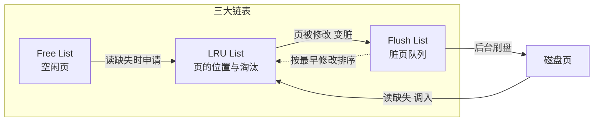
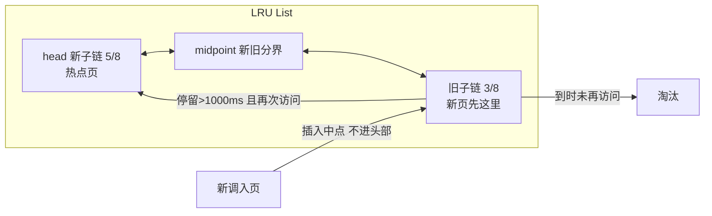

# Buffer Pool 与内存体系：InnoDB 用内存对抗磁盘的完整账本

> 为什么内存比磁盘大几百倍，数据库却不把所有数据放内存？为什么一次全表扫描不会把热点数据冲光？断电那一刻，16KB 的页只写了一半怎么办？这篇把 InnoDB 内存体系的账本翻开——每一块内存花在哪、每一次 IO 省在哪、每一个参数为什么是这个值，都算清楚。

## 一句话摘要

Buffer Pool 是 InnoDB 的**页缓存 + 写缓冲中枢**：读，把磁盘页按需调入内存复用（缓存读）；写，先改内存页变「脏页」，靠 WAL（redo log）保证持久性，再由后台线程异步刷盘（把随机写变成顺序写）。围绕它的是一整套内存治理机制——**三大链表管页的生命周期、新旧子链防缓存污染、doublewrite 防断电撕裂、change buffer 省二级索引随机读、预读把随机 IO 变顺序 IO**。这套机制的原理主线只有一条：**内存与磁盘的速度差有 3-5 个数量级，数据库的所有内存设计都在给这个差距找平衡**。

## 前置阅读

- 入门层篇 2《存储引擎与落盘细节》：页与区的物理结构
- 特性层篇《redo log 刷盘与组提交》：WAL 与脏页的关系（本篇的「写路径」上半场）

## 🎯 本文核心

**核心机制一句话**：Buffer Pool 的本质是把「对磁盘的随机读写」改造成「对内存的随机读写 + 对磁盘的顺序写」——读走缓存复用，写走 WAL 赎买。

**机制链（4 个节点，全文按这条链展开）**：

页调入（读缺失）→ 页定位与淘汰（三大链表 + 新旧子链）→ 页变脏与持久化（WAL + 检查点 + doublewrite）→ 写优化旁路（change buffer + 预读）

## 上下游一分钟

Buffer Pool 在 MySQL 架构里的位置：SQL 进来 → 服务层（连接器/优化器）→ **InnoDB 层先查 Buffer Pool**（命中直接返回，未命中才走磁盘）→ 磁盘表空间。它不是可有可无的加速件，而是 InnoDB 的**工作主战场**——所有数据读写必须经过它（绕过它的只有写日志）。这也是为什么「内存多大、给 Buffer Pool 多少」是 MySQL 容量规划的第一决策。向上它决定了查询延迟的量级，向下它决定了磁盘 IO 的形态（随机还是顺序）——架构上它是「内存-磁盘」两个世界的贸易口岸，所有代价与收益都在这个口岸结算。

## 磁盘到底有多慢：一切设计的起点

先看量级，这是理解全部机制的**原理基础**（数字为行业认知量级，用于建立直觉）：

| 介质 | 一次访问量级 | 相对内存 |
|---|---|---|
| 内存 | ~100ns | 1x |
| NVMe SSD | ~100μs | 1000x |
| SATA SSD | ~10-100μs | 千倍级 |
| 机械盘（随机） | ~10ms | **100000x** |

十万倍的差距意味着：不做缓存，每行数据的读取都要付一次磁盘延迟。InnoDB 的解法不是「把数据全放内存」（成本不允许，下文 Trade-off 展开），而是**以页为单位缓存**——默认每页 16KB。为什么是页而不是行？因为底层磁盘与文件系统以块为单位管理，一次 IO 拉一整页，相邻数据大概率被一起用到（局部性原理）；按行缓存则元数据开销会吃掉收益。这个「页粒度 + 缓存复用」的决策是 InnoDB 内存体系的公理，后面每个机制都从它推演出来。

## 三大链表：页的一生由谁管

Buffer Pool 内部不是一个大数组，而是**三条链表分工治理**（机制穿透的关键数据结构）：

- **Free List**：空闲页队列。启动时整个 Buffer Pool 的页都挂在这，读缺失时从这里拿空页装数据。
- **LRU List**：缓存的所有页（含脏页）按访问热度排序，决定「谁被淘汰」。
- **Flush List**：脏页队列，按**第一次变脏的时间**排序——这个排序是精心设计的：checkpoint 要推进 redo 的可覆盖范围，必须按修改时间从旧到新刷（为什么？追问见下节）。

一次读请求的完整走线：查 LRU List → 命中，页提升热度，返回；未命中 → Free List 取空页（没有则按 LRU 淘汰一页）→ 从磁盘调入 → 挂入 LRU 新子链 → 返回。**机制的本质**：三条链表把「页的存储、热度、脏净」三个正交问题拆给三个结构，各自 O(1) 操作——这是贯穿 InnoDB 的设计哲学：用简单的链表组合表达复杂的状态机。

## 传统 LRU 的两大失效：为什么要发明新旧子链

直接用教科书 LRU 会有两个致命问题，这是 Buffer Pool 最精彩的**演进脉络**：

**失效一：预读失效**。线性预读一次性调入 64 页（见下文），但应用可能只访问前几页。纯 LRU 里这 64 页挂在链表头部，把真正的热点页往尾部挤——**没被再次访问的预读页污染了缓存**。

**失效二：全表扫描污染**。扫一张 10GB 的表，所有页按扫描顺序进 LRU 头部，而扫描本身每页只访问一次——扫完后，真正的热点数据全被挤出了缓存，命中率断崖下跌。

这个补丁的历史分两代：5.x 时代先引入 midpoint insertion 雏形，5.6 后定型为参数化的新旧子链——今天看到的机制是一步步演进出来的。InnoDB 的解法是**把 LRU 链表劈成两段**：新子链（约 5/8，存热数据）+ 旧子链（约 3/8，存冷数据），新页（含预读页、扫描页）先进旧子链头部，在旧子链停留超过 `innodb_old_blocks_time`（默认 1000ms）且再次被访问，才晋升新子链。

每个参数都有为什么：**为什么扫描页污染不了新子链**？因为扫描页进的是旧子链，且每页只访问一次、停留不足 1000ms 就被后继页冲走，晋升不了。**为什么阈值是 1000ms 而不是 100ms 或 10s**？判断标准是「一次 IO 后页被再次访问的典型间隔」——热点页在毫秒到秒级会被重访，而扫描的页间间隔远小于 1000ms（顺序读很快），一次访问后不会再回来。1000ms 是「重访窗口」的工程折中（可调，行业经验：批处理重的库调大，OLTP 调小或不改）。**为什么新子链占 5/8**？新旧比例由 `innodb_old_blocks_pct` 控制（默认 37，即旧子链约 3/8）——接近黄金分割的经验值，行业认知：保证热点工作集能放进新子链的前提下给新页足够观察期。

**追问一层：为什么不在淘汰时判断「这页访问了几次」而要在晋升时判断？** 因为淘汰时判断（LFU 思路）要给每页维护访问计数，元数据开销大且对历史热点有粘性（曾经热、现在冷的页难被淘汰）；「时间 + 再访问」的晋升判据用两个时间戳就实现了「区分一次性扫描与真实热点」，代价最小。**再追问一层：这种设计有没有失效场景**？有——如果扫描慢到每页间隔超过 1000ms（超大表 + 极慢盘），扫描页反而会晋升污染新子链；此时靠调大 `innodb_old_blocks_time` 缓解。任何机制都有边界，知道边界比记住机制更重要。

## 脏页与检查点：随机写怎么变成顺序写

页在内存被修改后与磁盘不一致，成为**脏页**。问题来了：为什么脏页不立即刷盘？

答案是 WAL——这正是 redo log 那篇的下半场：修改先顺序写 redo log（fsync 落盘，保证持久），脏页留在内存继续接受修改，后台线程再找时机**批量、顺序**地刷回磁盘。一次随机写被拆成「一次顺序写（立刻）+ 一次随机写（延后，且同页多次修改合并成一次 IO）」。**核心权衡**：牺牲「数据页实时落盘」，换「提交延迟只受顺序写日志约束」——这是整个 InnoDB 写路径的第一性 Trade-off。

脏页什么时候刷？四条触发路径（决策知识，排障高频）：

1. **redo log 快满**（超过容量 75% 进入激进刷新，90% 后**阻塞所有写入**强制刷脏推进 checkpoint）——这是最凶险的路径；
2. **Buffer Pool 淘汰脏页**：LRU 要淘汰的页是脏页，必须先刷再腾；
3. **后台定时刷新**：Page Cleaner 线程按 `innodb_io_capacity`（默认 200，SSD 常调 2000-10000，**这个值该设为磁盘 IOPS 的认知量级**）节流地刷，避免突击；
4. **实例正常关闭**：全量刷完，不留脏页。

**事故推演**：一条真实形态的线上事故（行业典型案例叙事）——大促期间写入突增，redo 快满触发路径 1，检查点疯狂推进，大量脏页集中刷新挤占了业务 IO，**写入延迟飙高的根因不是磁盘慢，而是「平时不刷、急时全刷」的抖动**。治理：把 `innodb_io_capacity` 调到磁盘真实 IOPS 量级让后台匀速刷、监控 redo 使用率告警阈值前移到 60%。教训一句：**io_capacity 配低 = 后台偷懒，配高 = 后台抢业务 IO，这个参数是「刷新节流阀」不是越大越好**。

**追问：为什么 Flush List 要按首次修改时间排序？** 因为 checkpoint 语义是「这条 redo 日志之前的修改都已落盘，日志空间可覆盖重用」——必须从最老的脏页刷起，日志才能从头推进。如果乱序刷，最老页迟迟不落盘，checkpoint 卡死，redo 满了全库阻塞。**再追问：检查点期间数据页和 redo 谁先落盘？** redo 的提交顺序永远先于对应脏页（WAL 公理），否则崩溃恢复时无日志可重放。

## doublewrite：断电撕裂的兜底

脏页刷盘有一个物理层隐患：**部分写失效（torn page）**。磁盘保证的原子写单位远小于 16KB（常见 4KB 扇区/块设备），断电或崩溃时一个 InnoDB 页可能只写了一半——**页数据损坏，redo 也救不回来**（redo 重放的前提是页处于一致状态，损坏的页无法作为重放基座）。

InnoDB 的解法是 **doublewrite**：刷脏页前，先把整页顺序写入共享表空间的 doublewrite 缓冲区（连续 2MB，先写内存缓冲再 fsync），然后再把页写回真实位置。崩溃恢复时若发现真实位置页撕裂（checksum 对不上），用 doublewrite 区的完整副本覆盖修复。

- **代价**：每页写两次，写放大接近 2 倍——这是「用带宽买正确性」的典型权衡；
- **追问：为什么 doublewrite 能顺序写**？它是固定 2MB 连续空间，多页攒批后一次写，实际带宽损耗低于理论（且大量页是整页写场景，顺序写 + 合并后增到 ~10-25%，行业实测认知）；
- **追问：什么情况可以关掉**？文件系统自身有原子写保证（如 ZFS）、或使用支持原子写的设备/文件系统时，`innodb_doublewrite=OFF` 省写放大；在普通 ext4/xfs + 本地盘上关掉 = 裸奔断电风险。**决策口诀：先问底层有没有兜底，再决定要不要这层保险**。

## Change Buffer：只服务二级索引的写旁路

写入一个二级索引页时，如果该页不在 Buffer Pool，按朴素做法要先把页从磁盘读进来再改——**一次随机读，写路径最大的隐性成本**。Change Buffer 的机制：先把这次修改**缓存在 change buffer 里**，等后续该页被读入内存时再合并（merge），或由后台线程定期 merge。它的收益依赖「页长期不被读」的前提——预算给太大，写密集但偶发读的负载下会积压大量未 merge 修改，读进来时合并风暴，读延迟反而抖——**任何写优化旁路都有归还成本的时刻**。

它有个硬边界：**只对非唯一二级索引生效**。回看它的演进史也耐人寻味：早期版本 merge 完全靠后台线程，8.0 又加了对临时表的关闭优化——机制的形态一直在随负载认知调整。为什么唯一索引不行？——插入时必须校验唯一性，校验就必须读到该索引页确认「值不存在」，随机读躲不掉，缓冲失去意义。这个边界再次体现 5W1H 的思考方式：不是「高级功能给所有场景」，而是**机制的存在依赖一个前提，前提没了机制就退化为摆设**。追问一层：写多读少的表（日志表、流水表）change buffer 收益最大，因为页长期不被读、merge 一直推迟、修改持续攒批；读多写少的表收益趋零。参数 `innodb_change_buffer_max_size`（默认 25，占 Buffer Pool 比例上限）控制它的内存预算——为什么默认 25%？给得再多会挤压正常数据页缓存，行业认知：写极端密集才上调。

## 预读：把未来的 IO 提前变成顺序 IO

- **线性预读**：一个 extent（64 页）中被顺序访问的页超过 `innodb_read_ahead_threshold`（默认 56）时，异步预读整个下一 extent。**为什么是 56/64**？阈值过低会把偶发访问当顺序流（白读），过高则等凑齐 64 页才触发（预读形同虚设）——56 ≈ 87% 的比例是「确认这是顺序访问模式」的置信线（行业认知：默认值在绝大多数负载下够用，不建议乱调）。
- **随机预读**：同一 extent 内超过一定数量的页被随机访问就预读整段——误判率高，**5.x 后默认关闭**，这是「机制被演进淘汰」的现成案例：没有普适收益的预读，宁可不做。

## 参数体系与容量决策

Buffer Pool 的容量与形态是 MySQL 实例规划的第一决策（决策构件，给明确推荐）：

| 参数 | 推荐起点 | 为什么（5W1H） |
|---|---|---|
| `innodb_buffer_pool_size` | 专用 DB 实例：物理内存的 50%-75% | 剩余要留给连接内存、OS page cache、其他进程；>75% 有 OOM 风险（行业认知基准线） |
| `innodb_buffer_pool_instances` | pool ≥ 1GB 按每 instance 1GB 拆；超大内存 8-16 | 多实例 = 多把 LRU 锁，降低高并发下的链表争抢（内部互斥的架构代价） |
| `innodb_io_capacity` / `max` | 磁盘 IOPS 认知量级（SSD 2000+/10000+） | 后台刷脏节流阀：低了急时抖动，高了抢业务 IO |
| `innodb_old_blocks_time` | 默认 1000ms 不动 | 重访窗口；批量扫描特重的库可上调 |

**明确的推荐**：专用实例 buffer_pool_size 先给 60%，压测看命中率再调；不要一次拉到 80%——连接池内存是线性增长的（每个连接的 sort/join 缓冲都是会话级的），这是「全局缓存」与「会话内存」抢内存的经典边界。

## 排障手册：命中率、抖动与冷启动

- **命中率怎么看**：`1 - Innodb_buffer_pool_reads / Innodb_buffer_pool_read_requests`（前者是真正穿透到磁盘的物理读）。💡 行业认知基准：OLTP 库长期 ≥ 99%；掉到 95% 以下通常意味着热数据集超过 pool 容量，加内存是唯一正解。
- 💡 **冷启动问题**：重启后 Buffer Pool 是空的，命中率爬坡要几十分钟——`innodb_buffer_pool_dump_at_shutdown/onload`（默认开）把热点页清单落盘、重启后异步预载。
- 💡 **抖动定位**：写入延迟周期性飙高，先查 redo 使用率曲线和脏页比例（`Innodb_buffer_pool_pages_dirty / total`），把「急时全刷」变成「平时匀刷」。
- **失效边界清单**：热数据 > pool 容量（命中率天花板）；超大表慢速扫描（污染新子链，见前文边界）；关 doublewrite 且无底层原子写（断电撕裂风险）。

## 源码关键路径：这些机制在代码里的名字

机制的落地离不开对源码组织方式的认知（InnoDB 源码层：storage/innobase/），关键函数路线图：

| 动作 | 关键函数（源文件） | 对应机制 |
|---|---|---|
| 读页统一入口 | `buf_page_get_gen()`（buf0buf.cc） | 所有 B+ 树访问页必经；命中提升热度，未命中触发磁盘读 |
| 申请空页 | `buf_LRU_get_free_block()`（buf0lru.cc） | Free List 取页，不足时从 LRU 尾部淘汰 |
| 新页插入 | `buf_LRU_add_block()`（buf0lru.cc） | **插入点是旧子链头部（midpoint），不是链表头**——新旧子链的核心就在这一个函数 |
| 晋升判断 | `buf_page_make_young_if_needed()`（buf0lru.cc） | 检查页在旧子链的停留时长是否超过 `innodb_old_blocks_time` |
| 后台刷脏决策 | Page Cleaner 的 `page_cleaner_flush_pages_recommendation()`（buf0flu.cc） | 按 `innodb_io_capacity` 与脏页比例/redo 增速计算本次刷多少——「匀速刷新」策略的实现处 |
| 写旁路 | `ibuf_insert()` / `ibuf_merge_pages()`（ibuf0ibuf.cc） | change buffer 的缓存与合并入口；唯一索引在入口处就被拒之门外 |

读源码的建议路径：从 `buf_page_get_gen()` 进（每次行扫描都会路过），顺着「命中/缺失」两个分支各走一遍，三大链表的角色自然浮现——比从数据结构定义读起高效得多。

## 业内惯例与生产实践

- **容量惯例**：专用 MySQL 实例先把物理内存的 60%-70% 给 buffer_pool_size（行业认知基准），剩余留给连接会话内存与 OS；「内存优先喂 Buffer Pool」是 DBA 界的通用第一原则。
- **doublewrite 常开**：除非底层文件系统/设备有原子写保证（ZFS、部分云盘），生产环境默认不关——写放大 2 倍的代价在正确性面前是行业共识的「值得」。
- **flush_method 惯例**：Linux 上推荐 `O_DIRECT`，避开 OS page cache 双份缓存；此惯例写进了多数云厂商 RDS 类产品的底层配置。
- **监控惯例**：命中率、脏页比例、redo 使用率三条曲线是 MySQL 巡检看板的标配（PMM/Datadog 类面板的默认指标也印证了这一点）；大内存实例重启后必看「预热完成度」再接流量。
- **变更惯例**：调 `innodb_io_capacity`/`old_blocks_time` 属于低风险变更但仍走「先压测后灰度」——缓存类参数的效应要在真实负载下才能验证。

## 你们可能会问

**Q1：Redis 缓存和 Buffer Pool 不是重复建设吗？**
不重复，层级不同。Redis 挡在应用与数据库之间，省的是**网络往返 + SQL 执行**，缓存的是查询结果或对象；Buffer Pool 在存储引擎内部，省的是**磁盘 IO**，缓存的是 16KB 数据页。Redis 挂了查询退化到 DB，靠 Buffer Pool 兜底依然可以是内存级延迟——两层缓存架构上各管一段，互相构成纵深。

**Q2：为什么 InnoDB 不直接用 OS page cache，自己管缓存不是重复劳动？**
OS page cache 缓存的是文件块，不懂「页的逻辑热度与脏净」；InnoDB 需要事务语义（checkpoint、崩溃恢复、按首改时间排序刷脏），必须自己管。**权衡**：自管缓存 + `O_DIRECT` 绕过 OS cache（`innodb_flush_method=O_DIRECT`，推荐）避免双份缓存互相挤内存——不设 O_DIRECT 则一份页在 BP、一份在 page cache，内存白花一半。

**Q3：Buffer Pool 设越大越好吗？**
不对，见上文容量决策——50%-75% 是「全局缓存 vs 会话内存 vs OS」的三方权衡。超过热数据集大小后，继续加大命中率不再涨，纯浪费。

**Q4：为什么我的库内存没占满，命中率却上不去？**
典型原因：热数据集本身就大于 pool（分片/归档是解法）；或大量随机小表访问（工作集碎片化）。先看物理读的绝对量在涨还是稳——稳=容量够但访问模式随机；涨=容量不足。

**Q5：这套路数是 InnoDB 独有吗？**
不是，它是「带持久语义的页缓存」的通用形态：PostgreSQL 的 shared buffers、Oracle 的 buffer cache 同构，差异只在淘汰与刷新策略细节——理解了 InnoDB 这套，看别家是降维。

## 开放问题

- NVM/持久内存把字节寻址延迟拉到接近内存后，「页缓存 + WAL」这套架构还剩多少必要？底层机制（随机写合并、崩溃一致性）不变，但形态可能被重写——值得跟踪。
- 云厂商的共享存储形态（计算存储分离）下，Buffer Pool 的容量规划逻辑变了：本地盘 IOPS 约束变成网络 RT 约束，「命中率 99%」的基准是否还成立？我的判断是公式不变、基准要重标定，欢迎讨论。

## 核心带走

**30 秒复述**：Buffer Pool 用「页缓存 + WAL」把随机读写改造为内存读 + 顺序写——机制链：页调入 → 三大链表定位与淘汰（新旧子链防污染，1000ms 重访窗口）→ 脏页经检查点批量刷盘（io_capacity 节流，doublewrite 兜断电撕裂）→ change buffer 与预读做 IO 旁路优化。**失效点**：热数据超容量、慢扫描污染、redo 满阻塞、无原子写却关 doublewrite。金句带走：

> **读是缓存问题，写是顺序问题，丢是持久性问题——Buffer Pool 的全部设计就是这三句话。**

> **搬家的是脏页，不是全量数据；提前付的是日志，延后付的是刷盘——WAL 是一笔永远划算的时序交易。**

## 数据与事实声明

- 16KB 页、5/8 新子链、`innodb_old_blocks_time` 1000ms、线性预读阈值 56、change buffer 25% 上限等参数基于 MySQL 8.0 默认值（截至 2026-09，来源为 MySQL 官方文档长期稳定默认）；双 1、命中率 99% 基准、io_capacity 推荐区间为行业认知经验值。
- 文中事故形态为行业典型案例的叙事化重建，不含真实公司与生产数据。

## 参考资料

- MySQL 官方文档 InnoDB Buffer Pool / Change Buffer / Doublewrite Buffer 章节（dev.mysql.com）
- 《MySQL 技术内幕：InnoDB 存储引擎》（姜承尧）——内存与checkpoint 章节
- 《High Performance MySQL》——缓存与容量规划章节
- 关联：本系列《redo log 刷盘与组提交》（WAL 上游机制）；入门层篇 2（页物理结构）
