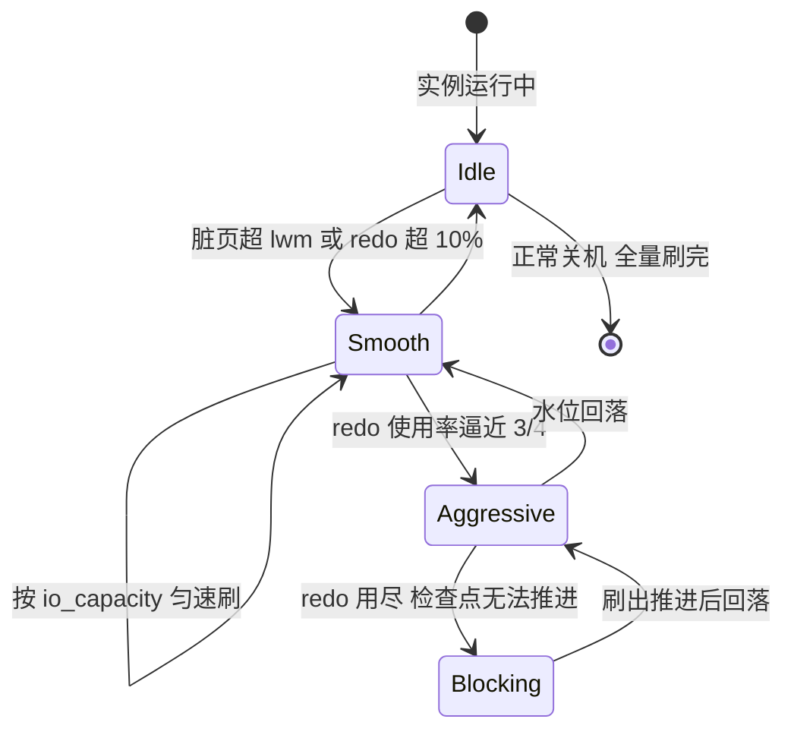
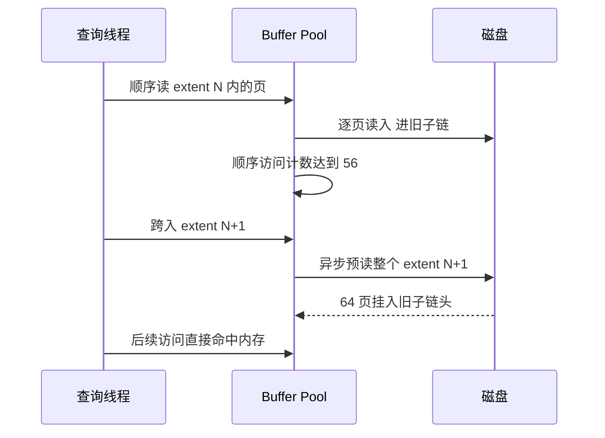
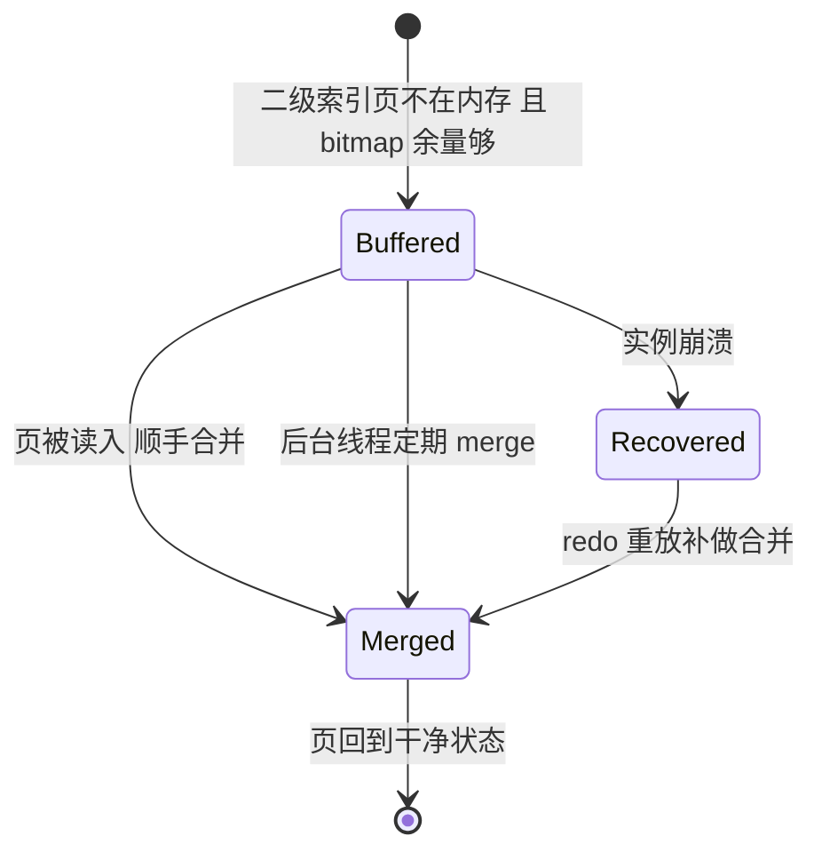
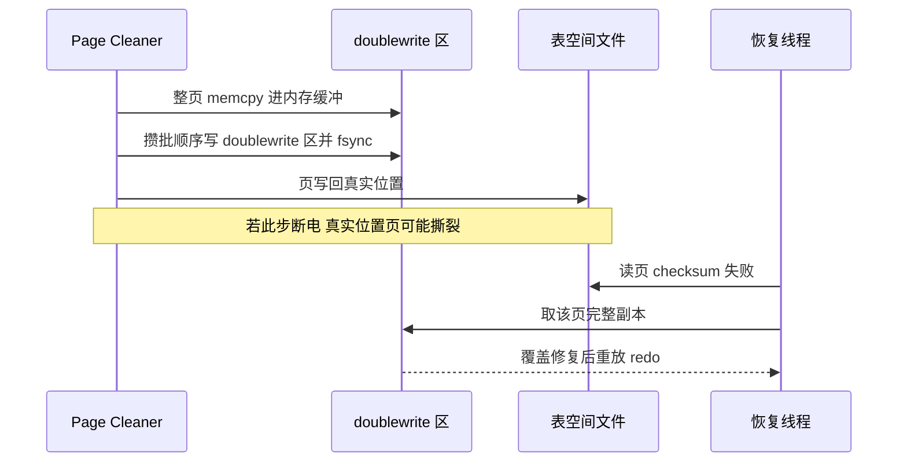

# Buffer Pool 深挖：LRU 改进、刷脏策略、预读、change buffer 与 doublewrite 的源码级账本

> 篇 1 翻开了 Buffer Pool 的总账；这一篇往下钻一层——新旧子链在源码里到底靠什么判「晋升」、每一次刷脏由哪个参数驱动、预读为什么分线性与随机两种、change buffer 靠每页 4 个 bit 工作、doublewrite 在崩溃恢复的哪一步被用上。目标只有一个：读完之后，你对着任何一个 Buffer Pool 参数，都能说出它改动了源码里的哪一步、代价是什么、什么时候不该动。

## 一句话摘要

Buffer Pool 的五大机制在深挖层各自有一条「参数 → 源码行为 → 生产后果」的直线：**LRU 改进**靠新旧子链 + 「停留时长 × 再次访问」的晋升判据（`innodb_old_blocks_time`）把一次性扫描挡在新子链之外；**刷脏**由 Page Cleaner 按「redo 增速 + 脏页水位」自适应匀速执行，四个触发时机对应四种紧急程度；**预读**用 extent（64 页）为粒度把顺序流的下一段提前异步调入，随机预读因误判率高被默认关闭；**change buffer** 只服务非唯一二级索引的写旁路（8.4 起官方默认 `none`，SSD 时代在退场）；**doublewrite** 用「先顺序写副本、再写真实位置」的两段式写，兜住断电撕裂页，是崩溃恢复里 checksum 失败后的救命副本。五大机制共享同一条底层原理：**内存与磁盘的鸿沟不靠单个技巧填平，靠的是一套互相咬合的时序设计**。

## 前置阅读

- 本系列篇 1《[Buffer Pool 与内存体系](1_BufferPool与内存体系-深度.md)》：三大链表、脏页与 WAL 的总账（本篇默认你已读过）
- 入门层篇 2《[存储引擎与落盘细节](../../入门层/从零开始认识MySQL系列/2_存储引擎与落盘细节-入门.md)》：页与区的物理结构
- 《[redo log 刷盘与组提交](../深入理解日志系列/1_redo-log刷盘与组提交-深度.md)》：WAL 与检查点（本篇「刷脏」的上半场）

## 🎯 本文核心

**核心机制一句话**：Buffer Pool 的五大深挖机制都在解同一道题——**「什么时候动、动多少、动完怎么兜底」**：LRU 用时间窗判晋升（什么时候晋升）、Page Cleaner 用水位线控节奏（什么时候刷、刷多少）、预读用访问模式做预测（提前动）、change buffer 用旁路推迟动（延后动）、doublewrite 用两段式写兜底（动坏了怎么救）。

**机制链（全文按这条链展开）**：

读进来的页去哪（LRU 分区与晋升）→ 页变脏后怎么落地（刷脏策略与四个时机）→ 落地前怎么提速（线性/随机预读）→ 哪些写可以绕过落地（change buffer）→ 落地写坏了怎么救（doublewrite 与崩溃恢复）

## 一、边界：篇 1 讲过什么，本篇挖什么

| 内容 | 篇 1 | 本篇 |
|---|---|---|
| 三大链表总览、WAL 与检查点原理 | ✅ 讲过 | 不重复 |
| LRU 新旧子链的存在性与直觉 | ✅ 提及 | **晋升判据的源码细节 + 边界场景** |
| 刷脏四条触发路径 | ✅ 列举 | **Page Cleaner 自适应刷新 + 参数级驱动表** |
| 预读的定义 | ✅ 提及 | **线性/随机的触发条件 + 与 LRU 的咬合** |
| change buffer 是什么 | ✅ 提及 | **ibuf bitmap、merge 时机、8.4 默认值变化** |
| doublewrite 为什么需要 | ✅ 提及 | **崩溃恢复决策树 + 8.0.20/8.0.30 演进** |

## 二、LRU 改进深挖：晋升判据是一对时间戳

### 2.1 源码级机制：单链表 + midpoint 插入

LRU List 物理上是一条双向链表，「新旧子链」是逻辑分区——分界点就是 **midpoint**。新调入的页不插链表头，而是插 midpoint（旧子链头部）；这是 InnoDB 与教科书 LRU 的第一个分岔。关键源码动作（InnoDB 源码 storage/innobase/）：

- `buf_LRU_add_block()`（buf0lru.cc）：页插入的统一入口，`old` 参数决定插 midpoint 还是链表头——**新数据页默认插旧子链**；
- `buf_page_make_young_if_needed()`：每次页被访问时调用，判断「这页在旧子链是否停留超过 `innodb_old_blocks_time` 且是被再次访问」——满足才移到新子链头；
- `buf_LRU_get_free_block()`：申请空页不足时，从旧子链**尾部**批量淘汰——注意淘汰只发生在旧子链尾部，新子链的页不会被直接挤出去。

**晋升判据的精妙处在时间戳的设置位置**：页插入旧子链时记录首次访问时间戳，之后再被访问时用「当前时间 − 时间戳」与 1000ms 比较。这意味着扫描场景（每页只访问一次）天然晋升不了：扫描的后继页不断把前面的页往旧子链尾部推，页在旧子链里的停留时间被「冲」到不足 1000ms，直接从尾部滑出。而真实热点页（比如订单表的最新页）毫秒级就会被再次访问，一次晋升直达新子链。**两个时间戳就实现了「扫描抗性」，这是 InnoDB 内存体系里性价比最高的设计**。

### 2.2 追问链：为什么不用更聪明的算法

**追问一层：为什么不用 LFU（按访问频率淘汰）？** 频率计数要给每页维护计数器（16KB 页 × 千万级页数，元数据本身就是一笔内存账），而且 LFU 对「曾经热、现在冷」的页有粘性——历史热点长期占着新子链，容量利用率反而下降。「停留时长 + 再次访问」用两个时间戳近似表达了「二度访问才算热」，这是**用最小状态表达最关键区分**的设计哲学。

**再追问一层：学术上有更优解（比如 ARC 自适应替换算法），为什么不用？** ARC（自适应替换缓存）当年被部分文件系统采用，但因算法专利问题，开源数据库社区普遍回避（公开报道口径）；而且 ARC 解决的是「频繁切换工作集」的场景，代价是更多元数据与更复杂的锁路径——对以吞吐为先的数据库，工程收益不明显。**为什么不用**「把新旧比例做成动态自适应」也是同一类答案：`innodb_old_blocks_pct`（默认 37，即旧子链约 3/8）给了人工调节的口子，把复杂度留给人而不是留给热路径。

**打破砂锅问到底：这个判据有没有失效场景？** 有，且很具体——扫描慢到每页间隔超过 1000ms（超大表 + 极慢盘 + 冷缓存），扫描页反而会满足「停留超 1s」被晋升，污染新子链。此时把 `innodb_old_blocks_time` 调大（比如 5000ms）可以缓解，但副作用是所有页的晋升都变难，命中率爬坡更慢。**任何机制都有它成立的前提，调参就是找当前负载下的前提边界**。

### 2.3 参数与压缩页的一个小坑

| 参数 | 默认值 | 机制作用 |
|---|---|---|
| `innodb_old_blocks_pct` | 37 | 旧子链占 LRU 的比例（约 3/8），粒度是「约数」——实现按整页数取近似 |
| `innodb_old_blocks_time` | 1000（ms） | 旧子链晋升的时间窗；扫描重的库调大，OLTP 保持默认 |

另外提一个容易忽略的点：启用压缩表（ROW_FORMAT=COMPRESSED）时，同一数据存在「压缩页 + 解压页」两份形态，解压页挂在独立的 unzip_LRU 上管理——它复用同一套新旧子链思路但单独追踪。用压缩表的实例看 Buffer Pool 指标时要意识到有两层页在计数，别把解压页的波动误判为缓存异常。

## 三、脏页刷新策略：谁在刷、刷多少、什么时候刷

### 3.1 刷脏的执行者与「匀速」哲学

8.0 把刷脏工作集中给 **Page Cleaner** 线程组：一个 coordinator 加多个 worker（`innodb_page_cleaners` 默认 4，含 coordinator，改动需重启）。所有刷脏集中调度的设计意图：**把「刷多少」做成一个全局决策点**——业务线程只在极端情况下被迫自己刷，其余全部由后台按节奏匀速执行。匀速的依据是自适应刷新（adaptive flushing）算法（源码 `page_cleaner_flush_pages_recommendation()`，buf0flu.cc），输入三个信号：

1. **redo 增速**：单位时间产生多少 redo——redo 写得越快，checkpoint 需要推进越快，刷脏越快；
2. **最老脏页的 LSN 年龄**：距离 redo 可覆盖边界的剩余空间，决定「离红灯还有多远」；
3. **脏页水位**：占 Buffer Pool 的百分比。

这条设计的底层原理值得说透：**WAL 之下，脏页刷盘速度的底线 = redo 生成速度**——刷得比写得慢，checkpoint 就被拖住，redo 用尽后写入被迫停摆。自适应刷新的本质是把「底线约束」提前折算成当前应刷速率，宁可平时多刷，避免急时全刷。

### 3.2 四个触发时机与对应参数

| 时机 | 紧急度 | 驱动参数 | 说明 |
|---|---|---|---|
| 后台匀速刷 | 低 | `innodb_io_capacity`（默认 200）+ `innodb_max_dirty_pages_pct_lwm`（默认 10） | 脏页超 10% 即启动，按容量节流 |
| 自适应加速 | 中 | `innodb_adaptive_flushing`（默认 ON）+ `innodb_adaptive_flushing_lwm`（默认 10） | redo 使用率超容量 10% 后，按 redo 增速动态加量 |
| 激进刷新 | 高 | `innodb_io_capacity_max`（默认 2000） | redo 逼近上限时突破 io_capacity 上限突击刷 |
| 同步阻塞 | 极高 | — | redo 用尽，写入线程被迫停下等刷脏——生产事故最常见的「数据库卡住」形态 |

**一句数字纪律提示**：传统口径常写「redo 75% 进入激进、90% 阻塞」，这是旧版本行为的教学近似；8.0.30 起 redo 改为 `innodb_redo_log_capacity`（默认 100MB）动态容量管理，固定分界点被软化为持续调速（公开口径）——所以**别把 75/90 当成可以精确依赖的阈值，要按「redo 使用率曲线的趋势」做监控告警**。

### 3.3 两个常被误解的参数

- `innodb_max_dirty_pages_pct`：8.0 默认 90（不是旧资料常写的 75）。它是「脏页比例的软上限」——超过后刷新力度显著加大，但**不是**「超过 90% 就停写」。把「脏页比例高」直接等同于故障是误读：脏页水位高只说明刷新跟不上或水位目标设得低，要结合 redo 年龄一起判断。
- `innodb_flush_neighbors`：默认 0（8.0 官方默认已按 SSD 时代调整；机械盘时代默认 1）。刷一个页时顺手刷同 extent 的相邻脏页，在机械盘上把多次寻道合并成一次——SSD/云盘上没有寻道概念，开着只增加写放大，保持 0。

### 3.4 事故叙事：一次「周期性写入抖动」的排查复盘

一个典型形态的线上故障（行业常见模式叙事化）：业务侧每几分钟出现一次写入延迟尖刺，应用重试报警，但 CPU/内存/磁盘利用率曲线都平稳。排查路径值得复盘：先看慢查询日志，尖刺时段没有对应的慢 SQL——排除 SQL 层；再看磁盘 util 突刺与写入延迟尖刺时间对齐——IO 层有动作；最后对齐 redo 使用率曲线，发现尖刺点正是 redo 使用率触顶、检查点被迫突击推进的时刻。根因：`innodb_io_capacity` 沿用默认 200，远低于所用 SSD 的真实 IOPS 量级，后台平时刷得太慢，redo 一紧就只能急刹车全刷。治理与复盘动作：io_capacity 按压测校准到磁盘真实能力、redo 使用率告警阈值前移、脏页水位纳入巡检。**复盘结论一句话：容量参数的默认值是「最小可用」不是「最优」，io_capacity 错配是最隐蔽的一类慢性病**。

**追问：为什么 redo 满了宁可阻塞写入也不丢日志？** 因为 WAL 是持久性的底线承诺——提交返回前 redo 必须落盘，这个顺序不可动摇；阻塞写入是「慢」，破坏承诺是「错」。**再追问：那为什么不把 redo 配超大来回避？** redo 越大，崩溃恢复要重放的日志区间可能越长，恢复时间失控；redo 容量是「恢复时长」与「刷脏节奏余量」的折中，不是越大越好。

## 四、预读深挖：以 extent 为粒度的 IO 预测

### 4.1 线性预读：56/64 的置信线

InnoDB 空间管理以 extent（区，64 个 16KB 页，共 1MB）为单位，线性预读以它为预测窗口：**同一 extent 内被顺序访问的页数达到 `innodb_read_ahead_threshold`（默认 56）时，异步读入下一个完整 extent**。为什么是 56/64 ≈ 87%？阈值是一道「确认这是顺序访问」的置信线——设低了偶发访问就触发（白读占缓存），设高了要凑满 64 页才触发（预读失去提前量）。源码入口在 buf0rea.cc 的线性预读函数，触发点在 extent 边界跨入时发起异步请求。

### 4.2 随机预读：被演进淘汰的机制

随机预读的逻辑是「同一 extent 内有较多页被非顺序访问就整段读入」——它赌的是「访问了这一段里的很多页，剩下的大概也会用」。这个赌注误判率太高：索引点查密集的场景会把大量不会被再访问的页拉进内存。**它默认关闭（`innodb_random_read_ahead=OFF`），是「机制被演进淘汰」的现成案例**——没有普适收益的预取，宁可不做；这也是为什么读源码时要留意「哪些参数默认 OFF」，被关掉的开关背后往往是一次失败的方向修正（设计思想：机制的存留由负载实证决定，不由「功能看起来有用」决定）。

**追问：预读页为什么不怕污染缓存？** 正是与第二节咬合的答案——预读页插在旧子链头（midpoint），没有被再次访问就沿着旧子链滑出，根本到不了新子链。**LRU 分区与预读是一对共生设计：预读负责「提前搬」，分区负责「搬错了便宜退」**。**再追问：什么负载该动这个参数？** 行业认知：机械盘 + 大范围顺序扫描（报表、备份校验）受益明显；全 SSD + 点查为主的库收益趋零，默认值不动是多数场景的最优解。

## 五、change buffer 深挖：每页 4 个 bit 撑起的写旁路

### 5.1 机制与它的记账页

change buffer 缓存的是「目标二级索引页不在内存」的修改（insert / 删除标记 / purge 三类操作），等页被读入时再合并。它怎么知道自己该不该缓存某个页？靠每个表空间的 **ibuf bitmap 页**（表空间的第 1 号页）：其中为每个页留了几个 bit，记录「该页还有多少可缓冲余量」与「是否已有缓冲的修改」。写操作进来时先查 bitmap：余量够就缓存、不够就老老实实把页读进来改。merge 的触发时机有四类（源码 ibuf0ibuf.cc）：

1. **页被读入 Buffer Pool 时**：读路径顺手合并，这是主路径；
2. **后台线程定期 merge**：避免长期不读的页积压过多；
3. **崩溃恢复后**：redo 重放会补做 change buffer 的合并——缓冲的修改本身也受 redo 保护，这是它敢「欠账」的底气；
4. **change buffer 空间紧张时**：强制收缩合并。

### 5.2 边界、演进与生产决策

硬边界只有一条：**非唯一二级索引**。唯一索引插入时必须校验「值不存在」，校验就得读到页，随机读躲不掉，缓冲失去意义。8.0 起还有一条衍生边界：包含降序索引列的二级索引不适用（官方文档口径——与新特性篇的降序索引呼应）。

演进线比机制本身更有信息量：`innodb_change_buffering` 在 8.0 主线默认 `all`，而 **8.4 起官方默认值改为 `none`（8.4 文档口径）**——SSD/云盘把随机读代价压低后，这个机制的收益场景在收窄，官方用默认值表态。内存预算由 `innodb_change_buffer_max_size` 控制（默认占 Buffer Pool 的 25%，上限 50）。

**为什么不选「无脑开着当保险」？** 因为它有归还时刻：写密集但偶发读的负载下，大量修改积压未合并，某天一个查询把冷页读进来，触发一次性的合并风暴，读延迟尖刺难定位（排查时 Extra 里出现 change buffer 相关字样是一个信号）。**决策推荐**：8.0 主线跑在 SSD 上、读多写少或读写均衡——跟随官方新默认改 `none` 或维持现状但纳入监控；写多读少的日志/流水类表（页长期不被读）——保留 `all`，这是它收益最大的主场。

## 六、doublewrite 深挖：崩溃恢复里的那道保险

### 6.1 为什么 redo 救不了撕裂页

页级 torn page（部分写）的物理根源：InnoDB 页 16KB，而文件系统/块设备的原子写单位常见是 4KB——一次 16KB 的写跨 4 个底层块，断电可能只落了一半。**为什么 redo 重放救不回来**？redo 重放的逻辑是「在页的当前状态上追加重放日志」，前提是页处于一个**合法的旧状态**；页被写到一半时 checksum 不通过，它既不是旧状态也不是新状态，没有合法基座可重放。这就是 doublewrite 存在的根本理由：**提供一个必然完整的旧状态副本**。

### 6.2 两段式写与恢复决策树

刷脏时序（源码 buf0dblwr.cc）：脏页先 memcpy 到 doublewrite 内存缓冲 → 缓冲攒批后**顺序**写入磁盘上的 doublewrite 区并 fsync → 然后才把页写回表空间真实位置。崩溃恢复时（公开口径的官方行为描述）：读到某页 checksum 校验失败 → 判定撕裂 → 从 doublewrite 区找回该页的完整副本覆盖 → 再基于副本重放 redo 到最新。doublewrite 区自身的写入也是带校验的分块顺序写，部分写会被恢复逻辑识别跳过——保险本身不能成为新的脆弱点。

### 6.3 代价、演进与什么时候可关

- **代价**：每页写两次，理论写放大 2 倍；但 doublewrite 区是固定空间的顺序写，多页攒批后实际带宽损耗低于理论值（行业认知：多数负载观测在百分之十几到二成）。
- **演进**：8.0.20 起把 doublewrite 的目录、批量、文件数拆成独立参数（`innodb_doublewrite_dir` / `innodb_doublewrite_pages` / `innodb_doublewrite_batch_size` / `innodb_doublewrite_files`）；8.0.30 起改为自动管理的独立 `.dblwr` 文件，不再与系统表空间绑死（公开口径）。演进的共同方向是**把保险的运维成本降下来**，而不是削弱保险本身。
- **什么时候可关**：底层已有原子写保证时——文件系统级（如 ZFS）、或提供原子写语义的存储；普通 ext4/xfs + 本地盘上关掉等于裸奔断电撕裂风险。**为什么不用**「提高 fsync 频率」替代 doublewrite？fsync 保证的是「落盘顺序」，不提供「原子单位」——它治不了写一半，两者不是一层的东西。

## 七、不同量级的思考：架构约束驱动解法

量级不是数字标签，是内存与 IO 约束的边界——每一档的底层逻辑完全不同：

- **十万级（单机或主从小实例）**：约束来自「默认值够用的边界」——数据量小到 Buffer Pool 装得下热集，所有深挖机制几乎都不需要动；思考方式是「监控驱动」——命中率、脏页水位、redo 使用率三条曲线在位即可，这一档的核心问题是「有没有监控在位」，而不是「参数调了没有」
- **百万级（热集逼近内存）**：约束来自「热数据集与 Buffer Pool 容量的比值」——命中率开始对容量敏感，io_capacity 错配的抖动开始显形；思考方式是「公式驱动」——按磁盘真实 IOPS 校准 io_capacity、按热集大小定 buffer_pool_size，这一档的核心问题是「容量账算对没有」，而不是「参数往哪边拧」
- **千万级（写入密集 + 大实例）**：约束来自「刷脏吞吐与写入吞吐的比值」——redo 增速高企，Page Cleaner 的节奏就是写入稳定性的生命线，page_cleaners 拆分与 io_capacity_max 的突击能力进入调优视野；思考方式是「节奏驱动」——把急时全刷改造成平时匀刷，这一档的核心问题是「刷新节奏跟得上写入吗」，而不是「命中率还高不高」
- **亿级（多实例 + 混合负载）**：约束来自「不同负载对缓存策略的诉求冲突」——OLTP 核心库与批量扫描库对 old_blocks_time、预读、change buffer 的最优解相反，解法是实例级隔离 + 按负载定型参数模板；思考方式是「分治驱动」——让每类负载在各自实例上单档运行，这一档的核心问题是「负载分型了吗」，而不是「单机还能榨多少」

思考方式总结：十万级靠「监控在位」，百万级靠「容量账本」，千万级靠「节奏控制」，亿级靠「负载分治」——每一档的约束来自不同的物理层（容量/吞吐/冲突），思考方式必须匹配约束来源。

**自下而上与触发升级**：先实测再定档——命中率曲线、redo 增速、刷脏等待事件三个实测值决定你站在哪一档，不预支上一档的复杂度。触发升级的信号：命中率跌破基准、redo 使用率频繁触顶、写入延迟出现周期性尖刺——任一出现，说明当前档位的思考方式已经不够，必须按公式驱动 → 节奏驱动 → 分治驱动升级。

## 八、源码关键路径：从参数到代码的对照表

| 参数/机制 | 源码位置（storage/innobase/） | 关键函数 |
|---|---|---|
| LRU 插入与晋升 | buf/buf0lru.cc | `buf_LRU_add_block()`（midpoint 插入）/ `buf_page_make_young_if_needed()`（时间窗晋升） |
| 空页申请与淘汰 | buf/buf0lru.cc | `buf_LRU_get_free_block()`（从旧子链尾批量腾页） |
| 读页统一入口 | buf/buf0buf.cc | `buf_page_get_gen()`（命中/缺失分流，晋升判断的调用方） |
| 自适应刷脏 | buf/buf0flu.cc | `page_cleaner_flush_pages_recommendation()`（redo 增速 + 水位 → 本次刷量） |
| 预读 | buf/buf0rea.cc | 线性预读入口（extent 计数达 56 触发下一区异步读） |
| change buffer | ibuf/ibuf0ibuf.cc | `ibuf_insert()`（缓存入口，唯一索引在此被拒）/ merge 系列函数 |
| doublewrite | buf/buf0dblwr.cc | 写入两段式与恢复期副本查找的实现 |

读法建议：带着参数读源码——先在官方文档确认参数语义，再全局搜索参数名找到读取点，顺藤摸瓜看它改变哪个分支。**参数是源码行为的人工旋钮，一一对应是理解机制的捷径**。

## 九、业内惯例与生产实践

- **io_capacity 必须校准**：默认 200 是机械盘时代的保守值，生产中按真实存储压测校准（SSD 量级常见 2000-10000，行业认知基准）是 DBA 界公认的必做项；多家云厂商 RDS 类产品的底层配置也印证了这一点。
- **刷脏三件套巡检**：redo 使用率、脏页水位、`Innodb_buffer_pool_wait_free`（业务线程等空页的次数）是生产看板标配——wait_free 持续非零 = 刷脏已追不上，红灯。
- **change buffer 随大版本重估**：8.4 官方默认改 `none` 之后，「升级前核对 change buffer 策略」进入业内升级 checklist——默认值变化本身就是官方在替你做一次负载假设更新。
- **doublewrite 常开**：除非底层有原子写保证，生产环境默认不关；关它省下的写放大，在断电撕裂风险面前是行业共识的「不值得」。
- **调参纪律**：缓存与刷新类参数的效应只能在真实负载下验证——「先压测、后灰度、带监控」是这类变更的三段式惯例，任何跳步都在赌运气。

## 💡 实战提示

- 💡 **写入周期性尖刺，先对齐三条曲线**：写入延迟、redo 使用率、磁盘 util 三条曲线按时间轴对齐——尖刺点重合即「急时全刷」实锤，根因十有八九是 io_capacity 与存储能力错配，不必先去怀疑 SQL。
- 💡 **扫描类批量任务前，临时调大 `innodb_old_blocks_time`**：让扫描页更难晋升，保护热集；任务结束改回。这是少数「按任务开关」而非「按实例定型」的参数。
- 💡 **change buffer 排查信号**：读延迟偶发尖刺且难复现，结合写多的表 + 大量二级索引的画像，优先怀疑积压合并风暴——把 `innodb_change_buffering` 改 `none` 做对照实验，是成本最低的定位手段。
- 💡 **8.0.30+ 别再配 `innodb_log_file_size`**：redo 容量口径已换成 `innodb_redo_log_capacity`（默认 100MB，可在线调整），老参数在新版本语义下兼容行为容易踩混，配置迁移时统一到新口径。
- 💡 **验证 doublewrite 是否在工作**：生产无法人为断电，可在测试环境模拟——kill -9 不会触发撕裂（OS 页缓存还在），必须模拟掉电场景才能真实演练恢复路径；平时靠「checksum 相关错误日志 + 恢复演练」保信心。

## 什么时候用/不用：三个高频决策

| 决策点 | 推荐用法 | 不建议用法 |
|---|---|---|
| change buffer 开关 | 写多读少的表保留 `all`；SSD + 读写均衡跟随 8.4 默认 `none` | 不看负载形态无脑开 `all`——merge 风暴风险 |
| 预读调参 | 机械盘 + 顺序扫描重 → 核对 56 阈值是否够触发；SSD 点查型 → 默认不动 | 为「看起来更快」开随机预读——误判拉满缓存 |
| doublewrite | 常规存储常开；有原子写保证的文件系统/设备才评估关闭 | 在无原子写兜底的普通盘上关闭求性能 |

明确推荐一句话：**先把 io_capacity 校准、再把三条曲线挂上监控、其余参数保持默认**——这一篇讲的五个机制，八成生产问题由第一项解决。

## Trade-off：五个机制共同的代价表

每一层优化都在用一种资源换另一种资源，深挖的意义就是看清换出去的是什么：

| 机制 | 换来的收益 | 付出的代价 | 代价何时反噬 |
|---|---|---|---|
| LRU 分区 | 扫描抗性 | 时间窗外的合法热点晋升变慢 | 批处理库时间窗设错 |
| 自适应刷脏 | 写入延迟平稳 | 后台持续占用 IO | io_capacity 配高抢业务 IO |
| 线性预读 | 顺序流提前量 | 误判时白读占缓存 | 点查型负载误触发 |
| change buffer | 写路径省一次随机读 | 欠账迟早要还（merge） | 偶发读触发合并风暴 |
| doublewrite | 断电撕裂兜底 | 写放大接近 2 倍 | 带宽敏感型负载 |

## 你们可能会问

**Q1：命中率 99% 了，还有必要关心刷脏策略吗？**
有必要，两件事正交：命中率管「读」，刷脏管「写延迟稳定性」。读全命中、写入却周期性抖动的库很常见——刷脏是写路径的事，跟读缓存命中率无关。

**Q2：`innodb_old_blocks_time` 调成 0 会怎样？**
旧子链的页被再访问立即晋升，分区机制实质失效，退化回「插入即头部」的传统 LRU——预读页和扫描页重新获得污染新子链的能力。它默认 1000ms 不是拍脑袋，是重访窗口的工程折中。

**Q3：为什么有些资料说脏页超 75% 就危险，你这里写默认 90%？**
75% 是旧版本默认或教学口径，8.0 的 `innodb_max_dirty_pages_pct` 默认已是 90（官方文档口径）。更要紧的是：水位百分比本身不危险，危险的是「水位高 + redo 年龄大」的组合——单看水位会误判。

**Q4：change buffer 在 8.4 默认关了，8.0 的存量库要主动关吗？**
先测量再决策：如果写多读少、二级索引多、磁盘压力大，它还在赚钱，不关；如果 SSD 上读写均衡且出现过可疑的读尖刺，改 `none` 做对照。默认值变化提醒的是「重新评估」，不是「立刻跟进」。

**Q5：这五个机制里，哪个最不该动？**
doublewrite。其他四个调错最多是性能问题，doublewrite 关错是数据正确性问题——性能问题可以回滚，正确性问题没有回滚。

## 开放问题

- 存算分离架构下，「页缓存 + 本地盘刷脏」的前提在变化：远端存储的 IO 代价模型不同，自适应刷新算法的输入假设还成立多少？值得持续跟踪云厂商的实现公开资料。
- CXL/持久内存让「内存与存储的速度差」出现新档位，LRU 这类为「百万倍差距」设计的机制，在十倍差距的介质上是否需要重写？我的判断是机制不变、参数语义会重标定，欢迎讨论。

## 核心带走

**30 秒复述**：Buffer Pool 深挖层的五件事——LRU 用「停留时长 × 再访问」挡扫描（两个时间戳的设计）；刷脏由 Page Cleaner 按「redo 增速 + 水位」匀速执行（io_capacity 是节流阀不是越大越好）；预读以 extent 为窗口做预测（线性默认开、随机默认关）；change buffer 给非唯一二级索引做写旁路（8.4 默认 none，欠账迟早要还）；doublewrite 用两段式写兜住撕裂（checksum 失败时的救命副本）。**失效点**：慢扫描晋升污染、io_capacity 错配抖动、change buffer 合并风暴、无原子写却关 doublewrite。金句带走：

> **读的优化是「什么进内存」，写的优化是「什么时序落盘」——五层参数，管的全是时序。**

> **默认值是最小可用，不是最优解——io_capacity 校准这一件事，值回这一篇的全部阅读时间。**

## 📌 数据与事实声明

- 参数默认值（`innodb_old_blocks_pct` 37 / `innodb_old_blocks_time` 1000ms / `innodb_read_ahead_threshold` 56 / `innodb_page_cleaners` 4 / `innodb_flush_neighbors` 0 / `innodb_max_dirty_pages_pct` 90 / 两个 lwm 10 / `innodb_lru_scan_depth` 1024 / `innodb_change_buffer_max_size` 25）基于 MySQL 8.0 官方文档（截至 2026-09）；`innodb_change_buffering` 在 8.4 默认 `none`、8.0 默认 `all` 来自 MySQL 8.4 官方文档；8.0.20/8.0.30 的 doublewrite 与 redo 容量演进口径为公开口径。
- 文中性能量级（写放大实际损耗、命中率基准、IOPS 推荐区间）为行业认知经验值；事故叙事为行业典型模式的匿名化重建，不含真实公司与生产数据。

## 📚 参考资料

| 来源 | 内容 |
|---|---|
| MySQL 官方文档（dev.mysql.com）InnoDB Buffer Pool / Flushing / Change Buffer / Doublewrite Buffer 章节 | 参数默认值与机制口径 |
| InnoDB 源码 storage/innobase/（buf0lru.cc、buf0flu.cc、buf0rea.cc、ibuf0ibuf.cc、buf0dblwr.cc） | 机制实现位置与函数路径 |
| 《MySQL 技术内幕：InnoDB 存储引擎》（姜承尧） | 内存体系与检查点章节 |
| 《MySQL 是怎样运行的》（小孩子 4919） | 页结构、LRU 分区与 change buffer 细节 |
| 本系列篇 1《Buffer Pool 与内存体系》、日志系列《redo log 刷盘与组提交》 | 上游机制衔接 |
