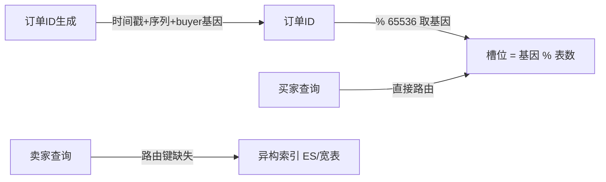

# 分片路由机制与容量推演：把一行数据唯一地送到它该去的地方

> 亿级存量、每日千万增量——分多少个库、多少张表？为什么老司机开口就是「512 张表起步」？hash 取模、range 分段、基因法各自由什么数学规律支配？这篇把路由机制拆到公式层，把容量算到 B+ 树的页数上。

## 一句话摘要

分片路由的本质是一个**确定性映射函数**：`f(分片键) → (库, 表)`——同一个键永远算出同一个槽位，这是所有分片系统能工作的公理。路由算法的取舍由两条数学性质支配：**hash 类均匀但毁掉顺序性，range 类保序但制造尾页热点**；容量规划则由 B+ 树的物理结构反推出来——**单表 2000 万行的经验值本质是「3 层 B+ 树 + 一次 IO 定位」的临界点**。亿级、日千万增量的系统，容量要在第一天就按 2 的幂次预留，因为扩容的本质是「重映射」，槽位数每次翻倍只搬一半数据。

## 前置阅读

- 入门层篇 5《索引基础》：B+ 树结构（本篇容量推演的物理基础）
- 专题层篇 1《拆分方案选型》与篇 2《分片键设计》：**怎么选**；本篇讲**怎么运作**——视角型分工，选型问题链回不重写

## 🎯 本文核心

**核心机制一句话**：分片路由 = 把「分片键空间」映射到「固定槽位空间」的确定性函数，容量与扩容的所有问题都是这个映射的重排代价问题。

**机制链（4 个节点）**：分片键 → 路由算法（hash/range/基因）→ 槽位映射（2^n 槽位）→ 重映射代价（扩容搬家比例）。

## 上下游一分钟

路由机制在分片架构里的位置：应用 SQL → **中间件解析出分片键 → 路由函数算出槽位 → 落到具体 库.表** → 单片执行。向上它决定了「哪些查询能定向到单分片」（所有跨片复杂度的源头都在这里），向下它决定了数据在物理世界的分布形态。**架构上它是分片系统的「地址系统」**——键错了满盘皆输，所以它值得单独一层深挖。

## 一、hash 取模：均匀性的数学与它的两个代价

`slot = hash(user_id) % N`。均匀性由大数定律保证：只要键本身分散，模 N 的结果近似均匀落在 [0, N)。这是它最大的美德——**不需要知道数据长什么样，就能自动摊平**。

代价一：**顺序性死亡**。`hash(id) % N` 后相邻 id 散落在不同分片，`where id between A and B` 要打到全部分片。范围查询、游标分页这类「依赖顺序」的操作全部退化为跨片操作。

代价二：**扩容即搬家**。`% 512` 改成 `% 1024`，只有 `slot < 512` 且新位置恰好相同的行留在原地——对 hash 取模来说，这个比例约为 50%…… 的反面：**取模换底时几乎所有行都换位置**（除非旧槽位恰好整除新槽位数，`% 512 → % 1024` 时保留比例为 50%）。亿级表搬家一半，就是几百 GB 的迁移量。这个数学事实直接决定了容量必须**第一天就按终局规划**——追问见第四节。

## 二、range 分段：保序的美德与尾页热点

`slot = id / 每段行数`。相邻键落同一分片，范围查询天然定向到单片，游标分页 O(1)。但两个病根：**写入热点**（自增键永远打到最后一个分片，新数据全部压在一张表上——分库分表的「写扩展」目标直接落空）与**数据倾斜**（段间行数不均时靠人为预估切段，估错就长期不均）。

**追问链**：为什么自增键 + range 一定是尾页热点？——所有 INSERT 的分片键都在增长序列的末端，物理上只有一个分片能接；写压力从「N 张表摊」退化回「1 张表扛」，除非键本身带随机性。→ 再追问：那 range 就不能用了？——键天然带时间或地区语义且查询以范围为主时（订单按月归档类），range 仍是正解；机制没有对错，只有「与查询形态的匹配度」。

## 三、基因法与绑定表：多维查询的工程解法

hash 路由有一个结构性死结：**按 buyer_id 分片后，`where seller_id = ?` 不知道该去哪个分片**。两个经典解法，机制都在「位运算」层：

**基因法**：生成订单 ID 时，把 buyer_id 的低 N 位**埋进**订单 ID（例：订单号 = 时间戳 + 序列 + `buyer_id % 65536`）。buyer 维度路由取订单 ID 本身即可；seller 维度查询走异构索引（ES/宽表）。**为什么埋低位而不是高位**——hash 路由通常取模，模运算只关心低位，把「分片基因」放低位让订单 ID 自身就是路由凭据，不需要额外查映射表。

**绑定表（binding tables）**：订单表与订单详情表用同一分片键、同一算法——同键行永远同槽位，join 被压平成本地 join。这是「用约束换性能」的架构决策：**一旦绑定，两表的扩容、迁移、清理必须同生共死**。

## 四、容量推演：亿级与日千万增量的账

这是本篇最实操的部分，每个数字都给出推导（数字为行业认知量级，用于建立规划直觉）。

**第一步：单表上限为什么是 2000 万量级**。InnoDB 主键若为 bigint（8 字节），非叶子节点按 16KB 页约存 1200 个指针；三层 B+ 树 = 1200 × 1200 ≈ 144 万个叶子页位置，每个叶子页按每行 100-200 字节存几十行——**三层树总容量约 2000 万行**。超过后树长到 4 层，每次点查从 3 次页访问变 4 次，缓冲池命中率要求陡增。**2000 万不是硬限制而是「一层 IO」的工程红线**——追问：为什么不让它长到 4 层？——热数据集够小、内存足够时 4 层也能跑；但亿级日千万的场景，红线是可预判性与容量规划的锚点。

**第二步：从增量反推终局表数**。每日 1000 万增量 × 3 年 ≈ **110 亿行**。按单表 2000 万上限留 50% 余量（单表 1000 万运行水位）：**终局 ≈ 1 万张表**。第一感觉恐怖，但拆成 16 库 × 512 表 = 8192 表，每表承载约 134 万行/3 年——运行水位健康。**为什么不规划 64 表？** 日千万意味着 32 天就多 1 亿，64 表方案一年内就要二次扩容；扩容要停写搬家（见第五节），**扩容次数本身就是成本**。

**第三步：为什么槽位数必须是 2 的幂**。`% 512 → % 1024`，旧行新槽位只有 `旧slot` 不变的保留（每 2 个旧槽数据 1 个不用搬，搬家比例 50%）；`% 500 → % 1000` 同样 50% 但路由计算与哈希分布质量下降。**2^n 翻倍扩容 = 每次只搬一半、槽位计算纯位运算**（`slot = key & (N-1)`），这是把「扩容搬家」从全量降为对数次数的一半的关键规划决策。

| 规划项 | 推荐值 | 为什么（5W1H） |
|---|---|---|
| 单表水位 | ≤ 1000 万行运行 | 2000 万是 3 层 B+ 树红线，留 50% 给索引页碎片与更新膨胀 |
| 终局表数 | 2^n 且 ≥ 5 年增量/水位 | 扩容 = 停写搬家，次数是隐性成本 |
| 库数 | 终局表数 / 单库可承载表数，2^n | 库级扩容（换更强机器）先行，表级翻倍在后 |
| 主键 | 含分片基因的分布式 ID | 见第三节；纯自增在多库必撞（链回 distributed-id 系列） |

## 五、扩容重映射：搬家比例的数学

扩容 = 改变槽位总数 N，所有行重算 `f(key)`：

**hash 取模翻倍（512→1024）**：50% 搬家，且搬与不搬的行均匀混杂——无规律。**range 翻段**：只搬「溢出到新段」的增量，历史不动——搬家最省但平时热点最重。**固定槽位 + 二级映射**（Redis Cluster 式 16384 slot → 节点的映射表）：slot 总数永远不变，扩容只改「槽位→物理」映射表，搬家单位是整槽——**工程上最优雅，映射表本身成为新的管理对象**。三者的取舍机制：**把「重映射」从行级挪到槽级，搬家就从数据问题变成路由表更新问题**。

## 源码关键路径：路由在 ShardingSphere 里的样子

机制落到中间件源码（ShardingSphere-JDBC，公开仓库命名）：

| 动作 | 关键类/配置 | 对应机制 |
|---|---|---|
| 路由引擎入口 | `ShardingStandardRoutingEngine`（routing 包） | 解析分片条件 → 决定 standard/complex/inline 路由类型 |
| 行表达式槽位 | `t_order_${buyer_id % 1024}` 行表达式 | `% N` 表达式——本文「确定性映射」的直接载体 |
| 分片算法扩展点 | `StandardShardingAlgorithm.doSharding()` | 自定义 hash/range/基因法的入口，入参即候选槽位集合 |
| 绑定表路由 | `BindingTableRule` | 同键多表共享一次路由结果（join 不二次计算） |

读源码建议：开 `sql-show` 看一次带分片键 SQL 的「Logic SQL → Actual SQL」日志，改写痕迹就是引擎各阶段的输出——从日志反向找类比从类图顺读高效。

## 你们可能会问

**Q1：为什么不用一致性哈希，扩容只搬 1/N？**
一致性哈希的「只搬邻居段」对缓存友好（Redis 类场景），但数据库场景它的杀手锏用不上：数据库扩容要的是**可校验的批量迁移计划**（按表/按槽搬，对账清楚），不是虚拟节点的随机漂移；且跨片查询需要稳定槽位语义。业内主流 MySQL 分片（ShardingSphere 类）全部走固定槽位翻倍路线——机制选择跟着场景走，不追先进性。

**Q2：每日千万增量，自增 ID 会耗尽吗？**
bigint 自增上限 9.2×10^18，日千万用 10^8 年才耗尽——**耗尽是伪问题，撞号才是真问题**：分库后各库独立自增必然冲突，所以分片系统的主键必须换分布式 ID（雪花/号段，链回 distributed-id 系列）。

**Q3：分 512 张表，每张表要建在同一个实例上吗？**
不是，**逻辑表数 ≠ 物理实例数**。512 是逻辑槽位，物理上先挂 4 个实例各承 128 表；容量涨了把表整体迁到新实例（表级搬家，不用改路由）——这就是「逻辑层隔离物理层」的红利。

**Q4：基因法占了订单 ID 的 16 位，会不会影响业务可读性？**
会，这是 Trade-off：订单号失去「纯时间有序」的可读性（基因位混在尾部）。取舍是「多维查询免查路由表」对「ID 可读性」——交易系统几乎永远选前者，可读性用中间件的查询能力补。

**Q5：路由函数写在哪一层，业务代码要感知吗？**
客户端 SDK（ShardingSphere-JDBC）或代理层（ShardingSphere-Proxy/MyCat）。业务 SQL 写逻辑表名，路由对业务透明——**但这不等于业务可以乱写 SQL**：不带分片键的查询依然会全片广播，规范要在接入层卡（链回专题层 1 的中间件选型）。

## 六、业内惯例与生产实践

- **槽位起手式**：业内中大型交易系统的常见起手是 2 库 × 256 表 或 4 库 × 128 表起步、终局规划 16 库 × 512 表（行业认知，具体随业务体量缩放）。
- **迁移窗口惯例**：扩容迁移普遍选低峰做「全量 + 增量追平」，双写期控制在 1-2 周内（双写期故障面翻倍，越短越好，见专题层篇 3）。
- **监控惯例**：各分片行数分布、写入 QPS 分布、慢 SQL 按分片聚合，是分片系统监控面板的标配三件套（链回篇 2 倾斜检测）。

💡 实战提示：热数据集小于总容量 20% 的库，槽位按逻辑规划、物理实例按水位扩——不要为「终局数字」一次买满硬件。
💡 实战提示：分片算法上线前用真实键分布做离线仿真（拉键样本跑路由函数出直方图），比上线后治理倾斜便宜一个数量级。

## 开放问题

- Serverless 形态的分布式数据库（按存储量自动分裂，如 TiDB Region 分裂）正在把「容量规划」变成「不需要规划」——固定槽位的人工艺术会不会被自动分裂机制淘汰？边界条件（热点自动打散的滞后性）值得持续跟踪。
- hash 基因位与 UUIDv7 类时间有序 ID 的结合（有序 + 路由基因），是否能同时拿到 range 的顺序性与 hash 的均匀性？已有厂商在实践，样本还不足以下结论。

## 🎯 核心带走

**30 秒复述**：分片路由 = 确定性映射 `f(键) → (库,表)`——hash 均匀但毁序、range 保序但尾页热点，基因法把第二个维度的路由凭据埋进主键低位；容量从「单表 2000 万 = 3 层 B+ 树红线」反推：日千万 × 3 年 ≈ 110 亿 → 终局 2^n 槽位（如 16 库 × 512 表），扩容靠 2^n 翻倍每次只搬一半。**失效点**：槽数非 2 的幂、主键没埋基因、单表水位超红线、扩容没有双写与校验就切流。金句带走：

> **分片数是规划出来的，不是撞出来的——每一次被迫扩容，都是第一天容量账没算清的利息。**

> **路由函数的确定性是分片系统的公理；均匀性是美德，保序性是美德，但两者在数学上互斥——工程的艺术是拿基因法和异构索引把两边都占住。**

## 📌 数据与事实声明

- 「单表 2000 万」为行业经验量级（三层 B+ 树推导见正文），实际随行宽、主键类型、页填充率浮动；「日千万 × 3 年」为假设场景推演。
- ShardingSphere 绑定表/基因法、Redis Cluster 槽位机制为公开文档描述的实现机制；参数与容量推荐均为行业认知，未引用未公开的生产数据。

## 📚 参考资料

- ShardingSphere 官方文档：数据分片核心概念（绑定表/行表达式/分布式主键）
- Redis Cluster 官方文档：16384 槽位设计（why 16384 的作者论证）
- 《High Performance MySQL》——分表与容量规划章节
- 关联：专题层《分片键设计》（选型视角）、《分布式 ID 衔接与平滑迁移》（迁移机制）；本仓库 distributed-id 系列（主键方案正式定义篇）
