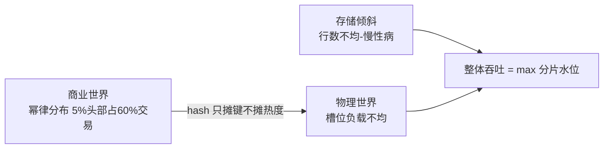
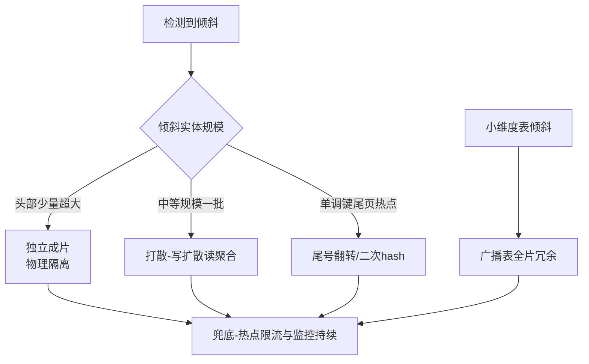

# 数据倾斜的检测与治理：最慢的那个分片决定你的上限

> 512 张表明明每张都很「均匀」，为什么大促时就是那几片先挂？为什么 hash 过的键还能倾斜？行数均匀等于负载均匀吗？这篇把倾斜从「感觉不均」拆成可量化的检测指标和一套有优先级的治理弹药库。

## 一句话摘要

数据倾斜的本质是**木桶效应在分片系统里的具象化**：整体吞吐由最热的分片决定，其余分片的富余容量全部浪费。倾斜分两种病——**存储倾斜**（行数不均，慢性病）与**流量倾斜**（QPS 不均，急症），后者更致命且更隐蔽，因为**行数均匀完全不等于访问均匀**：hash 把键摊平了，但键背后的商业实体（大卖家、大买家、头部内容）天然不均。治理弹药库按代价排序：**打散（写扩散读聚合）、独立成片（物理隔离）、尾号翻转（改造键分布）、广播表（小维度冗余）**——每个方案都在用一种成本换另一种成本，选型的依据是倾斜实体的规模占比。

## 前置阅读

- 特性层篇 1《分片路由机制与容量推演》：hash/range 的分布数学（倾斜的产生土壤）
- 专题层篇 2《分片键设计》第三节「倾斜治理」：**选型层的一句话版**；本篇展开**检测指标与治理机制**——链回不重写

## 🎯 本文核心

**核心机制一句话**：倾斜治理 = 先分清「存储倾斜还是流量倾斜」，再用「键分布改造」或「流量分摊」把木桶的短板垫平——所有方案的本质都是**让「商业世界的幂律分布」与「物理世界的均匀分片」解耦**。

**机制链（4 个节点）**：产生（幂律键分布 × 路由算法）→ 检测（双维度指标）→ 治理（四类方案）→ 复发（业务演化再倾斜）。

## 上下游一分钟

倾斜在分片链路的位置：路由机制（篇 1）决定「怎么分」，倾斜决定「分得再好也会局部过热」。向上它直接呈现为**单分片慢查询、连接池耗尽、大促时特定分片报警**（用户可见的症状），向下它牵动**中间件归并延迟**（一个分片慢，等归并的全部慢——链回篇 3 跨片查询）。架构上它是分片系统的「贫富差距问题」：平均数好看，方差杀人。

## 一、两种倾斜：慢性病与急症

**存储倾斜**：各分片行数差异大。症状温和（容量水位不齐、备份时长不均），恶化慢。

**流量倾斜**：某几个分片承载不成比例的读写。症状剧烈（单分片 CPU/IO/连接池打满），且**与行数无关**——一张 800 万行的小表如果承载着平台 Top1 卖家的全部订单写入，照样被打穿。

为什么行数均匀 ≠ 流量均匀？**底层原因是商业分布是幂律的**：平台模式下 5% 的头部卖家占 60% 的订单（行业认知量级），hash 只保证「键值均匀分布到槽位」，不保证「键值的访问频次均匀」。每个槽位分到的卖家不同，槽位负载 = 键数 × 键热度，第二项 hash 管不了。

**追问链**：hash 过了为什么还会倾斜？——hash 均匀化的对象是「键的数量」，不是「键的热度」；百万小卖家与大卖家的 buyer_id 在数学上等价，在商业上天差地别。→ 再追问：range 呢？——range 的倾斜更粗暴：单调键把写入全压尾段（篇 1 已推导），且时间热点天然叠加（最新数据永远最热）。→ 边界收束：**任何单维路由算法都无法消化幂律，倾斜治理是分片系统的必修课而不是选型失误的补偿**。

## 二、检测：把「感觉不均」变成三个指标

治理前先量化（检测指标本身是决策知识）：

| 指标 | 采集方式 | 健康线（行业认知） |
|---|---|---|
| 行数离散度 | 各分片 `count(*)`，看 max/avg 比值 | ≤ 1.3（超出看增长趋势再决定动不动） |
| 写入热度 | 分片级 QPS 采样，看 top 分片占比 | top1 分片 ≤ 总写入 20% |
| 热键画像 | `select 键, count(*) from ... group by 键 order by 2 desc limit 100`，业务侧订单/流水表按天汇总 | Top 键单日写入占比、环比突增 |

**检测的陷阱**：只看行数会漏掉流量倾斜——行业里真实的翻车形态是「每张表行数几乎一样，大促时 3 号库 CPU 100%」，事后才发现该库承载了头部主播店铺。**双维度监控（行数 + QPS）是分片面板标配**（链回篇 1 业内惯例），而热键画像表（每天算一次 Top100 写入键）是倾斜的「天气预报」——它涨得快，你的治理窗口就在收窄。

💡 实战提示：热键画像不必天天全表 group by——从 binlog 订阅（链回特性层 binlog 篇）流式聚合即可，代价远低于扫描。

## 三、治理弹药库：四个方案四种代价

**方案一：打散（写扩散，读聚合）**。把热点键伪装成 N 个键：写入按 `hash(key + salt) % N` 散到 N 个槽位（salt 0..N-1），读时聚合 N 份。**为什么写扩散读聚合而不是反过来**——交易场景写 ReadRatio 低的键（账本类）扩散写 N 份的冗余可控，而把读摊开需要跨片聚合更贵；读多写少的场景（内容热度）则反选读扩散（多副本缓存）。**代价**：写放大 N 倍、聚合读多 N-1 次往返、唯一性约束要重新设计（N 份的序号要全局可合并）。这是所有方案里机制最重的一个，只给真正的超热键用。

**方案二：独立成片（物理隔离）**。头部实体直接单独建库建表（不走 hash 槽位），路由层对白名单键定向。**为什么有效**——大卖家的负载形态本来就和长尾不同（写入集中、查询集中），塞在共享槽位里互相踩；独立成片后它爱怎么倾斜怎么倾斜，长尾世界恢复均匀。**代价**：路由层多一套定向逻辑、运维多一批「特批实例」、白名单治理靠流程。业内大平台的「大客户专线」机制就是这个形态。

**方案三：键分布改造（尾号翻转/二次 hash）**。针对单调键 + range：把 `user_id` 的尾位翻转让时间相邻的键离散化（或对单调段做二次 hash 再拼回）。**为什么能治尾页热点**——它把「写入永远打最后一片」变成「写入随机落全表」，用破坏局部有序性换写入摊平；**代价是 range 查询能力同步牺牲**，所以只适合「写入热点为主、范围查询少」的表。

**方案四：广播表（global table）**。倾斜的是小维度表（地区/类目/配置）时，不倾斜它——**每片冗余一份**，join 本地化。**代价**：更新要广播到全片（写少才用得起），表必须足够小（百兆级以内，行业认知）。

回看倾斜治理的历史演进：早期靠 DBA 手工 rehash 大表（纯人力时代）→ 后来白名单人工定向（脚本时代）→ 今天 binlog 画像自动触发评审（数据驱动时代）——每一代的演进都在把「人盯」变成「指标盯」，但白名单的治理流程始终是人工的：因为「谁是超大卖家」是商业判断，机器替不了。

💡 实战提示：四个方案可以叠加——「头部独立成片 + 长尾 hash + 维度表广播」是平台型系统的常见终态架构。

## 四、事故推演：大促之夜的三号库

一次典型的倾斜事故叙事（行业典型案例形态）：大促开始 11 分钟，3 号库连接池耗尽、CPU 100%，其余 15 个库水位不到 40%。定位：3 号库恰好承载 Top1 主播店铺（ seller_id 落在哪个槽位纯属 hash 运气）；该店瞬时订单写入占全平台 22%。**应急**：对该店铺的写接口执行平台级限流降级（链回稳定性系列的事中止血），保住其余 98% 卖家。**复盘 Action 反哺**：① 热键画像表上线，Top 写入键每周评审（反哺「事前」的容量防线）；② 大卖家准入流程加「预估峰值写入占比」卡点，超阈值走独立成片评审；③ 倾斜演练进例行混沌工程清单——每一条都指回事前防线，这是 Action 反哺闭环的教科书形态（链回稳定性双视角）。

**追问：为什么 hash 路由不内置倾斜治理？**——中间件只懂数学不懂数据的业务语义，「这个卖家是大卖家」只有业务知道；机制上倾斜治理必然是「业务语义回注」的过程，这正是它无法完全自动化、必须人工评审的原因。

## 检测的命令与关键路径

三指标怎么采（命令级，可直接进巡检脚本）：

- **行数分布**：`information_schema.TABLES.TABLE_ROWS` 批量取各分片估算值（秒级）+ 月度 `count(*)` 抽样校准；`sys.innodb_index_stats` 可交叉验证。
- **写入热度**：分片实例 `SHOW GLOBAL STATUS LIKE 'Com_insert'` 差分（60s 间隔），或中间件路由日志聚合——实例级看总量、中间件级看键维度。
- **热键画像**：binlog 订阅（canal/Flink CDC 类）流式聚合写入键 Top N——为什么走 binlog 不走业务埋点：binlog 是数据库视角的真相流，不漏不改、与业务代码零耦合。

巡检链路：binlog 聚合 → 画像表 → 阈值告警（Top 键占比/离散度）→ 评审工单——把倾斜治理从救火变成天气预报。

## 你们可能会问

**Q1：行数差 1.5 倍要不要治理？**
看趋势与绝对水位：max/avg=1.5 但所有表都在 500 万以下且增长平缓——不动（治理成本 > 均衡收益）；离散度在恶化、或 max 已逼近单表红线——启动治理。**指标驱动决策，不追求洁癖式的均匀**。

**Q2：打散的 N 怎么定？**
按热点实体的峰值写入 ÷ 单槽安全写入能力，向上取到 2 的幂（4/8/16）。N 过小没用，过大则读聚合代价失控；行业经验从 8 起步，按画像表数据校准（认知值，非公式）。

**Q3：独立成片后，大卖家自己也倾斜怎么办？**
它已经独占一个库的算力，继续倾斜就在库内做表分区（按时间 range）+ 归档——倾斜治理的终局是「把每个实体放到与它体量匹配的容器里」，不存在一次治理永久均匀。

**Q4：广播表的更新冲突怎么处理？**
广播更新的顺序一致性靠中间件的广播通道保证（顺序执行到各分片）；冲突本质是「表设计就该幂等」——配置类广播表以全量覆盖代替增量更新，规避冲突问题。

**Q5：倾斜能靠换分片键根治吗？**
换键（如 seller_id 换成 订单号 hash）能治存储倾斜，但代价是卖家维度的查询全部跨片——治了一种倾斜造一种跨片，这不是治理是搬家。**换键是兜底大招，倾斜专项治理是常规武器**（换键代价见专题层篇 2「换键事故推演」）。

## 开放问题

- 云原生分布式数据库（TiDB/PolarDB-X 类）的自动分裂 + 调度能否自动消化流量倾斜？现状是「存储自动均衡已成熟、流量感知调度刚起步」——热点调度（如 placement rules + 流量迁移）何时到「无感」级别，值得每年复评一次。
- 打散写扩散与 CRDT/无冲突复制的结合（多副本计数可合并）能否消除读聚合代价？理论上成立，工程上事务语义的兼容还是开放问题。

## 🎯 核心带走

**30 秒复述**：倾斜 = 商业幂律分布 × 均匀路由算法的必然冲突，分存储（慢性）与流量（急症）两种病；检测靠三指标（行数离散/写入热度/热键画像）；治理四方案——打散（写扩散读聚合，机制最重）、独立成片（头部物理隔离）、键分布改造（治单调尾页）、广播表（小维度冗余），按倾斜实体规模选型。**失效点**：只看行数漏掉流量倾斜、打散 N 拍脑袋、独立成片白名单无治理、换键当常规手段。金句带走：

> **hash 能摊平键的分布，摊不平商业的分布——倾斜治理的本质，是把幂律世界装进均匀的格子。**

> **平均数给你信心，方差要你性命——分片系统的容量决策永远看最热的那一片。**

## 📌 数据与事实声明

- 「5% 头部占 60% 订单」「top 分片 ≤ 20%」等为行业认知量级，用于建立决策直觉，非统计结论。
- 事故叙事为行业典型案例的化用重建，不含真实公司与数据；各方案机制描述基于 ShardingSphere 等公开文档与业界公开分享的模式归纳。

## 📚 参考资料

- ShardingSphere 官方文档：广播表 / 绑定表 / 分片策略
- 工业界公开分享：电商平台热点账户治理、社交平台大 V 计数打散（公开技术博客形态，行业认知）
- 关联：专题层篇 2《分片键设计》第三节（选型层视角）；本仓库稳定性系列（事中止血/Action 反哺）；缓存三兄弟系列（热点 key 的缓存版同构问题）
