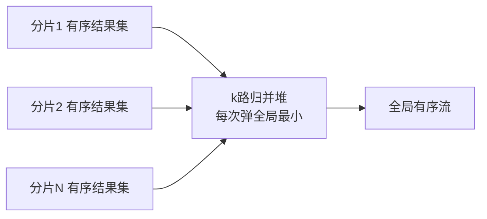

# 跨片查询执行机制：分发、执行、归并三段论

> 一条 `select ... order by create_time limit 10` 打到 512 张表，中间件到底做了什么？为什么 `avg` 不能各片算完直接平均？为什么跨片分页会被改写成你不认识的样子？这篇把分片中间件的执行引擎拆开——每一条「跨片查询慢」的故障，根因都在这三段里。

## 一句话摘要

跨片查询的执行机制是铁打的三段论：**解析改写（逻辑 SQL → N 份物理 SQL）→ 并行下发（各分片独立执行）→ 归并（把 N 个结果集重组成一个）**。三段各自藏着性能命门：改写段的**分页改写**（`limit 100000,10` 变成每片拉 100010 行）、执行段的**慢分片拖尾**（并行度被最慢者决定）、归并段的**内存压力**（排序归并的优先队列与流式权衡）。理解这套机制的价值在于：**所有跨片优化技巧（绑定表、广播表、聚合下推、禁跳页）都是在这三段上做减法**。

## 前置阅读

- 特性层篇 1《分片路由机制》：定向路由与跨片路由的分界
- 入门层篇 10《查询执行原理》：单库 join/排序/临时表（归并算法的原型）

## 🎯 本文核心

**核心机制一句话**：跨片查询 = 把「单机查询引擎」的工作拆成 N 份并行执行再用归并引擎拼回来——**归并引擎是分片中间件的真正复杂度所在**，它的能力边界定义了「哪些 SQL 在分片系统里写得出来」。

**机制链（4 个节点）**：SQL 解析与改写 → 路由分发 → 分片并行执行 → 结果归并（遍历/排序/分组/聚合/分页五类）。

## 上下游一分钟

跨片查询执行在链路的位置：路由机制（篇 1）算出目标分片集合后，执行引擎接管。向上它决定了业务 SQL 的自由度上限（ ORM 与复杂 SQL 的兼容性问题全在这里），向下它压在**每个分片的连接池**上（一条跨片 SQL = N 个物理连接——**连接数放大 N 倍**是分片系统容量规划里最容易漏算的一项）。架构上它是「逻辑数据库」这个抽象的实现者：抽象给业务省了心，复杂度全部沉淀在这一层。

## 一、解析与改写：你发的 SQL 和实际执行的 SQL 不是同一条

中间件拿到逻辑 SQL 后做两类改写（机制穿透的细节层）：

**表名改写**：逻辑表 `t_order` → 物理表 `t_order_043`——每个目标分片一份。附带**自增主键回填**：分片系统主键由分布式 ID 生成器在客户端生成后注入 SQL（链回 distributed-id 系列），老版本还会在返回时回填到实体。

**分页改写**：`limit 100000, 10` 在多片下必须改成每片 `limit 0, 100010`——因为**全局第 100001-100010 名可能藏在任何一个分片的前 100010 名里**，少拉一片都可能漏掉全局正确答案。这条改写是深分页灾难的机制源头（展开见篇 4，此处记住「改写后拉取量与 offset 成正比」即可）。

💡 实战提示：线上排查跨片 SQL 时，用中间件的 SQL 展示/日志功能看「实际下发 SQL」——你写的和它执行的差异，一半的「分片环境 SQL 行为怪异」问题出在改写层。

## 二、并行下发：连接数放大与慢分片拖尾

改写后的 N 条物理 SQL **并行**发往各分片。两个机制级结论：

**连接数放大 N 倍**：单库应用一条查询占 1 个连接；跨片查询瞬间占 N 个。应用连接池大小、各分片 MySQL 的 `max_connections` 规划都必须按「跨片并发 × 分片数」重算——这是分片上线后第一批「莫名连接耗尽」事故的根因（行业常见事故形态）。

**拖尾效应**：归并必须等最慢的分片返回。N 个分片并行，P99 由分片中的最大者决定——**并行不但没有掩盖慢分片，反而把它的延迟广播给了所有跨片查询**。这也是篇 2 倾斜治理在查询侧的回响：一个热点分片拖垮的是全部跨片流量。

**追问链**：为什么不 limit 并发「按需调度」？——中间件确实做资源限制（max-connections-size-per-query 这类配置：**每条跨片查询允许占用的最大连接数**，超过则把该查询降级为串行执行分片）。→ 再追问：串行不就是慢吗？——对无排序的简单遍历归并，串行省连接不省时间；对内存敏感的排序归并，串行流式处理反而稳。**并行度、连接占用、内存三者是执行引擎的三角权衡**，没有全赢配置。

## 三、归并：五类归并的能力边界

归并引擎把 N 个 JDBC 结果集重组成一个。五类归并，能力递增、约束递增：

**遍历归并**：无 order by，逐片逐行读出拼接。最便宜，语义就是「行的并集」。

**排序归并**：每片 SQL 已带 order by（各片有序），归并端用**优先队列（小顶堆）做 k 路归并**——堆里放各片的「当前行」，每次弹出全局最小者并从该结果集补下一行。**为什么各片必须先有序**——k 路归并的正确性依赖每个输入流自身有序，这是把 O(M log M) 的全量排序降为 O(M log N)（M 总行数、N 分片数）的关键。

**分组归并**：group by 场景，各片先按分组键排序返回，归并端按组聚合——若分组键与排序键不一致，中间件要缓存整组数据，内存陡增。

**聚合归并**：`count/sum/max/min` 可下推（各片算好，归并端二次合并：count 相加、max 取大）；**avg 不可直接合并**——`avg(3, 7) = 5` 没错，但各片行数不同时 `avg(avg1, avg2)` 是加权错误。正确机制：改写为 `sum + count` 下推，归并端 `sum/count` 还原。这是面试与实战双高频的「为什么」：**聚合函数能不能下推，取决于它是否满足「可合并律」**——sum/count/max/min 满足，avg/distinct 不满足（distinct 要全量去重，等于放弃下推）。

**分页归并**：与排序归并复合，配合改写层的全量拉取——全局 offset 以内的行全部流过堆才产出目标页。机制上决定了：**跨片跳页的代价随页深线性增长且无法在归并层优化掉**（优化空间在篇 4）。

## 四、跨片 join：三种合法姿势与一条禁令

单条 SQL 跨片 join 是分片系统的雷区，合法机制只有三种：

1. **绑定表 join**：两表同分片键同算法（篇 1 第三节），同键行同槽位——join 被中间件拆成各片本地 join，代价最低。**这是唯一推荐让引擎做的 join**。
2. **广播表 join**：小维表全片冗余（篇 2 方案四），join 本地完成。
3. **应用层组装**：各片查出主表数据，业务代码拿 id 集合去维表批量查再内存拼装——本质是把 join 从 SQL 层挪到应用层，N+1 查询要靠批量 in 控制。

**禁令**：无绑定关系的大表 join 直接跑在跨片引擎上——改写层会把它广播成笛卡尔式的跨片风暴（公开文档明确的危险行为），生产上应在 SQL 审核层直接拦截。**追问：为什么引擎不能像 MPP 数据库那样做 shuffle join？**——MySQL 分片中间件的定位是 OLTP 网关，不做数据重分布（那是存储引擎层的活，TiDB 类原生分布式数据库才内置 shuffle；架构定位不同，能力边界不同）。

## 五、事故推演：一条「简单报表 SQL」的雪崩

典型事故形态（行业化用）：运营在管理后台跑了 `select seller_id, sum(amount) from t_order where create_time > ? group by seller_id order by 2 desc limit 100`。无分片键 → 512 片广播；每片扫描近月全量数据 → 单片慢查询；512 个连接瞬间被占 → 连接池满 → **正常交易 SQL 排不进连接池，全站下单失败**。复盘 Action：① 管理/报表类 SQL 强制走异构数仓（ES/ClickHouse），OLTP 分片引擎禁止无分片键聚合（SQL 审核卡点）；② `max-connections-size-per-query` 从默认值收紧；③ 中间件层对广播 SQL 加并发上限与超时熔断——三条分别落在「入口分流、资源隔离、事中熔断」，又是稳定性三段论的回响。

**追问：为什么不让 OLTP 引擎「顺便」扛报表？**——归并引擎的排序/分组都是内存操作，广播聚合的数据量与 OLTP 点查差 4-5 个数量级；机制定位不同，混用必然出事。**OLTP 与 OLAP 的分离不是性能偏好，是架构正确性**（链回异构索引/HTAP 的开放讨论）。

## 你们可能会问

**Q1：跨片查询一定要跨片吗？能定向就定向？**
对——90% 的优化是让 SQL 带上分片键变成单片查询（路由层直接定向），跨片执行引擎只该接住剩下的 10%。**跨片查询的最好优化是消灭它**，执行引擎的存在意义是兜底而不是常规武器。

**Q2：各分片 limit 0,100010 会不会把单片打爆？**
会，这就是深分页在分片下的加倍形态。工程约束：limit 深度上限（如全局 offset ≤ 1 万）、超深需求走游标或异构（篇 4）。改写机制决定了这个代价无法在中间件层消失。

**Q3：orderBy 的字段不在分片键里，排序归并还正确吗？**
正确——各片各自排序后 k 路归并，全局有序由归并保证。但要意识到**每片的排序都是真实排序**（走索引则省，不走索引则 filesort × N），排序键有索引是分片表设计的基本要求。

**Q4：中间件支持子查询/窗口函数吗？**
按归并能力边界递减：简单子查询可下推改写，复杂子查询与窗口函数多数中间件**不支持或不保证正确**（公开文档的能力矩阵）。规范：分片环境 SQL 白名单化，超出能力的走异构链路。

**Q5：归并是流式还是全量缓存，怎么选？**
排序/分页归并必然流式（堆里只存 N 行「当前行」），但分组归并的「组内聚合」可能缓存整组——内存风险点在分组基数（group by 的唯一值数量）。基数失控的 group by 在分片环境就是 OOM 预备队，审核要卡。

## 业内惯例与生产实践

- **SQL 规范惯例**：分片环境的 SQL 白名单审核（必须带分片键 / 禁跨片大 join / 聚合走异构）是接入规范的标准三条，靠网关卡点不靠自觉（行业认知）。
- **连接惯例**：`max-connections-size-per-query` 类并发占用参数上线前收紧、压测定值；应用连接池按「跨片并发 × 分片数」上限重算——这是容量评审的固定条目。
- **治理惯例**：跨片慢查询看板按「改写后 SQL」聚合归因（而不是业务原始 SQL），否则拖尾分片的定位会失真。
- **演进惯例**：中间件大版本升级先跑 SQL 兼容性回放（线上 SQL 采样在新版本 dry-run），改写/归并行为差异是升级最大风险面。

## 开放问题

- HTAP 架构（TiDB 类一份数据同时服务 OLTP/OLAP）能否让「报表必须出库」的铁律过时？列存副本 + 智能路由的路线在成熟，但 OLTP 分片 + 异构数仓的解耦架构在故障隔离上依然占优——两条路线的边界值得每年重画。
- 归并引擎下推到存储层（各分片返回预聚合向量）的向量化归并，是中间件演进的下一个台阶还是原生分布式数据库的专属？观察中。

## 🎯 核心带走

**30 秒复述**：跨片查询 = 解析改写（表名/分页/主键回填）→ 并行下发（连接数放大 N 倍、慢分片拖尾）→ 五类归并（遍历/排序 k 路堆归并/分组/聚合按「可合并律」下推/分页与排序复合）；跨片 join 只认绑定表、广播表、应用层组装三条路。**失效点**：无分片键广播、深 offset 的全量拉取、不可合并聚合（avg/distinct）直接合、报表混跑 OLTP 引擎。金句带走：

> **跨片查询的最好优化是让它不发生——执行引擎是兜底方案，不是常规武器。**

> **聚合能不能下推，看它满不满足可合并律；SQL 能不能上分片，看它落不落进归并引擎的能力圈。**

## 📌 数据与事实声明

- 归并机制描述基于 ShardingSphere 公开文档与源码架构文章归纳（SQL 改写/归并引擎章节）；「连接数放大」「慢分片拖尾」为机制必然推论。
- 事故叙事为行业典型案例化用，不含真实公司与数据；能力矩阵（子查询/窗口函数支持度）以各中间件官方文档为准，本文不点名具体版本支持清单。

## 📚 参考资料

- ShardingSphere 官方文档：SQL 改写 / 归并引擎 / 跨分片查询能力说明
- 《数据库查询优化器的艺术》——归并与代价模型的通用理论背景
- 关联：篇 4《海量数据分页机制》（深分页专项）；专题层篇 1《拆分方案选型》（中间件选型视角）；本仓库 ES 系列（异构承接）
