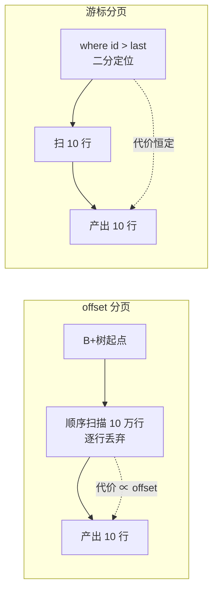
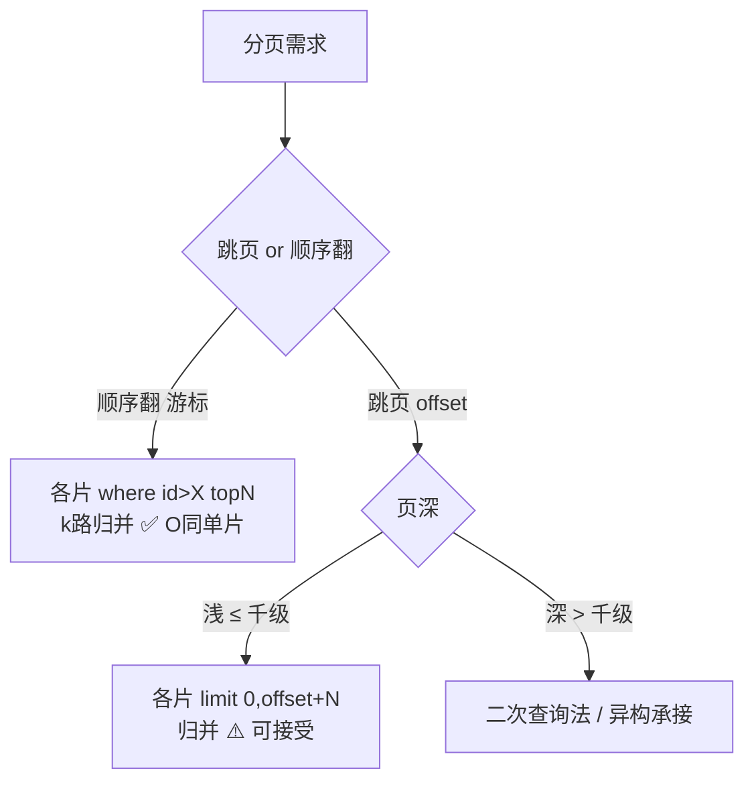

# 海量数据分页机制：offset 的代价与游标的救赎

> `limit 1000000, 10` 为什么是数据库最贵的十行数据？跨片环境下为什么跳一页要搬百万行？「下一页」很快、「跳到第 5000 页」很慢的机制差异在哪？这篇把分页从 SQL 语法拆到 B+ 树扫描行为，给你一套「能跳、敢跳、跳得起」的完整决策树。

## 一句话摘要

深分页慢的根因是一条冷冰冰的语义：**offset 是计数器不是索引——`limit 100000, 10` 要求引擎真正扫描并丢弃前 10 万行**，没有「直接跳到第 10 万行」的机制（B+ 树只能按序扫）。单库的救赎是**延迟关联**（覆盖索引先取主键再回表，把「丢弃」的成本从整行降到主键）与**游标分页**（`where id > last` 让每次翻页都从索引定位出发，O(1) 起点）；跨片后代价被归并机制放大（每片拉 offset+limit 全量，链回篇 3 的改写），工程答案分层：**产品层禁跳页、SQL 层延迟关联、跨片层 top-N 归并或二次查询法、超复杂分页交给异构引擎**。

## 前置阅读

- 特性层篇 3《跨片查询执行机制》：分页改写与归并（跨片分页的机制前提）
- 入门层篇 5《索引基础》：覆盖索引与回表（延迟关联的物理基础）

## 🎯 本文核心

**核心机制一句话**：分页的全部成本在「如何跳过前面的行」——offset 用扫描+丢弃来跳（代价 ∝ offset），游标用索引定位来跳（代价恒定）；分页优化史就是一部「把扫描丢弃改造成索引定位」的演进史。

**机制链（4 个节点）**：offset 语义（扫描丢弃）→ 单库改造（延迟关联/游标）→ 跨片放大（全量拉取）→ 分层解法（产品约束/二次查询/异构）。

## 上下游一分钟

分页在查询链路的位置：它是「列表类查询」的通用出口形态（订单列表/商品列表/消息列表），SQL 发出后先经路由（篇 1），带分片键则单片执行、不带则进入篇 3 的改写与归并——**深分页的跨片代价正是篇 3「分页改写」机制的直接后果**。向下它压在 B+ 树的顺序扫描能力上。架构上分页是「用户体感与引擎机制的交界面」：产品一句「支持跳页」，背后就是本文这一整篇的机制账单。

## 一、offset 的真实代价：扫描并丢弃

`select * from t_order where user_id=? order by id limit 100000, 10` 的执行行为：引擎走 user_id 索引顺序扫，**数够 100000 行丢掉，才产出 10 行**。三个机制细节：

1. **回表放大**：`select *` 意味着每「扫过」的行都要回表取整行再丢弃——10 万次回表只服务 10 行结果。💡 延迟关联的原理就在这：先 `select id ... limit 100000,10`（覆盖索引，不回表），拿 10 个 id 再 `where id in (...)` 回表——**丢弃的成本从「整行回表」降到「索引内计数」**，深页场景常有数量级提升。
2. **丢弃无法缓存**：每次翻第 50000 页都要重新丢 5 万行——offset 的代价是每次全付，不随访问积累摊薄。
3. **offset 越深越贵且无上界**：代价 ∝ offset，语法上却没有任何护栏——这是产品必须设「最大可跳页数」的机制依据。

**追问链**：为什么引擎不能「直接跳」？——B+ 树叶子是链表，定位只能从「搜索条件能约束的起点」开始；`offset` 不参与搜索条件，引擎无从把它翻译成树的定位谓词。→ 再追问：那 `where id > X limit 10` 为什么快？——它把「跳过」翻译成了**搜索谓词**，B+ 树直接二分定位到 X 的位置开始扫 10 行——这就是游标分页 O(1) 起点的机制本质：**同一个「跳过」动作，写在 offset 里是苦力，写进 where 里是快车道**。

## 二、游标分页：机制正确的产品约束

游标分页（keyset/书签分页）：请求带上一页最后一行的排序键 `last_id`，`where id > last_id order by id limit 10`。

- **性能**：每次都是索引定位 + 顺序扫 10 行，代价恒定不随页深增长；
- **一致性**：翻页间隙有新写入时，offset 分页会**重复或漏行**（页边界漂移），游标天然免疫（定位谓词锚定真实位置）——这是比性能更重要的正确性优势；
- **代价**：只能顺序翻页（不能跳页）、排序键必须唯一且有序（复合排序键用 `(create_time, id) > (last_time, last_id)` 行值比较）、URL 里要编码游标 token。

**决策构件**：什么时候必须游标——无限滚动流（feed/消息/账单导出）、数据高频写入的列表；什么时候 offset 仍可接受——后台管理低频跳页 + 页深上限 100 以内。**明确推荐**：面向 C 端的列表一律游标，面向运营的后台列表 offset + 页深上限，没有第三种正确答案。

## 三、跨片分页：归并机制把代价放大

单片游标很美，跨片后机制变脸（链回篇 3 分页改写）：

**全局 offset 跳页**：`limit 1000000,10` 被改写成**每片 `limit 0,1000010`**——512 片共扫 5 亿行送进归并堆。跨片跳页的代价是「单片 offset × 分片数」，这是分页问题的地狱难度。

**跨片「下一页」（游标）**：`where id > last_id` 下发各片，各片返回本片 top10，归并端 k 路堆归并取全局 top10——每片只拉 10 行，代价与单片同阶。**为什么全局游标可行**——排序键全局唯一（分布式 ID 含基因位也保持全局唯一）时，「全局第 N 之后的前 10 名」必然是「各片第 N 之后前 10 名的并集的前 10 名」，k 路归并数学上精确。

**二次查询法（精确跨片跳页的经典机制）**：目标「全局 offset=100 万的第 10 行」。第一次各片查 `limit 1000000/N + 10`（≈ 每片平均承担的 offset）拿局部第 100 万/N 名的排序键集合；**第二次用这些键的 min 作为定位谓词**再查各片，把全局第 100 万名精确锚定（利用各片排序键的分布信息收敛误差）。代价从「全量 100 万×N」降到「两次 × 每片 N 分之一量级」——**机制本质：用排序键的分布统计把全局 offset 翻译成各片的局部谓词**。代价是要两次往返 + 实现复杂，中间件不内置，需要应用层自建（业内有开源实现可参考，行业认知）。

**追问链**：为什么不能像 ES 那样用 search_after 直接解决？——ES 的 search_after 就是游标的索引侧实现，**它的前提同样是「禁跳页」**；任何引擎的深跳页都贵（ES 的 from+size 窗口默认 1 万封顶），这是「跳页」这个需求本身的机制原罪，不是某个引擎的缺陷。

## 四、产品与架构层的分页决策树

把机制翻译成落地的分层决策（决策构件，给明确推荐）：

| 层 | 决策 | 机制依据 |
|---|---|---|
| 产品层 | C 端列表禁跳页（只给上一页/下一页/下拉加载） | 游标 O(1) 且不重不漏 |
| 产品层 | 后台跳页设上限（≤ 500 页）+ 引导筛选缩小范围 | offset 代价 ∝ offset |
| SQL 层 | 单库深翻页用延迟关联 + 排序键覆盖索引 | 丢弃成本从整行降到索引内 |
| 中间件层 | 跨片禁无分片键深跳页；归并连接数收紧 | 篇 3 改写与拖尾机制 |
| 异构层 | 多维筛选 + 任意跳页 + 导出 → 同步 ES/数仓承接 | 列表查询本质是多维检索，异构引擎才是主场（链回篇 1 基因法的卖家维度） |

💡 实战提示：游标 token 用 `(sort_key, id)` 的 base64 编码并带过期时间——既防止客户端伪造任意 offset，也让长间隔翻页自然降级为重新查询。

## 五、事故推演：导出功能打穿归并引擎

典型事故形态（行业化用）：运营平台「订单全量导出」用 `limit offset, 10000` 循环翻页导出 3000 万行——每次循环跨片拉取量随页深线性上涨，跑到中段归并堆内存告警、各分片 CPU 飙升，**导出一条 SQL 把白天的正常交易拖进泥潭**。复盘 Action：① 导出类一律改「游标 + 主键分批」（`where id > last` 每批 5000，批次间 sleep 限流）；② 导出走从库/数仓，与 OLTP 物理隔离；③ 中间件对同账号并发导出加配额——**「导出」是最容易被遗忘的深分页大杀器**，每个分片系统都该在上线前禁手写 offset 循环。

## 源码级验证：分页成本在执行层的样子

「扫描并丢弃」不是推论，可直接观测：

- **EXPLAIN 验证**：深 offset 查询的 `EXPLAIN` 里 rows 估算 ≈ offset+limit——引擎的计划自己承认要扫这么多；`Extra` 出现 `Using index condition/filesort` 时丢弃成本进一步放大。
- **Handler 计数器**：`SHOW SESSION STATUS LIKE 'Handler_read%'` 前后差分——`Handler_read_next` 增量 ≈ 实际扫描行数（offset+limit），游标分页同查询该计数 ≈ limit，两个数字一对比，本文全部结论落地为可复现实验。
- **优化器视角**：`optimizer_trace` 可看到「offset 不参与 range 优化」的决策细节——为什么 offset 无法被索引利用，计划器给出的就是证据。

这一组实验适合作为团队的「分页机制」内训 demo：同一个查询把 offset 从 10 改到 1000000，Handler_read_next 线性起飞、游标版恒定——一图胜千言。

## 业内惯例与生产实践

- **产品惯例**：C 端列表禁跳页已成行业默认形态（瀑布流），后台系统页深上限（百页级）写入 UI 规范。
- **导出惯例**：大数据导出一律「游标 + 分批 + 限速 + 走从库/数仓」，offset 循环导出列入 SQL 审核黑名单（行业认知）。
- **总数惯例**：精确 count 用异步统计/近似值，列表页「是否有下一页」代替「共 N 页」。
- **索引惯例**：列表查询的排序键建覆盖索引（排序键+过滤列+主键），是延迟关联能生效的物理前提。

## 你们可能会问

**Q1：order by create_time 分页，时间重复怎么办？**
排序键必须唯一才能稳定分页——用行值比较 `(create_time, id) > (?, ?)`，时间相同按 id 破平。**任何不带唯一破平键的分页都有重/漏行风险**，这是正确性问题不是性能问题。

**Q2：游标分页的旧 token 在数据删除后失效吗？**
定位谓词 `id > X` 在锚点行被删后依然正确（锚点只是位置标记，不要求存在）——这是游标优于「按页码重查」的又一机制优势；但排序键依赖的其他列若被更新，边界可能漂移，敏感场景用不可变键。

**Q3：count 总数（配合分页器「共 N 页」）怎么算？**
跨片 count 可下推合并（可合并律，篇 3），但**大表实时 count 本身就是反模式**——行业惯例：列表场景用「是否有下一页」（多取 1 条）代替精确总数，或异步统计/近似值。把产品从「必须显示总数」的执念里解放出来，是分页方案最容易漏的一环。

**Q4：ES 承接列表后，MySQL 还需要分页优化吗？**
需要——导出、对账、运营明细仍是 MySQL 直查；且 ES 的写入延迟（近实时）决定了强一致场景回源 MySQL。两套分页机制并存，规范要写清哪些页面走哪条链路。

**Q5：二次查询法为什么不进中间件标准能力？**
它需要「各分片排序键分布」的先验假设（假设均匀才取 offset/N），分布偏斜时有精度问题，且两次往返的延迟模型复杂——机制上属于「应用层按需实现的优化」而非通用引擎能力，强行内置会把错误抽象带给所有人。

## 开放问题

- 分布式数据库的原生分页下推（TiDB 类把 limit/offset 推到 TiKV region 级）能把跨片跳页优化到什么程度？Coprocessor 预聚合的思路对 offset 语义的帮助仍有理论边界（丢弃还是丢弃），值得跟踪执行器演进。
- 列存引擎（ClickHouse 类）把「深翻页」重构为「向量化扫描」后，分页这个交互范式本身会不会被「流式游标 + 订阅」替代？交互演进与技术演进的因果值得观察。

## 🎯 核心带走

**30 秒复述**：offset = 扫描并丢弃（代价 ∝ 页深、无法缓存），游标 = 索引定位（O(1)、不重不漏）；单库改造靠延迟关联（覆盖索引计数代替整行回表）；跨片顺序翻页 = 各片 topN + k 路归并（同阶代价），深跳页 = 二次查询法（分布统计换谓词）或异构承接；导出必须游标分批。**失效点**：排序键不唯一、C 端给跳页、offset 循环导出、count 实时化。金句带走：

> **同一个「跳过」，写进 offset 是扫描十万里丢九万九，写进 where 是二分定位走十行——分页优化的全部，就是把跳过翻译成定位。**

> **禁掉跳页不是产品妥协，是机制诚实：所有引擎的深跳页都贵，区别只是谁先承认。**

## 📌 数据与事实声明

- B+ 树扫描行为、延迟关联、二次查询法为公开技术文献与社区共识机制；「窗口 1 万」为 Elasticsearch 默认配置（index.max_result_window，公开文档）。
- 事故叙事为行业典型案例化用；「C 端禁跳页/后台页深上限」为行业认知惯例，具体数值随场景校准。

## 📚 参考资料

- ShardingSphere 官方文档：分页归并的限制与说明
- Elasticsearch 官方文档：search_after 与 max_result_window（跨引擎对照）
- 《高性能 MySQL》——优化 limit 分页（延迟关联原始出处级别的经典章节）
- 关联：篇 3《跨片查询执行机制》（改写与归并前提）；本仓库 ES 系列（异构承接正源）；缓存三兄弟系列（列表热点的缓存层配合）
