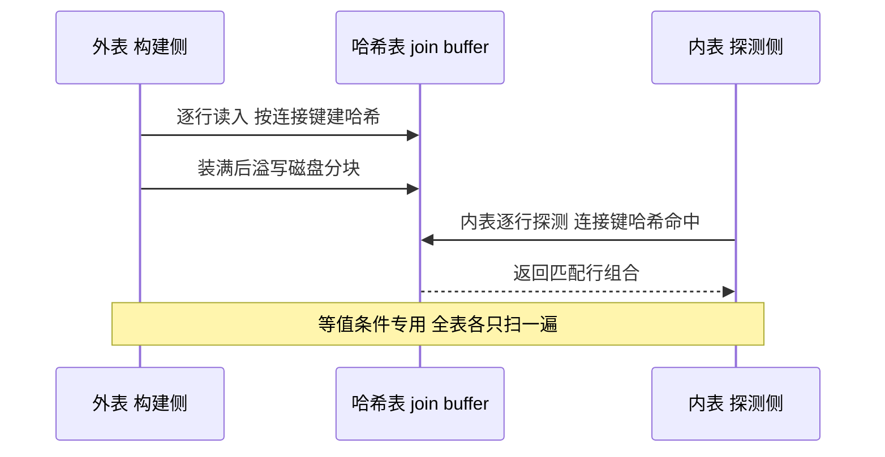

# Join 算法与优化器成本模型：NLJ、hash join、MRR、BKA 是怎么被选出来的

> 两条同样的 SQL，一条走索引嵌套循环毫秒出结果，一条走了全表 hash join 把 CPU 打满——区别不在写法，在优化器对「哪条路便宜」的量化判断。这篇把 Join 执行的四套算法（NLJ / BNL / hash join / MRR-BKA）的机制与成本公式摊开，讲清楚优化器怎么选、join_buffer_size 到底在给谁打工、慢查询日志里一条 Join 怎么归因。读完你会得到一张「看到 EXPLAIN 输出反推执行路径」的对照表。

## 一句话摘要

MySQL 的 Join 执行只有两个基本问题：**「对每一行驱动数据，怎么找到匹配行」与「找不到索引时怎么退化」**。有等值条件且内表有可用索引 → 索引嵌套循环（成本 = 外表行数 × 单次回表代价）；没有可用索引 → 8.0.18 起用 hash join（构建哈希表 + 探测，内存不够溢写磁盘，取代旧的 BNL 逐块扫描）；范围扫描回表随机 IO 大 → MRR 把回表按主键排序变成顺序流（`mrr_cost_based` 默认 ON 导致实际很少被选中）；BKA 是「MRR + join buffer」的 Join 版组合拳（默认 OFF）。优化器在这一切之上跑成本模型：**总代价 = IO 代价 + CPU 代价，输入是统计信息**——统计失真时选择必错，Join 慢查询的第一归因永远是统计与索引，而不是算法本身。

## 前置阅读

- 《[优化器与索引选择](../深入理解索引系列/3_优化器与索引选择-深度.md)》：代价模型与统计信息（本篇是它在 Join 场景的展开）
- 《[聚簇索引与回表](../深入理解索引系列/2_聚簇索引与回表-深度.md)》：回表代价模型（MRR/BKA 优化的正是这一段）
- 入门层篇 10《[查询执行原理](../../入门层/从零开始认识MySQL系列/10_查询执行原理-入门.md)》：执行器与访问类型基础

## 🎯 本文核心

**核心机制一句话**：优化器选 Join 路径 = 对「内表访问方式」逐个估价——索引点查最便宜、hash join 是「无索引时的批量替代」、MRR/BKA 是「回表随机 IO 的顺序化改造」；**join_buffer_size 不是 Join 的总内存，而是其中「批量类算法」的工作缓冲**。

**机制链（全文按这条链展开）**：

内表怎么找（NLJ 与索引回表）→ 找不到索引怎么办（BNL 退场、hash join 接棒）→ 回表太随机怎么办（MRR 排序回表 → BKA 攒批 Join）→ 谁在算账（成本模型与统计信息）→ 慢了怎么归因（EXPLAIN/ANALYZE/trace 三件套）

## 一、边界：入门层与索引系列讲过什么，本篇挖什么

| 内容 | 已有篇目 | 本篇 |
|---|---|---|
| EXPLAIN 字段解读、索引选择基础 | 索引系列篇 3 | 不重复 |
| 回表的代价与覆盖索引 | 索引系列篇 2 | 不重复 |
| **Join 四套算法的执行细节** | 未讲 | **本文核心一** |
| **成本模型如何给 Join 路径定价** | 未讲 | **本文核心二** |
| **join_buffer_size 的真实作用域** | 未讲 | **本文核心三** |
| **慢查询 Join 归因套路** | 未讲 | **本文核心四** |

## 二、NLJ：有索引时，Join 是「外层循环 + 内层点查」

嵌套循环_join（NLJ）的机制朴素到近乎废话：外层取一行，到内表按关联条件查匹配行。它的全部成本学问在**内表那一次查找**上：

- **内表有可用索引**（等值条件命中索引）：内表访问退化为一次 B+ 树点查 + 回表，成本 ≈ 外表行数 ×（树高 + 回表页数）。这种形态的 Join 效率极高——千万行外表 × 每行 3-4 次页访问，毫秒到秒级返回；
- **内表没有可用索引**：朴素 NLJ 要对每一行外表数据扫一遍内表全表——O(M×N) 的灾难，这正是下面几节所有机制存在的原因。

**驱动表怎么选**：成本模型分别给「A 驱动 B」与「B 驱动 A」估价，本质是比较两种乘法——`外表行数 × 内表单次查找代价`。单次查找代价接近时，**小表驱动大表**；但注意这不是道德律令，而是乘法的结果：如果大表做驱动能让内表走更窄的索引区间，大驱动也可能更便宜。用 `STRAIGHT_JOIN` 或 `JOIN_ORDER` hint 固定连接顺序前，先看两种顺序的 EXPLAIN 成本差，别凭「小表驱动」口诀硬掰。

**追问一层：为什么 MySQL 不自动给 Join 条件建索引？** 因为索引是写路径的长期负债（每次写入多维护一棵树），而这条 Join 可能一年跑一次——自动建索引等于替用户做存储决策。优化器只负责「在已有索引里挑」，建什么索引是 schema 设计的责任，这个边界是**执行与存储分权**的设计思想。

## 三、BNL 退场与 hash join 接棒：无索引 Join 的两代方案

### 3.1 旧方案 BNL：join buffer 分块缓存外表

没有索引时的老办法是 Block Nested-Loop：把外表的一批行装进 join buffer（一块会话级内存），内表**整表扫一次**，在内存里与这批行逐一匹配；buffer 装满就换下一批，内表再扫一遍。成本公式：`内表扫描次数 ≈ 外表行数 / 每批可容纳行数`——join buffer 越大，内表被扫的遍数越少。这解释了 BNL 时代「调大 join_buffer_size 能明显提速无索引 Join」的经验，也解释了它的天花板：内表扫描遍数只会趋近 1，不会小于 1。

从演进视角看，BNL 是「内存换扫描遍数」的第一次尝试，hash join 是同一目标下的彻底形态——后者把「逐行匹配」升级成「哈希定位」，机制的更替不是否定前者，而是同一约束（内表扫描次数）下解法的代际演进。

### 3.2 新方案 hash join：8.0.18 起，把「扫 N 遍」变成「建一次表」

8.0.18 引入 hash join，8.0.20 起覆盖外连接/半连接/反连接并移除 BNL（官方文档口径）。机制分两阶段：

- **构建（build）**：选相对小的输入，把行按连接键哈希进内存哈希表——这块内存就是 join buffer，装不下就**溢写磁盘分成若干块**（on-disk hash join），代价是落盘临时文件的读写；
- **探测（probe）**：读另一个输入的每一行，算哈希、查表、输出匹配组合。两边各只扫一遍，把 BNL 的「内表扫 N 遍」直接拍成「各扫一遍 + 一次哈希查找」。

EXPLAIN 的 Extra 出现 `Using join buffer (hash join)` 即此路径；EXPLAIN ANALYZE（8.0.18+）能看到 build/probe 各自的真实行数与耗时。

**硬前提是等值条件**：哈希匹配只认「键相等」。没有等值条件的笛卡尔积走不进这条快路，成本天然爆炸——这类 SQL 该在审核层直接拦下，而不是指望执行器救。

**追问一层：hash join 会用内表索引吗？** 优化器是在「索引回表路径」与「hash join 路径」之间做成本比较，不是「有索引必用索引」：外表过滤后剩行很少时，走索引回表通常赢；外表基本不过滤、内表又没有高选择性索引时，hash join 一次构建摊薄一切。个别 8.0 小版本上有过两种路径计划翻转的公开报告——**Join 计划随小版本漂移要有心理预期，升级后先跑关键 SQL 的 EXPLAIN 对照**。

**再追问一层：5.7 时代为什么不直接上 hash join？** 反方案分析：hash join 需要成体系的执行器改造（哈希表生命周期、溢写磁盘、内存记账），5.7 的执行器架构做这件事的改造成本远超收益；8.0 重写为迭代器执行框架后才顺理成章——**「为什么选择在 8.0 做」的答案不是技术不够早，而是地基重构让方案变便宜了**。这个设计思想值得单独记一笔：先修地基，新机制才有落脚处——次序选对了，难的决策会变简单。

### 3.3 为什么不选「hash join 一刀切」

有索引时 hash join 并非总是更慢，为什么优化器不无脑用它？因为 hash join 有隐性账单：**构建哈希表本身的 CPU 与内存成本是固定的**——外表只有几十行、内表索引点查只要 3 次页访问时，建哈希表纯属浪费。成本模型里两种路径各有公式，选便宜的那个；「一刀切」的提议在极端两侧都会劣化。这就是优化器存在的意义：**它不是选「理论上先进」的算法，是选「当前数据量下便宜」的算法**。

## 四、MRR 与 BKA：把回表的随机 IO 变成顺序流

### 4.1 MRR：先排序再回表

二级索引范围扫描的隐藏成本在回表：索引命中的主键通常是乱序的，逐条回表 = 逐次随机页访问。Multi-Range Read 的机制是把这一段改造掉：

机制核心是把「扫索引」与「回表」解耦成两步，中间加一道**按主键排序**的缓冲（实现层叫 DS-MRR）。代价模型两头算：排序缓冲有成本，随机页变顺序页有收益——`optimizer_switch` 里 `mrr=on` 且 `mrr_cost_based=on` 都是默认值，后者意味着**只有优化器估出「顺序化收益 > 排序成本」才真用**，实践中多数 OLTP 场景估出来不划算，`Extra` 里的 `Using MRR` 在大盘点/范围导出类查询更常见。机械盘时代它是明星优化，SSD 时代随机读代价塌缩，收益同步缩水——机制没变，物理底座变了。

### 4.2 BKA：把 MRR 用到 Join 上

Batched Key Access = 「join buffer 攒批外表的关联键 + MRR 顺序回表」：外表行先攒进 join buffer，把这一批关联键排序后对内表做批量索引查找、按主键序回表。

它默认关闭（`batched_key_access=off`），开启还有前置条件（`mrr` 开 + 会话权限要求）。**为什么不默认开**：BKA 的收益依赖「回表随机 IO 占比大」这个前提，且攒批有延迟与内存成本——默认开启会让大量本来很快的 Join 背上不必要的缓冲开销。默认值即官方的负载假设表态：**多数 Join 是索引点查型，不是批量回表型**。需要它的是「外表百万行 × 内表范围命中」的批量关联场景，按会话开启做对照验证后再固化。这套机制的演进历史也值得记一笔：BKA 与 MRR 同源共生，都是「随机 IO 时代」的产物——底层存储的物理特性变了，机制的相对收益随之重估，这是所有 IO 类优化共通的跨周期规律。

## 五、优化器怎么算账：成本模型与统计信息

Join 路径选择不是拍脑袋，是一张代价表上的加减法。8.0 把代价常数做成了**可查询可修改的两张表**：`mysql.server_cost`（CPU 侧：行求值、键比较、临时表创建等）与 `mysql.engine_cost`（IO 侧：`io_block_read_cost` 等页读代价，默认 1.0）——`UPDATE` 后 `FLUSH OPTIMIZER_COSTS` 生效。这意味着你可以把自己存储的真实 IO 比价「喂」给优化器，而不是接受出厂假设。

对 Join 场景，成本模型的输入与输出可以压缩成三句：

1. **输入是统计信息**：表的行数、索引基数（cardinality）、以及范围查询时的 index dive 估算——统计过期（大表未及时 ANALYZE）时，输入错了，输出再精確也是错；
2. **中间是连接顺序搜索**：多表 Join 有指数级的顺序组合，优化器做贪心 + 剪枝，超出搜索深度后不保证全局最优——这也是「Join 表数控制在个位数」这条审核惯例的底层原因；
3. **输出是路径组合**：每张表用哪个索引、Join 用哪套算法、谁驱动谁，全部来自上面两张代价表上的比较。

**追问：统计信息多久更新一次？** InnoDB 在表数据变化超过阈值（`innodb_stats_auto_recalc` 默认 ON，约 10% 变更触发）时异步重采样，但采样窗口有限，大表仍有失真期——**Join 计划突变的第一排查动作永远是 `ANALYZE TABLE` + 对比统计**，这条纪律来自无数次「昨天还好好的」型故障的复盘。

## 六、join_buffer_size 的真实作用：它是「批量算法的工作台」，不是「Join 总内存」

这是 Join 调优里误解率最高的参数，三条正本清源：

- **作用域**：join buffer 是**会话级、按需分配**的工作缓冲——普通索引 NLJ 根本不用它；用它的只有 BNL（已退场）、hash join（构建哈希表）、BKA（攒批键）、以及部分 MRR 场景。未分配时不占内存，查询结束释放；
- **默认值与量级**：默认 256KB（官方文档口径），这是给「常规 Join」的最小工作台；hash join 构建侧超过它就溢写磁盘，所以批量关联场景确实需要调大——但应该在**会话级**调（批量任务自己的连接里 `SET join_buffer_size=...`）；
- **为什么全局调大是反模式**：全局值是「单个 buffer 的上限」，并发高峰下每个在跑的批量 Join 都可能各自吃满——500 个并发 × 64MB 的潜在分配是真实的 OOM 路径（行业认知：多起内存告警复盘都指向全局 join_buffer_size 被一刀调大）。**「这个参数管的是单笔预算，乘上并发才是总账」——所有会话级缓冲参数都适用这条。**

## 七、慢查询里的 Join 归因：一套固定排查动线

一条 Join 慢查询到手，按这个顺序走（每步都有明确的「看什么 → 下什么结论」）：

1. **EXPLAIN 看内表 type**：内表是 `ALL`（全表扫）→ 要么缺索引、要么统计失真让优化器放弃了索引；`ref`/`eq_ref` → 索引路径，问题可能在外表行数失控；
2. **Extra 字段定算法**：`Using join buffer (hash join)` = 无索引批量路径；`Using MRR` = 顺序化回表在用；`Using temporary; Using filesort` 的组合经常暗示 Join 中间结果在落盘；
3. **rows 估值 vs 真实行数**：`EXPLAIN ANALYZE`（8.0.18+）直接给 actual rows 与各算子耗时——估值与实际差一个数量级就是统计失真的实锤，`ANALYZE TABLE` 后复测；
4. **还定位不了开 optimizer_trace**：能看到优化器对每条候选路径的具体估价——「为什么不用我预期的索引」这类问题 trace 里直接给答案；
5. **归因收口**：缺索引补索引（连带评估写放大）、统计失真修统计、量级到了分批/拆解——**不改执行路径的「SQL 调优」是安慰剂**。

**事故叙事一**（行业常见模式匿名化）：报表 Join 在某天突然从秒级跌到分钟级。排查动线：EXPLAIN 发现内表 type 从 `ref` 变 `ALL` + `Using join buffer (hash join)`——期间无人改表改索引；EXPLAIN ANALYZE 看到外表实际行数与估值差了两个数量级——上周一次大批量删除让统计失真；`ANALYZE TABLE` 后计划回位。**复盘结论：执行计划的「昨天还好好的」不是玄学，是统计输入变了；凡 Join 计划突变，先修统计再谈别的。**

**事故叙事二**：批量任务把 join_buffer_size 全局调到 64MB 求快，当晚高峰连接数上来后实例内存告警、触发 OOM 保护。复盘：会话级参数当全局配，单笔预算 × 并发才是总账；整改为「批量任务专用账号 + 会话级设置 + 并发上限」，全局值回归默认。**这条与第一篇的会话内存讨论同源：全局缓存与会话内存的边界，是 MySQL 内存治理的第一道分水岭。**

## 八、不同量级的思考：架构约束驱动解法

量级不同，Join 的核心矛盾完全不同——解法不能跨档套用：

- **十万级（外表内表都在万行以下）**：约束来自「数据全在内存」——怎么写都不慢，hash join 与索引回表的差异是微秒级；思考方式是「审核驱动」——只拦笛卡尔积与缺等值条件的写法，这一档的核心问题是「写法有没有底线错误」，而不是「算法选哪个」
- **百万级（Join 出现秒级延迟）**：约束来自「回表次数 = 外表行数 × 每行代价」的乘法——索引选择与统计质量开始决定生死；思考方式是「计划驱动」——EXPLAIN/ANALYZE 成为每条慢 Join 的第一反应，这一档的核心问题是「乘法里哪一项失控了」，而不是「加个参数试试」
- **千万级（单次 Join 触发溢写与全扫）**：约束来自「哈希表装不下 + 内表索引选择性不足」——hash join 溢写磁盘、BNL 式退化的风险都在这一档显形；思考方式是「预算驱动」——join_buffer 会话级调大 + 数据倾斜检查 + 分批执行，这一档的核心问题是「工作台预算与数据量匹配吗」，而不是「换个 hint 碰运气」
- **亿级（单实例 Join 物理不可行）**：约束来自「中间结果规模超过单机内存与临时表能力」——解法不在执行层，在架构层：预聚合、宽表化、或应用侧拆分关联；思考方式是「绕开驱动」——让 Join 在写路径就被消化掉，这一档的核心问题是「这个 Join 该不该在查询时发生」，而不是「怎么让它跑得动」

思考方式总结：十万级靠「写法审核」，百万级靠「计划解读」，千万级靠「预算管理」，亿级靠「架构绕开」——约束从语法层逐级上移到物理层，思考方式必须跟着约束来源迁移。

**自下而上与触发升级**：先用 EXPLAIN ANALYZE 实测「外表行数 × 内表单次代价」在哪个量级失守，再定档——不预支上一档的架构改造。触发升级的信号：Join 延迟从毫秒跳秒级（进百万档）、Extra 出现溢写/临时表落盘（进千万档）、Join 中间结果行数超过单表行数量级（进亿档）——信号出现即升级思考方式，滞留旧档就是在赌运气。

## 九、源码关键路径：算法与参数在代码里的位置

| 机制 | 源码位置（sql/） | 说明 |
|---|---|---|
| hash join 执行器 | iterators/hash_join_iterator.cc | 8.0 迭代器框架下的 build/probe 与溢写逻辑 |
| 成本模型 | cost_model/ + mysql.server_cost / mysql.engine_cost 表 | 代价常数表化（8.0），FLUSH OPTIMIZER_COSTS 生效 |
| MRR（DS-MRR） | handler 层 multi_range_read_* 接口族 | 二级键排序回表的引擎层通用实现 |
| Join buffer 记账 | 会话内存体系 | join_buffer_size 是单 buffer 上限，按需分配用完即还 |
| 旧 BNL | 8.0.20 起移除 | `block_nested_loop` 开关随之成为历史（8.0.20+ 弃用） |

读法建议：从 `hash_join_iterator.cc` 的 `build_hash_table` 进，顺着「内存够 → 常驻」与「内存不够 → 溢写」两个分支各走一遍，join_buffer_size 的语义自然浮现——比背参数文档扎实得多。

## 十、业内惯例与生产实践

- **Join 表数审核**：生产 SQL 审核普遍把「单条 Join 表数」限制在个位数——底层原因就是第五节讲的连接顺序搜索空间爆炸，超限后优化器不保证找到好计划。
- **统计维护进日常**：大表批量写入/删除后补 `ANALYZE TABLE`，或把统计陈旧度纳入巡检——业内反复验证的第一优先级 Join 稳定性措施。
- **会话级调参惯例**：批量 Join 任务走专用账号，会话级调 join_buffer_size 与 sort buffer，全局保持默认——「全局默认保守、会话按需放大」是缓冲参数管理的通用姿势。
- **升级后计划对照**：8.0 小版本间 Join 计划有过公开的计划翻转案例，版本升级 checklist 里给核心 Join SQL 留 EXPLAIN 对照位——成本模型也是代码，也会有 bug 与修正。
- **hash join 不是敌人**：无索引大表关联场景它是正确答案；要治理的是「本该有索引却跌进 hash join」的计划漂移，而不是禁用机制本身——「禁 hash join」类的土政策在业内普遍被证明是因噎废食。

## 💡 实战提示

- 💡 **看到 `Using join buffer (hash join)` 先问一句「该不该有索引」**：hash join 是无索引时的最优解，但「跌进来」常常意味着有人删了索引或统计失真——对比历史 EXPLAIN 是最快的定位动作。
- 💡 **EXPLAIN ANALYZE 只看 actual rows 一列也值回票价**：估值与实际的偏离度直接判定统计质量，比任何「感觉」都硬；两个数量级的偏离 = 立刻 ANALYZE TABLE。
- 💡 **调大 join_buffer_size 永远在会话级做**：批量任务自己的连接里 `SET`，并给该账号设并发上限——全局调大等于把单笔预算上限广播给所有并发。
- 💡 **范围扫描回表慢，先试 MRR 再谈覆盖索引**：会话里 `SET optimizer_switch='mrr_cost_based=off'` 做对照，如果 `Using MRR` 明显提速，说明这个查询是「顺序化收益型」，长期方案可以是覆盖索引或 hint 固化。
- 💡 **笛卡尔积在审核层拦，别到执行层救**：无等值条件的 Join 走不进任何批量算法的快路，成本乘法天然爆炸——这类问题的正确位置是 SQL 审核，不是 DBA 的深夜救援。

## 什么时候用/不用：Join 算法与参数决策表

| 场景 | 推荐路径 | 不建议 |
|---|---|---|
| 等值 Join + 内表高选择性索引 | 保持默认（索引 NLJ），不需要 hint | 强制 hash join——构建成本纯浪费 |
| 大表无索引临时关联（一次性任务） | 让 hash join 接活，会话级调大 join_buffer_size | 全局调大 join_buffer_size |
| 范围扫描 + 回表占比高的批量导出 | 会话开 MRR 做对照，有效则固化 hint | 对点查型 OLTP 全局开 BKA |
| 超多表 Join（两位数表） | 拆分执行 / 中间表物化 | 加 hint 逼优化器硬算——搜索空间已爆炸 |

明确推荐一句话：**默认路径 + 会话级放大 + 统计信息勤维护**——九成 Join 慢查询的答案在这三件事里，hint 是最后手段。

## Trade-off：每条 Join 路径的账单

| 路径 | 收益 | 代价 | 反噬场景 |
|---|---|---|---|
| 索引 NLJ | 每行代价最小、延迟稳定 | 依赖内表索引；外表行数失控时乘法爆炸 | 大外表 × 低选择性内表索引 |
| hash join | 无索引时两边各扫一遍 | 构建内存/溢写磁盘；等值条件硬前提 | 点查型场景被误选、构建侧过大 |
| MRR | 随机回表变顺序流 | 排序缓冲成本；小范围反而更慢 | SSD 点查场景白付排序成本 |
| BKA | 批量键 + 顺序回表双重收益 | 默认关闭（收益前提苛刻） | 被当全局开关滥用 |

## 你们可能会问

**Q1：hash join 出来后，还需要为 Join 条件建索引吗？**
需要，而且是第一优先级。hash join 是「没有索引时的兜底」，不是「有了它索引就不重要」——索引 NLJ 在低并发点查场景的延迟稳定性，hash join 的批量构建路径给不了。两者的正确关系是分层兜底，不是替代。

**Q2：为什么 `Using MRR` 我开着却几乎见不到？**
因为 `mrr_cost_based=on` 是默认——优化器估完账通常认为排序回表不划算。这是官方刻意保守的默认（防误用），想验证真实收益就临时关掉 `mrr_cost_based` 做对照，而不是怀疑机制没生效。

**Q3：join_buffer_size 调大到 1G 会不会让所有 Join 都变快？**
不会。索引 NLJ 不用它；hash join 快不快取决于构建侧数据量与是否溢写，而溢写与否又和外表过滤后行数有关——先把过滤做对，再谈缓冲。全局 1G 还有并发放大的 OOM 风险，见第六节。

**Q4：驱动表真的是「越小越好」吗？**
是「乘法越小越好」，不是「表越小越好」。单次内表查找代价不同时，小表驱动可能反而总代价更高；`STRAIGHT_JOIN` 固定顺序之前，用 EXPLAIN 比较两种 Join 顺序的成本列，让乘法说话。

**Q5：Join 顺序 hint 该不该常用？**
不该。hint 把「数据量变化后的重规划」能力也一起锁死了——今天的最优顺序在数据涨十倍后就是坑。hint 只用于「优化器确实选错且短期无法修统计/索引」的过渡态，并留注释说明退场条件。

## 开放问题

- 迭代器框架下 MySQL 正在推进的搜索器改造（hypergraph 方向，公开资料口径）会改变连接顺序搜索与代价假设——「搜索空间爆炸」的传统约束未来还剩多少，值得跟踪。
- 列存/向量化执行在分析型 Join 上与行存 hash join 的代差如何被 MySQL 主线吸收？我的判断是 HTAP 分流比单引擎追赶更现实，欢迎讨论。

## 核心带走

**30 秒复述**：Join 执行的算法谱系是「索引 NLJ（首选）→ hash join（无索引兜底，8.0.18+，溢写磁盘）→ MRR/BKA（回表顺序化，默认保守）」；优化器的选择 = 统计信息输入 × 成本常数表的加减法，统计失真则必错；join_buffer_size 只是批量算法的会话级工作台，全局调大是 OOM 反模式。**失效点**：统计过期计划突变、内表缺索引跌进 hash join、会话缓冲全局化、笛卡尔积漏过审核。金句带走：

> **Join 优化的本质是管好两个乘法——外表行数 × 内表单次代价，以及单笔缓冲 × 并发数。**

> **优化器不是在选先进的算法，是在选当前数据量下便宜的算法——你要做的是让它拿对统计、备对索引。**

## 📌 数据与事实声明

- 版本口径：hash join 于 8.0.18 引入、8.0.20 覆盖外连接并移除 BNL、EXPLAIN ANALYZE 8.0.18+ 可用，join_buffer_size 默认 256KB，`mrr`/`mrr_cost_based` 默认 ON、`batched_key_access` 默认 OFF，代价常数表 mysql.server_cost / mysql.engine_cost 为 8.0 特性——均出自 MySQL 官方文档（截至 2026-09）；「个别小版本计划翻转」为公开报告口径。
- 文中性能量级（延迟区间、并发放大风险）为行业认知经验值；两则事故为行业典型模式的匿名化重建，不含真实公司与生产数据。

## 📚 参考资料

| 来源 | 内容 |
|---|---|
| MySQL 官方文档（dev.mysql.com）Hash Joins / Multi-Range Read / BKA / Optimizer Cost Model 章节 | 算法条件、开关默认值与成本表 |
| InnoDB/Server 源码（sql/iterators/hash_join_iterator.cc、sql/cost_model/） | 执行器与成本模型实现位置 |
| 《高性能 MySQL》（第 4 版）Join 查询优化章节 | NLJ 形态与 Join 优化实践 |
| 《MySQL 技术内幕：InnoDB 存储引擎》（姜承尧） | 索引与执行机制章节 |
| 关联篇目：索引系列《优化器与索引选择》《聚簇索引与回表》 | 成本模型与回表代价的上游机制 |
