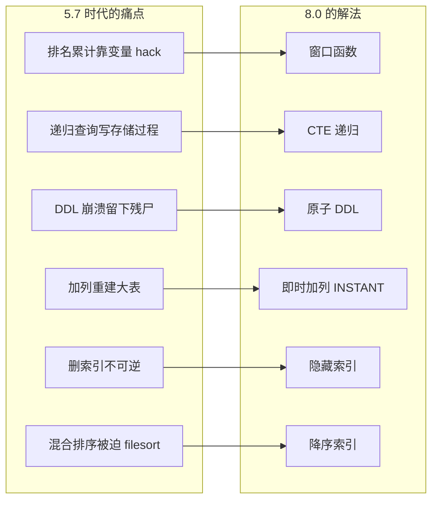
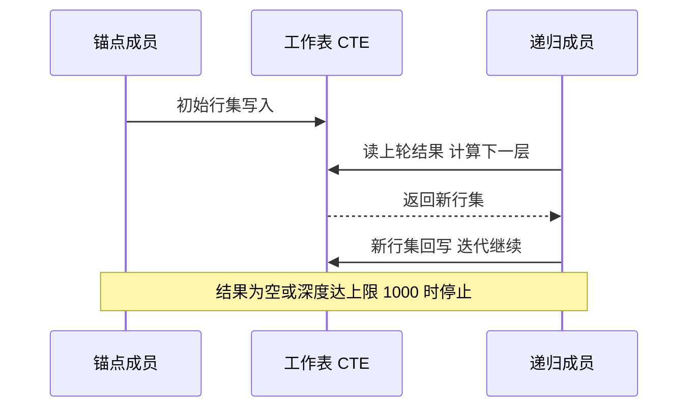
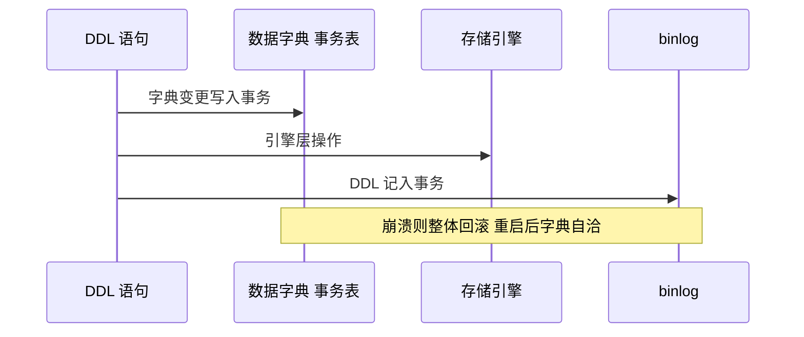
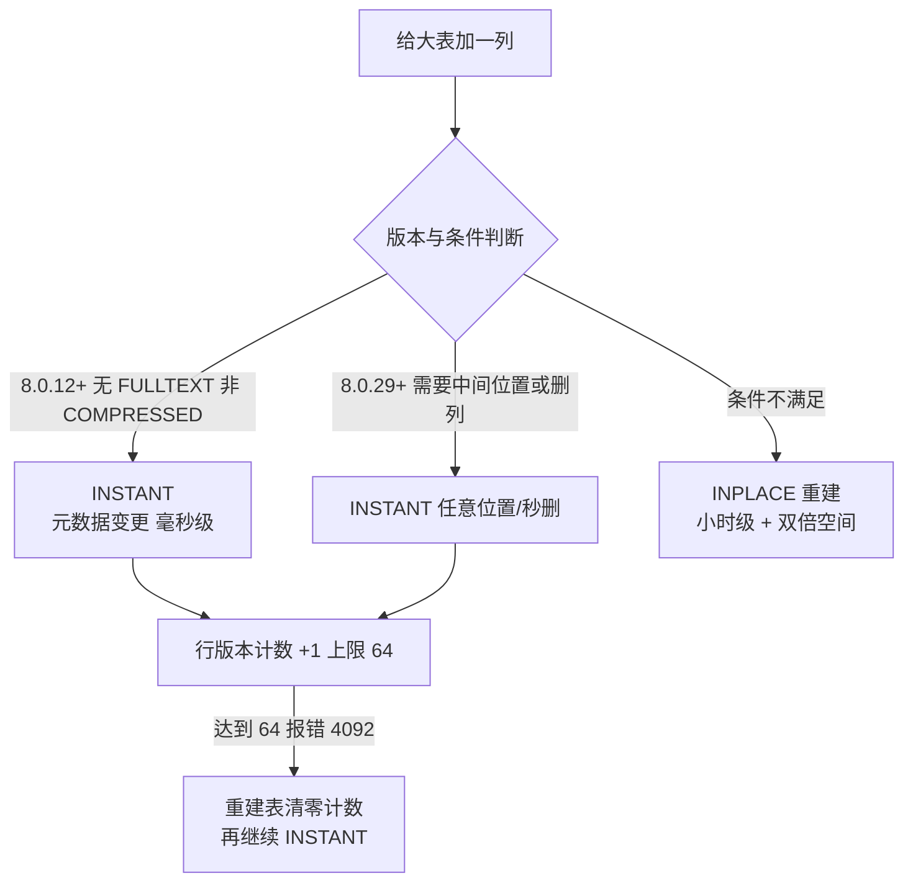
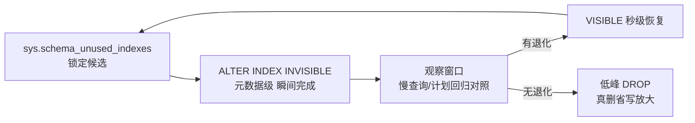

# MySQL 8 新特性主线：六个特性各自解决了什么旧痛点

> 窗口函数、CTE、原子 DDL、即时加列、隐藏索引、降序索引——MySQL 8 的新特性清单大家都见过，但「它解决了什么旧痛点、生产上要注意什么」才是决定要不要用的两个问题。这篇把六个特性逐个按「5.7 时代的疼法 → 8.0 的机制解法 → 生产注意」三段拆开，并给出升级视角的公共底座认知：这六个特性不是六个孤岛，它们共享同一套地基改造。

## 一句话摘要

MySQL 8 的六个主线特性各治一种「5.7 时代的结构性疼痛」：**窗口函数**治「排名/累计要靠用户变量 hack」（Server 层新增窗口帧计算）；**CTE** 治「递归查询要写存储过程」（锚点 + 递归成员的迭代执行，默认深度上限 1000）；**原子 DDL** 治「DDL 中途崩溃留下字典残尸」（.frm 退役、数据字典进事务型 InnoDB 表，DDL 与 binlog 单事务提交）；**即时加列**治「加一列要重建亿级大表」（元数据变更毫秒级完成，8.0.29 起支持任意位置与秒删列，行版本上限 64）；**隐藏索引**治「删索引是开弓没有回头箭」（元数据级先隐身观察、再真删）；**降序索引**治「混合方向排序被迫 filesort」（索引键按定义方向物理存储）。理解它们共同的底层原理：**Server 层与存储引擎的两轮地基重构（数据字典事务化 + 迭代器执行框架），才装得下这批特性**。

## 前置阅读

- 《[B+ 树与页存储](../深入理解索引系列/1_B+树与页存储-深度.md)》：索引键序的物理含义（降序索引的直接基础）
- 《[优化器与索引选择](../深入理解索引系列/3_优化器与索引选择-深度.md)》：优化器怎么看索引（隐藏索引的作用点）
- 《[Join 算法与优化器成本模型](../深入理解执行与优化器系列/1_Join算法与优化器成本模型-特性.md)》：迭代器执行框架（窗口函数与 CTE 的执行载体）
- 《[Buffer Pool 深挖](../深入理解内存体系系列/2_BufferPool与内存体系深挖-特性.md)》：重建型 DDL 的 IO 代价（即时加列省掉的正是这笔账）

## 🎯 本文核心

**核心机制一句话**：六个特性 = 三个「给开发的表达力」（窗口函数/CTE/降序索引）+ 三个「给运维的安全阀」（原子 DDL/即时加列/隐藏索引）——前者解决「SQL 写不出来或写出来巨慢」，后者解决「变更要么太慢要么不可逆」。

**机制链（全文按这条链展开）**：

5.7 的痛点清单 → 表达力三件套（窗口函数 → CTE → 降序索引）→ 运维三件套（原子 DDL → 即时加列 → 隐藏索引）→ 公共底座（数据字典事务化 + 行格式演进）→ 升级生产清单

## 一、8.0 为什么是一次「补地基」的版本

从演进脉络看，8.0 不是「堆功能」，是先换地基再盖楼：数据字典从 .frm 文件搬进事务型 InnoDB 表（原子 DDL 的前提）、执行器重写为迭代器框架（窗口函数与 CTE 的载体）、InnoDB 行格式支持「逻辑列与物理列部分对齐」（即时加列的前提）。**理解这层「特性背后的地基」，才能解释为什么这些特性只在 8.0 出现——不是灵感到了，是地基到了**。这也是贯穿本篇的分析方法：每个特性都先问「旧痛点是什么」，再看「新机制动了哪层地基」。

## 二、窗口函数：排名与累计不再靠用户变量

**旧痛点**：5.7 算「分组内排名」「移动平均」「累计求和」，要靠用户变量自增 hack 或自关联子查询——写法晦涩、依赖求值顺序（优化器计划一变结果就可能变）、性能还差。这类「在行的邻域上计算」的需求，聚合函数表达不了（聚合把行压成一行），普通函数表达不了（看不到邻居）。

**机制**：8.0 在 Server 层新增窗口函数体系——`OVER` 子句定义「分区（PARTITION BY）+ 排序（ORDER BY）+ 帧（ROWS/RANGE 框定邻域）」，专用函数（ROW_NUMBER / RANK / LAG / LEAD / NTILE 等）与聚合函数都可工作在窗口模式上。注意实现位置：**它是 Server 层能力，与存储引擎无关**——理解这一点就明白为什么窗口函数的代价主要在排序与临时表，而不在引擎层。分区排序可能用到内存临时表，超限后落盘（受 temptable_max_ram 等参数约束，官方文档口径）。

**生产注意**：

- **别在亿级明细上裸跑窗口**：分区排序是硬成本，先 WHERE 收窄再开窗，或预聚合减行数——窗口函数给了表达力，没免掉数据量的账；
- **窗口结果不能直接进 WHERE**：窗口在查询后期求值，要过滤窗口结果需再包一层派生表——这是 SQL 语义约束，不是 bug；
- **帧类型影响语义**：默认帧是 RANGE 到当前行，「同分并列」时累计值会把并列行一起算进去——要逐行累计显式写 `ROWS` 帧。

**追问一层：为什么窗口函数不能像聚合一样无排序成本？** 因为窗口的语义定义在「顺序」上（排名、前一行、后一行），顺序必须先物化——除非数据恰好按分区键+排序键有序（索引能喂上这个顺序时排序可免）。**再追问：窗口函数会不会让 SQL 慢查询变多？** 会——表达力上来了，以前「写不出来所以不跑」的计算现在都跑得动了，成本控制的责任从「写不出」转移到「要会算」。

## 三、CTE 与递归：组织树、物料清单不再是存储过程的地盘

**旧痛点**：两 类。其一，「同一段子查询要在多处引用」，5.7 只能派生表复制一份或临时表落一份，重复执行或重复落盘；其二，「树形/图状遍历」（组织架构、物料清单、分类树），5.7 没有递归查询——要么存储过程循环，要么按最大层数写死 N 个自连接，层数一变 SQL 就作废。

**机制**：CTE（`WITH` 子句）给查询引入「命名的临时结果集」，一次定义多处引用；`WITH RECURSIVE` 进一步允许 CTE 引用自身，执行模型是「锚点成员先跑，递归成员反复套用上轮结果，直到产出空集」。递归有安全阀：`cte_max_recursion_depth` 默认 1000（官方文档口径），超深直接报错——这道墙挡的就是环形数据（比如组织树的上级环）导致的无限递归。

**生产注意**：

- **深度上限是保护不是枷锁**：正常层级（组织树十几层、BOM 几十层）远够；真要跑深图遍历，会话级调大上限前先确认图无环；
- **递归 CTE 没有去重**：同一行被多条路径到达会重复产出——图遍历要去重得自己设计标记方案，别假设引擎帮你防重；
- **大工作表注意落盘**：递归中间结果像其他临时表一样受内存临时表预算约束，层数深 × 每层行数大时会落盘。

**事故叙事一**（行业常见模式匿名化）：某分类树页面迁移到递归 CTE 后偶发超时，排查发现某次脏数据把两个节点的父子关系改成了环，递归撞到深度上限报错——错误信息被应用层吞掉，前端表现为「偶尔加载不出」。复盘动作：递归查询的报错单独告警、脏数据加环检测、深度上限保持默认而不是无脑调大。**复盘结论：安全阀报警时该修的是数据，不是拆阀。**

## 四、原子 DDL：崩溃不再留下「半个表」

**旧痛点**：5.7 的 DDL 是「多步非事务」操作——改 .frm 文件、改 InnoDB 字典、重放/写 binlog 各走各的。DDL 中途崩溃可能留下：.frm 与 InnoDB 字典不一致、孤立表空间文件、重启后报「表不存在但文件在」。恢复靠手工清理与字典修复，这是 DBA 时代级的经典故障形态。

**机制**：8.0 拆掉 .frm，**数据字典全部搬进 mysql 库的事务型 InnoDB 表**；DDL 的所有步骤（字典变更 + 存储引擎操作 + binlog 写入）打包进**一个事务提交**——要么完整生效，要么完整回滚，崩溃后由 InnoDB 自身的崩溃恢复统一处理。SQL 层定义与存储层定义从此有单一事实源。

**生产注意**：

- **原子 ≠ 在线**：原子 DDL 解决「崩溃一致性」，不解决「执行期间锁表」——在线语义是 online DDL / INSTANT 算法的事，两个概念别混着期待；
- **DDL 不可手动回滚**：事务性体现在失败自动回滚，不存在「ROLLBACK 那条 ALTER」——错误会在提交前发生，别把 DDL 塞进业务事务里跑；
- **备份与复制链路更稳了**：字典自洽让备份一致性、复制回放 DDL 的崩溃安全都上台阶——这是「用了感知不强、坏了才知道」型的地基收益。

**为什么不选「继续修补 .frm 方案」？** 反方案分析：给多步文件操作加日志重放（类似文件系统日志）理论上可行，但 Server 层与引擎层两份字典的对账逻辑会越来越复杂，且永远差一个「单一事实源」。搬进事务表是**用成熟的事务机制替换手写的两阶段对账**——设计思想上是「把正确性问题转化为已解决的问题」，这是它比修补方案高明的地方。

## 五、即时加列：ALTER TABLE 从小时级回到毫秒级

**旧痛点**：5.7 给大表加一列，INPLACE 算法仍要**重建整张表**——亿级行表跑小时级，期间占双倍空间、推高刷脏压力、每台从库重放一遍。加列这个最高频的 schema 变更，成本却是最重档。

**机制**：8.0.12 起 `ALGORITHM=INSTANT` 成为加列默认——列的元数据与默认值记进数据字典，**行格式头部记录「该行属于哪个列版本」**，物理行不变；读旧行时对缺失列物化默认值。改动只碰元数据，毫秒级完成、不复制数据、不阻塞 DML。8.0.29 又补了两刀：加列可放**任意位置**（此前只能加在末尾）、**秒删列**也走 INSTANT。

**生产注意**（这张清单每条都有对应的报错或翻车形态）：

- **行版本上限 64**：每次 INSTANT 加/删列使行版本计数 +1，达到上限后报 ERROR 4092，需要一次重建型操作（重建清零计数）才能继续 INSTANT——频繁变更 schema 的表要把这个计数纳入巡检（INFORMATION_SCHEMA.INNODB_TABLES.TOTAL_ROW_VERSIONS，官方口径）；
- **条件边界**：带 FULLTEXT 索引的表、ROW_FORMAT=COMPRESSED 的表不支持 INSTANT；同一句 ALTER 不能把加列与其他不兼容操作混在一起——**显式写 `ALGORITHM=INSTANT` 是好习惯**：不写时服务器自动挑算法，可能悄悄退化成 INPLACE 重建；写了则不支持直接报错，变更窗口的预期是确定的；
- **单向门**：INSTANT 加过的表回不到 5.7（降级不可行），升级演练时把这类表记入清单；
- **从库同步收益巨大**：DDL 只记元数据变更，从库回放同样毫秒级——对比重建型 DDL 逐台从库各跑几小时，这是即时加列最大的隐性收益。

**追问：为什么行版本上限是 64，不能做成无限？** 因为上限存储在行格式头部的固定字段里——允许无限版本等于行头要动态膨胀，每一行都要为「可能无限多的 schema 历史」付出空间；64 个版本用 1 个字节内的位段就够，这是**存储粒度与工程实用性的折中**（一张表一年内加删列超过 64 次，本身就该先治 schema 管理而不是怪数据库）。

**事故叙事二**：某高频迭代的业务库在大版本升级评估时发现一批核心表 INSTANT 报 4092——两年间每张表加删列累计逼近 64 次上限。排查路径：按 TOTAL_ROW_VERSIONS 排序定位高危表、变更窗口合并加列需求（一次加一列 → 一次加 N 列只计 1 个版本……不对，是各自计版本，合并的意义在减少变更次数）、对满版本表安排低峰重建。**复盘结论：INSTANT 把加列变便宜后，「随便加列」开始积累隐形负债——便宜的操作更要看总账。**

## 六、隐藏索引：删索引终于可以「先试后删」

**旧痛点**：下线一个疑似没用的索引是高风险动作——直接 DROP，一旦某个隐既单查询突然退化，大表重建索引又是小时级；留着，它持续吃写放大与磁盘。**决策成本高到多数团队选择「永远留着」**，索引越积越多，写路径越拖越慢。

**机制**：8.0 的 `ALTER TABLE ... ALTER INDEX ... INVISIBLE` 把索引标记为「对优化器隐身」——**维护照旧（写路径成本不变），但查询计划不再考虑它**（主键不可隐身）。这是个纯元数据变更，瞬间完成、随时可逆。配合 `optimizer_switch` 的 `use_invisible_indexes` 会话开关，还能做「假装索引不存在」的计划对照实验。

**生产注意**：

- **隐身不省写放大**：维护还在，隐藏索引只是「读路径隔离」——省下写成本的只有真删那一步。别把 INVISIBLE 当成免费的「保留索引」手段长期挂着；
- **演练要给足观察窗口**：覆盖月度报表/季度任务这类低频路径再下结论，一周观察期对季报型查询是不够的；
- **与统计无关**：隐身改变的是优化器可见性，统计信息照常更新——恢复可见时计划立即回来，不需要重新分析。

**再追问一层：既然写放大还在，为什么不做成「隐身连维护也暂停」？** 因为演练的语义就是「假装删了」——真实 DROP 之后索引不会再被任何查询用到，隐身期却必须保证「一键恢复可用」：维护暂停的索引恢复时要重建（回到小时级），可逆性就没了。**用持续维护换零成本回滚，正是这个机制的设计取舍**——它是「下线演练场」，不是「低成本仓库」。

## 七、降序索引：混合方向排序不再 filesort

**旧痛点**：`ORDER BY created_at DESC, id ASC` 这类混合方向排序，5.7 的索引定义里写 DESC 是**语法糖**——解析器接受但存储时全部按升序建（5.7 只给警告），实际执行要么 filesort、要么正反扫描拼接，大结果集排序成本躲不掉。

**机制**：8.0 起索引键**按定义方向物理存储**——`(a ASC, b DESC)` 就真的 a 升 b 降地组织 B+ 树（键序的物理含义见索引系列篇 1），混合方向排序能直接按索引序扫描，跳过排序。

**生产注意**：

- **反向扫描天然更慢**：官方文档明说 backward scan 慢于 forward scan——所以「纯降序查询」用一个纯升序索引反向扫就行时，不必为它建降序索引；降序索引的价值在**混合方向**场景；
- **升级不自动转换**：5.7 建的索引（DESC 被忽略、实为纯升序）升级到 8.0 后仍是旧语义——要用真降序必须 DROP 后重建（官方文档升级注意），大表重建要按变更窗口规划；
- **与 change buffer 互斥**：包含降序列的二级索引不适用 change buffer（官方文档口径，与内存体系篇呼应）——写密集 + 降序索引的组合要重估写路径；
- **排序方向对齐是设计动作**：降序索引只对「索引序与查询序完全一致」的排序免 sort——方向差一个都不行，设计联合索引时把查询的 ORDER BY 方向一起看。

## 八、不同量级的思考：架构约束驱动解法

同一批新特性，在不同量级的表上意义完全不同：

- **十万级（小表快迭代）**：约束来自「迭代速度」——schema 变更频繁但表小，INSTANT 加列的收益是「部署流水线不停等」；思考方式是「流程驱动」——把 schema 变更纳入 CI 检查行版本计数，这一档的核心问题是「变更流程顺不顺」，而不是「变更快不快」
- **百万级（中表 + 读多写少）**：约束来自「查询表达力」——窗口函数与 CTE 直接删掉应用层的拼装代码；思考方式是「表达力驱动」——能用一条 SQL 表达的就别在应用层循环，这一档的核心问题是「语义清晰吗」，而不是「性能极限在哪」
- **千万级（大表 + 高并发写）**：约束来自「变更与写路径的冲突」——INSTANT 加列 + 隐藏索引演练成为变更标准件，降序索引/新索引要评估写放大；思考方式是「变更工程驱动」——每个变更先问算法、再问从库回放时长，这一档的核心问题是「变更可控吗」，而不是「功能能不能用」
- **亿级（超大规模 + 多副本）**：约束来自「一次变更 × N 个副本的放大效应」——重建型操作被逐出常规手段，架构上靠预聚合表/宽表消化复杂查询，即时加列是唯一常态通道；思考方式是「放大系数驱动」——任何操作先乘上副本数与行数再看可行性，这一档的核心问题是「放大后还成立吗」，而不是「单机跑得动吗」

思考方式总结：十万级看「流程」，百万级看「表达」，千万级看「变更工程」，亿级看「放大系数」——约束从迭代速度逐级迁移到变更安全，思考方式必须跟着约束来源走。

**自下而上与触发升级**：先量表行数与副本数再选做法，不预支上一档的谨慎。触发升级的信号：变更开始占用变更窗口、从库回放延迟进入分钟级、行版本计数过半——任一出现，就要把对应特性的「生产注意」从参考清单升级为强制 checklist。

## 九、机制实现位置速查（源码与关键路径）

| 特性 | 实现层 | 关键路径 |
|---|---|---|
| 窗口函数 | Server 层 | sql/window.* ——窗口帧计算与迭代，与引擎无关 |
| CTE 递归 | Server 层 | 迭代式执行（锚点 + 递归成员），深度由 cte_max_recursion_depth 约束 |
| 原子 DDL | Server + InnoDB | sql/dd/ 数据字典模块——字典即事务表，DDL 单事务提交 |
| 即时加列 | InnoDB 行格式 + DD | 行头列版本计数 + 字典存默认值（INNODB_TABLES.INSTANT_COLS 可查） |
| 隐藏索引 | 优化器入口 | 索引元数据标志位，优化器候选集过滤 |
| 降序索引 | InnoDB B+ 树 | 键按定义方向存储——与索引系列篇 1 的页内键序直接相关 |

## 十、业内惯例与生产实践

- **升级 checklist 三件套**：8.0 升级评估普遍必查——默认字符集变化（utf8mb4 系，影响索引长度与空间估算）、默认认证插件变化（老客户端驱动兼容）、以及本篇六特性相关的行为差异（INSTANT 单向门、降序索引不自动转换）——版本默认值的漂移是升级事故的第一来源（公开口径的常见教训）。
- **变更分级的行业惯例**：把 ALTER 按算法分级（INSTANT 随时可做 / INPLACE 排窗口 / COPY 评估禁用），写进数据库变更规范——「先问算法再提工单」是大表团队的通用纪律。
- **索引治理闭环**：sys.schema_unused_indexes 定期巡检 → INVISIBLE 演练 → 真删，三步成环——「只建不删」的索引腐化在大表团队普遍被列为专项治理项。
- **窗口函数上生产前的基准**：对亿级明细开窗的 SQL，先 EXPLAIN 看临时表策略再放行——「表达力特性进 OLAP 场景、OLTP 明细表慎用」是惯例分界。

## 💡 实战提示

- 💡 **ALTER 永远显式写 ALGORITHM**：`ALTER TABLE ... , ALGORITHM=INSTANT` 让「不支持」变成启动时报错而不是悄悄重建——变更预期的确定性比成功率更值钱。
- 💡 **行版本计数进巡检**：`INNODB_TABLES.TOTAL_ROW_VERSIONS` 接近 64 的表提前安排低峰重建，别等 4092 在变更窗口里现报错。
- 💡 **递归 CTE 上线先验环**：对组织树/分类树跑一次环检测 SQL，深度上限保持默认 1000——报警时先查数据再调参数。
- 💡 **删索引的标准动作是 INVISIBLE 一周再 DROP**：观察窗口覆盖到月度任务，恢复用 VISIBLE 秒级回滚——这是把「不可逆决策」改造成「可逆演练」的最小成本方案。
- 💡 **升级后核心 SQL 重跑 EXPLAIN**：8.0 的执行器与代价模型都是新的，计划漂移是常态——升级演练里给 TOP 慢查询留前后对照，别等线上首抖。

## 什么时候用/不用：六特性决策表

| 特性 | 什么时候用 | 什么时候不用 |
|---|---|---|
| 窗口函数 | 报表/榜单/累计类分析查询 | OLTP 高频点查里塞大范围开窗 |
| 递归 CTE | 层级树/物料清单等有限深度遍历 | 无环保证的巨型图遍历（上专用图方案） |
| 原子 DDL | 无需决策——8.0 默认行为 | 无（它是地基收益） |
| 即时加列 | 8.0.12+ 加列的默认首选 | FULLTEXT/COMPRESSED 表、行版本已满未重建的表 |
| 隐藏索引 | 下线索引前的标准演练 | 当长期「保留索引」的手段挂着（写成本还在） |
| 降序索引 | 混合方向排序且结果集大 | 纯方向排序（反向扫升序索引即可） |

明确推荐一句话：**变更类三件套（原子 DDL/即时加列/隐藏索引）直接进团队规范；表达类三件套（窗口/CTE/降序索引）按查询场景引进，各配一条生产红线**。

## Trade-off：表达力与运维安全的代价表

| 特性 | 换来的收益 | 付出的代价 | 代价反噬场景 |
|---|---|---|---|
| 窗口函数 | 复杂计算一条 SQL | 排序 + 临时表成本 | 亿级明细裸开窗 |
| 递归 CTE | 递归语义进 SQL | 深度失控风险 + 可能落盘 | 环形数据撞墙或跑爆临时表 |
| 原子 DDL | 崩溃一致 | DDL 不可部分回滚 | 把 DDL 当普通事务用 |
| 即时加列 | 毫秒级变更 | 行版本上限 + 单向门 | 随便加列积累满 64 版本 |
| 隐藏索引 | 可逆的下线演练 | 观察期内写放大照旧 | 拿隐身当长期保留手段 |
| 降序索引 | 混合排序免 filesort | 需重建迁移 + change buffer 互斥 | 纯方向排序场景白建索引 |

## 你们可能会问

**Q1：这些特性都要 8.0，8.4/9.x 还会有变化吗？**
机制层面六件套都稳定；参数与边界有微调（比如 change buffer 默认值在 8.4 变为 none，影响降序索引与写路径的关联评估）。原则是：**机制按 8.0 学，边界按所用版本文档核对**——大版本 LTS 之间默认值会漂移。

**Q2：窗口函数这么好用，能不能全面替换 GROUP BY？**
不能，两者语义不同：GROUP BY 把行压缩成组（一组一行），窗口函数保留行数只在旁边附加计算值。需要「折叠」的统计用 GROUP BY，需要「每行带上下文」的计算才用窗口——混用层次是设计问题不是功能问题。

**Q3：即时加列既然毫秒级，为什么不建议随便加列？**
三个隐性账：行版本上限 64 会耗尽、每列都有读时物化默认值的语义成本、以及 schema 频繁漂移对下游（同步链路、缓存反序列化）的传导。机制便宜了，纪律不能跟着便宜。

**Q4：隐藏索引期间性能真退化了，恢复有多快？**
元数据变更，秒级；且统计信息一直在维护，恢复后计划立即回归，不需要重新 ANALYZE。这正是它作为「演练机制」的价值——回滚成本趋近于零。

**Q5：5.7 升 8.0，降序索引相关的存量索引要怎么处理？**
先盘点：5.7 写过 DESC 的定义（当时被忽略）升级后仍是纯升序。对确有混合方向排序需求的，按变更窗口 DROP + 重建；没有对应查询的，不折腾——**特性迁移跟着查询需求走，不跟着功能清单走**。

## 开放问题

- MySQL 的 HTAP 演进方向（列存副本/向量化，公开资料口径）成熟后，窗口函数这类分析原语会下沉到列存引擎执行——「Server 层实现」的边界未来可能重画，值得跟踪。
- INSTANT 的行版本机制本质上是在行格式里引入了「schema 版本化」，它还能承载哪些零拷贝变更（改默认值、改注释已部分支持）？我的判断是 DDL 即元数据事务的方向会继续扩容，欢迎讨论。

## 核心带走

**30 秒复述**：MySQL 8 六特性 = 表达力三件套（窗口函数治排名累计、递归 CTE 治树形遍历、降序索引治混合排序）+ 运维三件套（原子 DDL 治崩溃残尸、即时加列治重建小时级、隐藏索引治删索引不可逆）；它们共享 8.0 的两块新地基——事务化数据字典与迭代器执行框架。**失效点**：亿级明细裸开窗、递归撞环、INSTANT 版本计数耗尽、隐身索引长期挂载、5.7 存量降序定义未重建。金句带走：

> **新特性解决的是旧结构的结构性缺陷——先懂痛点，再谈用法；先看地基，再记功能。**

> **变更类特性教会我们同一件事：把不可逆决策改造成可逆演练，成本趋零的回滚是最便宜的生产保险。**

## 📌 数据与事实声明

- 版本口径（均出自 MySQL 官方文档，截至 2026-09）：窗口函数/CTE/原子 DDL/降序索引/隐藏索引为 8.0 GA 特性；`ALGORITHM=INSTANT` 加列 8.0.12 起默认、8.0.29 起支持任意位置与秒删列；INSTANT 行版本上限 64（报错 4092）、不支持 FULLTEXT/COMPRESSED 表、不可与其他算法混用同句；`cte_max_recursion_depth` 默认 1000；反向索引扫描慢于正向为官方文档明示；5.7 的 DESC 定义被忽略、存量索引升级不自动转换为官方升级注意。
- 文中量级表述（毫秒级变更、小时级重建）为行业认知经验值；两则事故为行业典型模式的匿名化重建，不含真实公司与生产数据。

## 📚 参考资料

| 来源 | 内容 |
|---|---|
| MySQL 官方文档（dev.mysql.com）Window Functions / WITH (CTE) / Atomic DDL / Online DDL / Invisible Indexes / Descending Indexes 章节 | 特性语义、版本与限制口径 |
| 《高性能 MySQL》（第 4 版）MySQL 8.0 新特性章节 | 特性评估与升级实践 |
| 《MySQL 是怎样运行的》（小孩子 4919） | 行格式与页结构（即时加列/降序索引的物理基础） |
| InnoDB/Server 源码（sql/window.*、sql/dd/） | 机制实现层定位 |
| 关联篇目：索引系列两篇、Join 篇、内存体系深挖篇 | 键序物理含义 / 迭代器框架 / 重建 IO 代价的上游机制 |
