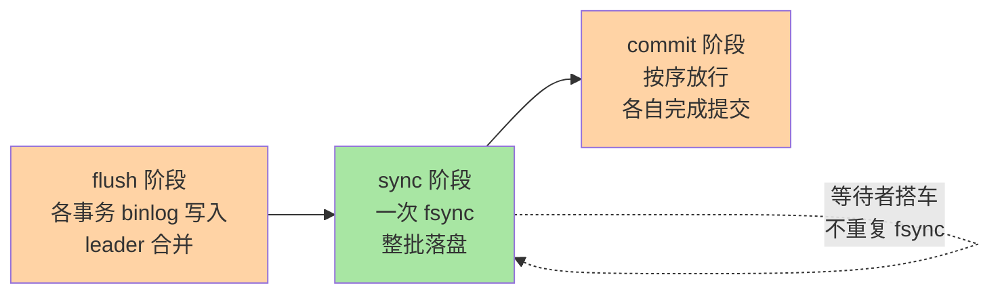

# redo log 刷盘与组提交：WAL 的性能账本

> 「双 1 配置掉一半性能」的说法怎么来的？redo log 为什么是顺序写就撑得住随机写？组提交又把每次事务一次 fsync 摊薄成了什么？这篇把 WAL 机制的账本翻开，每一笔 I/O 都算清楚。并补上跨库对照（其他数据库的 WAL 实现）、生产事故、代价量化三个深度维度。

## 一句话摘要

redo log 是 InnoDB 的**物理日志 + WAL（Write-Ahead Logging）**实现：先顺序写日志、后随机刷脏页，把「每事务随机写数据页」变成「每事务顺序追加日志 + 后台批量刷页」。**`innodb_flush_log_at_trx_commit` 决定提交时刷到哪一层（内存 / OS 缓存 / 磁盘）**，组提交再把同一时刻多个事务的 fsync 合并成一次——双 1（redo + binlog 全落盘）的持久化收益与性能代价，全部在这条链路上。

跨库对照：PG 用 WAL（Write-Ahead Log）+ full_page_write，Oracle 用 redo log + archive log，SQL Server 用 transaction log + checkpoint，MongoDB WiredTiger 用 journal（WAL 变体）——WAL 是所有关系型数据库的通用机制，但实现细节决定性能边界。

## 🎯 本文核心

**核心一句话：WAL = 用「顺序写日志」消化「随机写数据页」——提交只保证日志落盘（fsync 是提交路径最贵的一步），数据页慢慢刷；组提交把 N 次 fsync 合成 1 次，是双 1 体系下吞吐的真正来源。**

机制链：WAL 原理（两个推论：脏页可以慢慢刷、redo 必须先行）→ LSN 进度尺 → 刷盘参数三档（值 2 的误读重灾区）→ 组提交三阶段与 leader/follower → redo 容量与检查点抖动 → 双 1 的取舍账本 → 跨库对照 → 生产事故 → 代价量化。记住「日志先行保正确，凑批 fsync 保吞吐，容量给足保平滑」这一句话，全篇可重构。

## 前置阅读

- 入门层篇 9《日志三件套》：redo / undo / binlog 的分工
- 入门层篇 1《一条 SQL 的一生》：Buffer Pool 与脏页

## 一、边界：入门层讲过什么，本文讲什么

| 内容 | 入门层 | 本文 |
|---|---|---|
| redo/undo/binlog 三件套分工 | ✅ 讲过 | 不重复 |
| WAL 与刷盘时机参数 | 提了一句 | **本文核心一** |
| 组提交三阶段 | 未讲 | **本文核心二** |
| 两阶段提交与 crash-safe | 未讲 | 本系列篇 2 |
| 跨库对照 | 未讲 | **本文新增** |
| 生产事故与代价量化 | 未讲 | **本文新增** |

## 二、WAL：用顺序写消化随机写

先立住物理事实：机械盘随机 IOPS 以百计、顺序写以百 MB 计；SSD 虽缓解了随机读，但**页级随机写的写放大与一致性开销仍在**。WAL 的思路因此是：


崩溃恢复时重放 redo 即可把已提交事务「补」到数据页上——所以数据页本身不需要每次提交都落盘。两个推论：**脏页可以慢慢刷**（性能来源），**redo 必须先于脏页落盘**（正确性约束，即 Write-Ahead 之名）。

**LSN（日志序列号）**是 redo 的全局进度尺：日志写入推进 `log write LSN`，落盘推进 `flushed to disk LSN`，脏页记录自己「对应 redo 已刷到哪」。三个 LSN 的差值就是「内存里还没落盘的日志量」——监控 redo 的核心指标，也是检查点机制的工作语言。

## 三、跨库对照：各家的 WAL 实现

| 数据库 | WAL 实现 | 刷盘时机 | 备注 |
|---|---|---|---|
| **MySQL InnoDB** | redo log（物理日志） | `innodb_flush_log_at_trx_commit` 三档 | 组提交 + 两阶段提交 |
| **PostgreSQL** | WAL（逻辑日志 + full_page_write） | `wal_level` + `archive_mode` | 物理复制 + 逻辑复制 |
| **Oracle** | redo log + archive log | `LOG_ARCHIVE_DEST` + `COMMIT WRITE` | 归档模式 + 联机日志组 |
| **SQL Server** | transaction log + checkpoint | `RECOVERY` 模型 + `LOG` 备份 | 简单/完整/大容量日志 |
| **MongoDB WiredTiger** | journal（WAL 变体） | `commitIntervalMs` | 非关系型，WAL 思想类似 |
| **TiDB** | Raft log + local redo | 分布式共识 | 跨节点复制，非单节点 WAL |

**MySQL 特殊在哪**：MySQL 的 redo 是**物理日志**（记录页的物理修改），PG 的 WAL 是**逻辑日志**（记录逻辑操作）——物理日志恢复快但不能跨版本，逻辑日志灵活但体积大。选 MySQL 还是 PG，日志形态是架构级取舍之一。

**PG 对比启示**：PG 的 WAL 有 `full_page_write` 机制（每次 checkpoint 后首条 WAL 写整页）——保证崩溃恢复时页的完整性，但写入放大比 MySQL 高。MySQL 的物理日志只记差异，恢复时重放即可。

**选型结论**：需要物理复制选 MySQL；需要逻辑复制/逻辑解码选 PG；金融级持久性 MySQL 双 1 + 半同步更成熟。

## 四、刷盘时机：三层缓存与一个参数

提交时 redo 要经过三层：log buffer（进程内存）→ OS 文件缓存 → 磁盘。`innodb_flush_log_at_trx_commit` 决定走到哪层：

| 值 | 提交时的动作 | 崩溃丢失窗口 | 适用 |
|---|---|---|---|
| 0 | 每秒由后台刷一次 | 最多丢 1 秒事务 | 可容忍丢失的内部系统 |
| **1** | **write + fsync，每次提交必落盘** | 不丢已提交事务 | 金融/订单默认 |
| 2 | write 到 OS 缓存，每秒 fsync | 进程崩不丢，**主机崩丢 1 秒** | 中间态，常见误用 |

关键在 write 与 fsync 的区别：write 只是「交给操作系统」，数据还在缓存；fsync 才真正压盘。**值 2 的「进程崩溃不丢」很容易被误读为安全**——掉电时 OS 缓存一并蒸发，1 秒事务没了。

## 五、代价量化：双 1 的真实 I/O 成本

**量化口径**（行业经验，非官方数字）：

| 场景 | 每次提交 fsync 次数 | 1000 TPS 的 fsync 量 | 量化依据 |
|---|---|---|---|
| 双 1（默认） | 1 次 fsync/事务 | 1000 fsync/s | 机械盘 fsync ~10ms → 100 TPS 上限 |
| 组提交（并发 100） | ~10 次 fsync/事务 | 10 fsync/s | 100 个事务攒 1 波 |
| 组提交（并发 1000） | ~100 次 fsync/事务 | 1 fsync/s | 1000 个事务攒 1 波 |
| 值 2（不 fsync） | 0 次 fsync/事务 | 0 fsync/s | 仅 write 到 OS 缓存 |

**量化逻辑**：双 1 的 fsync 是提交路径上最贵的一步。机械盘 fsync ~10ms，单线程 100 TPS 就是 fsync 的理论天花板。并发组提交把 N 次 fsync 合成 1 次——**并发越高，单事务摊到的 fsync 成本越低，吞吐随并发不降反升到某个平台期**。这就是「高并发写入场景加压反而稳」的机制解释。

**SSD 时代的变化**：SSD fsync 延迟亚毫秒级，双 1 的 fsync 开销大幅下降——但「fsync 是提交路径最贵的一步」这个定性不变，只是绝对值变了。调优方向从「放宽双 1」转向「组提交 + 容量调优」。

## 六、组提交：把 N 次 fsync 变成 1 次

若每个事务提交各自 fsync 一次，SSD 的 fsync 延迟（亚毫秒到毫秒级）乘上并发就是吞吐天花板。组提交的思路：**同一瞬间提交的事务凑一波，一次 fsync 全带走**。8.0 的 binlog 侧把它做成三阶段队列（InnoDB redo 侧同样有组提交）：



三阶段的巧思在 **leader/follower**：队列第一个事务当 leader 带队走完三阶段，后来的事务搭车——它们的 fsync 被 leader 那一次覆盖。并发越高，一波越大，单事务摊到的 fsync 成本越低，**吞吐随并发不降反升到某个平台期**——这就是高并发写入场景「加压反而稳」的机制解释。

与组提交配套的两个参数：`binlog_group_commit_sync_delay` / `sync_no_delay_count`——故意等一小段或攒够笔数再 sync，用毫秒级延迟换更大的组。属于「先测量再微调」项，盲开会白送延迟。

## 七、redo 容量与检查点：抖动的另一来源

redo 文件是**固定容量环形使用**的（8.0.30 起支持动态调整）。写满一圈就必须推进**检查点**——即「把最老的脏页刷掉，腾出日志空间」，这一步通常后台平滑进行；但写入猛增时被迫**同步刷脏页抢进度**，用户线程被拉去干后台的活，表现为周期性写入毛刺。业内口径：给足 redo 容量（默认 96MB 对写入型负载普遍偏小，常见调到 GB 级），让检查点永远追不上一线，毛刺自然消失。

**量化**：redo 容量 = 写入速率 × 秒数。默认 96MB 在 100MB/s 写入速率下只能缓冲不到 1 秒——这正是高写入场景默认值偏小的原因。GB 级容量在 100MB/s 下可缓冲 10+ 秒，检查点有充足时间后台推进。

## 八、源码关键路径

以 8.0 主线口径（storage/innobase/log/）：

- 写入：`log_buffer_write` / `log_writer` 独立线程（8.0 重构为无锁写入管线）把 buffer 推到 OS
- 落盘：`log_flusher → log_flush_to_disk` 按 `trx_commit` 等级决定是否 fsync；提交线程在 `logsys` 上等待自己的 LSN 被确认
- 组提交：binlog 侧 `MYSQL_BIN_LOG::process_commit_stage_queue` 一族（flush/sync/commit 三队列），与 InnoDB 侧通过内部 XA 呼应
- 检查点：`log_checkpoint` 一族按最老脏页 LSN 推进

阅读建议：抓「一个 LSN 的旅程」——从 `mtr` 产生日志到提交等待其刷盘确认，整条管线即 redo 全貌。

## 九、生产事故推演：双 1 丢数场景的裁决链路推演

**场景**：某金融系统主库崩溃，运维发现备库比主库少了一笔交易。事故复盘需要沿双 1 链路逐格推演。

**根因链路**：

1. 事务提交：redo prepare → binlog sync → redo commit
2. 崩溃发生在 redo commit 之前（binlog 已 sync 但 redo 未 commit）
3. 恢复时裁决：binlog 里有该事务 → 提交（正确）
4. 若崩溃发生在 binlog sync 之前 → binlog 无该事务 → 回滚（数据不丢，但客户端没收到 OK）
5. 若双 1 有一个放松（`sync_binlog=0` 或 `innodb_flush_log_at_trx_commit=2`）→ 裁决前提缺一角 → crash-safe 退化为「大概率安全」

**排查 SOP**：

```sql
-- 查当前双 1 配置
SHOW VARIABLES LIKE 'innodb_flush_log_at_trx_commit';
SHOW VARIABLES LIKE 'sync_binlog';

-- 查最近崩溃恢复记录
SHOW ENGINE INNODB STATUS\G
-- 关注 TRANSACTIONS 段和 BACKGROUND THREAD 段
```

**止血三步**：
1. 紧急：确认双 1 状态 → 任何一环不为 1 立即修复
2. 短期：开启 `innodb_print_all_deadlocks` + 监控 `Log flush/sync` 耗时
3. 长期：双 1 成立 + 半同步 + 延迟从库做误删逃生舱

**Trade-off**：双 1 保住持久性，吞吐交给组提交与容量调优。放松双 1 换性能是架构决策，必须写进容灾预案并告知业务方。

## 十、典型场景

- **秒杀下单**：写入峰值靠组提交摊薄 fsync；redo 容量给足防检查点毛刺，配合预热避免首屏抖动
- **批量导入**：可临时用非双 1（如值 2）+ 大事务/分批的组合提速，导入完恢复双 1——窗口期明确、回退路径清晰才允许
- **提交延迟抖动排查**：先看 `Log flush/sync` 耗时监控，区分「fsync 慢（存储层）」与「排队久（并发/容量）」，对症下药
- **跨库对照**：从 Oracle 切 MySQL 时，Oracle 的 `COMMIT WRITE` 参数更细粒度（`WAIT`/`BATCH`/`SYNC`/`ASYNC`），MySQL 的三档更粗——迁移时持久化等级要重新评审

## 十一、业内惯例

> 💡 **实战提示**
> - 每次故障演练/巡检把双 1 当首查项：`SHOW VARIABLES LIKE '%trx_commit%'` + `sync_binlog`——「应该配过」不算数，环境漂移是常态
> - 写入毛刺排查两张图叠加看：checkpoint age 曲线 + fsync 耗时曲线——顶格回落就是容量不足，尖刺同步就是存储抖动
> - 批量导入提速的正确窗口：值 2 + 分批事务 + 导完恢复双 1，全程留痕——没有回退路径的持久化降级不许上线
> - 组提交延迟参数先看组大小监控再动：并发低组凑不起来时开延迟参数纯白送 rt
> - 监控三件套：`Log flush 次数/耗时`、`checkpoint age / 容量占比`、`每秒日志写入量`——三张图在，抖动基本无处遁形
> - redo 容量按写入速率估算：业内常用「容纳 20 分钟到 1 小时写入量」作起点，压测验证检查点不顶格
> - SSD 时代不要急着放宽双 1：先看组提交是否生效（并发够不够）再考虑参数调优

- **双 1 是资金/订单类系统的默认底线**：性能问题优先用「容量、批量、缓存、拆分」解决，而不是先动持久化等级——业内把「放松双 1」视为架构决策而非调优手段
- **值 2 只在「明确说得清丢 1 秒的代价」时使用**：并要求写进容灾预案；「默认值 2 图省事」是事故复盘的高频出现项
- **redo 容量按写入速率估算**：业内常用「容纳 20 分钟到 1 小时写入量」作起点，压测验证检查点不顶格
- **监控三件套**：`Log flush 次数/耗时`、`checkpoint age / 容量占比`、`每秒日志写入量`——三张图在，抖动基本无处遁形

## 十二、常见误区

- **「redo log 越大越好」**：容量解决检查点毛刺，但崩溃恢复要重放全部未检查点日志——过大拉长恢复时间，容量与 RTO 之间是权衡不是单向优化
- **「值 2 和 1 差不多，主机不常崩」**：值 2 丢的是「主机级故障」窗口，恰好是容灾体系最该覆盖的场景——用低频赌大额，账算不过来
- **「组提交是 binlog 专属」**：InnoDB redo 侧同样有组提交逻辑，两侧协同靠内部 XA（本系列篇 2 展开）；只知一半会在排查时断链
- **「fsync 慢就加组提交延迟参数」**：延迟参数换吞吐的前提是并发足够大、组能凑起来；低并发场景开延迟参数只是白白加 rt——先看组大小监控再动
- **「SSD 时代双 1 不疼了」**：SSD fsync 延迟下降但仍是提交路径最贵的一步——「疼」的形态变了（从单笔慢变成吞吐墙），定性不变
- **「redo log 和 binlog 一样」**：redo 是物理日志+崩溃恢复，binlog 是逻辑日志+主备复制——两者分工不同，不能互相替代

## 十三、与相邻机制的关系

- 本系列篇 2《binlog 与 crash-safe》：redo prepare 与 binlog sync 的两阶段协作、崩溃恢复裁决在那篇展开
- 入门层篇 9：三件套分工的概念地图
- tips 互指：主备复制依赖 binlog 落盘进度，半同步复制的「等待 binlog sync」与本文 sync 阶段同源，在主从复制系列衔接

## 你们可能会问

**Q1：SSD 时代双 1 还疼吗？**
fsync 绝对耗时降了，但它仍是提交路径上最贵的一步，且高并发下组提交会把它摊薄——所以「疼」的形态从「单笔慢」变成「并发上不去时的吞吐墙」。结论没变：双 1 保住，吞吐交给组提交与容量调优。

**Q2：怎么确认生产是不是真的双 1？**
直接查两个变量 `innodb_flush_log_at_trx_commit` 与 `sync_binlog` 是否都为 1——「应该配过」不算数，环境漂移是常态，例行巡检兜底。

**Q3：写入毛刺为什么总在整点附近出现？**
若与检查点周期吻合（checkpoint age 顶格回落），就是 redo 容量不足被迫同步刷页；若与整点任务吻合，那是批处理抢 I/O——两张监控图叠一下即可分辨。

**Q4：PG 的 WAL 和 MySQL redo 的区别是什么？**
PG 的 WAL 是逻辑日志（记录操作），MySQL redo 是物理日志（记录页的物理修改）——物理日志恢复快但不能跨版本，逻辑日志灵活但体积大。PG 的 `full_page_write` 机制在 checkpoint 后首条 WAL 写整页，保证崩溃恢复时页的完整性但写入放大比 MySQL 高。

**Q5：redo 容量不够会怎样？**
检查点推进不过来 → 同步刷脏页 → 用户线程被阻塞 → 写入毛刺。解决方式：增大 redo 容量（`innodb_log_file_size`）+ 降低写入速率 + 优化脏页刷写比例。

## 十四、自测三问

1. WAL 用什么顺序换掉了什么随机？崩溃恢复靠什么把账补上？
2. `innodb_flush_log_at_trx_commit` 三个值分别丢什么窗口的什么数据？
3. 组提交三阶段各干什么？leader/follower 省的是哪一笔开销？

## 开放问题

- 存算分离架构下日志先行与远端页服务器的协同（日志即数据）正在改写 WAL 的实现形态，redo 的「本地环形文件」设定可能被逐步架空
- NVM 类介质把「顺序写」优势重新定价后，WAL 与直接页写的取舍边界如何移动，社区已有实验性探索，尚未到生产结论
- 分布式数据库（Raft/Paxos）的日志复制与传统 WAL 的关系——共识算法是否正在替代 WAL 的崩溃恢复角色

## 🎯 核心带走

- **核心一句话**：WAL 用顺序日志消化随机页写——提交只等日志落盘，组提交把 N 次 fsync 并成 1 次，容量给足防检查点毛刺
- **机制链**：WAL 两推论 → LSN 三水位 → 刷盘三档 → 组提交三阶段 → 容量与抖动 → 双 1 裁决链 → 跨库对照 → 生产事故 → 代价量化
- **哪里会坏**：值 2 的主机崩溃丢窗口、redo 容量不足同步刷页（毛刺）、放松双 1 无预案
- **边界**：本篇管 redo 侧；redo 与 binlog 的两阶段协作与崩溃裁决在本系列篇 2，undo 侧在篇 3

## 📌 数据与事实声明

- 写于 2026-09-10，机制以 MySQL 8.0 InnoDB 为基准；参数默认值（trx_commit=1、redo 默认容量随版本动态调整）以官方文档为准
- 「fsync 亚毫秒到毫秒级」「容量调到 GB 级」为业内经验口径，需按硬件实测
- 跨库对照基于公开资料（PG/Oracle/SQL Server/MongoDB 官方文档），细节以各版本官方为准
- 免责：行为与默认值以 dev.mysql.com 官方文档为准

## 📚 参考资料

| 类型 | 标题 | 来源 |
|---|---|---|
| 官方文档 | InnoDB Redo Log / Binlog Group Commit | dev.mysql.com/doc/refman/8.0/en/ |
| 官方源码 | mysql/mysql-server（storage/innobase/log/） | github.com/mysql/mysql-server |
| 原理书 | 《MySQL 技术内幕：InnoDB 存储引擎》姜承尧 | 公开出版 |
| 实战书 | 《高性能 MySQL（第 4 版）》日志与复制章 | 公开出版 |
| 跨库参照 | PostgreSQL WAL / Oracle Redo Log / SQL Server Transaction Log | github.com/postgres/postgres / oracle.com / microsoft.com |