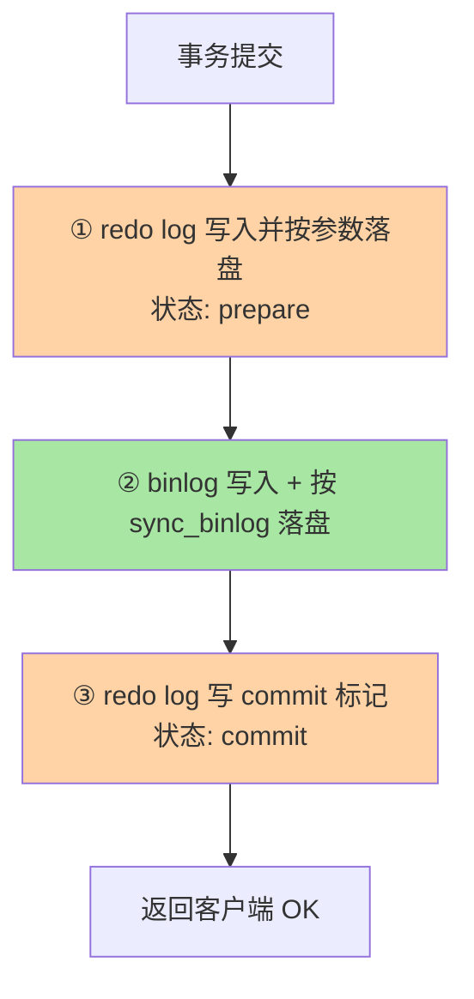
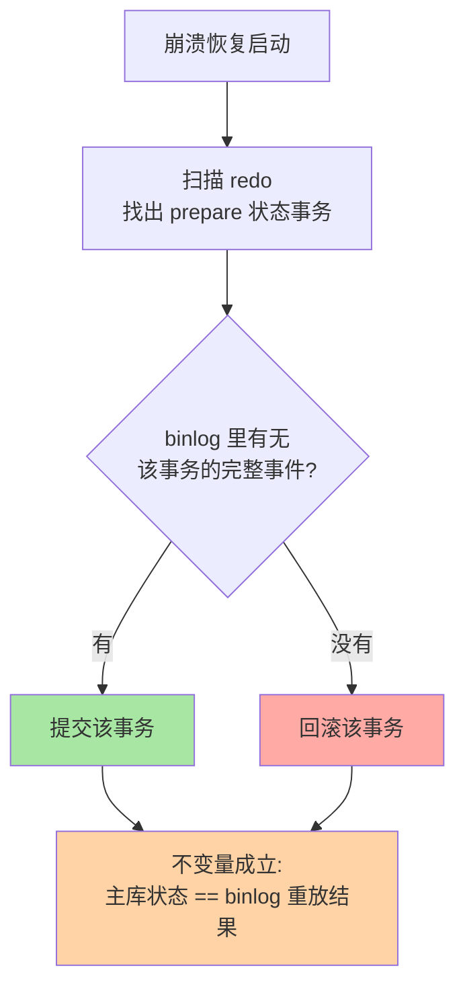

# binlog 与 crash-safe：两阶段提交的裁决逻辑

> 为什么有了 redo log 还必须有 binlog？为什么一次提交要走「redo prepare → binlog 落盘 → redo commit」三个动作？答案是一句话：**要让「引擎恢复出来的数据」和「binlog 复制出去的数据」永远一致**。这篇把两阶段提交和崩溃恢复的裁决规则拆到可推演。并补上跨库对照（其他数据库的持久化协议）、生产事故、代价量化三个深度维度。

## 一句话摘要

binlog 是 Server 层的**逻辑日志**，服务复制与归档；redo 是 InnoDB 层的**物理日志**，服务崩溃恢复。两个日志各自独立落盘就必须协调，协调方案是**内部 XA 两阶段提交**：redo 先 prepare、binlog 写入并 sync、redo 再 commit。**崩溃恢复时用 binlog 裁决 prepare 状态的事务**——binlog 里有就提交、没有就回滚，从此「主库恢复出来的状态」与「备库重放的结果」严格一致，这就是 crash-safe 的完整含义。

跨库对照：PG 用 XLOG + checkpoint 实现 crash-safe（无 binlog 等价物），Oracle 用 redo + archive log + flashback，SQL Server 用 transaction log + log shipping，MongoDB WiredTiger 用 journal——崩溃恢复是数据库的通用需求，但协议细节决定一致性强度。

## 🎯 本文核心

**核心一句话：两阶段提交维护一条不变量——「主库最终状态 == binlog 重放结果」；裁决规则唯一且可推演：恢复时 redo 里 prepare 状态的事务，binlog 有则提交、无则回滚，因为 binlog 是「对备库的承诺」。**

机制链：两种日志两种命运（层级/形态/服务对象）→ 三步时序（prepare → binlog sync → commit）→ 崩溃裁决 → 双 1 串联前提 → 三格式演进收敛 ROW → 组提交与内部 XA 的合流 → 跨库对照 → 生产事故 → 代价量化。记住「binlog 是承诺，裁决看承诺，双 1 保承诺」这一句话，全篇可重构。

## 前置阅读

- 入门层篇 9《日志三件套》：binlog 三种格式与用途
- 本系列篇 1《redo log 刷盘与组提交》：WAL、刷盘参数与组提交

## 一、边界：入门层讲过什么，本文讲什么

| 内容 | 入门层 | 本文 |
|---|---|---|
| binlog 是什么、三种格式名字 | ✅ 讲过 | 不重复 |
| 两阶段提交的完整时序与原因 | 未讲 | **本文核心一** |
| 崩溃恢复裁决规则 | 未讲 | **本文核心二** |
| 三格式的工程取舍与演进 | 提了一句 | **本文核心三** |
| 复制链路（dump/IO/SQL 线程） | 未讲 | 主从复制系列 |
| 跨库对照 | 未讲 | **本文新增** |
| 生产事故与代价量化 | 未讲 | **本文新增** |

## 二、两种日志，两种命运

| | redo log | binlog |
|---|---|---|
| 层级 | InnoDB 引擎层 | MySQL Server 层 |
| 物理形态 | 物理日志（页级改动） | 逻辑日志（语句/行变更事件） |
| 写法 | 环形复用，固定容量 | 追加不断增长，写满切换 |
| 服务对象 | 崩溃恢复（只属于本机） | 复制 + 归档（要跨机器传播） |

正因为服务对象不同，两者谁也替代不了谁——在 MySQL 架构里分属上下两层：redo 沉在引擎内只管本机，binlog 站在 Server 层对外传播。主库崩溃恢复若只看 redo，备库却按 binlog 重放——**两本账对不上就是主备不一致**。协调它们的机制，就是两阶段提交。

## 三、跨库对照：各家的持久化协议

| 数据库 | 崩溃恢复机制 | 日志形态 | 备库一致性保障 |
|---|---|---|---|
| **MySQL** | redo + binlog + 两阶段提交 | 物理 + 逻辑 | 半同步 / GTID |
| **PostgreSQL** | XLOG + checkpoint | 物理日志 | 流复制 + 逻辑复制 |
| **Oracle** | redo + archive log + flashback | 物理日志 | Data Guard + GoldenGate |
| **SQL Server** | transaction log + log shipping | 物理日志 | AlwaysOn + 镜像 |
| **MongoDB WiredTiger** | journal + oplog | journal（WAL）+ oplog | 副本集 + 写入关注 |
| **TiDB** | Raft log + local redo | 分布式共识 | Raft 复制 + PD 调度 |

**MySQL 特殊在哪**：MySQL 是**唯一**同时维护物理日志（redo）和逻辑日志（binlog）的主流关系型数据库——这是 MySQL 复制体系的基础，也是两阶段提交存在的前提。其他数据库的备库一致性由存储层原生保障（PG XLOG、Oracle redo），不需要应用层协调。

**PG 对比启示**：PG 的 XLOG 是物理日志，备库通过物理流复制重放——一致性由存储层保证，不需要两阶段提交。但 PG 也因此缺乏 MySQL 那种「逻辑日志驱动复制」的灵活性——逻辑复制需要额外的解码插件（wal2json、pgoutput）。

**选型结论**：需要逻辑复制选 MySQL/PG；需要物理复制选 PG/Oracle；MongoDB 靠副本集 + 写入关注。

## 四、两阶段提交：三步时序与裁决规则

一次事务提交，横跨 Server 层与引擎层的上下游，完整动作：



崩溃可能发生在任意两步之间，恢复逻辑按**binlog 是否完整落盘**做唯一裁决：



```text
扫描 redo 发现 prepare 事务 → 去 binlog 查对应事务事件:
  binlog 完整存在  →  提交该事务（因为备库已经/将会重放它）
  binlog 不存在    →  回滚该事务（备库不知道它存在）
```

裁决的不变量只有一条：**「主库最终状态 == binlog 重放结果」**。三步时序里每一步的先后都为这条不变量服务——binlog 落盘排在 redo commit 之前，保证「只要主库提交了，binlog 一定在」；redo prepare 排在 binlog 之前，保证「binlog 里的行变更在引擎里必然可提交」。

**双 1 在这条链上是串联的**：`innodb_flush_log_at_trx_commit=1` 保住 prepare/commit 的持久性，`sync_binlog=1` 保住 binlog 落盘——任何一环放松，裁决的前提就缺一角，crash-safe 退化为「大概率安全」。

## 五、代价量化：两阶段提交的 I/O 开销

**量化口径**（行业经验，非官方数字）：

| 场景 | 每次提交 fsync 次数 | 1000 TPS 的 fsync 量 | 量化依据 |
|---|---|---|---|
| 双 1（默认） | 2 次 fsync/事务 | 2000 fsync/s | redo fsync + binlog fsync |
| 组提交（并发 100） | ~20 次 fsync/事务 | 20 fsync/s | 100 个事务攒 1 波 |
| 组提交（并发 1000） | ~200 次 fsync/事务 | 2 fsync/s | 1000 个事务攒 1 波 |
| redo=1 + binlog=0 | 1 次 fsync/事务 | 1000 fsync/s | 仅 redo fsync |
| redo=0 + binlog=1 | 1 次 fsync/事务 | 1000 fsync/s | 仅 binlog fsync |

**量化逻辑**：双 1 的 fsync 开销是单事务的 2 倍（redo + binlog 各一次 fsync）。组提交把同一时刻的多个事务的 fsync 合并——并发越高，组越大，单事务摊到的 fsync 成本越低。这是双 1 体系下「吞吐随并发不降反升」的代价账本。

**基准线**：机械盘 fsync ~10ms，单线程 100 TPS 就是 fsync 的理论天花板。SSD fsync 亚毫秒级，双 1 的 fsync 开销下降一个量级——但「fsync 是提交路径最贵的一步」这个定性不变。

## 六、组提交协作：内部 XA 的工程化

篇 1 讲过 binlog 侧三阶段组提交（flush/sync/commit），它实际就是内部 XA 的批量版本：**flush 阶段**各事务 redo prepare + 写 binlog；**sync 阶段**一次 fsync 整批 binlog 落盘；**commit 阶段**按序给 redo 打 commit 标记。两阶段协议定义正确性，组提交定义吞吐——协议不变，上下游节奏合拍：模块边界各守一层，吞吐却在同一队列里合流。

## 七、三格式演进：STATEMENT → ROW → MIXED

| 格式 | 记录什么 | 优势 | 代价 |
|---|---|---|---|
| STATEMENT | 原 SQL 语句 | 体积小 | 不确定函数（NOW/UUID/limit）主备可能不一致 |
| **ROW** | 行级变更前后镜像 | 语义精确，主备一致性强 | 体积大（批量变更放大明显） |
| MIXED | 混合，危险语句自动切 ROW | 折中 | 判定规则是黑盒，行为不可预期 |

演进方向清晰：**默认格式在社区版本里已收敛到 ROW**——复制语义确定性 > 日志体积，这条权衡在 SSD 与带宽充裕的时代几乎没有悬念。RC 隔离级别必须配 ROW（事务与 MVCC 系列篇 1 的结论）也反哺了 ROW 的普及。MIXED 如今是「历史兼容」多于「现实推荐」。

**量化对比**（批量更新 1000 行的日志量级）：

| 格式 | 日志体积 | 主备一致性 |
|---|---|---|
| STATEMENT | ~几 KB | 不确定函数场景可能不一致 |
| ROW | ~几十 KB | 精确一致 |
| MIXED | ~几 KB 到几十 KB | 取决于自动切换时机 |

## 八、源码关键路径

以 8.0 主线口径（sql/）：

- 提交主路径：`MYSQL_BIN_LOG::commit()` ——ordered_commit 内完成 flush/sync/commit 三队列调度
- prepare/commit 标记：`handlerton → innobase_xa_prepare` / `innobase_commit`（storage/innobase/handler/）
- 崩溃恢复裁决：`binlog_in_recovery` 一族——恢复期扫描 redo 的 prepare 事务，解析最后一个 binlog 文件查找事务事件，按第三节规则定夺
- GTID 前置：`gtid_set` 维护已执行事务集合，为复制幂等奠基（复制侧细节在主从复制系列）

阅读建议：以「崩溃时刻逐格假设」读恢复代码——假设崩在①后、②后、③后各走一遍裁决，三遍之后这段代码就不再是天书。

## 九、生产事故推演：主备不一致的裁决链路

**场景**：某电商主库崩溃，运维发现备库比主库少了一笔交易。事故复盘需要沿双 1 链路逐格推演。

**根因链路**：

1. 事务提交：redo prepare → binlog sync → redo commit
2. 崩溃发生在 redo commit 之前（binlog 已 sync 但 redo 未 commit）
3. 恢复时裁决：binlog 里有该事务 → 提交（正确）
4. 若崩溃发生在 binlog sync 之前 → binlog 无该事务 → 回滚（数据不丢，但客户端没收到 OK）
5. 若双 1 有一个放松（`sync_binlog=0` 或 `innodb_flush_log_at_trx_commit=2`）→ 裁决前提缺一角 → crash-safe 退化为「大概率安全」

**排查 SOP**：

```sql
-- 查当前双 1 配置
SHOW VARIABLES LIKE 'innodb_flush_log_at_trx_commit';
SHOW VARIABLES LIKE 'sync_binlog';

-- 查最近崩溃恢复记录
SHOW ENGINE INNODB STATUS\G
-- 关注 TRANSACTIONS 段和 BACKGROUND THREAD 段
```

**止血三步**：
1. 紧急：确认双 1 状态 → 任何一环不为 1 立即修复
2. 短期：开启 `innodb_print_all_deadlocks` + 监控 `Log flush/sync` 耗时
3. 长期：双 1 成立 + 半同步 + 延迟从库做误删逃生舱

**Trade-off**：双 1 保住持久性，吞吐交给组提交与容量调优。放松双 1 换性能是架构决策，必须写进容灾预案并告知业务方。

## 十、典型场景

- **升级/迁移前检查**：格式是否 ROW、双 1 是否成立、GTID 是否开启——三查完成才算具备「crash-safe + 可复制」前提
- **主备不一致排查**：先按「binlog 缺口 vs 数据差异」定位是裁决类（崩溃窗口）还是语义类（非 ROW/不确定语句）——两类病因药方完全不同
- **半同步衔接**：半同步复制等的就是 binlog sync 完成（本系列篇 1 的 sync 阶段），双 1 不到位则半同步的「至少一备收到」承诺同样松动
- **跨库对照**：从 Oracle 切 MySQL 时，Oracle 的 Data Guard 自动处理崩溃恢复的一致性——MySQL 依赖应用层配置（双 1 + 半同步），迁移时一致性保障机制要重新评审

## 十一、业内惯例

> 💡 **实战提示**
> - 新集群初始化检查单三行：binlog 格式 = ROW、双 1 成立、GTID 开启——三行齐了才有「crash-safe + 可复制」的入场资格
> - 主备不一致排查先分类：binlog 有数据没有（裁决类/崩溃窗口）vs binlog 与数据同步漂移（语义类/非 ROW 或不确定语句）——两类病因药方完全不同
> - `binlog_row_image=minimal` 常态化 + 定期审计：体积省一个量级，但 CDC 下游若需要全镜像要单独评估
> - 崩溃恢复后先对账再对外：恢复完成 ≠ 对账完成，「binlog vs 业务对账」的关键库例行动作
> - 监控双 1 状态：`SHOW VARIABLES LIKE '%trx_commit%'` + `sync_binlog`——例行巡检兜底
> - 组提交监控：`Binlog_logical_size` + `Com_commit` + `Binlog_cache_use`——日志缓存使用率飙升说明组提交凑不够批

- **`binlog_row_image` 常收敛为 minimal**：ROW 全镜像太肥，minimal 只记主键与变更列——体积与可读性的常见折中，属可审计项
- **binlog 保留期按「备库追平 + 审计要求」双约束定**：业内常见天数级，与备份策略联动，不拍脑袋
- **崩溃后先看裁决日志再对外服务**：恢复完成不等于对账完成，关键业务有「恢复后比对 binlog 与业务对账」的惯例动作
- **GTID 开启是新建集群默认**：变更复制拓扑、故障切换的位置计算从「文件名 + 位点」进化为全局事务号，演进收益明显

## 十二、常见误区

- **「binlog 是 InnoDB 的日志」**：它是 Server 层日志，与引擎无关——这也是它成了复制通用语言的原因。引擎换了（如 MyISAM 时代），binlog 语义不变
- **「开了 binlog 就 crash-safe」**：crash-safe 是 redo + binlog + 两阶段提交 + 双 1 的组合性质，单开一个日志什么也保证不了
- **「STATEMENT 格式省空间，生产先用着」**：不确定函数埋下的主备分叉是静默的，出问题时已积重难返——格式是入场券不是优化项
- **「崩溃恢复可能丢 binlog，备库会少数据」**：双 1 成立时被裁决提交的事务 binlog 必在；「备库少数据」来自双 1 被放松的窗口，把因果挂在正确的参数上
- **「两阶段提交 = 2PC 协议」**：MySQL 的两阶段提交是内部 XA（引擎 + Server 协调），不是标准 XA（多资源管理器）——实现更轻量但也有限制
- **「GTID 解决了主备不一致」**：GTID 只解决「备库执行了哪些事务」的标识问题，不解决「事务本身是否完整落地」——crash-safe 仍然靠双 1

## 十三、与相邻机制的关系

- 本系列篇 1《redo log 刷盘与组提交》：WAL、LSN 与 binlog 组提交的 redo 侧呼应
- 主从复制系列：binlog 如何被 dump 线程送出、半同步如何等 sync，在那边展开链路视角
- tips 互指：入门层篇 9 的三件套分工是本文的概念地图；MVCC 系列的 RC-ROW 强绑定结论在此兑现

## 你们可能会问

**Q1：为什么裁决看「binlog 是否完整」而不是「事务是否执行完」？**
因为备库的世界观只有 binlog。主库内部执行到哪一步无人在意，**binlog 才是「对备库的承诺」**——裁决以承诺为界，两边世界才不漂移。

**Q2：双 1 之下崩溃真的一个事务都不丢吗？**
已提交（客户端收到 OK）的事务不丢；**客户端没收到 OK 但实际已提交的事务会「活着」**——应用需要按幂等/查询确认处理这种「悬而未决」，这是协议边界，不是漏洞。

**Q3：MIXED 还有存在的必要吗？**
历史包袱为主。ROW 默认 + minimal 行镜像的今天，MIXED 的自动切换收益接近零、行为黑盒成本仍在——存量环境保留，新建环境没有理由选它。

**Q4：TiDB 的两阶段提交和 MySQL 一样吗？**
TiDB 的两阶段提交是跨节点的分布式事务协议（PD 协调），和 MySQL 的内部 XA（引擎 + Server）不是一回事——TiDB 的 2PC 是分布式共识的一部分，MySQL 的 2PC 是单机持久化的一部分。

**Q5：Oracle 的 flashback 和 MySQL crash-safe 有什么区别？**
Oracle flashback 基于 undo + redo 的组合查询，可以「时间旅行」到任意过去时间点；MySQL crash-safe 只能恢复到崩溃那一刻的一致性状态——功能上 Oracle 更强，但架构上 MySQL 的 redo + binlog 分离更灵活。

## 十四、自测三问

1. 两阶段提交的三步是什么？为什么 binlog 落盘必须在 redo commit 之前？
2. 崩溃恢复的裁决规则是什么？它维护的不变量是哪一条？
3. 三种 binlog 格式的核心取舍是什么？为什么业内收敛到 ROW？

## 开放问题

- 并行复制的「组提交即并行度」依赖主库提交节奏，组提交特征如何进一步映射到备库并行重放（WRITESET 等方案之后），仍是活跃演进区
- 云原生形态下 binlog 作为「变更流」被下游订阅（CDC 类场景），从复制日志到数据总线，其角色边界仍在扩张
- 分布式事务的 2PC 在多写多活场景下的活锁与脑裂问题，各家实现尚无统一范式

## 🎯 核心带走

- **核心一句话**：两阶段提交让「引擎恢复」与「binlog 重放」永远一致——裁决规则：prepare 事务 binlog 有则提交、无则回滚
- **机制链**：两日志分工 → 三步时序 → 崩溃裁决 → 双 1 前提 → ROW 收敛 → 组提交合流 → 跨库对照 → 生产事故 → 代价量化
- **哪里会坏**：双 1 任一环放松（裁决退化）、STATEMENT 不确定函数（主备静默分叉）、以为开 binlog 就 crash-safe
- **边界**：本篇管「两本账如何对齐」；redo 侧刷盘细节在篇 1，binlog 如何驱动复制链路在主从复制系列

## 📌 数据与事实声明

- 写于 2026-09-10，机制以 MySQL 8.0 为基准；ROW 为社区版默认 binlog 格式（官方文档口径）
- 「双 1 联动裁决」为官方文档两阶段提交描述的归纳；GTID 为 8.0 成熟能力
- 量化口径为行业经验，非官方数字，具体值以实测为准
- 跨库对照基于公开资料（PG/Oracle/SQL Server/MongoDB/TiDB 官方文档），细节以各版本官方为准
- 免责：参数与行为以 dev.mysql.com 官方文档为准

## 📚 参考资料

| 类型 | 标题 | 来源 |
|---|---|---|
| 官方文档 | The Binary Log / Internal XA / Crash Recovery | dev.mysql.com/doc/refman/8.0/en/ |
| 官方源码 | mysql/mysql-server（sql/、storage/innobase/handler/） | github.com/mysql/mysql-server |
| 原理书 | 《MySQL 技术内幕：InnoDB 存储引擎》姜承尧 | 公开出版 |
| 实战书 | 《高性能 MySQL（第 4 版）》日志与复制章 | 公开出版 |
| 跨库参照 | PostgreSQL WAL / Oracle Redo Log / SQL Server Transaction Log | github.com/postgres/postgres / oracle.com / microsoft.com |
| 系列导航 | MySQL 系列目录 | `docs/data/mysql/index.md` |