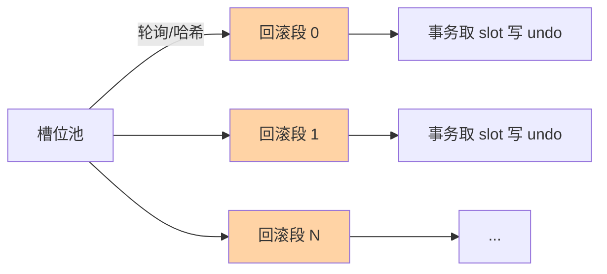
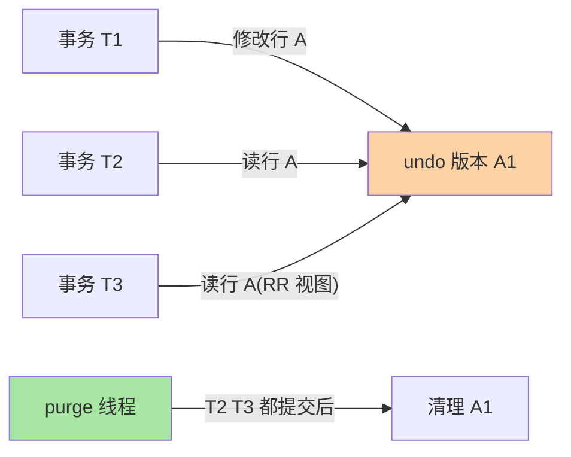

# undo 回滚段：多版本的物理承载与 purge 治理

> undo log 身兼两职——MVCC 版本链的仓库 + 事务回滚的数据源。这篇把 undo 的物理结构、分配策略、purge 线程的回收机制一次讲透：undo 表空间暴涨的根因、`UNDO TABLESPACE` 管理的取舍、`innodb_undo_logs` 参数怎么影响回滚并发。并补上跨库对照（其他数据库的多版本实现）、生产事故、代价量化三个深度维度。

## 一句话摘要

InnoDB 的 undo log 是 **MVCC 版本链的物理载体**：每次更新把旧版本写入 undo 表空间，roll_ptr 指针串成链。**purge 线程负责回收——等事务都看过旧版本后才真正清理**。undo 表空间膨胀 = 长事务 + purge 跟不上，两个症状同源一个根因。

跨库对照：PG 用 xmin/xmax + hint bit 实现 MVCC，Oracle 用 undo segment + 回滚段，SQL Server 用版本存储（tempdb），MongoDB WiredTiger 用 snapshot 读取——多版本是数据库的通用机制，但物理实现各有取舍。

## 🎯 本文核心

**核心一句话：undo 的生命周期由「还有没有人需要旧版本」决定——事务提交只解除回滚职责，MVCC 引用解除后 purge 才能回收；undo 膨胀的本质是「引用不释放」（长事务）或「清理速度跟不上产生速度」（purge 滞后），两者同源不同治。**

机制链：物理结构（表空间 → 回滚段 → undo 页）→ slot 分配与并发度 → purge 的可见性回收时机 → History list length 核心指标 → 膨胀根因诊断 → 治理路径（先治长事务再调参数）→ 跨库对照 → 生产事故 → 代价量化。记住「undo 不是删了就删，是没人看了才删」这一句话，全篇可重构。

## 前置阅读

- 本系列篇 2《版本链与 ReadView》：undo 作为版本链的仓库
- 入门层篇 9《日志三件套》：undo log 的分工
- 本系列篇 1《redo log 刷盘与组提交》：WAL 与刷盘参数

## 一、边界：入门层讲过什么，本文讲什么

| 内容 | 入门层 | 本文 |
|---|---|---|
| undo log 分工：回滚 + MVCC 仓库 | ✅ 讲过 | 不重复 |
| undo 表空间文件结构 | 未讲 | **本文核心一** |
| 回滚段分配策略 | 未讲 | **本文核心二** |
| purge 线程与回收时机 | 未讲 | **本文核心三** |
| undo 膨胀的根因诊断 | 未讲 | **本文核心四** |
| 跨库对照 | 未讲 | **本文新增** |
| 生产事故与代价量化 | 未讲 | **本文新增** |

## 二、undo 的物理结构：表空间与段

MySQL 8.0 起，undo log **默认放在独立 undo 表空间**（初始化时自动创建 `undo_001` / `undo_002`），5.7 及更早版本默认与系统表空间（`ibdata1`）混放——这是「升级后 undo 管理方式变了」的时代背景，独立表空间支持自动 truncate 收缩，是 8.0 的重要演进。一个 undo 表空间由多个**回滚段（rollback segment）**组成，每个回滚段管理**1024 个 undo slot**。

```
undo 表空间 (undo_001)
├── 回滚段 0
│   └── undo slot × 1024（每个活动事务占一个）
├── 回滚段 1
│   └── ...
└── 回滚段 N（innodb_rollback_segments，默认 128）
```

**两个关键数字**：

| 参数 | 默认值 | 含义 |
|---|---|---|
| `innodb_rollback_segments` | 128 | 回滚段数量（旧名 `innodb_undo_logs`） |
| `innodb_undo_tablespaces` | 2 | 独立 undo 表空间数量（8.0 默认） |

回滚段数量决定 **undo slot 的分配面**——并发事务各自取 slot 写 undo，slot 不足时事务需要等待或新页；它不是「回滚并发度」的旋钮（回滚动作本身由 purge/事务自己执行），真正的并发治理在 purge 线程侧（见第四节）。

## 三、跨库对照：各家的多版本实现

| 数据库 | MVCC 实现 | undo 形态 | 备注 |
|---|---|---|---|
| **MySQL InnoDB** | undo log + roll_ptr | 独立 undo 表空间 | 回滚段 slot 池化 |
| **PostgreSQL** | xmin/xmax + hint bit | 堆表元组头 | 无独立 undo 文件，版本在堆表中 |
| **Oracle** | undo segment | 回滚段 + undo 表空间 | 多版本读一致性由 undo 支持 |
| **SQL Server** | 版本存储（tempdb） | tempdb 中的版本链 | 版本存储在 tempdb，非原表 |
| **MongoDB WiredTiger** | snapshot 读取 | 内存快照 + journal | 非关系型，MVCC 实现不同 |
| **TiDB** | MVCC + PD 时间戳 | 分布式 MVCC | 跨节点版本管理 |

**MySQL 特殊在哪**：MySQL 的 undo 是**独立表空间**（8.0 默认），可以 truncate 收缩——PG 的版本在堆表头（hint bit），无法独立收缩；Oracle 的 undo 是回滚段，可以在线回收但不可 truncate。MySQL 8.0 的设计是「独立表空间 + 自动 truncate」，运维友好度最高。

**PG 对比启示**：PG 的 MVCC 在元组头加 xmin/xmax，读取时通过事务 ID 可见性判断——不需要独立 undo 文件，但堆表会膨胀（dead tuple 需要 vacuum 回收）。MySQL 的 undo 是独立空间，purge 清理后文件可 truncate——两种设计取舍不同。

**选型结论**：需要独立 undo 管理选 MySQL 8.0；需要简单 MVCC 选 PG；需要在线回收选 Oracle。

## 四、回滚段分配：事务如何拿到 undo

```
事务 START → InnoDB 从回滚段分配一个 undo slot
            → 写 undo log（旧版本 + 回滚指针）
            → 事务 END → slot 释放（但 undo 页不删，等 purge）
```

**分配策略**：InnoDB 维护一个**回滚段槽位池**，事务启动时按轮询或哈希取一个回滚段。同一个回滚段上的事务串行化——这是 undo 并发瓶颈的根源。



## 五、purge 线程：回收的时机与机制



purge 的触发条件（满足其一即触发）：

1. **read view**：undo 版本对所有活跃事务都不可见 → 可清理
2. **purge lag**：`innodb_max_purge_lag`（默认 0，不限制）超过阈值 → 触发延迟写
3. **后台定时**：每 10 秒扫描一次（`innodb_purge_batch_size` 控制每次清理量）

purge lag 延迟写：undo 页积压超过阈值触发 DML sleep，防止 undo 膨胀失控。这个机制在极端场景下会显著拖慢写入——当 undo 表空间告急时，延迟写本身就成了性能瓶颈。

## 六、代价量化：undo 膨胀的真实成本

**量化口径**（行业经验，非官方数字）：

| 场景 | undo 增长速率 | History list 上涨 | 量化依据 |
|---|---|---|---|
| 长事务（> 1 小时） | 每秒 KB~MB 级 | 持续上涨 | undo 版本不释放 |
| 批量更新（单事务百万行） | 瞬间 GB 级 | 陡升 | undo 产生速度 >> purge 速度 |
| 高并发更新（>1000 TPS） | 持续 MB/s | 缓涨 | purge 线程 CPU 受限 |
| 大表 DELETE 无 LIMIT | 瞬间 GB 级 | 陡升 + 主从延迟 | undo 暴涨 + 复制延迟 |

**量化逻辑**：undo 增长速率 = 并发事务数 × 每事务 undo 量。purge 清理速率 = purge 线程数 × 每线程清理能力。当增长速率 > 清理速率，History list length 持续上涨——这是 undo 膨胀的本质。

**临界点**：History list length > 10000 是危险信号——此时 purge 已经跟不上，产生速率持续超过清理速率，需要立即干预。

## 七、undo 膨胀：根因与诊断

undo 表空间暴涨的根因就两个：

| 根因 | 机制 | 诊断方法 |
|---|---|---|
| **长事务** | 事务 T1 开启后一直未提交 → 所有后续版本的 undo 都不能清理 | `information_schema.innodb_trx` 查 `trx_started` |
| **purge 跟不上** | 高并发更新产生 undo 的速度 > purge 清理速度 | `SHOW ENGINE INNODB STATUS` 看 purge 进度 |

**诊断命令速查**：

```sql
-- 1. 当前活跃事务（长事务排查）
SELECT trx_id, trx_started, trx_state, trx_query
FROM information_schema.innodb_trx
ORDER BY trx_started;

-- 2. undo 表空间大小
SELECT SUM(bytes)/1024/1024 AS undo_mb
FROM information_schema.innodb_tablespaces
WHERE name LIKE '%undo%';

-- 3. purge 进度
SHOW ENGINE INNODB STATUS\G
-- 看 "History list length"：未清理的 undo 版本数
```

**History list length** 是 purge 治理的核心指标：

- < 1000：健康
- 1000~10000：需要关注
- > 10000：undo 膨胀风险，触发延迟写

## 八、源码关键路径

以 8.0 主线口径（storage/innobase）：

- undo 写入：`trx_undo_report_row_operation()` 一族——事务取 slot、写 undo 记录、回填 roll_ptr 的入口
- 回滚执行：`row_undo_step` / `trx_rollback_active()`——回滚时沿旧版本逆向应用
- purge 主循环：`trx_purge()` + `que_thr` 调度——按最老 ReadView 计算可清理水位，多线程（`innodb_purge_threads`）分片消费
- 观测投影：`information_schema.innodb_trx`（最老事务）与 `SHOW ENGINE INNODB STATUS` 的 History list length 即 purge 水位的对外视图

阅读建议：拿「一次 UPDATE 的 undo 生命周期」串读——写入（slot 分配）→ 被引用（快照读回溯）→ 引用清零（最老 ReadView 推进）→ purge 回收，四步对应四处源码。

**场景**：某金融系统批量对账任务，一个事务扫描 5000 万行并做标记。事务执行了 3 小时未提交。期间写入并发持续高涨，undo 表空间从 50GB 膨胀到 400GB，History list length 突破 50000，主库出现周期性写入毛刺。

**根因链路**：

1. 长事务开启 → 事务期间产生的所有 undo 版本都不能清理
2. 后续事务持续更新同一行 → undo 链不断拉长
3. purge 线程被长事务「拽住」——所有新版本都等待最老 read view
4. History list length 持续上涨 → 触发 purge lag 延迟写
5. 延迟写阻塞 DML → 主库写入毛刺 + 慢查询激增

**排查 SOP**：

```sql
-- 1. 找最老事务（首要命令）
SELECT trx_id, trx_started, trx_state, trx_query
FROM information_schema.innodb_trx
ORDER BY trx_started ASC LIMIT 1;

-- 2. 看 History list length
SHOW ENGINE INNODB STATUS\G

-- 3. 看 undo 表空间大小
SELECT SUM(bytes)/1024/1024 AS undo_mb
FROM information_schema.innodb_tablespaces
WHERE name LIKE '%undo%';
```

**止血三步**：
1. 紧急：kill 长事务（undo 链才开始释放）
2. 短期：调大 `innodb_purge_threads` + 监控 History list 下降
3. 长期：业务层事务超时 + 批量操作改分批提交

**Trade-off**：kill 长事务会回滚大量 undo——回滚本身也要时间，大事务回滚可能比执行更久。所以**预防（超时 + 分批）比抢救（kill）更重要**。

## 九、治理手法

| 手法 | 动作 | 代价 |
|---|---|---|
| **消灭长事务** | 事务拆分、批量提交、加超时 | 业务改动 |
| **增大 purge 并发** | `innodb_purge_threads` 调 4（默认 1） | CPU 占用上升 |
| **减小 purge 批次** | `innodb_purge_batch_size` 调小 | 单次清理变慢，总清理时间不变 |
| **启用独立 undo 表空间** | `innodb_undo_tablespaces = 2` | 空间管理更灵活 |
| **调大 undo 表空间** | `innodb_undo_tablespace` 调大 | 磁盘占用 |

**最优路径**：先消灭长事务（治本），再调 purge 参数（治标）。

## 十、典型场景

- **长事务拖爆 undo**：事务 T1 开启后一直未提交，所有后续版本的 undo 都不能清理 → undo 表空间告警。
- **批量更新单事务**：`UPDATE big_table SET status='done' WHERE created < '2024-01-01'` 单事务执行 → 产生大量 undo 版本 → purge 跟不上。
- **大表 DELETE 无 LIMIT**：`DELETE FROM big_table` 单事务删除百万行 → undo 暴涨 + 主从延迟。
- **purge 跟不上**：高并发更新产生 undo 的速度 > purge 清理速度 → History list length 持续上涨。
- **跨库对照**：从 Oracle 切 MySQL 时，Oracle 的 undo 是回滚段（可在线回收），MySQL 8.0 的 undo 是独立表空间（可 truncate）——迁移时 undo 治理策略要重新评审。

## 十一、业内惯例

> 💡 **实战提示**
> - undo 告警第一命令永远是 `innodb_trx ORDER BY trx_started ASC LIMIT 1` 找最老事务——比任何参数调整都优先
> - `innodb_purge_threads` 8.0 默认已是 4，无需从 1 调起；真正要盯的是 History list length 趋势而不是线程数
> - 大表删除用「循环 + LIMIT 1000 + 批间 sleep」模板，把 undo 产生速率压到 purge 能跟上的水位
> - 什么时候需要手工干预 purge：History list length 持续上涨且最老事务已清——先查 purge 线程 CPU 是否被抢，再考虑临时下调业务写入
> - 监控三件套：`History list length`、`undo 表空间大小`、`purge 线程进度`——三张图在，undo 问题无处遁形
> - undo 表空间预分配：初始化时按「容纳 20 分钟到 1 小时写入量」估算，避免运行时频繁扩缩

- **长事务治理**：业务层设置事务超时 + 应用层超时双重保障，避免事务无限期持有 undo 版本。
- **批量更新分批**：大批量 UPDATE 分批提交（每批 1000 行），避免单事务产生大量 undo 版本拖爆 purge。
- **History list length 监控**：> 10000 是 purge 跟不上的信号，需立即排查长事务。
- **独立 undo 表空间**：MySQL 8.0 默认开启 `innodb_undo_tablespaces = 2`，便于 TRUNCATE 收缩。
- **purge 线程调优**：`innodb_purge_threads` 默认 1，高并发场景调 4；`innodb_purge_batch_size` 默认 20 页，不建议大幅调整。
- **undo 膨胀的应急处理**：先 kill 长事务，再 `ANALYZE TABLE` 刷新统计信息，最后看 purge 是否跟上。
- **大表 DELETE 加 LIMIT**：每次删 1000 行，循环执行——避免单事务 undo 暴涨。

## 十二、常见误区

- **「undo 表空间会自动收缩」**：purge 清理数据后文件大小不会缩小（除非 8.0 独立表空间的自动 TRUNCATE）。
- **「purge 越快越好」**：purge 消耗 CPU 和 IO，过高并发反而影响业务线程。
- **「undo 只服务于回滚」**：undo 同时服务 MVCC 版本链，是读一致性基础——清理过快会导致快照读找不到旧版本。
- **「长事务只影响 undo」**：长事务还阻塞 purge → undo 膨胀 → 影响所有读写——这是连锁反应
- **「undo slot 是并发瓶颈」**：128 个回滚段在绝大多数场景够用——真正瓶颈是 purge 线程 CPU，不是 slot 分配
- **「MySQL 5.7 和 8.0 undo 一样」**：5.7 undo 混在 ibdata1 无法 truncate，8.0 独立表空间可 truncate——升级后 undo 管理方式变了

## 十三、与相邻机制的关系

- 本系列篇 2《版本链与 ReadView》：undo 作为版本链的仓库，purge 的可见性判断依赖 ReadView
- 本系列篇 1《redo log 刷盘与组提交》：WAL 与 undo 的生命周期不同——undo 在事务提交后仍保留（MVCC 需要），redo 在事务提交后即可覆盖
- tips 互指：MVCC 系列篇 1 的 RC-ROW 强绑定结论在此兑现——RC 隔离级别下 undo 版本可以更早清理

## 你们可能会问

**Q1：purge 线程有几个？越多越快吗？**
`innodb_purge_threads` 8.0 默认 4。调大加速回收但抢业务 CPU/IO——「purge 跟不上」多数是长事务拽着而不是线程不够，先查最老事务再动线程数。

**Q2：History list length 怎么读？**
它是「还没被 purge 的 undo 量」的水位计：千级健康、万级要查、持续上行告急。它的斜率比数值更有意义——缓涨说明 purge 略滞后，陡涨八成有长事务。

**Q3：8.0 的自动 truncate 会不会影响业务？**
独立 undo 表空间的 truncate 在后台做且做了空闲页复用优化，常态无感；但触发时机赶上写入高峰会加剧 IO——给它配置合理的表空间大小，让 truncate 频率低而稳。

**Q4：Oracle 的 undo 和 MySQL 的 undo 有什么不同？**
Oracle undo 是回滚段（在线表空间），可以在线回收但不支持 truncate；MySQL 8.0 undo 是独立表空间，支持 TRUNCATE 收缩——MySQL 的 undo 管理更自动化。

**Q5：为什么 undo 提交后不立即删除？**
因为 MVCC 可能还有其他事务在读旧版本——undo 的生命周期由「最老需要它的事务」决定，不是由「创建它的事务」决定。这就是「undo 不是删了就删，是没人看了才删」的完整含义。

## 十四、自测三问

1. undo log 的物理载体是什么？undo 表空间由什么组成？
2. purge 的三个触发条件是什么？History list length 的健康阈值是多少？
3. undo 膨胀的两个根因是什么？最优治理路径是什么？

## 开放问题

- 分布式数据库（TiDB/CockroachDB）的 MVCC 版本管理如何跨节点回收，各家实现差异大
- 存算分离架构下 undo 的物理位置变化——undo 是否从本地表空间移到远端存储
- AI 驱动的 purge 自适应调度——根据工作负载动态调整 purge 并发和批次，社区已有实验性探索

## 🎯 核心带走

- **核心一句话**：undo 由「引用」决定生死——事务提交解除回滚职责，无人引用才被 purge 回收；膨胀 = 引用不放（长事务）或清理滞后
- **机制链**：表空间/回滚段/slot → 分配与并发 → purge 回收时机 → History list 水位 → 根因诊断 → 治理顺序 → 跨库对照 → 生产事故 → 代价量化
- **哪里会坏**：长事务拽链、批量更新单事务、大表 DELETE 无 LIMIT、误信文件会自动收缩
- **边界**：本篇管 undo 的物理与治理；版本链逻辑在 MVCC 系列篇 2，redo 的环形容量在篇 1——三种日志各一套生命周期

## 📌 数据与事实声明

- 写于 2026-09-10，机制以 MySQL 8.0 InnoDB 为基准；参数默认值以官方文档为准
- `innodb_rollback_segments` 默认 128（旧名 `innodb_undo_logs`）；`innodb_purge_threads` 8.0 默认 4
- History list length 阈值（1000/10000）为业内常见经验值，非官方标准
- 量化口径为行业经验，非官方数字，具体值以实测为准
- 跨库对照基于公开资料（PG/Oracle/SQL Server/MongoDB/TiDB 官方文档），细节以各版本官方为准
- 免责：参数与行为以 dev.mysql.com 官方文档为准

## 📚 参考资料

| 类型 | 标题 | 来源 |
|---|---|---|
| 书籍 | 《高性能 MySQL》日志章 | O'Reilly（公开出版） |
| 书籍 | 《MySQL 是怎样运行的》事务与日志章 | 公开出版 |
| 官方 | MySQL 8.0 Ref - Undo Tablespaces | dev.mysql.com/doc/refman/8.0/en/innodb-undo-tablespaces.html |
| 官方 | MySQL 8.0 Ref - Purge Configuration | dev.mysql.com/doc/refman/8.0/en/innodb-purge-configuration.html |
| 跨库参照 | PostgreSQL MVCC / Oracle Undo Segment / SQL Server Version Store | github.com/postgres/postgres / oracle.com / microsoft.com |
| 系列导航 | MySQL 系列目录 | `docs/data/mysql/index.md` |