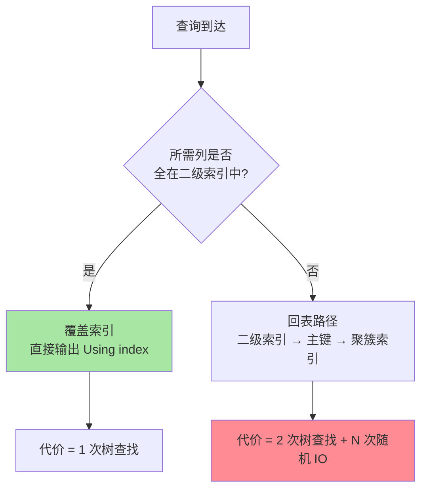

# 聚簇索引与回表：一次查询到底查了几棵树

> 用二级索引查一行，为什么有时候快如闪电、有时候优化器宁可全表扫？答案藏在「回表」的代价模型里。这篇把聚簇与二级索引的分野、回表的完整链路和代价量化讲透，覆盖索引的收益也就不言自明。并补上跨库对照（其他引擎的索引组织方式）、生产事故、代价量化三个深度维度。

## 一句话摘要

InnoDB 的表本身就是一棵按主键组织的聚簇索引树，叶子存完整行；二级索引的叶子只存「索引键 + 主键」。**用二级索引找到主键、再回聚簇树取整行的过程就是回表**——回表次数一多，二级索引反而输给全表扫描，覆盖索引的全部意义就在于把这次「第二次树查找」消掉。

跨库对照：PG 堆表 + B+ 树索引（叶子只存行指针）、Oracle 堆表 + B+ 树（回表同样随机 IO）、SQL Server 堆表 + 列存储索引——MySQL 的聚簇索引是读优化的极致，但写入代价更高。

## 🎯 本文核心

**核心一句话：一次查询查几棵树 = 回表几次 + 1——二级索引叶子只存主键，每命中一行都要回聚簇树再走一遍（且是随机页访问）；回表行数一多，走索引不如全表扫；覆盖索引的使命就是把第二次树查找整个消灭。**

机制链：聚簇结构（表即索引）→ 二级叶子瘦身（键 + 主键）→ 回表链路（N 次随机页访问）→ 代价天平（回表 vs 全扫的临界点）→ 覆盖索引（消灭第二跳）→ 跨库对照 → 生产事故 → 代价量化。记住「回表是随机 I/O，覆盖是免第二跳」，全篇可重构。

## 前置阅读

- 本系列篇 1《B+ 树与页存储》：树高、页、页分裂机制
- 入门层篇 5《索引基础》：索引类型与建索引的基本判断

## 一、边界：入门层讲过什么，本文讲什么

| 内容 | 入门层 | 本文 |
|---|---|---|
| 主键索引 vs 普通索引的用法 | ✅ 讲过 | 不重复 |
| 聚簇与二级的叶子结构差异 | 提了一句 | **本文核心一** |
| 回表链路与代价模型 | 未讲 | **本文核心二** |
| 覆盖索引与联合索引列序 | 提了一句 | **本文核心三** |
| EXPLAIN 字段解读 | 未讲 | 留给专题层「索引优化深度」 |
| 跨库对照 | 未讲 | **本文新增** |
| 生产事故与代价量化 | 未讲 | **本文新增** |

## 二、聚簇索引：表就是索引

InnoDB 的「表」在物理上就是一棵聚簇索引树（primary index）：叶子页里按主键顺序存放**完整行数据**。这不是「表 + 一个主键索引」两个东西，而是同一个东西的两种说法——这是 InnoDB 与 MyISAM 这类堆表引擎最本质的架构分野：堆表的表数据和索引互相独立，索引叶子存数据文件地址；聚簇引擎的索引即数据。从堆表到聚簇，是 MySQL 存储引擎演进史上最重要的一次转向：主键访问从「索引定位 + 文件寻址」收敛成一次树查找。

这个结构决定了两条铁律：

1. **主键即物理组织顺序**——篇 1 讲的页分裂、自增主键优势，全都作用在这棵树上
2. **二级索引天然「瘦身」**——二级索引叶子只存「索引键 + 主键值」，不复制整行。行再宽，二级索引也不膨胀；但主键会被每个二级索引叶子复制，这是「主键要短」的第二层原因

## 三、回表的完整链路

用 `SELECT * FROM orders WHERE user_id = 42`（user_id 上有二级索引）走一遍：


三次结构动作：① 二级树查找（树高次页访问 + 页内二分）；② 拿到一批主键；③ **每个主键各走一遍聚簇树**。如果 user_id=42 命中 500 行，③ 就是 500 次主键查找——哪怕这些行分布在 200 个叶子页上，也是 200 次左右的页访问。

关键在于 ③ 的访问模式是**随机的**：主键无序命中，页在 Buffer Pool 里的命中率远不如顺序扫描。这就是回表的真实成本——不是「多查一棵树」这么轻描淡写，而是**N 次随机页访问**。

## 四、跨库对照：聚簇 vs 堆表

| 数据库 | 表组织方式 | 回表代价 | 备注 |
|---|---|---|---|
| **MySQL InnoDB** | 聚簇索引（叶子=完整行） | N 次随机 IO | 主键即物理顺序，二级索引带主键 |
| **PostgreSQL** | 堆表 + B+ 树索引 | N 次随机 IO + 行指针跳转 | 堆表独立存储，索引叶子存 TID（页号+行号） |
| **Oracle** | 堆表 + B+ 树索引 | N 次随机 IO + 行指针跳转 | 同 PG，ROWID 寻址 |
| **SQL Server** | 堆表 / 聚簇索引可选 | 聚簇时同 MySQL，堆表时额外书签查找 | 堆表用 RID 寻址，聚簇表用主键 |
| **MongoDB** | 堆表 + B+ 树索引 | N 次随机 IO | WiredTiger 堆表 + B+ 树，回表常态 |
| **TiDB** | 聚簇索引可选（TiDB 5.0+ 默认） | 同 MySQL | 分布式聚簇，跨节点回表网络代价更高 |

**MySQL 特殊在哪**：MySQL 是默认聚簇的关系型数据库，PG/Oracle/SQL Server 默认堆表——这意味着 MySQL 主键查询极快（一次树查找），但二级索引回表比堆表数据库更频繁（因为聚簇索引叶子即数据，二级索引必须回主键树才能取整行）。堆表数据库的回表是「索引 → 堆文件地址」，MySQL 是「索引 → 主键 → 聚簇索引叶子」——多一次树查找。

**PG 对比启示**：PG 的堆表 + B+ 树索引，回表时通过 TID（页号+行号）直接定位堆文件——比 MySQL 的「主键再查一次树」少一次 IO，但堆表的顺序扫描比聚簇快（物理顺序与逻辑顺序一致）。写入时堆表比聚簇更快（无需维护聚簇顺序），这是 PG 写密集场景的优势。

**选型结论**：读多主键查 → 聚簇（MySQL/TiDB）；写多 + 读杂 → 堆表（PG/Oracle）；混合 → SQL Server 可选聚簇/堆表。

## 五、代价量化：优化器为什么有时放弃二级索引

把两条路径放上天平：

- **走二级索引 + 回表**：`二级树高 + 回表行数 × 每行约 1 次随机页访问`
- **全表扫描**：`聚簇树高 × 全表页数（顺序访问，页均成本远低于随机）`

设回表行数为 N、选择率越低 N 越大（选择差），当 N 超过某个比例（经验上百分之几到百分之几十，取决于行宽与缓存），全表扫描反而更便宜——优化器基于统计信息估算后选择全表扫，`EXPLAIN` 显示 `type=ALL`。**索引建了却没走，多数时候不是优化器笨，是回表代价真的高**。

由此推出三条可量化的设计判据：

1. **选择性与回表行数成反比**——低选择性列（如性别、状态）单独建索引收益有限
2. **`SELECT *` 让每行都必须回表**——只查索引里已有的列，回表才可能消失
3. **LIMIT 小的深分页例外**——`ORDER BY 索引列 LIMIT 20` 只需回表 20 行，这就是深分页「延迟关联」改写的基础

这三条判据背后是同一个模型：把「随数据量与硬件演进变化的 I/O 代价」折算成可比较的决策依据——代价模型变了，结论就会变。

**量化口径**（行业经验，非官方数字）：

| 场景 | 回表行数 | 优化器倾向 | 实际表现 |
|---|---|---|---|
| 高选择性 + 少量行 | < 5% | 走索引 | 索引快 5-10x |
| 中等选择性 | 5-20% | 看 Buffer Pool 命中率 | 索引与全表接近 |
| 低选择性 + SELECT * | > 20% | 全表扫 | 全表快 2-5x |
| 深分页 LIMIT 大 | 少数行 | 延迟关联改写 | 索引快 10-100x |



## 六、源码关键路径

以 8.0 主线口径（storage/innobase）：

- 二级索引扫描入口：`row_search_mvcc()`——同一条路径同时服务聚簇与二级扫描，靠 `read_just Secondary` 布局区分
- 回表：二级命中后经 MySQL 层 handler 回调 `ha_innobase::index_read` 以主键再走 `btr_cur_search_to_nth_level()`，即篇 1 的树搜索关键路径
- ICP：Server 层将 WHERE 中能下推的条件交给存储引擎在索引层求值（`pushed_cond` 数组），InnoDB 在 `row_search_mvcc` 循环里先判再决定是否回表

顺着「一条带覆盖索引的 SELECT」读：`SQL 层优化器选定覆盖索引 → 只访问二级 B+ 树 → 沿叶子链表顺序输出`，全程不碰聚簇树，`Handler_read_key` 等状态变量可验证。

## 七、生产事故推演：回表爆炸拖慢线上查询

**场景**：某订单系统列表页 `SELECT * FROM orders WHERE status = 'pending' ORDER BY create_time DESC LIMIT 20`，`status` 上有索引但每秒千级查询，CPU 持续 90%+。

**根因链路**：

1. `status` 选择性差（pending 占比 30%），优化器估算回表行数大
2. 实际执行时每行都要回聚簇树取整行——30% 的行 × 随机 IO
3. Buffer Pool 被大量随机读污染，热点数据被挤出
4. 全表扫反而只需顺序读聚簇索引，代价更低——但优化器没选它（统计信息过期）
5. 业务侧表现为「列表页慢、卡、CPU 高」——根因是回表爆炸

**排查 SOP**：

```sql
-- 查回表率（rows_examined vs rows_sent）
SHOW STATUS LIKE 'Handler_read%';

-- 查执行计划（看 type/Extra）
EXPLAIN SELECT * FROM orders WHERE status = 'pending' ORDER BY create_time DESC LIMIT 20;

-- 刷新统计信息
ANALYZE TABLE orders;
```

**止血三步**：
1. 紧急：`ANALYZE TABLE` 刷新统计信息（优化器可能自己转向全表扫）
2. 短期：改写为覆盖索引 + 延迟关联，或只取必要列
3. 长期：评估是否要把高频查询的列并进索引，或升级更大 Buffer Pool

**Trade-off**：覆盖索引消灭回表但写放大，延迟关联减少回表但多一次子查询——选哪个取决于读写比例。

## 八、典型场景

- **列表页**：订单/账单列表按「用户 + 时间」翻页——`(user_id, create_time, 展示列…)` 覆盖，列表查询不回表
- **深分页优化**：`WHERE user_id=? ORDER BY id LIMIT 100000, 20` 改延迟关联：先用覆盖索引定位主键边界，再回表取 20 行整数据
- **计数与存在性检查**：`COUNT(*) WHERE 状态列=?` 高频时建窄覆盖索引，代价远低于全表扫
- **跨库对照**：从 PG 切 MySQL 时，PG 的堆表回表是「索引 → TID → 堆文件」，MySQL 是「索引 → 主键 → 聚簇叶子」——回表 IO 次数相同但路径不同，MySQL 的聚簇顺序扫描比 PG 堆表顺序扫描快（物理顺序与逻辑顺序一致）

## 九、业内惯例

> 💡 **实战提示**
> - 列表页索引布局公式：`(等值条件列, 排序列, 高频展示列…)`——前缀检索 + 免排序 + 尽量覆盖，一索三用
> - 深分页改写模板：`SELECT * FROM t JOIN (SELECT id FROM t WHERE ? ORDER BY ? LIMIT 100000, 20) tmp USING(id)`——子查询走覆盖索引定位边界，外层只回表 20 行
> - 判断回表是否发生只看 `Extra`：`Using index` = 覆盖；`Using index condition` = ICP 减少了但仍有回表；两者都没有 = 每行都回
> - 评审索引时先问「这条索引吃谁的查询、谁为它付写放大」：说不清服务对象的索引，下一个季度清理名单里就有它
> - 禁止无脑 `SELECT *`：线上规范普遍要求按需取列——它不只是网络带宽问题，直接决定回表是否发生
> - 单表二级索引收敛：业内常见约束是单表索引个数控制在个位数，每个索引都要能说清服务哪类查询
> - 先 EXPLAIN 再上线：新查询上线前看 `type/rows/Extra`，`Using index` 与 `Using filesort` 是两个必看项
> - 大字段独立存储：TEXT/BLOB 行溢出页会让聚簇叶子只存指针——宽表与覆盖索引天然冲突

- **禁止无脑 `SELECT *`**：线上规范普遍要求按需取列——它不只是网络带宽问题，直接决定回表是否发生
- **单表二级索引收敛**：业内常见约束是单表索引个数控制在个位数，每个索引都要能说清服务哪类查询——索引不是免费的，写放大（篇 1 分裂 + 每索引一份叶子）都要付账
- **先 EXPLAIN 再上线**：新查询上线前看 `type/rows/Extra`，`Using index`（覆盖）与 `Using filesort`（免不了再议）是两个必看项
- **大字段独立存储**：TEXT/BLOB 行溢出页会让聚簇叶子只存指针——宽表与覆盖索引天然冲突，业内默认把大字段拆出主表

## 十、常见误区

- **「走索引一定比全表扫快」**：回表模型下不成立。选择差 + `SELECT *` 的组合，走二级索引反而是灾难，优化器会自己转向
- **「覆盖索引越多越好」**：每个覆盖索引都是一棵要维护的 B+ 树，写放大与优化器选择成本随索引数上涨。覆盖设计瞄准 Top 高频查询，不做长尾大全
- **「ICP 就是覆盖索引」**：ICP 减少回表次数，仍需回表；覆盖索引才是不回表。Extra 里 `Using index condition` 与 `Using index` 是两种结果
- **「主键越短只影响主键索引」**：主键被所有二级索引叶子复制，主键变长是全索引体系一起膨胀——篇 1 与本篇互为印证
- **「聚簇索引永远比堆表快」**：聚簇索引在主键查询和顺序扫描上快，但写入时维护聚簇顺序的代价比堆表高——写密集场景堆表可能更快
- **「覆盖索引不需要维护」**：覆盖索引本身就是一棵要维护的 B+ 树，写入时同步更新覆盖索引——写放大不可忽视

## 十一、与相邻机制的关系

- 篇 1《B+ 树与页存储》：树高与页机制是本文代价模型的地基
- 专题层《索引优化深度》：EXPLAIN 深度解读与索引失效手册在那边组合成排查手册，本文提供「为什么」
- tips 互指：分库分表后二级索引的全局唯一性问题，在 `专题层/分库分表深度` 展开

## 你们可能会问

**Q1：为什么优化器有时选了二级索引却很慢（执行了才知道错）？**
统计信息过期时估算失真（`rows` 估错量级），ANALYZE TABLE 刷新即可修复多数误判；偶发的还有内存临时表与索引争夺的干扰，用 `EXPLAIN ANALYZE` 看真实执行耗时定位。

**Q2：UUID 主键下回表更疼吗？**
是。聚簇叶子按主键排序，无序主键使回表的页访问更加随机、缓存命中率更低——回表代价模型里的「随机页访问」项被放大。这与篇 1 的页分裂问题叠加，是无序主键的双重代价。

**Q3：联合索引把常用列全并进去，会不会太宽？**
会。覆盖列越多单页容纳的行越少、树越高，写放大也越大。取舍标准：把「高频查询的高选择性前缀 + 少量覆盖列」并进去，长尾与低频列不值得进索引。

**Q4：TiDB 的聚簇索引和 MySQL 一样吗？**
TiDB 5.0+ 默认聚簇索引（与 MySQL 类似），但聚簇索引在分布式环境下回表涉及跨节点网络——回表代价 = 树查找 + 网络 RTT，比单机 MySQL 高一个量级。分布式场景下回表优化更关键。

**Q5：列存数据库怎么处理回表？**
列存（如 ClickHouse）没有回表概念——列存按列存数据，查询只读需要的列，天然「覆盖」。HTAP 架构下行存（MySQL）做事务，列存做分析，回表是行存的特权——这也是为什么分析查询通常不下推到 MySQL。

## 十二、自测三问

1. 二级索引叶子存什么？为什么 InnoDB 这样设计而不是存行地址？
2. 完整说出回表的三步链路，并解释为什么它是随机 I/O。
3. `Using index` 和 `Using index condition` 的区别是什么？

## 开放问题

- HTAP 架构下行存副本（列存）与聚簇行存并存，回表概念在「分析走列存」的路径上如何重新定义，业界仍在演化
- 原生分区表下二级索引只保证分区内有序，「全局索引」的代价模型至今没有跨厂商一致的演进结论
- 分布式数据库（TiDB/CockroachDB）跨节点回表的网络代价如何建模，各家实现尚无统一范式

## 🎯 核心带走

- **核心一句话**：二级索引叶子存主键，回表 = 每行一次随机页访问；行数一多索引就输给全扫，覆盖索引把第二跳整个消灭
- **机制链**：聚簇即表 → 二级瘦身 → 回表随机 IO → 代价天平 → 覆盖/ICP/延迟关联 → 跨库对照 → 生产事故 → 代价量化
- **哪里会坏**：低选择性列 + SELECT *（回表爆炸）、覆盖索引堆砌（写放大）、误把 ICP 当覆盖
- **边界**：本篇讲「回表的代价模型」；失效场景与 EXPLAIN 全字段解读在专题层「索引优化深度」组合成排查手册

## 📌 数据与事实声明

- 写于 2026-09-10，机制以 MySQL 8.0 InnoDB 为基准；ICP、覆盖索引行为以官方文档为准
- 「回表 N 行约 N 次随机页访问」为量级估算口径，实际受缓冲池命中率影响
- 量化口径为行业经验，非官方数字，具体值以实测为准
- 跨库对照基于公开资料（PG/Oracle/SQL Server/MongoDB/TiDB 官方文档），细节以各版本官方为准
- 免责：参数默认值以 dev.mysql.com 官方文档为准

## 📚 参考资料

| 类型 | 标题 | 来源 |
|---|---|---|
| 官方文档 | InnoDB Index Structure / ICP | dev.mysql.com/doc/refman/8.0/en/innodb-index-types.html |
| 官方源码 | mysql/mysql-server（storage/innobase） | github.com/mysql/mysql-server |
| 原理书 | 《MySQL 技术内幕：InnoDB 存储引擎》姜承尧 | 公开出版 |
| 实战书 | 《高性能 MySQL（第 4 版）》索引章 | 公开出版 |
| 跨库参照 | PostgreSQL Heap + Index / Oracle Index Organization / SQL Server Clustered vs Heap | github.com/postgres/postgres / oracle.com / microsoft.com |