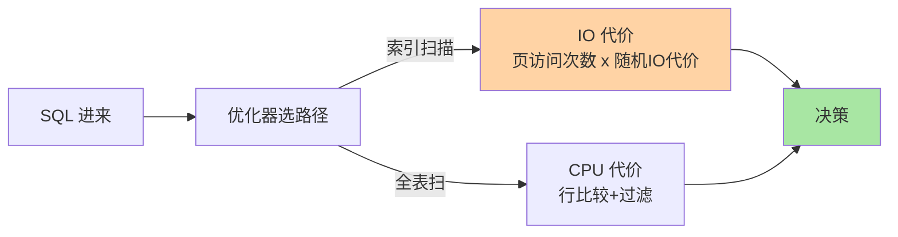
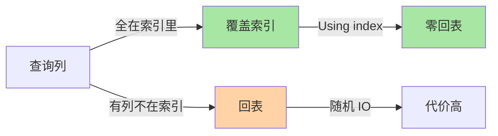

# 优化器与索引选择：从代价模型到执行计划

> 建了索引却没用、走了索引反而慢——优化器选索引不是靠「直觉」，而是基于代价模型的量化计算。这篇把成本估算的每一项拆开：IO 代价、CPU 代价、统计信息、回表放大，让你拿到 EXPLAIN 就能推理优化器到底在想什么。并补上跨库对照（其他数据库的优化器策略）、生产事故、代价量化三个深度维度。

## 一句话摘要

InnoDB 优化器的目标是**最小化总代价**：IO 代价（页访问次数）+ CPU 代价（行比较 + 回表）。决策依赖统计信息（cardinality、索引基数），统计不准时优化器会「选错」。Covering 索引、联合索引列序、深分页改写是三个最值得掌握的优化模式。

跨库对照：PG 用基于成本的优化器（CBO）+ 统计信息直方图，Oracle 用 CBO + 分区级统计，SQL Server 用 CBO + 自动创建统计信息，MongoDB 用基于规则的优化器（RBO）为主 + CBO 辅助——优化器策略随数据规模与工作负载演进。

## 🎯 本文核心

**核心一句话：优化器选索引 = 代价模型的量化比较——总代价 = IO 代价（页访问 × 随机读）+ CPU 代价（行比较 + 回表），决策输入是统计信息；统计信息失真时决策必错，「选错索引」的第一 root cause 永远先查统计。**

机制链：代价模型（IO+CPU 双轨）→ 决策临界点（范围扫描命中 5%-10% 以上不如全扫）→ 统计信息（Cardinality/Index dive/行数）→ EXPLAIN 推理（type/key/rows/Extra 逐字段）→ 失效陷阱清单 → 联合索引列序工程化 → 覆盖索引兜底 → 跨库对照 → 生产事故 → 代价量化。记住「统计失真 → 选错 → 慢查询」这一条因果链，全篇可重构。

## 前置阅读

- 本系列篇 1《B+ 树与页存储》：树高与 I/O 次数的映射
- 本系列篇 2《聚簇索引与回表》：回表代价模型
- 入门层篇 5《索引基础》：索引类型与建索引判断

## 一、边界：入门层讲过什么，本文讲什么

| 内容 | 入门层 | 本文 |
|---|---|---|
| 索引类型与建索引判断 | ✅ 讲过 | 不重复 |
| 聚簇与二级索引结构 | ✅ 讲过 | 不重复 |
| 回表代价模型 | ✅ 讲过 | 不重复 |
| **代价模型与统计信息** | 未讲 | **本文核心一** |
| **EXPLAIN 字段解读与推理** | 未讲 | **本文核心二** |
| **索引失效常见陷阱** | 未讲 | **本文核心三** |
| **跨库对照** | 未讲 | **本文新增** |
| **生产事故与代价量化** | 未讲 | **本文新增** |

## 二、代价模型：IO + CPU 双轨



InnoDB 默认配置下 IO 代价 >> CPU 代价，所以优化器**优先最小化页访问次数**，回表次数是核心考量——这和篇 2「回表 N 次 = N 次随机页访问」完全一致。

## 三、跨库对照：其他数据库的优化器策略

| 数据库 | 优化器类型 | 统计信息 | 备注 |
|---|---|---|---|
| **MySQL InnoDB** | 基于代价（CBO） | Cardinality + Index Dive | IO 代价权重高，回表是核心考量 |
| **PostgreSQL** | 基于代价（CBO） | 直方图 + 相关性统计 | 支持更细粒度统计 `ANALYZE` |
| **Oracle** | 基于代价（CBO） | 分区级统计 + 直方图 | 分区裁剪 + 动态采样 |
| **SQL Server** | 基于代价（CBO） | 自动创建统计 + 增量统计 | 自动更新统计阈值可调 |
| **MongoDB** | 基于规则（RBO）为主 + CBO 辅助 | 集合级统计 | 3.0+ 支持 `explain("executionStats")` |
| **TiDB** | 基于代价（CBO） | 伪统计 + 真实统计 | 分布式统计，节点间同步 |

**MySQL 特殊在哪**：MySQL 优化器的代价权重硬编码（`io_block_read_cost=1.0, cpu_tuple_cost=0.2`），不适合 SSD 时代的随机 IO 低延迟——这是 MySQL 优化器被诟病最多的地方。调优手段有限，主要靠「统计信息刷新 + 索引设计适配优化器偏好」。

**PG 对比启示**：PG 的统计信息更丰富（直方图 + 最常见值列表 + 相关性系数），CBO 估算更准——同样的数据分布，PG 的优化器决策通常比 MySQL 更合理。这也是为什么复杂查询 PG 表现常优于 MySQL。

**选型结论**：简单 OLTP 查询 MySQL 够用；复杂分析型查询 + 大量范围扫描 → PG 优化器更稳；分布式场景 → TiDB 统计信息需额外关注。

## 四、统计信息：优化器的「数据」

优化器不知道数据分布，它靠**统计信息**估算：

| 统计项 | 含义 | 对决策的影响 |
|---|---|---|
| **Cardinality** | 索引列不重复值估算 | 选择性估算 → 是否走索引 |
| **Index dive** | 等值条件具体值 | 精确估算行数 |
| **Index statistics** | 索引高度、页分布 | 范围扫描代价 |
| **表行数** | 总行数 | 全表扫基线 |

**统计信息不准 → 优化器选错**的两种典型：

1. **数据倾斜**：列值分布极不均匀（如 99% 行 status='active'），Cardinality 高估选择性，优化器错误地选索引
2. **大数据表未 ANALYZE**：统计信息过时，优化器基于错误的基数估算做决策

**诊断命令**：

```sql
-- 查看索引基数
SHOW INDEX FROM t FROM db;

-- 更新统计信息
ANALYZE TABLE t;

-- EXPLAIN 看估算行数
EXPLAIN SELECT * FROM t WHERE status = 'active';
-- rows 列就是基数估算
```

> 💡 **实战提示（统计信息陷阱）**：Cardinality 是估算不是精确值——对倾斜列尤其不准。`ANALYZE TABLE` 刷新后重新观察执行计划，迭代到「优化器行为符合预期」为止；不是每次查询都需要刷新。

## 五、代价量化：范围扫描 vs 全表扫的临界点

**量化口径**（行业经验，非官方数字）：

```
范围扫描代价 = 树高 + 命中页数 × 每页回表行数
全表扫描代价 = 聚簇树高 × 全表页数（顺序读）
```

| 命中比例 | 优化器倾向 | 实际表现 | 量化依据 |
|---|---|---|---|
| < 5% | 走索引 | 索引快 5-10x | 随机 IO 远少于顺序 IO |
| 5%-10% | 看 Buffer Pool 命中率 | 索引与全表接近 | 缓存命中抵消随机 IO |
| > 10%-20% | 全表扫 | 全表快 2-5x | 顺序读吞吐 >> 随机读 |
| > 50% | 一定全表扫 | 全表快 5-20x | 顺序读是随机读的 10x+ |

**量化逻辑**：InnoDB 默认 `io_block_read_cost=1.0`（机械盘时代定价），SSD 时代实际随机 IO 远低于此——调低该值会让优化器更倾向索引扫描。代价权重与硬件的代际关系，是优化器演进里最容易被忽视的一条线。

**Benchmark 边界**：以上量化基于默认参数 + 机械盘假设，SSD 环境需重新校准 `io_block_read_cost`。具体值以 `SHOW VARIABLES LIKE 'innodb_io_capacity%'` 为准。

## 六、源码关键路径

以 8.0 主线口径（storage/innobase + sql/）：

- **代价模型**：`sql/sql_optimizer.cc` 的 `join_optimization()` → `choose_index()` 选索引
- **统计信息**：`storage/innobase/dict/dict0stats.cc` 的 `dict_stats_update()`
- **覆盖索引判定**：`sql/sql_select.cc` 的 `check_quick_select()`
- **EXPLAIN 输出**：`sql/sql_explain.cc` 的 `explain_join()`

读源码路线：先看 `sql_optimizer.cc` 的 `join_optimization()` → 跟踪 `choose_index()` 的索引选择逻辑 → 看 `dict0stats.cc` 的统计信息更新 → 看 `sql_explain.cc` 的 EXPLAIN 输出构建。理解优化器决策最直接的方式是跟一遍代价估算的调用链。

## 七、EXPLAIN 推理：逐字段解读

```sql
EXPLAIN SELECT * FROM orders WHERE user_id = 42 AND status = 'paid' ORDER BY created_at LIMIT 20;
```

| 字段 | 含义 | 关注点 |
|---|---|---|
| **type** | 访问类型 | ALL 全表扫（最差）→ range → ref → eq_ref → const（最好） |
| **key** | 实际用的索引 | NULL = 未用索引 |
| **rows** | 估算扫描行数 | 越大说明选择性越差 |
| **Extra** | 额外信息 | Using filesort（文件排序）、Using temporary（临时表）、Using index（覆盖索引） |

**优化器决策链**：

```
1. 确定候选索引（WHERE + ORDER BY 能用的）
2. 估算每条路径的 rows + IO 代价
3. 选代价最低的路径
4. 输出 EXPLAIN
```

**跨库对照**：PG 的 `EXPLAIN (ANALYZE, BUFFERS)` 比 MySQL 的 `EXPLAIN` 更详细——PG 输出实际行数 + 实际耗时 + Buffer 命中率，MySQL 的 `EXPLAIN` 只给估算。PG 的 `EXPLAIN ANALYZE` 是「实际执行 + 统计」，MySQL 的 `EXPLAIN ANALYZE`（8.0.18+）也是实际执行数据但粒度较粗。

## 八、索引失效的常见陷阱

| 陷阱 | 原因 | 修复 |
|---|---|---|
| **函数操作** | `WHERE YEAR(created_at) = 2024` | 改范围条件 `WHERE created_at >= '2024-01-01'` |
| **隐式类型转换** | `WHERE id = '123'`（id 是 int） | 确保类型一致 |
| **OR 条件** | `WHERE a = 1 OR b = 2`（a、b 各不同索引）| 改 UNION 或覆盖索引 |
| **前导通配符** | `WHERE name LIKE '%abc'` | 改全文索引或覆盖索引 |
| **联合索引列序不对** | 索引 `(a,b)`，查询 `WHERE b = 1` | 调整列序或单独建索引 |
| **索引列计算** | `WHERE age + 1 = 18` | 改写为 `WHERE age = 17` |
| **LIMIT 大偏移深分页** | `LIMIT 1000000, 10` | 延迟关联或游标分页 |

**生产事故推演：统计信息过期导致全表扫拖垮主库**

**场景**：某订单表 `orders`（5000 万行），`status` 列选择性 5%，近期数据倾斜加剧（新订单 status='pending' 占比升至 60%）。上午 10 点起，大量查询从走索引变为全表扫，CPU 飙到 95%。

**根因链路**：

1. 数据倾斜变化 → Cardinality 估算失真
2. 优化器误判 `status='pending'` 选择性低 → 走索引回表 300 万行
3. 回表 300 万行 × 随机 IO → Buffer Pool 污染 → CPU 毛刺
4. 全表扫反而更优 → 但优化器没选

**排查 SOP**：

```sql
-- 查统计信息
SHOW INDEX FROM orders;

-- 查执行计划
EXPLAIN SELECT * FROM orders WHERE status = 'pending';

-- 刷新统计信息
ANALYZE TABLE orders;

-- 对比刷新前后
EXPLAIN SELECT * FROM orders WHERE status = 'pending';
```

**止血三步**：
1. 紧急：`ANALYZE TABLE` 刷新统计信息（优化器可能自己转向全表扫）
2. 短期：改写查询 + 加 FORCE INDEX（仅急救）
3. 长期：监控数据倾斜 + 定期 ANALYZE + 考虑分区表

## 九、联合索引列序：最左前缀的工程化

联合索引 `(a, b, c)` 的可用性：

| 查询条件 | 能用到索引吗？ |
|---|---|
| `WHERE a = 1` | ✅ 全部三列 |
| `WHERE a = 1 AND b = 2` | ✅ a + b 范围 |
| `WHERE a = 1 AND b > 2 AND c = 3` | ✅ a + b 范围，c 不走 |
| `WHERE b = 2` | ❌ 不走（跳过 a）|
| `WHERE a = 1 AND c = 3` | ⚠️ a 走，c 不走（b 跳过）|

**设计原则**：把选择性最高的列放前面、范围查询列放最后（范围后列失效）。

**跨库对照**：PG 的 B+ 树索引支持 `(a, b)` 和 `(b, a)` 独立使用（无最左前缀限制），因为 PG 优化器更智能——但 MySQL 的最左前缀是硬性约束，设计索引时必须考虑查询模式。

## 十、覆盖索引：把回表消掉



```sql
-- 覆盖索引：查询列全在索引里，无需回表
SELECT id, status FROM orders WHERE user_id = 42;
-- EXPLAIN Extra: Using index
```

**判断方法**：EXPLAIN Extra 显示 `Using index`。回表次数 = 0 = 零随机 IO。

**适用场景**：
- 查询列少 + 过滤列有索引
- `COUNT` 统计（覆盖索引直接算）
- 分页查询的排序键 + 过滤键联合覆盖

## 十一、反思

1. **优化器不是神**：它基于统计信息做估算，统计错 → 决策错。定期 `ANALYZE` 是基本功。
2. **索引不是越多越好**：每个索引增加写放大（INSERT/UPDATE/DELETE 都要维护索引树）。
3. **EXPLAIN 是推理工具不是答案**：估算行数和实际行数可能差 10 倍——`EXPLAIN ANALYZE`（8.0.18+）才给实际执行数据。

## 十二、典型场景

1. **低选择性列建索引**：`WHERE status = 'active'`（status 只有几个值）→ 优化器选全表扫 → 建索引无效。
2. **联合索引列序不对**：索引 `(a,b)`，查询 `WHERE b = 1` → 不走索引。
3. **函数操作导致索引失效**：`WHERE YEAR(created_at) = 2024` → 全表扫。
4. **深分页**：`LIMIT 1000000, 10` → 扫描百万行只返回 10 行 → 性能灾难。
5. **隐式类型转换**：`WHERE id = '123'`（id 是 int）→ 索引失效。
6. **跨库对照**：从 MySQL 切 PG 时，PG 的 CBO 更智能但统计信息也更复杂——迁移后需重新 `ANALYZE` 并观察执行计划变化。

## 十三、业内惯例

> 💡 **实战提示**
> - 统计信息刷新：大批量写入后必须 `ANALYZE TABLE`，否则优化器基于过期基数做决策
> - 联合索引列序：把选择性最高的列放前面、范围查询列放最后（范围后列失效）
> - 覆盖索引优先：查询列全在索引里，无需回表——这是减少 IO 的第一优化手段
> - 深分页改写：`LIMIT 1000000, 10` 改为延迟关联或游标分页，避免扫描百万行
> - 索引失效排查：函数操作、隐式类型转换、OR 条件、前导通配符是四大常见陷阱
> - EXPLAIN 是推理工具不是答案：估算行数和实际行数可能差 10 倍——`EXPLAIN ANALYZE`（8.0.18+）才给实际执行数据
> - 大表加索引先建后删：先 `ALTER TABLE ... ADD INDEX ... ALGORITHM=INPLACE, LOCK=NONE`，避免锁表
> - 统计信息监控：`information_schema.table_statistics` 查看索引基数变化趋势

- **统计信息刷新**：大批量写入后必须 `ANALYZE TABLE`，否则优化器基于过期基数做决策。
- **联合索引列序**：把选择性最高的列放前面、范围查询列放最后（范围后列失效）。
- **覆盖索引优先**：查询列全在索引里，无需回表——这是减少 IO 的第一优化手段。
- **深分页改写**：`LIMIT 1000000, 10` 改为延迟关联或游标分页，避免扫描百万行。
- **索引失效排查**：函数操作、隐式类型转换、OR 条件、前导通配符是四大常见陷阱。
- **EXPLAIN 是推理工具不是答案**：估算行数和实际行数可能差 10 倍——`EXPLAIN ANALYZE`（8.0.18+）才给实际执行数据。
- **大表加索引先建后删**：先 `ALTER TABLE ... ADD INDEX ... ALGORITHM=INPLACE, LOCK=NONE`，避免锁表。

## 十四、常见误区

- **「索引越多越好」**：每个索引增加写放大（INSERT/UPDATE/DELETE 都要维护索引树）。
- **「走了索引一定快」**：回表次数多反而比全表扫慢。
- **「EXPLAIN 的 rows 是精确值」**：估算值，可能偏差 10 倍以上。
- **「优化器总是选最优」**：统计失真时优化器会选错，第一嫌疑永远是统计信息
- **「MySQL 优化器和 PG 一样」**：MySQL 代价权重硬编码、PG 统计信息更丰富——复杂查询 PG 通常更优
- **「FORCE INDEX 是银弹」**：急救可用、长期有害——锁死路径后数据分布继续漂移反而更糟

## 十五、与相邻机制的关系

- 本系列篇 1《B+ 树与页存储》：树高与页机制是代价模型的地基
- 本系列篇 2《聚簇索引与回表》：回表代价模型是优化器决策的核心输入
- 专题层《索引优化深度》：EXPLAIN 手册化应用在那边展开
- tips 互指：分库分表后索引设计的跨分片影响，在 `专题层/分库分表深度` 展开

## 你们可能会问

**Q1：为什么同一个 SQL 昨天走索引今天全表扫？**
三条线索按序排查：统计信息过期（ANALYZE TABLE 刷新）→ 数据分布漂移（新数据让 range 扫描命中比例越过临界点）→ 参数/版本变更（升级后代价模型或优化器行为变化）。`EXPLAIN ANALYZE` 对比估算与实际是分叉点定位器。

**Q2：FORCE INDEX 该不该用？**
急救可用、长期有害：它锁死路径，数据分布继续漂移后可能把最优路径也锁掉。正解是修统计信息 + 调整索引设计，hint 只在「改不了表结构的窗口期」用。

**Q3：优化器怎么知道每个值有多少行？Index dive 是什么？**
对等值条件，优化器可以直接沿索引树「潜水」数出该值的行数（精确）；对范围条件退化为用 Cardinality 估算（粗略）。所以「等值慢」比「范围慢」更能说明统计问题——前者本该算得准。

**Q4：TiDB 的优化器和 MySQL 一样吗？**
TiDB 用 CBO 但统计信息是伪统计（基于采样的分布式统计），精度低于 MySQL——分布式环境下优化器决策可能偏差更大，必要时用 `EXPLAIN ANALYZE` 验证。

**Q5：SQL Server 的自动统计和 MySQL 的手动 ANALYZE 怎么选？**
SQL Server 自动创建/更新统计信息，对 OLTP 更友好；MySQL 需手动 `ANALYZE TABLE`，DBA 负担更重但可控——选哪个取决于团队运维能力。

## 十六、自测三问

1. 优化器选索引的代价模型是哪两个维度？
2. 统计信息不准时优化器会怎样？第一嫌疑是什么？
3. 说出三种索引失效的常见陷阱及修复方法。

## 开放问题

- AI 驱动的自适应优化器（如 Oracle Auto ML、PG 的自适应查询计划）能否解决统计信息失真问题，业内尚无定论
- 分布式数据库的代价模型如何跨节点汇总，各家实现差异大
- 硬件演进（NVMe/持久内存）是否正在改变 IO 代价权重的默认值

## 🎯 核心带走

- **核心一句话**：优化器 = 代价模型（IO+CPU）+ 统计信息输入，输出执行计划；选错的第一嫌疑永远是统计失真
- **机制链**：代价双轨 → 决策临界点 → 统计四项 → EXPLAIN 逐字段推理 → 失效陷阱 → 列序工程化 → 覆盖兜底 → 跨库对照 → 生产事故 → 代价量化
- **哪里会坏**：倾斜列基数失真、大表不 ANALYZE、EXPLAIN 估算与实际差 10 倍（用 EXPLAIN ANALYZE 验）
- **边界**：本篇管「优化器怎么选」；Join 顺序与执行器细节在入门层篇 10，EXPLAIN 手册化应用在专题层「索引优化深度」

## 📌 数据与事实声明

- 本文基于 MySQL 8.0 官方文档 +《高性能 MySQL》第 6 章 +《MySQL 是怎样运行的》优化器章节
- 代价模型参数（io_block_read_cost / cpu_tuple_cost）在 MySQL 8.0 默认值分别为 1.0 和 0.2
- EXPLAIN ANALYZE 自 MySQL 8.0.18 引入
- 量化口径为行业经验，非官方数字，具体值以实测为准
- 跨库对照基于公开资料（PG/Oracle/SQL Server/MongoDB/TiDB 官方文档），细节以各版本官方为准
- 免责：参数默认值以 dev.mysql.com 官方文档为准

## 📚 参考资料

| 类型 | 标题 | 来源 |
|---|---|---|
| 官方文档 | MySQL 8.0 Ref - Optimizer Trace | dev.mysql.com/doc/refman/8.0/en/optimizer-trace.html |
| 官方文档 | MySQL 8.0 Ref - EXPLAIN Output Format | dev.mysql.com/doc/refman/8.0/en/explain-output.html |
| 书籍 | 《高性能 MySQL》第 6 章 | O'Reilly（公开出版） |
| 书籍 | 《MySQL 是怎样运行的》优化器章 | 公开出版 |
| 跨库参照 | PostgreSQL Query Planner / Oracle Optimizer / SQL Server Query Optimizer | github.com/postgres/postgres / oracle.com / microsoft.com |
| 系列导航 | MySQL 系列目录 | `docs/data/mysql/index.md` |