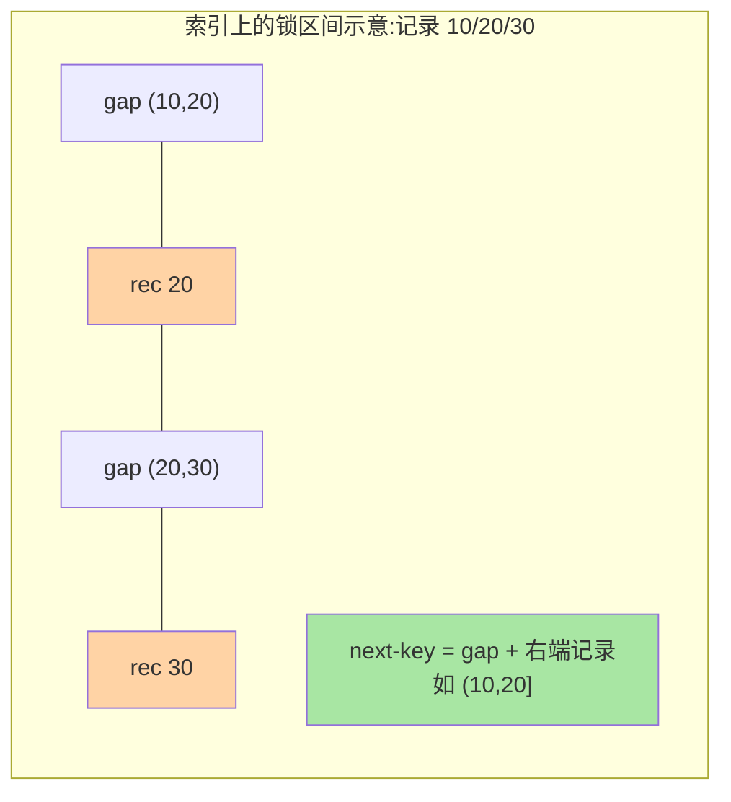

# 行锁与间隙锁：加锁规则的可推演化

> 「我明明只更新了一行，怎么锁住了半张表？」加锁不是玄学：InnoDB 的行锁加在**索引记录**上，RR 下还叠加间隙锁防插入。掌握一套加锁规则，任何 UPDATE/DELETE 的锁范围都能像做题一样推出来。

## 一句话摘要

InnoDB 的行锁不是加在「行」上，而是加在**索引记录**上：走哪个索引，就锁哪个索引的记录（二级索引命中还要回锁对应主键记录）。RR 隔离级别下，当前读按「记录锁 + 间隙锁（合成临键锁）」加锁，规则固定可推演；RC 下退化为纯记录锁。**锁范围 = 索引访问路径 × 隔离级别**，这就是全部公理。

## 🎯 本文核心

**核心一句话：锁范围 = 索引访问路径 × 隔离级别——锁加在索引记录上（不是行上），RR 下按「记录 + 间隙 = 临键锁」五条规则可推演，RC 下退化成纯记录锁；「我只改一行」的主观意图不决定锁范围，索引与级别才决定。**

机制链：锁在索引不在行 → 三种锁结构（记录/间隙/临键）→ 三条兼容规则（间隙彼此兼容、与插入意向冲突）→ 五条推演公理 → 完整推演示例（未命中等值的锁区间）→ 观测验证（data_locks）。全文是「公理 → 推演 → 实锤」的闭环：任何 UPDATE/DELETE 的锁范围都能像做题一样推出来、再用视图验证。

## 前置阅读

- 入门层篇 8《锁机制》：锁的分类与现象
- 本系列（事务与 MVCC）篇 1《隔离级别的实现路径》：当前读与快照读的分界

## 目标导向

本文是什么：InnoDB 行锁的加锁规则与推演方法。功能是什么：给定一条 UPDATE/DELETE 和索引结构，能推出锁了哪些区间。能得到什么：锁冲突排查有据、热点行设计有解、与 RC 取舍的依据。为什么用：并发更新抖动、锁等待堆积、扣减类热点设计，必看。

## 一、边界：入门层讲过什么，本文讲什么

| 内容 | 入门层 | 本文 |
|---|---|---|
| 共享锁/排他锁、乐观悲观的概念 | ✅ 讲过 | 不重复 |
| 锁在索引不在行 | 提了一句 | **本文核心一** |
| 记录/间隙/临键锁的加锁规则 | 未讲 | **本文核心二** |
| 死锁的产生与处理 | 未讲 | 本系列篇 2 |

## 二、行锁的本质：锁在索引记录上

InnoDB 的「行锁」官方名称是**索引记录锁**——锁的对象是索引项，不是行本身。由此推出一条最容易翻车的规则：**UPDATE/DELETE 的 WHERE 必须走索引，否则锁不住「目标行」，只能全表扫描并把扫过的记录全锁上**（近似表锁的效果，但仍是行锁机制）。

二级索引还有个二次加锁动作：命中二级索引记录后，**还要锁对应的聚簇索引记录**——因为回表修改发生在主键树上。所以二级索引条件更新的锁 = 二级索引项 + 主键索引项，两处都要等待。

## 三、三种锁结构：记录、间隙、临键

| 锁 | 锁什么 | 一句话 |
|---|---|---|
| 记录锁 Record Lock | 单条索引记录 | 锁「这一条」 |
| 间隙锁 Gap Lock | 记录之间的开区间 | 锁「这一段，不许插入」 |
| 临键锁 Next-Key Lock | 记录 + 前面的间隙（左开右闭） | RR 当前读的默认加锁单位 |



三条兼容规则决定并发行为：**间隙锁之间互相兼容**（两个事务可以同时锁同一段间隙）；**间隙锁与插入意向锁冲突**（插入要先拿到意向，间隙被占就等）；**记录锁之间按读写互斥**。第三条常识，前两条反直觉——「两个都只读不加行锁的事务因间隙互相卡住对方插入」正是死锁的经典土壤（篇 2 展开）。

## 四、加锁规则：一套可推演的公理

RR 下当前读（UPDATE/DELETE/`FOR UPDATE`）的加锁规则，按优先级推演：

```text
1. 等值条件 + 唯一索引，且命中        → 退化为纯记录锁（不锁间隙）
2. 等值条件，命中普通（二级）索引      → 临键锁(命中区间) + 对应主键记录锁
3. 等值条件，未命中（无论什么索引）    → 加到「所在区间的临键锁」，
                                       唯一索引时退化为纯间隙锁
4. 范围条件                          → 命中范围逐个临键锁 + 
                                       右边界之后一个间隙
5. 走不到索引                        → 每条扫过的记录都加临键锁
                                       （近似锁全表）
```

RC 下的规则瘦身成一条：**只有记录锁，没有间隙锁；等值未命中不加锁**。这也是 RC 并发更好的结构性原因（本系列 MVCC 篇 1 的结论在这里兑现）。

一个完整推演示例（RR，表上有主键 id，执行 `UPDATE t SET a=1 WHERE id=25`，25 不存在）：


推演法的好处是**可验证**：用两个会话手工复现锁等待（一个事务加锁、另一个做插入/更新看谁阻塞），`performance_schema.data_locks`（8.0）能看到每一把锁的类型与区间——规则与观测对上，才算真的会。

## 五、源码关键路径

以 8.0 主线口径（storage/innobase/lock/lock0lock.cc）：

- 加锁总入口：`lock_rec_lock()`——先乐观尝试（无冲突直接上锁），冲突进等待队列
- 插入检查：`lock_rec_insert_check_and_lock()`——插入前检查目标间隙的间隙锁与插入意向冲突，是间隙锁交互的核心
- 隔离级别判定：`lock_rec_request()` 族内按 `trx->isolation_level` 决定 next-key 还是纯记录锁
- 观测视图：`performance_schema.data_locks / data_lock_waits` 两表即源码锁结构的对外投影

阅读建议：拿着第四节的推演结果去 `data_locks` 里找对应行（`LOCK_TYPE=RECORD, LOCK_MODE` 区分 S/X/GAP），每个推演都有实锤。

## 典型场景

- **热点行扣减**：`UPDATE stock SET n=n-1 WHERE id=1` 高并发全在一条记录锁上排队——业内解法是拆桶（一行拆 N 行分摊锁）或转异步削峰，而不是调锁参数
- **状态机流转**：`UPDATE orders SET status='B' WHERE id=? AND status='A'`——等值唯一命中，纯记录锁，等待时间可控；条件带 status 走二级索引时锁翻倍，值不值得看并发量
- **批量删除**：`DELETE WHERE create_time < ?` 范围条件临键锁一路铺——业内默认按主键分批（每批千行级），把大范围锁切成小片

## 业内惯例

> 💡 **实战提示**
> - 写每条 UPDATE/DELETE 时先默问三连：走哪个索引？等值还是范围？会不会未命中？——三问答完锁范围就推完了
> - 双会话验证模板：A 会话 `BEGIN; UPDATE ...;` 不提交，B 会话查 `data_locks` 并尝试插入/更新——每个推演结论都要这样过一遍实锤
> - 批量删除按主键分批且批间 sleep：大范围临键锁切成小片，purge 也跟得上
> - 热点行监控加「单行更新等待」指标：`data_lock_waits` 里同一把记录锁的等待数即热点信号，比 CPU 先报警

- **互联网默认 RC 规避间隙锁**：与 MVCC 篇 1 的结论互为表里——并发写密集场景，间隙锁的插入阻塞代价常大于幻读风险
- **更新语句必带索引条件**：无索引 WHERE 在生产属事故级代码，代码评审的第一道红线
- **热点行拆桶是默认思路**：单行锁的物理上限无法靠参数突破，拆桶/合并写入/队列化三选一是业内通行的架构应对
- **用 data_locks 不用猜**：8.0 之后锁观测有现成视图，「感觉锁住了」一律查表确认，业内不再接受盲猜式排查

## 六、常见误区

- **「行锁不会锁全表」**：机制上不会，效果上会——无索引 WHERE 全扫全锁。锁的粒度由索引路径决定，不是由「我只改一行」的主观意图决定
- **「间隙锁是用来防读的」**：间隙锁不阻塞任何读（快照读无锁、当前读也不被 gap 挡），只阻塞**插入**。它的唯一使命是 RR 下防幻插入
- **「两个事务锁同一段间隙会互相等待」**：不会，间隙锁彼此兼容——死锁发生在「兼容的间隙锁 + 后续的插入意向冲突」组合里，这正是下一篇的主题
- **「主键条件一定只锁一条」**：等值命中才是；范围条件或未命中照样铺区间——「主键」不是免死金牌，「等值 + 唯一 + 命中」三件齐才是

## 七、与相邻机制的关系

- 事务与 MVCC 系列篇 1：快照读/当前读的分界决定了「要不要进本文的加锁规则」，两篇是一枚硬币的两面
- 本系列篇 2《死锁检测与处理》：间隙兼容 + 插入冲突是死锁高频剧本，处理与检测在那篇
- tips 互指：热点行拆桶背后的「分片思想」与 distributed-id、分库分表系列同源，不在此展开

## 你们可能会问

**Q1：怎么快速看到一条 UPDATE 到底锁了什么？**
双会话法：会话 A 开事务执行 UPDATE 不提交；会话 B 查 `performance_schema.data_locks`（8.0），每把锁的索引名、区间、模式一目了然，配合推演规则核对。

**Q2：SELECT FOR UPDATE 比先查后改好在哪？**
它是当前读 + 一把锁到事务结束，把「检查—修改」原子化；先查后改在两次交互之间数据可能已变，属于丢失更新的标准剧本。条件更新（WHERE 带旧值校验）是轻量替代。

**Q3：为什么感觉高并发下偶尔冒出神秘的超时？**
大概率是间隙锁与插入的隐式冲突或锁等待超时（`innodb_lock_wait_timeout` 默认 50 秒）兜底。查 `data_lock_waits` 与死锁日志（篇 2）能把「神秘」变成「有据」。

## 什么时候怎么选：锁面相关的选型速查

- **热点行扣减（秒杀/库存）**：选 RC + 拆桶/队列化——间隙锁在这类场景只有成本没有收益
- **状态机流转（订单状态）**：RR 默认即可——等值唯一命中纯记录锁，RR 不额外付费
- **批量删除/归档**：任一级别都按主键分批，选型重点是「分批」而不是级别
- **无特殊理由的默认**：跟全局级别走，单语句不单开特例——级别漂移比锁冲突更难排查

## 生产事故推演：热点行扣减的锁风暴

**场景**：某秒杀活动，库存表一行 `UPDATE stock SET n=n-1 WHERE id=1`，QPS 5000+，数据库 CPU 100%，大量事务超时。

**根因链路**：

1. 高并发全部更新同一行 → 同一把记录锁
2. 排队等待 → 锁等待队列堆积
3. `innodb_lock_wait_timeout`（默认 50s）超时 → 大批事务回滚
4. 业务层重试 → 锁竞争更激烈 → 恶性循环

**排查 SOP**：

```sql
-- 查当前锁等待
SELECT * FROM performance_schema.data_lock_waits;

-- 查正在持锁的事务
SELECT * FROM information_schema.innodb_trx
WHERE trx_rows_locked > 0;
```

**止血三步**：
1. 紧急：业务层限流（QPS 降至 500）+ 队列化
2. 短期：热点行拆桶（一行拆 N 行分摊锁）
3. 长期：异步削峰（消息队列串行化扣减）

**Trade-off**：拆桶增加应用复杂度，队列化增加延迟。互联网场景优先队列化（牺牲延迟换吞吐），金融场景优先拆桶（保持同步）。

## 八、自测三问

1. 行锁加在哪？二级索引条件更新会锁几处？
2. 记录锁、间隙锁、临键锁各锁什么？RR 下等值唯一命中为什么退化为记录锁？
3. 间隙锁之间兼容、与什么冲突？这条规则如何演变成死锁剧本？

## 开放问题

- 云原生分布式 MySQL（存算分离 + 多写节点）下，行锁要走分布式锁管理器，单机 next-key 语义的平移与代价各家实现差异明显，尚无统一范式。
- 热点行的「拆桶/队列化」仍是工程手段而非内核能力，内核级热点写入优化（组提交向单行聚合）是社区长期议题。

## 🎯 核心带走

- **核心一句话**：锁范围 = 索引访问路径 × 隔离级别；锁在索引记录上，RR 五条公理可推演，RC 退化为纯记录锁
- **机制链**：锁在索引 → 三种锁结构 → 兼容规则 → 五条推演公理 → 未命中案例 → data_locks 实锤
- **哪里会坏**：无索引 WHERE（近似锁全表）、未命中等值（锁住区间拦插入）、热点单行（锁队列堆积）
- **边界**：本篇给「加锁规则」；死锁的形成与检测在篇 2，锁的监控与等待链分析在篇 3

## 📌 数据与事实声明

- 写于 2026-09-08，加锁规则以 MySQL 8.0 InnoDB RR/RC 为基准；锁视图为 performance_schema.data_locks（8.0）
- 「等值唯一命中退化记录锁」等规则为官方文档口径的归纳；锁等待超时默认 50 秒
- 免责：具体行为以 dev.mysql.com 官方文档为准

## 📚 参考资料

| 类型 | 标题 | 来源 |
|---|---|---|
| 官方文档 | InnoDB Locking / Locks Set by Different SQL | dev.mysql.com/doc/refman/8.0/en/innodb-locking.html |
| 官方源码 | mysql/mysql-server（storage/innobase/lock/lock0lock.cc） | github.com/mysql/mysql-server |
| 原理书 | 《MySQL 技术内幕：InnoDB 存储引擎》姜承尧 | 公开出版 |
| 实战书 | 《高性能 MySQL（第 4 版）》锁与事务章 | 公开出版 |
