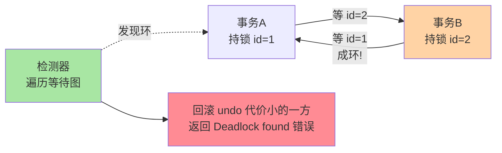

# 死锁检测与处理：从等待图到日志复盘

> 死锁不是「出了再救」，而是一套「检测—回滚—留证—预防」的闭环。这篇把 InnoDB 的主动检测机制、日志怎么读、经典死锁剧本（唯一键并发插入）怎么复现，一次讲全——热点行把检测关掉这种业内奇观也会讲清楚来龙去脉。

## 一句话摘要

InnoDB 用**等待图（wait-for graph）做主动死锁检测**：事务 A 等 B、B 又绕回等 A，成环即死锁，立刻选择回滚「undo 代价更小」的一方并写日志留证。**绝大多数死锁源于「加锁顺序不一致」与「间隙锁 + 插入意向」两个剧本**——修复靠统一顺序与事务瘦身，不靠重试硬扛。

## 🎯 本文核心

**核心一句话：InnoDB 对死锁的策略是「容忍发生 + 主动打断」——等待图成环即判死锁、回滚 undo 代价小的一方、日志留证；死锁剧本 90% 收敛为「加锁顺序不一致」与「间隙锁 + 插入意向」两类，修复改剧本而不是加重试。**

机制链：四条件的数据库化（循环等待是唯一可打断环节）→ 等待图检测与代价裁决 → 两个工程旋钮（detect 开关 / 超时兜底）→ 唯一键并发插入经典剧本 → 日志解读三步 → 预防三式。全文一句话可重构：「允许成环、快速打断、按剧本预防」。

## 前置阅读

- 本系列篇 1《行锁与间隙锁》：记录/间隙/临键锁与兼容规则——死锁剧本的全部素材
- 入门层篇 8《锁机制》：锁等待的基本现象

## 目标导向

本文是什么：死锁的产生条件、InnoDB 检测机制、日志解读与预防手法。功能是什么：把「神秘的超时/回滚」归因到具体剧本。能得到什么：读得懂 `LATEST DETECTED DEADLOCK`、知道热点行场景的检测开关取舍、拿到三套可落地的预防模式。为什么用：偶发回滚告警、高峰期更新抖动、唯一键并发写入设计，必看。

## 一、边界：入门层讲过什么，本文讲什么

| 内容 | 入门层 | 本文 |
|---|---|---|
| 死锁的概念与「死锁 vs 锁等待」区别 | ✅ 讲过 | 不重复 |
| 等待图与主动检测机制 | 未讲 | **本文核心一** |
| 日志解读与经典剧本复现 | 未讲 | **本文核心二** |
| 预防模式与热点行特殊处理 | 未讲 | **本文核心三** |

## 二、四个必要条件落到数据库语境

教科书四条件在 InnoDB 里的对应物：

| 教科书条件 | 数据库语境 | InnoDB 现实 |
|---|---|---|
| 互斥 | 记录锁排他 | 写锁天然互斥，不可消除 |
| 持有并等待 | 事务内多次加锁不释放 | 事务边界即锁边界，可缩小（瘦事务） |
| 不可剥夺 | 锁只能由持有者释放 | 同左，无抢占（区别于 DB2 类早期实现） |
| 循环等待 | 等待图成环 | **唯一可被系统打破的一环**——检测器盯的就是它 |

前三个条件在工程上只能「缓解」不能「消除」，所以 InnoDB 的策略是：**允许死锁发生，用主动检测快速成环判断、立刻打断**。这与「预防式锁排序」路线是两条哲学：检测型容忍死锁但保住并发，预防型消灭死锁但约束编程方式——InnoDB 选择了检测为主、预防靠开发者自觉。从检测实现的重构，到 5.7 引入 `innodb_deadlock_detect` 开关，这条演进线反映社区在「检测收益与检测开销」之间的长期权衡。

## 三、检测机制：等待图与代价选择

每个锁等待是一条边（A → B 表示 A 等 B 持有的锁）。加锁请求进等待队列时，InnoDB 沿这条边向深处做图搜索，**成环即死锁**。此刻做一次代价裁决：比较环上各事务的 undo/变更代价，回滚代价最小者（通常 `SHOW ENGINE INNODB STATUS` 日志会体现为「回滚了其中一个」），另一方继续执行。



两个工程参数：

- **`innodb_deadlock_detect`（默认 ON）**：高并发热点行场景，成百上千事务在同一条记录上排队，每次加锁都触发图搜索，检测本身的 CPU 开销会成为新瓶颈——业内确实存在「热点行关闭检测 + 靠 `innodb_lock_wait_timeout` 兜底」的取舍，前提是配合队列化/拆桶把并发降维
- **`innodb_lock_wait_timeout`（默认 50 秒）**：被动兜底，等不到就超时报错。关掉主动检测后，真死锁要等 50 秒才被拆——这就是「关闭检测必须配合架构手段」的原因

## 四、经典剧本一：唯一键并发插入

三个会话并发插入同一个不存在的唯一键，是生产最高频的死锁剧本，机制完全可推演：

```text
① A 插入 key=X：成功拿记录锁（未提交）
② B 插入 key=X：撞唯一键 → 等待 A（持有共享锁性质的等待）
③ C 插入 key=X：同样等待 A
④ A 回滚：释放后 B、C 同时获得锁——随即互相意识到
   对方也在插同一个键 → 循环等待成环 → 死锁，回滚其一
```

这个剧本的残忍之处在于**没有任何一条 UPDATE**，全是 INSERT——「我们只有插入不会有死锁」是最常见的误判。变体还包括：先删后插、`INSERT ... ON DUPLICATE KEY UPDATE` 高并发打同一键。缓解方向：唯一键前置校验 + 缓存预占、错峰写入、或把「同一业务键」的写入收敛到单点（队列/分区路由）——本质都是把「环」的机会拆掉。

## 五、日志解读：从 LATEST DETECTED DEADLOCK 里找真相

`SHOW ENGINE INNODB STATUS` 的死锁节固定结构：两个事务各自「持有哪些锁、在等哪把锁」，最后一行回滚了谁。解读三步：

1. **认事务**：两个事务各自执行的 SQL 是什么（日志原文给出）
2. **认锁**：`lock_mode X locks rec but not gap`（纯记录锁）与 `lock_mode X`（临键锁）/ `gap before rec`（间隙锁）——锁模式直接指向剧本类型
3. **认结论**：`WE ROLL BACK TRANSACTION (x)`——被回滚方是 undo 代价小者，与「谁先谁后」无关，别按时间线臆断

把检测到修复的完整闭环画出来，团队排障 SOP 可以直接对齐：


注意该日志只保留**最近一次**死锁；持续采集要么周期性抓取，要么开 `innodb_print_all_deadlocks` 把每次死锁都写进错误日志——业内默认在高并发库上常开，代价可忽略。

## 六、源码关键路径

以 8.0 主线口径（storage/innobase/lock/lock0lock.cc）：

- 等待入队即检测：`lock_rec_lock()` 冲突后 `lock_wait_suspend_thread()` 挂起并触发 `lock_deadlock_check_and_rollback()` 路径
- 图搜索：`DeadlockChecker` 类（8.0 重构后的实现）沿等待边 DFS，深度有上限（`LOCK_MAX_N_STEPS_IN_DEADLOCK_CHECK`），超限按「最老事务」裁决——防检测本身失控
- 留证：`lock_deadlock_notify()` 组装日志节 + 可选写入错误日志
- 兜底：超时路径由 `lock_wait_timeout` 在等待队列里倒计时

阅读建议：拿一段真实死锁日志反推 `DeadlockChecker` 的环路径，图与代码对照一次即可建立长期记忆。

## 典型场景

- **订单状态机高并发流转**：多个事务以不同顺序更新同一组订单行——统一按主键升序加锁（先锁小 id）即可消除环
- **库存扣减 + 流水插入**：先锁库存行再插流水，全部代码同一顺序——顺序不一致就是经典双表死锁
- **批量任务与在线流量交叉**：批量 UPDATE 按非主键顺序扫，与在线单行更新互锁——批量任务按主键排序分批是业内铁律，这类约束正是从无数次死锁复盘里演变出来的团队规范

## 什么时候动检测开关：决策依据

- **什么时候保持默认 ON**：一切非热点行场景——检测开销可忽略，快速打断是最优解
- **什么时候考虑 OFF**：仅当单行热点已排队成百上千、检测 CPU 开销成为新瓶颈，且已落地拆桶/队列化降维——OFF 是最后一步不是第一步
- **OFF 之后靠什么兜底**：`innodb_lock_wait_timeout` 调短（按业务 SLA 定，别留默认 50 秒）+ 应用层对超时报错重试
- **怎么选预防与重试**：剧本型死锁（顺序不一致）必须改代码；偶发型死锁配幂等重试即可——先归因再选手段

## 业内惯例

> 💡 **实战提示**
> - 高并发库默认开 `innodb_print_all_deadlocks`：日志只留最近一次太不够用，全量落错误日志的代价可忽略
> - 死锁告警关联发布事件：频次突变几乎总是新代码带进新剧本，按上线时间线归因最快
> - 复现死锁用三会话剧本模板：测试环境照第四节步骤可控重放，比线上等风来高效得多
> - 代码评审口令「事务里有没有第二个加锁点」：双表/双行异序加锁是环的主要产地

- **预防三式是代码评审标配**：①加锁顺序全局一致（按主键/约定列排序）；②事务瘦身（锁内只做必须的事，RPC 移出事务）；③索引到位（防无索引锁全表放大等待面）
- **重试要带幂等**：应用层对「Deadlock found」自动重试是常见做法，但必须幂等——重试不是修复，是止损
- **死锁日志纳入告警**：频次突变（例如从天级到分钟级）往往对应新代码上线，按发布事件关联归因是业内标准动作
- **热点行先降维再谈检测开关**：`innodb_deadlock_detect=OFF` 是拆桶/队列化之后的最后一步，单独关闭等于把 50 秒超时当死锁检测用

## 七、常见误区

- **「死锁了数据库会卡死」**：检测主动打断，业务感知是偶发报错不是卡死；真正卡死观感来自「关闭检测 + 超时兜底」组合下的长等待
- **「被回滚的是罪魁祸首」**：回滚选择基于 undo 代价，与业务对错无关。日志解读要按锁模式找剧本，不要按「谁被回滚」定责任
- **「只读事务不会进死锁」**：`FOR SHARE` 的读也是当前读加锁，一样参与成环；纯快照读不参与——分清两种「读」
- **「重试一次就没事」**：剧本型死锁（顺序不一致）重试大概率再撞，修复剧本才是正解；重试只对偶发型合理

## 八、与相邻机制的关系

- 本系列篇 1《行锁与间隙锁》：所有死锁剧本的锁素材（兼容规则、临键区间）在那篇
- 事务与 MVCC 系列篇 1：当前读/快照读分界决定谁参与死锁
- tips 互指：分布式锁、消息驱动的削峰队列与热点行降维同属「并发治理」话题，在 stability 域展开

## 你们可能会问

**Q1：怎么在测试环境稳定复现死锁？**
按第四节的唯一键剧本：三个会话开事务、按步骤插入同一键、手动控制提交/回滚节奏即可稳定复现；配合 `SHOW ENGINE INNODB STATUS` 观察每一环，比任何文档都直观。

**Q2：为什么 InnoDB 不像某些系统用「全局锁排序」根治死锁？**
锁排序把调度责任推给所有开发者，约束成本极高且伤害并发表达力；检测型把复杂度收进内核、把偶发回滚当正常代价——海量并发场景下这是更便宜的取舍，但要求团队会用日志与预防三式兜底。

**Q3：检测开着也没报死锁，但锁等待很高，是什么？**
那不是死锁是**长事务持锁**：环没成，但某事务拿锁后慢慢悠悠，全员排队。查 `data_lock_waits` 找队头持锁人，配合 `innodb_trx` 看事务时长——与死锁是两套病因两套药。

## 九、自测三问

1. 四个死锁必要条件里，InnoDB 的检测器打破的是哪一个？怎么打破？
2. 复述唯一键并发插入死锁的四步剧本，它为什么在纯 INSERT 场景也能发生？
3. `innodb_deadlock_detect=OFF` 的适用前提与兜底机制分别是什么？

## 开放问题

- 分布式数据库把等待图跨节点展开，死锁检测需要全局事务协调器介入，检测时效性与开销的平衡各家实现差异大，尚无收敛标准。
- 热点行的内核级解决方案（单行组提交、写合并）一旦随内核演进成熟，「关检测 + 拆桶」这套民间偏方或将退役，值得持续跟踪。

## 🎯 核心带走

- **核心一句话**：死锁策略 = 容忍发生 + 等待图主动打断 + 回滚代价小方 + 日志留证；两类剧本（异序、间隙+插入）覆盖九成现场
- **机制链**：四条件数据库化 → 等待图检测 → 代价裁决 → 两个旋钮 → 唯一键剧本 → 日志三步 → 预防三式
- **哪里会坏**：纯 INSERT 场景的唯一键环、关检测后 50 秒超时兜底卡死观感、重试不幂等放大问题
- **边界**：本篇管「成环之后」；锁的加锁规则（环的素材）在篇 1，锁等待链监控在篇 3

## 📌 数据与事实声明

- 写于 2026-09-08，机制以 MySQL 8.0 InnoDB 为基准；检测开关与超时默认值（ON / 50s）为官方默认
- 唯一键并发插入死锁为公开社区与官方文档均收录的经典案例口径
- 免责：参数与行为以 dev.mysql.com 官方文档为准

## 📚 参考资料

| 类型 | 标题 | 来源 |
|---|---|---|
| 官方文档 | InnoDB Deadlock Detection / Deadlocks | dev.mysql.com/doc/refman/8.0/en/innodb-deadlocks.html |
| 官方源码 | mysql/mysql-server（storage/innobase/lock/lock0deadlock.cc） | github.com/mysql/mysql-server |
| 原理书 | 《MySQL 技术内幕：InnoDB 存储引擎》姜承尧 | 公开出版 |
| 实战书 | 《高性能 MySQL（第 4 版）》锁章 | 公开出版 |
