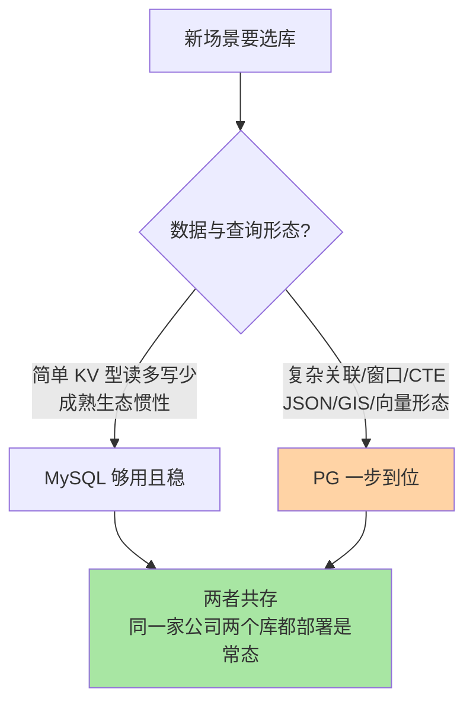

# PostgreSQL 是什么与全景：从定位到选型的第一张地图

> 一句话：PostgreSQL 是「对象-关系型」开源数据库，官方口径自称「世界上最先进的开源关系型数据库」——本系列假设你已熟悉 MySQL（本库 MySQL 系列共 59 篇是读者的既有基线），所以篇篇对标讲差异：这篇先给全景地图，后面三篇分别拆进程与存储、MVCC 与索引、JSONB 与生态。

## 🎯 本文核心

**核心一句话：PostgreSQL 与 MySQL 同属开源关系型数据库，但设计哲学相反——MySQL 把「简单场景做到极致」（互联网 LAMP 基因，单机读多写少优先），PG 把「完备性与扩展性做到极致」（学术基因，复杂 SQL、数据类型、扩展插件全都要），企业选它做第二数据库，本质是为「复杂形态的数据与查询」买一份保险。**

组织主线（全系列锚点图，一张图看懂本系列）：

本篇回答「是什么、为什么选、与 MySQL 差在哪」；后续三篇全部挂在这张图的 B/C/D 三个节点上，逐个机制与 MySQL 对照着讲。

## 一句话摘要

PostgreSQL 起源于加州大学伯克利分校的 POSTGRES 研究项目（1970 年代末 Ingres 项目之后，由 Michael Stonebraker 主导，公开口径），1996 年改名 PostgreSQL 并加入 SQL 支持。它采用类 BSD 的宽松许可证（PostgreSQL License），单一内核统一承载关系、JSON、地理、全文、向量等数据形态，扩展插件（CREATE EXTENSION）是它的招牌能力。与 MySQL 相比：MySQL 赢在互联网时代的简单读多写少场景与成熟生态惯性，PG 赢在 SQL 标准兼容度、复杂查询优化器、数据类型完备性与扩展生态——这决定了两者的典型分工：MySQL 当主库扛交易主链路，PG 做第二数据库承接分析查询、混合数据形态与新业务探索。

## 5W 速记卡

| 维度 | 一句话 |
|---|---|
| What | 对象-关系型开源数据库：完备 SQL + 丰富类型 + 扩展插件生态 |
| Why | 复杂查询/混合数据形态/标准兼容是 MySQL 的短板，PG 正好补位 |
| When | 新业务探索、分析型查询、GIS/JSON/向量等特殊形态；交易主链路迁移动作要谨慎 |
| Where | 单一进程体系 + 统一存储引擎 + 系统目录（catalog），无插件式多引擎 |
| How | 学差异：进程模型 → MVCC/VACUUM → 索引家族 → JSONB 与扩展，四步对照 MySQL 走 |

## 一、为什么需要认识 PostgreSQL：第二数据库是常态而非折腾

过去 5 年（2021-2026，公开口径）企业数据基础设施有一个明显演进：很少再有团队讨论「要不要引入第二数据库」，讨论的变成「第二数据库选谁」。原因有三条，每一条都指向 MySQL 的真实边界：

1. **数据形态变复杂了**：订单里塞着动态属性（商品参数/营销标签），MySQL 用 VARCHAR 存 JSON 字符串，查询与索引都别扭——PG 的 JSONB 类型从存储层就是一等公民（第 4 篇专讲）。
2. **分析查询变多了**：运营后台要的多表关联 + 窗口函数 + CTE 递归，MySQL 的优化器在复杂查询上历史上偏弱（8.0 起补齐了一部分，业内认知），PG 的优化器一直以复杂查询见长。
3. **新形态轮番出现**：地理围栏要 GIS、语义检索要向量——PostGIS 与 pgvector 让 PG 一个内核接住这些形态（第 4 篇专讲），不用为一个中等规模的场景再维护一套专用系统。

**设计思想就藏在许可证里**：PG 采用极宽松的 PostgreSQL License（类 BSD，无商用限制），衍生产品与云服务可以自由构建——这是它生态扩散的法律底座，也是「社区驱动、厂商中立」这个定位的根源。

## 二、2026 视角：挑战 MySQL 的趋势从何而来

三条公开口径的趋势线（数据截至 2026-09，均为公开报道口径，非精确统计）：

- **流行度榜单**：DB-Engines 总榜上 PostgreSQL 多年稳居前四，与 MySQL 的分差逐年收窄；Stack Overflow 年度开发者调查中，PostgreSQL 在「最常用数据库」选项上 2023 年起已越过 MySQL 位居前列（公开口径）。
- **版本节奏**：自 PG 10（2017）起每年一个大版本，2025 年发布 PG 18——十年前「保守缓慢」的刻板印象已被稳定的年度演进取代。
- **生态迁移**：传统商业数据库的用户向开源迁移时，PG 是最常见的落点之一（公开报道口径）；多家云厂商把 PG 兼容作为托管数据库的标配能力。

**追问：既然趋势这么猛，为什么不直接把主库从 MySQL 换成 PG？**
反方案的代价常被低估：迁移不是「语法翻译」——连接池模型（进程 vs 线程）、复制体系（WAL vs binlog）、运维工具链、团队心智全是重写项。业内认知：大部分「PG 替换 MySQL」的成功案例发生在**新业务**，而不是存量交易主链路的硬切换。趋势归趋势，决策看场景——这正是本篇给「第二数据库」定位的原因。

**再追问：那 PG 有没有可能像传闻一样彻底取代 MySQL？**
打破砂锅问到底的答案是：两边的存亡都不取决于功能清单，取决于存量。MySQL 的存量部署与人才供给仍是巨量（公开认知），PG 的增长更多来自「新增份额的分配变化」——新项目里 PG 的首选率在上升（公开口径）。取代论是流量叙事，替代边界才是工程判断。

## 三、与 MySQL 的定位区别：两套设计哲学

这对概念最容易被混为一谈——都是开源关系型、都支持 ACID、语法七成相似，但底层取舍方向相反：

| 维度 | PostgreSQL | MySQL（InnoDB） |
|---|---|---|
| 出身基因 | 伯克利研究项目，学术完备性优先 | 网络公司实用主义，简单场景优先 |
| 连接模型 | 每连接一进程（第 2 篇详讲） | 每连接一线程 |
| 存储引擎 | 单一统一引擎 | 插件式多引擎（InnoDB 为默认） |
| 复制日志 | 一个 WAL 通吃（redo + binlog 职责合一） | 引擎 redo + 服务层 binlog 双日志 |
| 版本管理 | 多版本存表内，VACUUM 回收 | 多版本在 undo log，purge 回收 |
| 索引家族 | B-tree/GIN/GiST/BRIN/Hash 多家族 | InnoDB 主力 B+tree，辅以全文/空间 |
| 类型与扩展 | 类型丰富 + CREATE EXTENSION | 类型常规 + 插件生态偏运维侧 |

一句话记忆：**MySQL 是「把 80% 的简单场景做到极致顺手」，PG 是「把 100% 的 SQL 能力都给到你」**——简单场景两者没有可感知差距，复杂场景才是分水岭。

## 四、典型使用场景

- **企业第二数据库/新业务探索**：表结构频繁演进的业务（PG 的 ALTER 能力与类型系统更从容），或直接吃 PG 生态红利的场景。
- **分析型与报表查询**：多表关联、窗口函数、CTE 递归、物化视图——读端复杂查询是 PG 优化器的传统强项。
- **混合数据形态**：JSONB 动态属性 + 关系字段混存（商品/风控画像类数据），第 4 篇展开。
- **地理与空间**：PostGIS 是开源 GIS 领域事实标准之一（公开口径），覆盖投影、拓扑、路径分析。
- **AI 时代的向量检索**：pgvector 让中等规模（十万到千万级向量）的语义检索不必引入专用向量库——量级再上一个台阶（亿级、高 QPS）时才必须评估专用系统。
- **量级分界一句话**：十万级数据量两类库体感无差；千万级起 PG 的复杂查询能力与 JSONB 开始拉开可感知的差距；亿级以上两者都进入分片/专用化讨论，选型的重心从「哪个库」变成「怎么拆」。

> 💡 **实战提示**
> - 💡 评估 PG 别只看语法兼容表：先跑一遍真实业务 Top 20 慢查询在两边优化器下的执行计划对比，差距会直接暴露在哪一侧——这是成本最低的选型证据
> - 💡 引入第二数据库先想清楚「谁来运维」：备份、监控、参数基线、故障演练是一整套能力，没有运维归属的第二数据库等于埋雷
> - 💡 用「数据形态」而不是「流行度」做决策：JSON/GIS/向量形态选 PG 收益立竿见影；纯交易表迁移 PG 收益模糊而风险具体

## 五、常见误区与代价

- **误区一：把 PG 当「功能更强的 MySQL」直接平迁**。连接模型（每连接一进程）在几百个直连下就可能被内存吃穿（第 2 篇详讲），不配连接池直接上线是经典翻车形态——代价是内存耗尽与性能雪崩。
- **误区二：以为 VACUUM 可以不关心**。PG 的多版本回收是显式机制（第 3 篇详讲），长事务 + 高频更新的表会表膨胀，线上排查过公开社区常见的同款案例：报表长事务挂了 6 小时，订单表膨胀 3 倍，复盘结论是长事务监控缺失。
- **误区三：流行度榜单当选型依据**。榜单反映关注度不反映适配度——拿榜单给交易主链路换库，代价是一次高风险迁移换不来可感知收益。
- **误区四：单一引擎=能力弱**。PG 没有插件式多引擎是设计取舍：单一引擎换来「所有特性在一个体系内自洽」（优化器、复制、备份全部围绕同一套存储机制），这是它复杂查询强的底层原理之一，不是短板。

## 六、你们可能会问

**Q1：MySQL 会的人学 PG，要重学多少？**
SQL 层七成通用，剩下三成才是价值所在：进程/连接模型、MVCC 与 VACUUM、索引家族、JSONB 与扩展——本系列 4 篇就是按这四步组织的，每篇都从「MySQL 里你熟悉的对应物」出发讲差异。方向是「对照迁移」，不是「从零学起」。

**Q2：为什么官方敢自称「最先进的开源关系型数据库」？**
这是官网自述的定位口径（公开口径），支撑点主要是：SQL 标准兼容度高、类型系统完备、可扩展框架（类型/操作符/索引方法都可插件化）、科研出身带来的机制完备性。当成定位宣言理解即可——「先进」不等于「对你的场景更合适」。

**Q3：PG 和 MySQL 可以共用一套连接池/中间件吗？**
协议层不通（PG 用自有线协议，MySQL 用另一套），主流连接池与代理都是各配各的（业内认知）。共用的是上游：应用 ORM 层大多双兼容，这也是「双库共存」在工程上可行的原因——应用层抽象屏蔽方言差异。

## 七、什么时候用/不用与 Trade-off

| 场景 | 推荐 | 不推荐 |
|---|---|---|
| 新业务 + 动态 schema | PG（JSONB + 类型系统） | 平迁思维硬搬 MySQL 习惯 |
| 存量 MySQL 交易主链路 | 维持 MySQL + 治理优化 | 为趋势硬切换 |
| 复杂分析/报表读端 | PG 或专用 OLAP（量级决定） | 在交易主库上硬扛大报表 |
| 团队零 PG 运维经验 | 先非核心场景试点 | 直接当主库上生产 |

Trade-off 的取舍锚点是**收益可见度与迁移风险的比值**：PG 对「复杂形态」的收益立竿见影，对「简单形态」的收益趋近于零；而引入第二数据库的风险（运维体系、人才储备、双栈心智）是固定成本。收益高时固定成本可忽略，收益低时固定成本就是全部——所以本篇的结论不是「PG 好还是 MySQL 好」，是「你的场景站在分水岭的哪一侧」。

## 开放问题

- 云托管数据库把「PG 兼容」变成商品能力后，社区版与云版的特性边界会怎么演进，值得持续观察
- 多模合一（关系+JSON+向量一个内核）与专用系统专项优化，哪条路线在十年后胜出，目前没有定论——量级与成本结构可能才是最终裁判

## 🎯 核心带走

- **核心一句话**：PG = 学术完备性路线的关系型数据库——完备 SQL、丰富类型、扩展生态；MySQL = 实用主义路线——简单场景极致顺手；第二数据库选 PG 本质是给「复杂形态」买保险
- **趋势口径**：榜单收窄与调查反超是公开口径的增量信号，替代边界在「新增业务」而非「存量硬切换」
- **哪里会破**：不配连接池直连上生产、无视 VACUUM 的表膨胀、拿流行度当选型依据
- **取舍锚点**：数据形态复杂度决定收益，运维固定成本决定门槛——分水岭在复杂场景

## 自测三问

1. PG 与 MySQL 的设计哲学差异一句话是什么？——答出「完备性 vs 简单场景极致」算过。
2. 为什么企业普遍选 PG 做第二数据库而不是直接替换主库？——答出「迁移风险固定成本 + 收益集中在复杂形态」算过。
3. PG 单一存储引擎是短板还是取舍？为什么？——答出「换来体系自洽与优化器能力」算过。

## 📌 数据与事实声明

- 写于 2026-09-24，版本基线以 PG 近年稳定版（官方年度大版本节奏）与 MySQL 8.0 为准，细节以 postgresql.org 与 dev.mysql.com 官方文档为准
- 历史沿革（伯克利 POSTGRES 项目、1996 年更名）为公开史实口径；流行度趋势（DB-Engines、Stack Overflow 年度调查）为公开报道口径，数据截至 2026-09，非精确统计
- 量级体感（十万/千万/亿级）为业内认知，非基准测试结论
- 误区案例为公开技术社区常见问题模式的匿名化复述，不指向任何特定公司

## 📚 参考资料

| 类型 | 标题 | 来源 |
|---|---|---|
| 官方文档 | PostgreSQL 官网与 About 页（定位口径） | postgresql.org/about/ |
| 官方文档 | PostgreSQL 版本发布策略 | postgresql.org/docs/ |
| 公开口径 | DB-Engines Ranking（流行度趋势） | db-engines.com/en/ranking |
| 公开口径 | Stack Overflow Annual Developer Survey | survey.stackoverflow.co/ |
| 系列内链 | 进程模型与存储架构（MySQL 对照） | [2_进程模型与存储架构-入门.md](2_进程模型与存储架构-入门.md) |
| 系列内链 | MySQL 架构与一条 SQL 的一生 | [../../../mysql/入门层/从零开始认识MySQL系列/1_MySQL架构与一条SQL的一生-入门.md](../../../mysql/入门层/从零开始认识MySQL系列/1_MySQL架构与一条SQL的一生-入门.md) |
