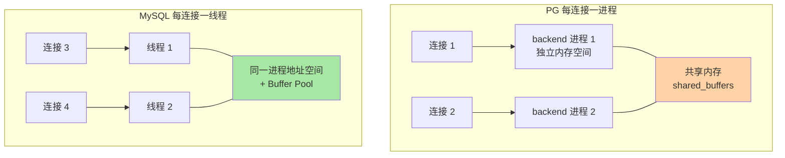
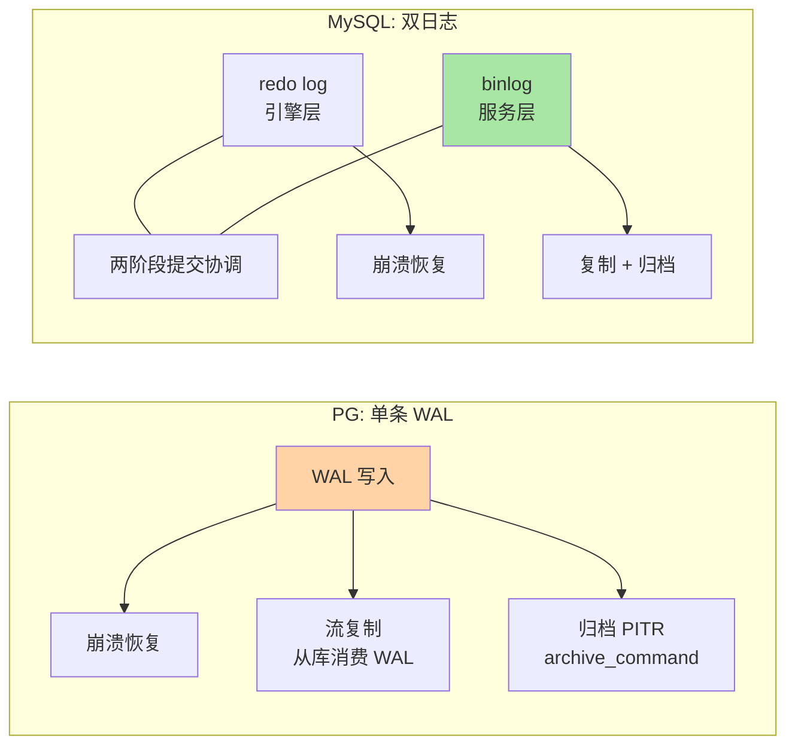

# 进程模型与存储架构：从 MySQL 线程到 PG 进程

> 一句话：PG 每个连接 fork 一个后端进程，MySQL 每个连接一个线程——这一字之差决定了连接数上限、内存模型与连接池策略的全部差异；存储侧 PG 用「单引擎 + 8KB 页 + 1GB 段文件 + 一条 WAL 通吃」对应 MySQL 的「多引擎 + 16KB 页 + redo/binlog 双日志」。

## 🎯 本文核心

**核心一句话：PG 的架构选择是「重进程、单引擎、单日志」——每个连接独享一个操作系统进程（隔离强、成本高，所以必须配连接池），一张表对应可切段的物理文件（8KB 页），一条 WAL 同时承担崩溃恢复与复制职责（对应 MySQL 的 redo + binlog 双日志）；理解这三件套，后面所有机制篇都能挂到正确的底层位置上。**

组织主线（本篇锚点图，一张图看懂三层结构）：


连接模型是「上边界」（能扛多少连接），存储布局是「下边界」（数据怎么落盘），WAL 是「中间的写路径」（怎么保证不丢）——三层串起来就是 PG 实例的完整骨架。

## 一句话摘要

PG 采用「每连接一进程」模型：主进程 postmaster 监听端口，每个客户端连接 fork 一个独立后端进程（backend），进程间通过共享内存（shared_buffers 等）协作——隔离性好（一个连接崩溃不拖垮实例），但进程创建与内存占用成本高于线程，因此生产环境标配外部连接池（PgBouncer 等，公开口径）。存储侧，每张表对应 base 目录下的一组文件，单个文件上限 1GB 自动切段，页大小固定 8KB（InnoDB 是 16KB）；超大字段走 TOAST 机制单独存储。日志侧，PG 只有一条 WAL：它同时是崩溃恢复日志（对应 InnoDB redo）和复制/归档日志（对应 binlog）——MySQL 是「引擎层 redo + 服务层 binlog」双日志体系，PG 把两份职责合并成一份，换来的是复制与恢复语义的天然一致。

## 5W 速记卡

| 维度 | 一句话 |
|---|---|
| What | 每连接一进程 + 8KB 页/1GB 段文件 + 单条 WAL 的三层架构 |
| Why | 进程隔离换稳定性，单引擎单日志换语义一致性——重进程重隔离的学术取舍 |
| When | 上生产前必配连接池；容量规划先算 max_connections 的内存账 |
| Where | PGDATA/base 下按 OID 组织的表文件 + pg_wal 目录 |
| How | 对照 MySQL：线程→进程、16KB 页→8KB 页、redo+binlog→单 WAL |

## 一、连接模型：每连接一进程 vs 每连接一线程

四要素对着看，差异立刻具体：

| 要素 | PostgreSQL | MySQL |
|---|---|---|
| 单位 | 进程（fork） | 线程 |
| 默认连接上限 | max_connections = 100（公开口径默认值） | max_connections = 151（公开口径默认值） |
| 单连接基础成本 | 数 MB 起，随 work_mem 翻倍（业内认知） | 线程栈 + 少量结构，约数百 KB 量级（业内认知） |
| 隔离性 | 进程级：连接崩溃不影响实例 | 线程级：共享地址空间 |



**追问：为什么 PG 敢用「更贵」的进程模型？**
设计哲学层面：进程隔离换来的稳定性是数据库最贵的品质——内存越界、野指针这类 bug 被操作系统边界挡住，坏一个连接不至于坏一个实例。MySQL 的线程模型换来的是轻量与高并发承载能力。两者都成立，取决于你更怕什么：PG 更怕「一个连接污染全局」，MySQL 更怕「连接成本吃掉容量」。

**再追问：那 PG 生产环境到底能开多少连接？**
业内认知的常见口径：几百个直连后端进程就可能让内存吃紧（每个活跃连接的排序/哈希都会申请 work_mem，默认 4MB，注意它是「每个排序节点」的预算而不是连接总额）。所以标配是连接池前置：应用连池，池以几十个真实连接服务几百上千个会话——事务模式（transaction pooling）收益最大，但要留意会话级特性（如 prepared statement、advisory lock）在池化后的兼容性（业内认知）。

## 二、存储布局：表文件、段与页

PG 数据目录下，每张表是 base/<数据库 OID>/<表 OID> 的一组文件，四要素具体值：

1. **页大小 8KB**（BLCKSZ，编译期常量，不可运行时改）——InnoDB 默认 16KB；页越小，单页锁定的 IO 粒度越细，全页写（full_page_writes）的开销面也相应变化。
2. **段大小 1GB**：单张表的文件超过 1GB 自动切为 `<oid>.1`、`<oid>.2`……对应 MySQL 单表一个 .ibd（innodb_file_per_table=on 时）的形态。
3. **空闲空间映射（FSM）与可见性映射（VM）**：FSM 记录页内空闲位置加速插入定位；VM 标记「全可见」页，加速全表扫描与 VACUUM（第 3 篇会用到）——这两个辅助文件是 MySQL 没有的独立结构。
4. **TOAST**：超长字段（单行超页大小约 2KB 就可能触发，业内认知）压缩后切到独立的 TOAST 表——MySQL 行溢出走溢出页，仍在同一表空间内。

```sql
-- 查一张表真实对应的物理文件路径与大小
SELECT pg_relation_filepath('orders'), pg_size_pretty(pg_total_relation_size('orders'));
-- 典型输出形态: base/16384/24576
```

```bash
# 到数据目录看切段效果（1GB 一个文件）
ls -lh $PGDATA/base/16384/ | head
# 24576   1.0G ...    24576.1  512M ...
```

**设计思想**：表定义与物理文件都登记在系统目录（pg_class/pg_attribute 等系统表）里，而系统目录本身就是普通表——你可以用 SQL 查询数据库自己的元数据。这套「自描述」设计是 PG 可扩展性的底层原理之一：扩展插件登记自己的元信息，走的也是同一套目录机制。

## 三、WAL：一条日志对应 MySQL 的两份职责

MySQL 的写路径是双日志：InnoDB 引擎层 redo log（崩溃恢复）+ 服务层 binlog（复制与归档），两份日志之间靠两阶段提交保证一致（本库 MySQL 系列日志三件套篇已详讲）。PG 把两份职责合并成一条 WAL：



| 对照点 | PG WAL | MySQL |
|---|---|---|
| 职责 | 恢复 + 复制 + 归档三合一 | redo 管恢复，binlog 管复制/归档 |
| 复制载体 | 从库直接消费 WAL 流 | 从库拉取 binlog 重放 |
| 关键参数 | wal_level（replica/logical） | innodb_redo 容量 + binlog_format |
| 刷盘控制 | synchronous_commit | innodb_flush_log_at_trx_commit + sync_binlog |

**追问：单日志省掉了双日志的一致性协调，为什么 MySQL 不这么设计？**
答案是历史与引擎插件制的分层：MySQL 引擎可替换（InnoDB/MyISAM…），binlog 必须放在服务层才能对任何引擎生效——于是服务层与引擎层各有一条日志，靠内部 XA 协调。PG 没有插件式引擎，存储与日志天然一体，单条 WAL 是「单一引擎」这个决定（第 1 篇讲过的取舍）在日志层的直接推论。**不是谁更先进，是分层约束不同。**

线上排查过一则公开社区常见同款案例：PG 从库延迟忽高忽低，排查半天发现应用在跑大批量更新，主库每提交一个事务刷一次 WAL（synchronous_commit=on）没问题，但从库重放单线程追不上批量写入——复盘结论：大批量作业挪到低峰 + 拆小事务，复制延迟随之收敛。这类「写放大在主库、延迟爆在从库」的形态，PG 与 MySQL 同款。

## 四、内存三件套与参数直觉

PG 内存分两层，对照 MySQL 记忆：

- **共享层（实例级，预分配）**：shared_buffers（默认 128MB，生产常见按总内存 1/4 起步调，业内认知）对应 MySQL 的 Buffer Pool；WAL buffers 对应 redo buffer。
- **私有层（连接级，按需申请）**：work_mem（排序/哈希预算，默认 4MB）、maintenance_work_mem（VACUUM/建索引预算，默认 64MB）——这一层是 PG 特有的心智模型：**MySQL 的排序缓冲随连接会话分配但规模小，PG 的 work_mem 是「每节点」预算**，一个复杂查询里多个排序节点各自申请，10 个连接跑复杂报表的内存峰值 = 连接数 × 节点数 × work_mem，这是容量规划最常算错的一笔账。

> 💡 **实战提示**
> - 💡 max_connections 别拍脑袋调大：先用「连接数 ×（基础 MB + work_mem × 查询节点数）」粗算内存上界，再决定是调参数还是上连接池——调大 max_connections 掩盖问题的方式是把崩溃延后
> - 💡 pg_stat_activity 是连接问题的第一现场：查谁在耗连接、谁的查询在跑多久，对应 MySQL 的 SHOW PROCESSLIST
> - 💡 表膨胀排查先看物理文件数与大小：pg_relation_filepath 看切段数量，段文件异常多就是膨胀信号，对应 MySQL 看 .ibd 体积与 information_schema 表统计

## 五、与 MySQL 的区别速查：一张表对齐

| 维度 | PostgreSQL | MySQL |
|---|---|---|
| 连接单位 | 进程（重、隔离强） | 线程（轻、共享空间） |
| 连接池 | 外置刚需（PgBouncer 等） | 常配但非生存必需 |
| 页大小 | 8KB 固定 | 16KB 默认（可配） |
| 表文件 | 1GB 自动切段 | 单表空间文件 |
| 大字段 | TOAST 独立表 | 溢出页 |
| 日志 | 单 WAL 三职责 | redo + binlog 双日志 + 内部 XA |
| 元数据 | 系统目录是普通表可 SQL 查询 | information_schema 虚拟化视图 |

## 六、常见误区与代价

- **误区一：像 MySQL 一样把 max_connections 调到几千**。进程模型下这是直接给 OOM 排队——代价是实例内存耗尽被系统杀进程，比连接被拒绝严重得多。
- **误区二：把 work_mem 当连接总额预算**。它是每排序/哈希节点的预算，复杂报表 × 多连接的乘积效应让实际内存远超直觉——线上排查过同款案例：默认参数下 8 个分析查询并行把内存打穿，复盘后按节点数重算了预算。
- **误区三：以为 8KB 页意味着 PG IO 更差**。页大小影响的是 IO 粒度与全页写开销的平衡，不是性能标签——优化器与索引形态（第 3 篇）对查询速度的影响比页大小大一个量级（业内认知）。
- **误区四：把 WAL 当 binlog 等价物直接照搬运维习惯**。binlog 的格式（row/statement）概念在 WAL 里不存在，逻辑复制要走 wal_level=logical + 发布订阅机制——照搬 MySQL 复制运维手册会找不到对应开关。

## 七、你们可能会问

**Q1：连接池会不会丢掉会话级状态？**
事务模式（transaction pooling）下，同一会话的前后两条语句可能落在不同后端进程上——prepared statement、SET 会话变量、advisory lock 这类会话级特性会失效或串位（业内认知）。对策：需要会话级特性的连接走会话模式池，普通连接走事务模式；新版本生态对协议级 prepared statement 的支持在持续改善（以官方文档为准）。

**Q2：8KB 页能不能改成 16KB 对齐 MySQL？**
不能运行时改，BLCKSZ 是编译期常量——这也是一个信号：PG 的调优空间在「怎么用好 8KB 页」（VM、fillfactor、TOAST 策略），而不在改页大小。MySQL 的 innodb_page_size 同样建议不动默认值（业内认知），两边在这个问题上殊途同归。

**Q3：WAL 会不会像 binlog 一样撑爆磁盘？**
会，所以要管 pg_wal 目录：检查点（checkpoint）推进后旧 WAL 可循环复用；归档场景靠 archive_command 把 WAL 拷走后再清理。监控上盯「pg_wal 目录体积」这一项，超过阈值告警——对应 MySQL 盯 binlog 空间与 expire_logs_days 的习惯。

## 八、什么时候用/不用与 Trade-off

| 场景 | 推荐 | 不推荐 |
|---|---|---|
| 高并发短连接业务 | 连接池 + 事务模式（PG 刚需） | 裸连 max_connections 硬扛 |
| 大批量离线作业 | 低峰 + 拆小事务 | 高峰大事务直打主库 |
| 内存容量规划 | 按节点数 × work_mem 算上界 | 只按连接数 × 单值估算 |
| 复制延迟敏感 | 盯 WAL 重放滞后指标 | 照搬 MySQL 延迟治理开关 |

Trade-off 的锚点是**隔离成本与并发容量**：进程模型用内存与创建成本换隔离稳定性，线程模型用共享风险换轻量——PG 侧的解法是「连接池把进程成本摊薄」，MySQL 侧的解法是「线程池插件把线程收益放大」。两边的工程结论一致：**连接治理是各自架构下的第一课，谁也别裸奔**。量级分界一句话：十万级以内日活、几十个连接的应用，两边默认参数都够；百万级连接型业务（如长连接推送），PG 必须池化、MySQL 也到了要线程池与拆分的量级。

## 开放问题

- 云托管 PG 把连接池做成网关内置能力后，「应用直连 + 平台池化」与「应用自管池」的边界怎么划分，仍无定论
- 异步 IO 与 io_uring 等新内核能力进入 PG 后（近年版本在演进，公开口径），进程模型与线程模型的成本差会不会被硬件层抹平，值得跟踪

## 🎯 核心带走

- **核心一句话**：PG = 重进程（每连接一进程→连接池刚需）+ 单引擎（8KB 页/1GB 段/TOAST）+ 单 WAL（恢复/复制/归档三合一）；MySQL = 轻线程 + 多引擎 + 双日志——三组对照记住骨架
- **最小动作集**：上连接池、算 work_mem 内存账、盯 pg_wal 磁盘、用 pg_stat_activity 看现场
- **哪里会破**：max_connections 拍脑袋调大、work_mem 乘积效应没算、大批量作业打穿复制
- **取舍锚点**：隔离换成本、单日志换一致性——两个架构都自洽，错的是把一边的运维直觉原样搬到另一边

## 自测三问

1. PG 为什么必须外置连接池，MySQL 为什么不是刚需？——答出「进程 vs 线程的成本差」算过。
2. PG 的一条 WAL 对应 MySQL 哪两份日志？为什么 MySQL 需要两份？——答出「redo+binlog 与引擎插件分层」算过。
3. work_mem 的预算单位是什么？容量规划怎么算？——答出「每排序/哈希节点 × 连接数」算过。

## 📌 数据与事实声明

- 写于 2026-09-24，参数默认值（max_connections、shared_buffers、work_mem 等）以 PostgreSQL 官方文档当前默认口径为准
- MySQL 对照参数（线程模型、innodb_page_size、redo/binlog 体系）以 dev.mysql.com 官方文档为准
- 内存成本量级、连接数经验口径均为业内认知，非基准测试结论
- 排查案例为公开技术社区常见问题模式的匿名化复述，不指向任何特定公司

## 📚 参考资料

| 类型 | 标题 | 来源 |
|---|---|---|
| 官方文档 | PostgreSQL: Server Configuration（max_connections/work_mem 等） | postgresql.org/docs/ |
| 官方文档 | PostgreSQL: Database Physical Storage（页/段/FSM/VM/TOAST） | postgresql.org/docs/ |
| 官方文档 | PostgreSQL: Write-Ahead Log（WAL/检查点/归档） | postgresql.org/docs/ |
| 公开口径 | PgBouncer 连接池文档（池化模式） | pgbouncer.org/ |
| 系列内链 | MySQL 日志三件套（redo/binlog/undo） | [../../../mysql/入门层/从零开始认识MySQL系列/9_日志三件套-入门.md](../../../mysql/入门层/从零开始认识MySQL系列/9_日志三件套-入门.md) |
| 系列内链 | 本系列：MVCC 与索引的机制差异 | [3_MVCC与索引的机制差异-入门.md](3_MVCC与索引的机制差异-入门.md) |
