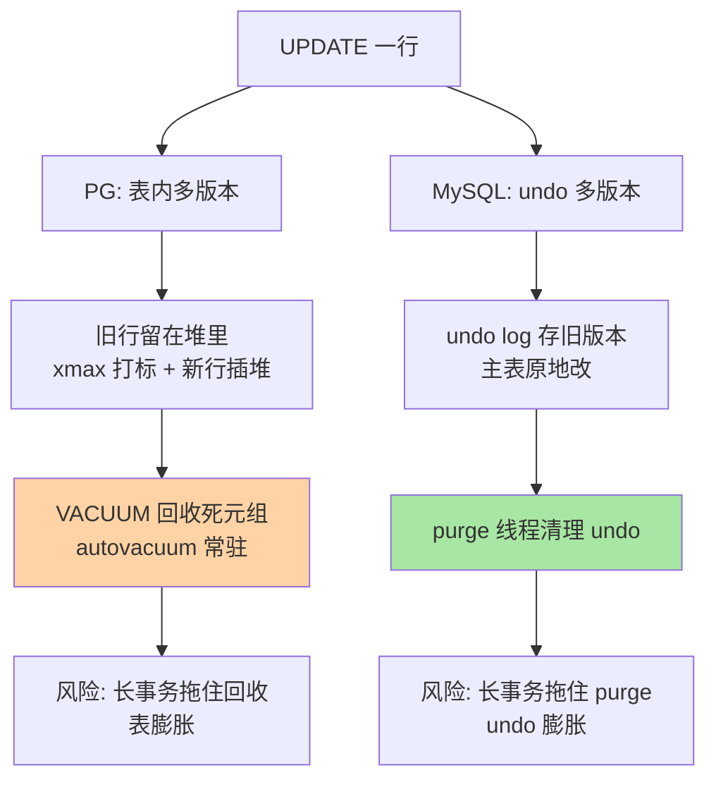
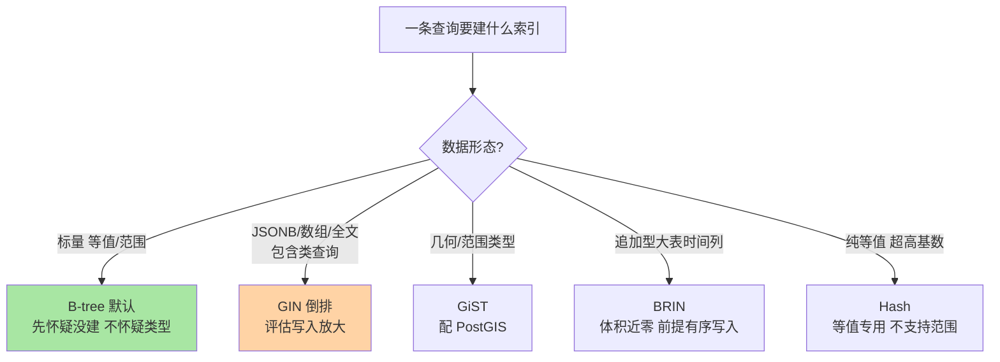

# MVCC 与索引的机制差异：xmin/xmax、VACUUM 与索引家族

> 一句话：PG 的多版本直接堆在表里（xmin/xmax 标记），靠 VACUUM 显式回收——所以有「表膨胀」这个 MySQL 没有的病；索引侧 PG 除 B-tree 外还有 GIN/GiST/BRIN/Hash 一整个家族——这是「单一引擎」换来的机制自由度。

## 🎯 本文核心

**核心一句话：PG 与 MySQL 的 MVCC 目标相同（读写不互斥），实现位置相反——PG 把旧版本留在表内、用事务 ID 打标、靠 VACUUM 回收（代价是表膨胀风险），InnoDB 把旧版本放进 undo log、主表始终只有最新行、靠后台 purge 回收（代价是回表链长）；索引差异同源：PG 的索引方法可插拔注册，于是长出 B-tree 之外的多类型家族。**

组织主线（一张图看懂两条 MVCC 路线）：



读端行为两边几乎一致（快照读不阻塞写），差异全在「旧版本放哪、谁来收、坏了长什么样」——本篇按这条对照线展开，最后落到索引家族。

## 一句话摘要

MVCC 的原理两边同源：每行数据带事务可见性信息，读事务按快照判断「这行对我可见的版本是哪个」，实现读写互不阻塞（MySQL 侧机制见本库 MVCC 篇）。PG 的实现是**表内多版本**：每行头有 xmin（创建它的事务 ID）与 xmax（删除/更新它的事务 ID），UPDATE = 旧行打 xmax + 新行插入堆，读时按 xmin/xmax 与快照比对选出可见版本；死元组（对所有人不可见的旧行）由 **VACUUM** 显式回收，autovacuum 进程常驻自动触发。InnoDB 的实现是**undo 多版本**：主表记录原地更新，旧版本链进 undo log，purge 线程回收。两边的共同命门都是**长事务**：长事务持有旧快照，回收机制就要为它保留历史——PG 表现为表膨胀，MySQL 表现为 undo 膨胀。索引侧，PG 除 B-tree 外原生提供 GIN（倒排，JSONB/全文）、GiST（几何/范围）、BRIN（块区间，追加型大表）、Hash（等值）多家族，另有部分索引、表达式索引等形态。

## 5W 速记卡

| 维度 | 一句话 |
|---|---|
| What | 表内多版本（xmin/xmax）+ VACUUM 回收 + 多类型索引家族 |
| Why | 单引擎架构下版本与索引都能「就地生长」，代价是回收要显式管 |
| When | 盯死元组率与长事务；JSONB/数组/地理数据选对应索引类型 |
| Where | 堆表页内元组头（xmin/xmax）+ pg_stat_user_tables 监控视图 |
| How | 对照 MySQL：undo→堆内版本、purge→VACUUM、B+tree 单家族→多家族 |

## 一、表内多版本：xmin/xmax 怎么工作

PG 的行（元组）头部有两个事务 ID 字段，四要素具体值：

1. **xmin**：插入这行的事务 ID。快照判定规则：xmin 已提交且在快照之前 → 这行的「诞生」对快照可见。
2. **xmax**：删除/更新它的事务 ID（0 表示从未被删）。xmax 为空或未提交或快照之后 → 这行仍然可见。
3. **UPDATE 的物理动作**：旧行置 xmax = 当前事务，新行（新版本）插入堆的其他位置——**没有任何原地更新**（hot update 优化例外：新版本能放进同一页且无索引引用该列时，走页内 HOT 链，省 IO，业内认知）。
4. **可见性判断成本**：每次读都要比对 xmin/xmax 与快照，PG 用可见性映射（VM，第 2 篇讲过）缓存「全页可见」结论，让大扫描跳过逐行判断。

```sql
-- 亲眼看多版本: 建表更新后查看行头的 xmin/xmax
CREATE TABLE t (id int, v text);
INSERT INTO t VALUES (1, 'a');
UPDATE t SET v = 'b' WHERE id = 1;
SELECT xmin, xmax, v FROM t;
--   xmin   |  xmax   | v
-- --------+---------+---
--  789201 |       0 | b     <- 新版本
-- (1 row)
-- 旧版本 'a' 仍物理存在于堆中, 等 VACUUM 回收
```

**追问：为什么 PG 不学 InnoDB 把旧版本放 undo log？**
反方案分析：undo 方案主表干净、读最新值零回溯，但「当前页 + undo 链」让更新必须原地改页，与 PG 的「堆 + 追加友好」存储观冲突；表内方案让写入天然是追加型（对 SSD 友好、崩溃恢复简单——恢复不需要 undo 前滚），代价是把回收责任显式化成 VACUUM。两边都在自己架构约束内的最优解，不是能力高下。

**再追问：表内旧版本堆积到什么程度会出事？**
打破砂锅看数字：pg_stat_user_tables 的 n_dead_tup（死元组数）与活元组的比值是关键指标，业内认知超过两三成就要警觉——膨胀不止吃磁盘，还拖慢所有扫描（扫描器要跳过死元组）。极端形态是一个表膨胀到几十 GB 而活数据只有几 GB。

## 二、VACUUM 的存在意义：与 MySQL purge 对照

| 对照点 | PG VACUUM | MySQL purge |
|---|---|---|
| 回收对象 | 表内的死元组 | undo log 里的旧版本 |
| 触发方式 | autovacuum 常驻（按表阈值自动触发） | purge 线程后台持续 |
| 并发设计 | 与业务并发跑（常规 VACUUM 不锁表） | 后台线程，天然并发 |
| 深度清理 | VACUUM FULL 重写整表（锁表级代价）；在线形态用重建工具（业内认知） | undo 表空间收缩（8.0 支持自动） |
| 独有职责 | 防事务 ID 回卷（freeze 老元组） | 无对应物 |

**设计思想**：VACUUM 不是 PG 的「补丁」，是表内多版本这套机制的**另一半**——版本放堆里，就必然需要一个堆内回收器。MySQL 的 purge 同理是 undo 方案的另一半。两个体系都没有「免维护」选项，只是维护的对象不同：PG 盯死元组与膨胀，MySQL 盯 undo 与历史链长。

**autovacuum 的触发直觉**（参数级，业内认知口径）：对一张表，死元组数超过 `autovacuum_vacuum_threshold(默认 50) + 元组数 × autovacuum_vacuum_scale_factor(默认 0.2)` 就触发——默认口径意味着 1000 万行的表要积 200 万死元组才清，高频更新的大表要手动把 scale_factor 调小到 0.01 甚至更低。

**追问：长事务为什么是两边共同的头号杀手？**
快照存在的意义是「让读事务看到一致的历史」，而回收器只能清掉「没有任何快照需要」的版本。一个挂了 6 小时的报表事务 = 6 小时内所有死元组都不许回收 = 表/undo 线性膨胀。线上排查过公开社区高频同款形态：监控发现磁盘水位异常，顺着膨胀指标找到一台长连接闲置事务（应用连接池泄漏，事务开而不用），复盘后给长事务加了超时杀（PG 侧 idle_in_transaction_session_timeout，MySQL 侧 innodb_kill_idle_transaction 类机制），问题从根上消失。

```sql
-- 长事务排查三板斧
SELECT pid, state, now() - xact_start AS xact_age, query
FROM pg_stat_activity
WHERE state <> 'idle' ORDER BY xact_age DESC;      -- 1. 谁在长事务
SELECT relname, n_dead_tup, n_live_tup,
       round(n_dead_tup * 100.0 / greatest(n_live_tup,1), 1) AS dead_pct
FROM pg_stat_user_tables ORDER BY n_dead_tup DESC;  -- 2. 谁在膨胀
SHOW autovacuum;                                    -- 3. 回收器活着吗
```

**事务 ID 回卷**：PG 事务 ID 是 32 位有限空间（约 42 亿，业内认知），耗尽会回卷导致可见性判断错乱——VACUUM 顺带把老元组冻结（freeze），这是它比 MySQL purge 多出的一份独特职责，也是 PG 实例上 autovacuum 偶尔「突然狂跑」的原因（anti-wraparound 清理，机制以官方文档为准）。

## 三、MVCC 的可见性边界：与 MySQL 隔离级别的区别

两边 MVCC 都服务快照读，但边界细节有差异，最容易踩的是这三条：

| 维度 | PostgreSQL | MySQL（InnoDB） |
|---|---|---|
| 读已提交下的快照 | 每条语句一个快照 | 每条语句一个快照（一致） |
| 可重复读下的快照 | 事务开始后第一条语句建立 | 事务第一条快照读建立（一致） |
| 可重复读写冲突 | 检测到并发更新即报错（serialization failure） | 加锁等待，可能死锁 |
| 幻读防护 | RR 下靠多版本 + 写冲突检测 | RR 下靠间隙锁 |

**「与 MySQL 的区别」核心一条**：MySQL 可重复读靠**锁**补幻读（间隙锁），PG 可重复读靠**版本比对 + 写冲突报错**——PG 走的是「乐观」路线，遇到冲突直接让事务失败重试；MySQL 走「悲观」路线，先锁住再说。应用侧的写法因此不同：PG 的 RR 事务要准备重试逻辑，MySQL 的 RR 事务要警惕锁范围扩大。

## 四、索引家族：B-tree 之外的四个名字

InnoDB 的索引主力就是 B+tree（辅以全文与空间索引）；PG 把「索引访问方法」做成可注册框架，于是长出一整个家族——每类记「解决什么问题」：

| 索引类型 | 机制一句话 | 典型场景 | MySQL 对应物 |
|---|---|---|---|
| B-tree | 平衡多路树，范围+等值 | 绝大多数场景（默认） | B+tree（同构） |
| GIN | 倒排：值 → 包含它的行 | JSONB 包含查询、全文、数组 | 无（FULLTEXT 仅全文且形态不同） |
| GiST | 通用搜索树框架 | 地理（配 PostGIS）、范围类型 | 无 |
| BRIN | 块区间摘要，极小 | 追加型大表（日志/时序）的时间列 | 无 |
| Hash | 哈希等值匹配 | 纯等值且列基数极高 | 无（自适应哈希是内部机制非显式索引） |

```sql
-- 四个家族各一行真实 DDL
CREATE INDEX idx_orders_created ON orders (created_at);                    -- B-tree
CREATE INDEX idx_products_attrs ON products USING GIN (attrs jsonb_path_ops); -- GIN 服务 JSONB
CREATE INDEX idx_places_geom   ON places USING GIST (geom);                -- GiST 服务地理
CREATE INDEX idx_logs_ts_brin  ON logs USING BRIN (created_at);            -- BRIN 服务追加大表
```



另有三种**形态**（可与任意方法叠加，InnoDB 侧功能子集对照）：部分索引（只索引满足条件的行，如只索引未完成订单，体积与维护成本骤降——MySQL 无对应物）、表达式索引（对函数结果建索引，MySQL 8.0 起有功能索引对应）、覆盖索引 INCLUDE 列（MySQL 用联合索引前缀近似达成）。

**追问：为什么 MySQL 不长出这个家族？**
还是引擎插件制与单一引擎的分野（第 1 篇埋的线）：InnoDB 的 B+tree 深度耦合聚簇组织（索引即数据组织方式），新索引类型要进 InnoDB 内核；PG 的堆表把「数据组织」与「索引组织」解耦——堆永远是一套，索引全是「堆之上的外挂视图」，注册一个新访问方法不用动存储核心。**解耦才有多家族，这是架构决定生态的直接案例。**

> 💡 **实战提示**
> - 💡 GIN 索引不是免费的：JSONB 上的 GIN 会让写入变慢（每个元素都要进倒排），写多读少的表先测写入放大——业内认知 GIN 更新比 B-tree 慢一截，fastupdate 与 pending list 是调优入口
> - 💡 BRIN 是「近乎免费」的索引：体积比 B-tree 小几个量级，追加型时序表的_created_at 列先上 BRIN，收益立现；乱序更新的表 BRIN 会失准
> - 💡 监控挂三个指标就够起步：n_dead_tup 比值（膨胀）、autovacuum 最近执行时间（回收器活着）、长事务时长（回收的最大敌人）——对应 MySQL 盯 undo 表空间与历史链长度的习惯

## 五、常见误区与代价

- **误区一：以为 VACUUM 会「锁表」所以关掉 autovacuum**。常规 VACUUM 设计为可与业务并发（只短暂加轻锁）；关掉的代价是表膨胀到只能 VACUUM FULL 重写——那才是锁表级操作，因小失大的经典。
- **误区二：用 DELETE + 重导清理膨胀**。业务表直接 VACUUM FULL（锁表）或在线重建工具是正路；DELETE 不回收空间（死元组还是要 VACUUM 收），重导一次的停机风险远超在线重建。
- **误区三：给 JSONB 查询建 B-tree 索引**。B-tree 对「整列等值」有效，对 `attrs @> '{"a":1}'` 这类包含查询无效——要 GIN。建错类型 = 索引白建 + 写入白白变慢。
- **误区四：把 PG 的 RR 写冲突报错当 bug**。它是乐观并发的正常行为，应用要带重试——拿 MySQL RR「阻塞等待」的预期去写 PG 代码，压测时才会发现错误率异常。

## 六、你们可能会问

**Q1：PG 为什么没有「回表」这个词？**
准确说有但形态不同：InnoDB 二级索引叶子存主键、要回聚簇索引取整行；PG 的 B-tree 索引叶子直接存堆元组指针（TID），取整行是「按 TID 回堆」——多一次堆访问的形态类似，但 PG 没有聚簇索引这层。 Heap-organize 与 index-organize 的分野（第 2 篇存储架构的延伸），决定了两边的「回表」成本模型不同。

**Q2：UPDATE 很频繁的表，PG 和 MySQL 谁更合适？**
看更新模式：随机小更新两边都可管理（PG 靠调好 autovacuum，MySQL 靠 purge 跟上）；高频全行更新（如计数器）PG 的表内版本堆积更快，fillfactor 调小给 HOT 更新留空间是常见缓解。答案是「没有默认赢家，有各自要盯的指标」——盯错指标才是事故来源。

**Q3：部分索引什么场景收益最大？**
「热点子集」场景：订单表 95% 已完结、活跃的只有 5%——`CREATE INDEX ... ON orders (user_id) WHERE status = 'active'` 只索引那 5%，体积小、维护便宜、恰好命中业务查询。MySQL 要达成同样效果只能冗余过滤列进联合索引，代价更高。

## 七、什么时候用/不用与 Trade-off

| 场景 | 推荐 | 不推荐 |
|---|---|---|
| 高频更新大表 | 调好 autovacuum + fillfactor + 监控死元组 | 关 autovacuum 或无视膨胀 |
| JSONB/数组检索 | GIN（读多）或评估写入放大（写多） | B-tree 硬上包含查询 |
| 追加型时序大表 | BRIN + 分区 | 全表 B-tree（体积与维护代价高） |
| 强一致 RR 短事务 | 两边都顺手 | PG RR 下不带重试的并发写 |

Trade-off 的锚点是**版本存放位置**：表内多版本（PG）换来追加友好与恢复简单，代价是显式回收与膨胀风险；undo 多版本（MySQL）换来主表紧凑，代价是原地更新与 undo 管理。索引侧的 trade-off 同构：多家族换来「每类数据都有趁手索引」，代价是选型心智——选错类型等于双倍代价（查询不走 + 写入变慢）。量级分界一句话：十万级行数、低频更新，两边默认参数都无感；千万级高频更新，PG 的 autovacuum 调优与 MySQL 的 purge 监控都从「可选」变「必做」；亿级追加型表，BRIN/分区（PG）与表分区（MySQL）都是必答题。

## 开放问题

- PG 近年版本在持续优化 VACUUM 与 HOT 的效率（公开口径），「表内多版本 + 显式回收」这套机制十余年的演进轨迹，本身就是观察「架构级代价能被工程优化压到多低」的样本
- 向量/全文/JSON 索引家族继续膨胀后，「索引选型」会不会成为 PG 应用的新复杂度中心，还是被「默认 B-tree + 默认 GIN」的事实标准收敛

## 🎯 核心带走

- **核心一句话**：MVCC 同目标、异实现——PG 版本在表内（xmin/xmax + VACUUM），MySQL 版本在 undo（roll pointer + purge）；命门同为长事务，病灶分别是表膨胀与 undo 膨胀
- **索引一句话**：堆表解耦让 PG 长出 B-tree/GIN/GiST/BRIN/Hash 多家族 + 部分索引等形态；JSONB 包含查询用 GIN、地理用 GiST、追加大表用 BRIN
- **最小动作集**：盯 n_dead_tup 比值、盯长事务、高频表调 autovacuum scale_factor、JSONB 配 GIN
- **哪里会破**：长连接闲置事务、关 autovacuum、给包含查询建 B-tree、PG RR 不带重试

## 自测三问

1. PG 的 UPDATE 在物理上发生了什么？为什么会有表膨胀？——答出「旧行打 xmax + 新行插堆，死元组等 VACUUM」算过。
2. VACUUM 与 MySQL purge 各回收什么？共同命门是什么？——答出「死元组 vs undo 旧版本，共同命门长事务」算过。
3. `attrs @> '{"a":1}'` 该建什么索引？为什么？——答出「GIN，倒排服务包含查询」算过。

## 📌 数据与事实声明

- 写于 2026-09-24，机制以 PostgreSQL 官方文档（MVCC/VACUUM/索引访问方法章节）与 MySQL 8.0 官方文档为基准
- autovacuum 默认参数、事务 ID 空间位数等具体数值以官方文档当前版本为准
- 膨胀阈值经验（两三成）、GIN 写入放大等均为业内认知，非基准测试结论
- 长事务案例为公开技术社区常见问题模式的匿名化复述，不指向任何特定公司

## 📚 参考资料

| 类型 | 标题 | 来源 |
|---|---|---|
| 官方文档 | PostgreSQL: MVCC 与并发控制 | postgresql.org/docs/（mvcc 章节） |
| 官方文档 | PostgreSQL: Routine Vacuuming / autovacuum | postgresql.org/docs/（vacuum 章节） |
| 官方文档 | PostgreSQL: Index Access Methods（GIN/GiST/BRIN/Hash） | postgresql.org/docs/（indexes 章节） |
| 系列内链 | MySQL MVCC 机制（undo 与 purge 对照侧） | [../../../mysql/入门层/从零开始认识MySQL系列/7_MVCC机制-入门.md](../../../mysql/入门层/从零开始认识MySQL系列/7_MVCC机制-入门.md) |
| 系列内链 | 本系列：JSONB 扩展性与生态选型 | [4_JSONB扩展性与生态选型-入门.md](4_JSONB扩展性与生态选型-入门.md) |
